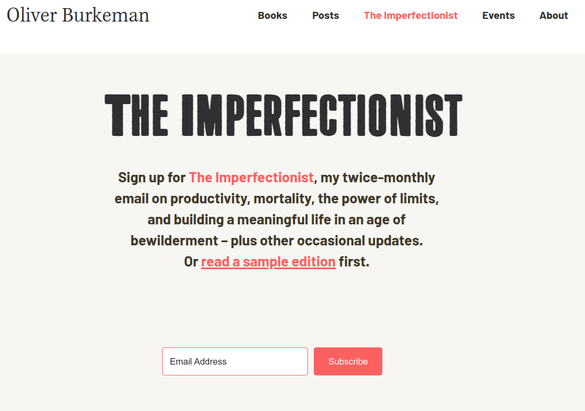

<!-- gid:20241024T134108 -->
[[TIP("이 노트에 대하여")]]
불완전주의자는 모든 것을 완벽히 관리하려는 강박에서 한 걸음 물러나는 태도와 닿아 있다. 올리버 버크먼의 뉴스레터를 매개로 시간감각과 계획 습관을 다시 본다.
[[/TIP]]

<!-- provenance:source:start -->
[[TIP("원본·최신본")]]
이 페이지는 한국어 검색과 읽기를 위한 WikiDocs 미러입니다. [원본·최신본은 가든](https://notes.junghanacs.com/meta/20241024T134108/)에 있습니다. 최신 수정 내용·백링크·태그·히스토리·댓글·출처 정보는 원본 가든에서 확인하세요.

- 작성: `2024-10-24T13:41:00+09:00`
- 최근 수정: `2026-08-09T12:22:00+09:00`
[[/TIP]]
<!-- provenance:source:end -->

[TOC]

## 히스토리

-   [2026-08-09 Sun 12:14] @mitsein/sonnet-5 — 표준 구조 점검: 히스토리 섹션을 신설했다. KEYWORDS dblock·print_bibliography·관련노트·본문은 그대로 두었다.

## 관련메타

-   [계획 스케줄 캘린더 어젠다 일정 커리큘럼](https://notes.junghanacs.com/meta/20241202T133400/)
-   [뉴스레터](https://notes.junghanacs.com/meta/20231223T072758/) 양식으로 좋다.
-   [힣: 어쏠로지스트 뉴스레터](https://notes.junghanacs.com/notes/20241024T134557/)

## KEYWORDS

-   [bib/ 올리버버크먼 OliverBurkeman 팀하포드 TimHarford - 유한함 불완전주의 시간의 철학 '2024-10-22 2026-08-09](https://notes.junghanacs.com/bib/20241022T145747/)
-   [bib/ 시몬윌리슨 SimonWillison - Datasette '2025-03-27 2026-09-04](https://notes.junghanacs.com/bib/20250327T071914/)
-   [notes/ 힣: 모두가 생산자 작은 소통 공간 커뮤니티 '2024-09-22 2025-02-15](https://notes.junghanacs.com/notes/20240922T103151/)
-   [notes/ 힣: 어쏠로지스트 인간상 뉴스레터 앎과삶 '2024-10-24 2026-08-29](https://notes.junghanacs.com/notes/20241024T134557/)
-   [notes/ 힣: 디지털가든 — 불완전함에서 창조가 나오는 곳 '2025-03-14 2026-07-22](https://notes.junghanacs.com/notes/20250314T152111/)
-   [notes/ 알못시대 - 불완전한 시작과 배움 - 코알못 '2025-03-26 2026-04-19](https://notes.junghanacs.com/notes/20250326T163625/)
-   [notes/ 힣: 느린 창조도구 커뮤니티 인간 계층 분화 불완전함 테크노퓨달리즘 봉건 '2025-05-29 2026-07-08](https://notes.junghanacs.com/notes/20250529T114735/)

## 불완전주의자 - 뉴스레터 신청

[The Imperfectionist | Oliver Burkeman - oliverburkeman.com](https://www.oliverburkeman.com/the-imperfectionist)

-   The Imperfectionist 불완전주의자
-   Sign up for The Imperfectionist, my twice-monthly email on productivity,

mortality, the power of limits, and building a meaningful life in an age of bewilderment – plus other occasional updates.

-   생산성, 죽음, 한계의 힘, 혼란의 시대에 의미 있는 삶을 구축하는 방법 등에 대해 한

달에 두 번씩 보내드리는 이메일인 '불완전주의자'에 가입하고 가끔씩 업데이트되는 다른 소식도 받아보세요.

### 스크린샷

