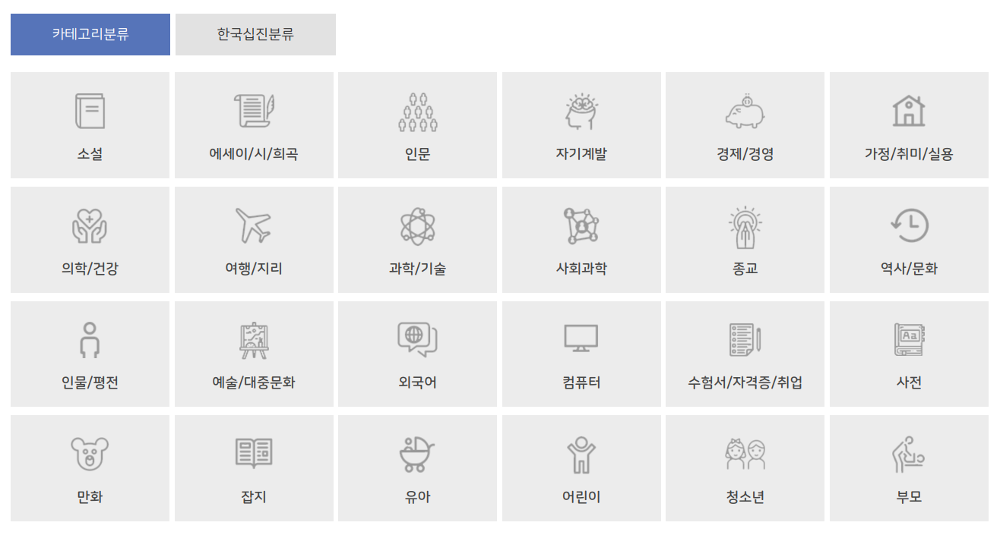

<!-- gid:20241202T223128 -->
[TOC]

[[TIP("이 노트에 대하여")]]
분류체계는 책을 정리하는 기술인 동시에 지식을 바라보는 방식이기도 하다. 도서 카테고리의 구조와 이름이 어떻게 만들어지는지 추적한다.
[[/TIP]]

## 히스토리

-   [2025-05-23 Fri 17:33] 십진분류와 다른 도서 카테고리 분류의 역할과 활용
-   [2024-12-02 Mon 22:31] 막연하게 도서 카테고리 노트 만들어 놓음

## KEYWORDS

-   [알렉스라이트 분류의역사 문헌정보 (2024-10-04)](https://wikidocs.net/382098)
-   [전창호 자료조직개론 - 자료분류론 자료편목론 - 문헌정보학 (2024-07-21)](https://wikidocs.net/382012)

## 도서 분류

-   [도서관 분류 도서기호법](https://wikidocs.net/381224)
-   [분류체계: 국가서지 오픈데이터 온톨로지 한국십진분류 카테고리분류](https://wikidocs.net/381194)

## 도서 카테고리 분류 - 구성과 의미 유래

(“수원시도서관 도서검색 #카테고리분류” n.d.)

kcc Korean Category Classification

<https://www.suwonlib.go.kr:8443/categorySearch> 참고. 이게 더 일반 익숙

예스24 분류와 비교한다. 카테고리 분류법이군.

-   소설
-   에세이-시
-   경제-경영
-   자기계발
-   인문
-   사회-정치
-   역사
-   종교
-   예술-대중문화
-   자연과학
-   가정-살림
-   건강-취미-여행
-   어린이-유아
-   청소년
-   국어-외국어
-   IT-모바일
-   대학교재
-   수험서-자격증
-   잡지 만화

## 관련메타

-   [분류체계 구분 구조화 분야 택소노미 폭소노미](https://wikidocs.net/380842)
-   [태그](https://wikidocs.net/380526)
-   [한국십진분류법](https://wikidocs.net/380561)

## BIBLIOGRAPHY

  “수원시도서관 도서검색 #카테고리분류.” n.d. Accessed December 2, 2024. [https://www.suwonlib.go.kr:8443/categorySearch](https://www.suwonlib.go.kr:8443/categorySearch).
