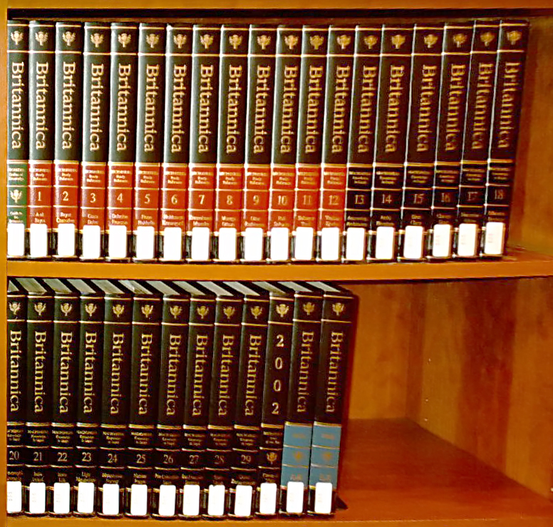
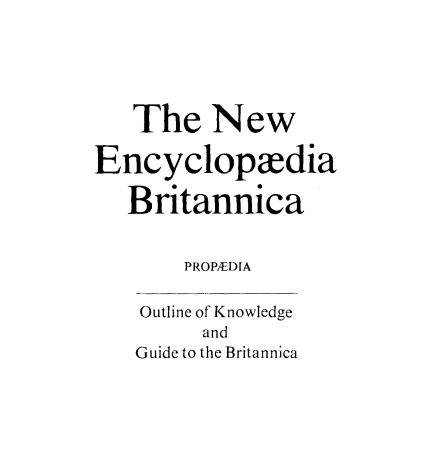
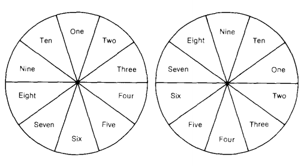
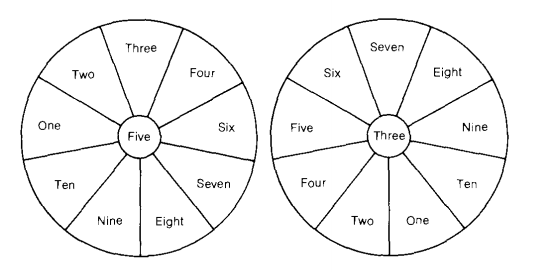
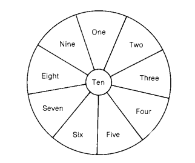
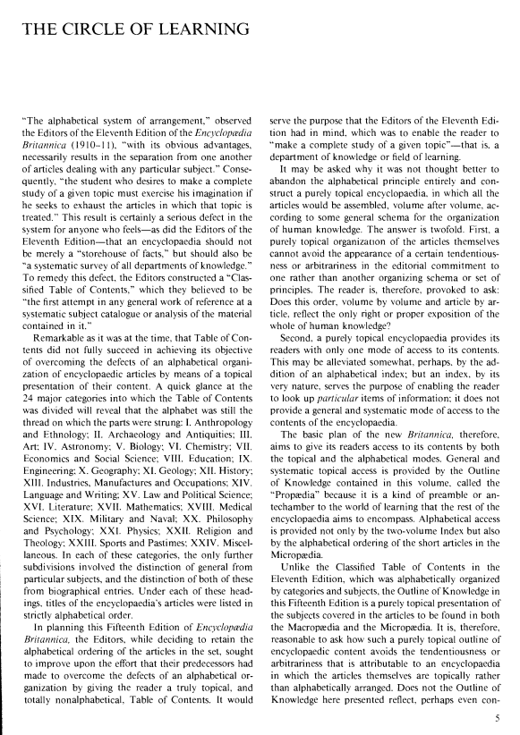

<!-- gid:20250420T152816 -->
[TOC]

[[TIP("이 노트에 대하여")]]
프로피디아는 백과사전의 목차를 넘어 지식 전체를 조감하는 설계도에 가깝다. 개별 메타와 신토피콘을 어떤 상위 구조로 배치할지 보여 주며, 분류의 껍데기와 개념 자석 사이를 연결한다. 전체 지형을 그리는 메타메타의 중심축이다.
[[/TIP]]

## KEYWORDS

-   [bib/ 김학래 온톨로지 지식그래프 시맨틱웹 '2024-02-14](https://wikidocs.net/381875)
-   [bib/ 데니즈고즈넬 마티아스브뢰헬러 그래프데이터 실무 가이드 - 그래프씽킹 '2024-05-07 2025-02-15](https://wikidocs.net/381918)
-   [bib/ 김필영 생각의역사 철학 유튜버 '2024-05-22 2025-04-22](https://wikidocs.net/381943)
-   [bib/ 피터버크 지식의사회사 폴리매스 '2024-05-23 2025-04-22](https://wikidocs.net/381949)
-   [bib/ 마크왓슨 MarkWatson 개인지식관리 시맨틱웹 LLM 하스켈 클로저 하이랭 구루 '2024-06-23 2026-04-30](https://wikidocs.net/381992)
-   [bib/ 개인지식그래프 - Personal Knowledge Graphs '2024-07-20 2025-02-14](https://wikidocs.net/382010)
-   [bib/ 한상기: 지식론 인식론 - 입문서 '2024-07-21](https://wikidocs.net/382011)
-   [bib/ 짐웨버 지식그래프 그래프데이터베이스 - Neo4j '2024-07-25 2025-02-14](https://wikidocs.net/382015)
-   [bib/ 에릭헌터 분류란 무엇인가 - 지식 구조화 검색 '2024-07-25 2025-04-22](https://wikidocs.net/382017)
-   [bib/ 구글 지식그래프 GoogleKnowledgeGraph '2024-07-30 2026-04-20](https://wikidocs.net/382021)
-   [bib/ 사이먼윈체스터: 지식의탄생 - 생각이필요없는시대 앎의의미 '2024-09-23 2025-04-22](https://wikidocs.net/382089)
-   [bib/ 조이홍(joyHong) 지식그래프 추론 온톨로지 '2024-10-04 2025-03-27](https://wikidocs.net/382097)
-   [bib/ 유영만 지식생태학자 코나투스 일생이론 인공지능 백신 '2024-10-16 2025-05-02](https://wikidocs.net/382114)
-   [bib/ 헥터레베스크 Hector Levesque 지식표현 추론분야 인공지능 석학 '2024-11-11 2025-03-28](https://wikidocs.net/382149)
-   [bib/ 이광주 '2024-12-28](https://wikidocs.net/382225)
-   [bib/ 장하석 과학철학 역사 능동적앎 실천 실용 실재 진리 지식관 인본주의 '2025-02-17 2026-07-06](https://wikidocs.net/382278)
-   [bib/ 에이브러햄플렉스너 쓸모없는 지식의 쓸모 - 세상을 바꾼 과학자들의 순수학문 예찬 '2025-04-05 2026-03-18](https://wikidocs.net/382354)
-   [bib/ 모티머애들러 파이데이아 평생공부 가이드 - 브리태니커 폴리매스 '2025-04-15 2025-04-15](https://wikidocs.net/382386)
-   [bib/ 장경식 브리태니커 백과사전 '2025-04-16 2025-04-16](https://wikidocs.net/382391)
-   [bib/ 살림출판사 Salrim 지식 총서 600권 '2025-04-22 2026-04-20](https://wikidocs.net/382399)
-   [bib/ 설동준 캣츠랩 인공지능 지식과학습 교육공학 '2025-04-22 2025-04-22](https://wikidocs.net/382400)
-   [bib/ g4rden Rhizome 가든 작가 지식 보관소 '2025-04-30 2025-04-30](https://wikidocs.net/382411)
-   [bib/ 앤서니그레일링 지식의 최전선 - 고고학 경계 과학 역사 조망 '2025-08-30 2025-08-30](https://wikidocs.net/382500)
-   [botlog/ 무의식 지식그래프 에이전트 연상맵 토큰절약 키워드 의미망 '2026-03-04 2026-03-30](https://wikidocs.net/382557)
-   [botlog/ Openclaw 유즈케이스와 어쏠로지스트의 길 — 지식그래프와 통합 아키텍처 '2026-03-05 2026-03-05](https://wikidocs.net/382561)
-   [botlog/ dictcli 태그-정규화와-개인-어휘-사전-영어-태그 단어 개념 '2026-03-09 2026-03-30](https://wikidocs.net/382566)
-   [botlog/ 힣맨: 프롤로그 1탄 이맥스를 넘어 - 앎의 틀과 힣봇 생태계 정리 시작 '2026-03-24 2026-03-29](https://wikidocs.net/382580)
-   [botlog/ org: 힣과 에이전트 협업 — 시간축, 지식관리, 어쏠로지 '2026-03-30 2026-04-02](https://wikidocs.net/382584)
-   [llmlog/ @OKFN: 오픈 열린 지식 재단 '2025-07-01 #2025-07-01]
-   [llmlog/ #LLM: ¤mermaid 다이어그램 관계 연결 핵심 문법 인간사고중심지식그래프 '2025-07-28 #2025-07-28]
-   [notes/ 힣: AI 시대에 왜 우리 개인은 더 지식에 목마른가 '2022-03-30 2025-04-02](https://wikidocs.net/381018)
-   [notes/ 지식구조화: 온오프라인 사전 - 필요할까 '2023-09-08 2025-05-30](https://wikidocs.net/381120)
-   [notes/ 제텔카스텐: 폴게제텔2 분류 - 프로피디아 십진분류 '2023-11-16 2025-02-25](https://wikidocs.net/381167)
-   [notes/ 힣: 자기만의 문법 구조 이해 그림 - 개념 체계 확장 '2024-02-01 2025-06-20](https://wikidocs.net/381188)
-   [notes/ 개인지식관리: 용어 PKA PKB PKC PKI PKM PKO '2024-07-04 2025-10-23](https://wikidocs.net/381259)
-   [notes/ 힣: 지식공학: 개인지식관리 인공지능 관계 '2024-07-04 2025-10-23](https://wikidocs.net/381262)
-   [notes/ 힣: 개인지식관리 인공지능 도구 및 활용 가이드 '2024-09-15 2025-06-03](https://wikidocs.net/381312)
-   [notes/ 모음 커뮤니티 모임: 공부 지식 학습 독서 '2024-10-10 2025-06-17](https://wikidocs.net/381351)
-   [notes/ 힣: 라이브 공동편집 - 지식통합 협업 독서 대화 '2024-11-11 2025-04-04](https://wikidocs.net/381379)
-   [notes/ ~이즘 ~주의: 모호한 경계 노트테이킹 가추법 태도 체제 엇갈림 '2024-12-09 2026-04-29](https://wikidocs.net/381417)
-   [notes/ 입문서 MIT Press Essential Knowledge vs. 옥스포드 Very Short Introductions '2025-02-13 2025-02-13](https://wikidocs.net/381519)
-   [notes/ 지식그래프 검색증강생성 RAG의 의미 전환 — LLM 보조에서 분신의 기억으로 '2025-02-14 2026-03-30](https://wikidocs.net/381529)
-   [notes/ imenuoutlineheading 헤딩 레벨 키바인딩의 핵심 - Alt 통일 '2025-02-27 2025-02-27](https://wikidocs.net/381561)
-   [notes/ 힣: 인공지능이 말하는 힣의 디지털가든 지식관리 '2025-04-10 2026-06-18](https://wikidocs.net/381670)
-   [notes/ 힣: 이맥스 AI노트 지식도구 사용 이유 - 시대 물음 '2025-04-28 2025-04-28](https://wikidocs.net/381697)
-   [notes/ junghan0611 denote-explore 디노트 확장 플러그인 일괄변경 통계 검색 시각화 도구 '2025-06-16 2025-06-16](https://wikidocs.net/381745)
-   [notes/ Dify 에이전틱 AI 개발 플랫폼 - 지식베이스 클러스터 LangGenius '2025-06-25 2025-06-25](https://wikidocs.net/381749)
-   [notes/ 에이전트 지식베이스 아키텍처 ULTRATHINK '2025-10-16 2025-10-16](https://wikidocs.net/381795)

## BIBLIOGRAPHY

- “001 Outline of Knowledge.” 2024. [https://en.wikipedia.org/w/index.php?title=Outline_of_knowledge&#38;oldid=1221140965](https://en.wikipedia.org/w/index.php?title=Outline_of_knowledge&oldid=1221140965).
- “An Appreciation of Britannica’s Outline of Knowledge – Legion of Christ College of Humanities.” n.d. Accessed April 16, 2025. [https://lccollege.org/2024/05/an-appreciation-of-britannicas-outline-of-knowledge/?utm_source=perplexity](https://lccollege.org/2024/05/an-appreciation-of-britannicas-outline-of-knowledge/?utm_source=perplexity).
- “Outline of Knowledge 지식 개요.” 2025. [https://en.wikipedia.org/w/index.php?title=Outline_of_knowledge&#38;oldid=1269081643](https://en.wikipedia.org/w/index.php?title=Outline_of_knowledge&oldid=1269081643).
- “프로피디아 Propædia - 브리태니커 백과사전.” 2025. [https://en.wikipedia.org/w/index.php?title=Prop%C3%A6dia&#38;oldid=1272609552](https://en.wikipedia.org/w/index.php?title=Prop%C3%A6dia&oldid=1272609552).

## History

-   [2026-04-02 Thu 15:55] @pi-gpt(thinkpad) — 프로피디아를 개별 메타/신토피콘과 잇는 실례로 예술 메타를 명시. 분류의 껍데기와 개념 자석의 연결선.
-   [2025-04-20 Sun 15:28] 프로피디아를 겟하다.

## 관련노트

-   [예술 기예 테크네](https://wikidocs.net/380635) — 신토피콘 Art의 오늘적 재해석
-   [예술 6](https://wikidocs.net/380849) — 프로피디아의 예술 분류 실례

### An Appreciation of Britannica's Outline of Knowledge – Legion of Christ College of Humanities

(“An Appreciation of Britannica’s Outline of Knowledge – Legion of Christ College of Humanities” n.d.)

### 001 Outline of knowledge

(“001 Outline of Knowledge” 2024)

The following outline is provided as an overview of and topical guide to knowledge: Knowledge – familiarity with someone or something, which can include facts, information, descriptions, and/or skills acquired through experience or education. It can refer to the theoretical or practical understanding of a subject. It can be implicit (as with practical skill or expertise) or explicit (as with the theoretical understanding of a subject); and it can be more or less formal or systematic.

### 프로피디아 Propædia 브리태니커 백과사전

(“프로피디아 Propædia - 브리태니커 백과사전” 2025)

The one-volume Propædia is the first of three parts of the 15th edition of Encyclopædia Britannica, intended as a compendium and topical organization of the 12-volume Micropædia and the 17-volume Macropædia, which are organized alphabetically. Introduced in 1974 with the 15th edition, the Propædia and Micropædia were intended to replace the Index of the 14th edition; however, after widespread criticism, the Britannica restored the Index as a two-volume set in 1985. The core of the Propædia is its Outline of Knowledge, which seeks to provide a logical framework for all human knowledge. However, the Propædia also has several appendices listing the staff members, advisors and contributors to all three parts of the Britannica. The last edition of the print Britannica was published in 2010.

한 권으로 구성된 프로페디아는 브리태니커 백과사전 15판의 세 부분 중 첫 번째 부분으로, 알파벳순으로 구성된 12권의 마이크로페디아와 17권의 매크로페디아의 개요 및 주제별 구성을 위한 것입니다. 1974년 15판과 함께 소개된 프로페디아 및 마이크로페디아는 14판의 색인을 대체하기 위한 것이었지만, 광범위한 비판이 일자 브리태니커는 1985년에 두 권으로 구성된 색인으로 복원했습니다. 프로페디아의 핵심은 모든 인간 지식에 대한 논리적 틀을 제공하고자 하는 지식의 개요입니다. 그러나 프로페디아에는 브리태니커의 세 부분 모두에 참여한 직원, 자문위원 및 기고자를 나열하는 여러 부록도 있습니다. 브리태니커 인쇄본의 마지막 판은 2010년에 출판되었습니다.

"Outline of Knowledge" redirects here. For an outline about knowledge, see [Outline of knowledge](https://en.wikipedia.org/wiki/Outline_of_knowledge).

Encyclopaedia Britannica, 15th edition

단권으로 구성된 Propædia는 Encyclopædia Britannica 제15판의 세 부분 중 첫 번째로, 12권으로 구성된 Micropædia와 17권으로 구성된 Macropædia의 개요 및 주제별 구성을 목적으로 합니다. Micropædia와 Macropædia는 알파벳순으로 구성되어 있습니다. 1974년 제15판에서 처음 소개된 Propædia와 Micropædia는 제14판의 색인을 대체하기 위한 것이었지만, 광범위한 비판 이후 Britannica는 1985년에 색인을 2권 세트로 복원했습니다. Propædia의 핵심은 모든 인간 지식에 대한 논리적 프레임워크를 제공하고자 하는 지식 개요입니다. 그러나 Propædia에는 Britannica의 세 부분 모두에 대한 직원, 고문 및 기고자를 나열하는 여러 부록도 있습니다.

마지막 인쇄판 브리태니커는 2010년에 출판되었습니다.

### Outline of knowledge 지식 개요

(“Outline of Knowledge 지식 개요” 2025)

The following outline is provided as an overview of and topical guide to knowledge: Knowledge – familiarity with someone or something, which can include facts, information, descriptions, and/or skills acquired through experience or education. It can refer to the theoretical or practical understanding of a subject. It can be implicit (as with practical skill or expertise) or explicit (as with the theoretical understanding of a subject); and it can be more or less formal or systematic.

다음 개요는 지식에 대한 개요 및 주제별 가이드로 제공됩니다: 지식 - 경험이나 교육을 통해 습득한 사실, 정보, 설명 및/또는 기술을 포함하여 누군가 또는 무언가에 대한 친숙함. 지식은 주제에 대한 이론적 또는 실제적 이해를 나타낼 수 있습니다. 실용적인 기술이나 전문 지식처럼 암묵적일 수도 있고, 주제에 대한 이론적 이해처럼 명시적일 수도 있으며, 다소 형식적이거나 체계적일 수도 있습니다.

## 관련노트

-   [모티머애들러 파이데이아 평생공부 가이드 - 브리태니커 폴리매스](https://wikidocs.net/382386)
-   [장경식 브리태니커 백과사전](https://wikidocs.net/382391)

## 프로피디아 파트 1-10

-   [1=1 물질 에너지 1](https://wikidocs.net/380844)
-   [1=2 지구 2](https://wikidocs.net/380845)
-   [1=3 생명 3](https://wikidocs.net/380846)
-   [1=4 인간의삶 인생 평생 4](https://wikidocs.net/380847)
-   [1=5 사회 5](https://wikidocs.net/380848)
-   [1=6 예술 6](https://wikidocs.net/380849)
-   [1=7 기술 7](https://wikidocs.net/380850)
-   [1=8 종교 8](https://wikidocs.net/380851)
-   [1=9 역사 9](https://wikidocs.net/380852)
-   [1=10 메타지식 10](https://wikidocs.net/380839)

## 번역: 프로피디아 사용법 (How to use the PROPAEDIA)

제목에서 알 수 있듯이, 지식의 개요인 PROPAEDIA는 브리태니커 백과사전의 내용에 대한 주제별 가이드 역할을 하며, 독자가 학습을 위해 선택한 지식 또는 학습 분야에 대해 질서 정연한 계획을 세우고 깊이 있게 읽을 수 있도록 도와줍니다. 프로페디아의 목차는 독자에게 지식의 개요 전체에 대한 개요를 제공하고, 10개의 각 부분에 대한 서론은 인간 지식의 해당 부분의 주요 관심사를 조명하며, 각 부분과 부문에 부착된 머리말은 독자가 해당 부분에서 다루는 주제를 검토할 수 있도록 준비시키고, 관련 기사 제목 목록과 함께 이러한 주제에 대한 개요를 제시하여 독자가 개인의 관심과 욕구에 따라 다소 광범위하고 상세한 학습 과정을 진행할 수 있도록 해줍니다.

-   Structure

프로페디아를 구성하는 10부, 41과, 177개 섹션은 각각 목차에 제목으로 표시되어 있으며, 그 뒤에는 프로페디아의 해당 단원이 시작되는 페이지 번호가 표시됩니다. 이 구조는 세 가지 방법으로 개요를 활용할 수 있습니다: (1) 파트 전체를 넘겨 해당 파트의 내용을 검토하거나, (2) 파트의 특정 섹션을 선택하여 해당 섹션의 내용을 검토하거나, (3) 해당 섹션의 단일 섹션 또는 여러 섹션에 집중하여 해당 섹션 또는 해당 섹션의 내용을 검토할 수 있습니다.

-   Sectional outlines.

섹션 개요는 매크로페디아 및 마이크로페디아의 기사에서 다루는 주제를 질서정연하게 배열하여 제시합니다. 각 섹션 번호에는 해당 섹션이 속한 파트 및 부서의 번호가 포함되어 있습니다. 예를 들어, 섹션 725는 파트 7, 디비전 II의 다섯 번째 섹션이고 섹션 96/10은 파트 9, 디비전 VI의 열 번째 섹션입니다. 각 섹션 개요에서 주요 과목은 대문자("A", "B" 등)로 표시됩니다. 주요 과목은 항상 두 개 이상이지만, 특정 섹션에는 더 많은 과목이 있을 수 있습니다. 전공 과목을 세분화할 필요가 있는 경우 아래 그림과 같이 개요에 최대 세 단계까지 추가로 표시할 수 있으며, 첫 번째는 아라비아 숫자, 두 번째는 소문자, 세 번째는 로마 숫자로 표시합니다:

[[TIP("노트")]]
A. Metallurgy

1.  Mineral processing: crushing and grinding of ores, concentration of metallic minerals
2.  Extractive metallurgy: separation of metallic elements from mineral form a. Pyrometallurgy: processes that involve the use of heat A) Roasting: oxidizing, reducing reactions B) Smelting: processes for removing molten metal from molten slag
[[/TIP]]

알파벳순으로 배열된 주제 제목이 있는 색인은 지식의 개요에서 특정 주제가 등장하는 위치를 찾는 데 없어서는 안 될 필수 요소입니다. 이러한 제목에는 적절한 경우 해당 주제를 다루는 PROPAEDIA의 부분, 부문 또는 섹션을 가리키는 구체적인 인용문이 포함되어 있습니다. 섹션별 개요에서 언급된 주제는 대부분의 경우 매크로페디아 또는 마이크로페디아의 동일한 제목의 기사에서 충분히 다루어지며, 이러한 각 제목은 섹션 끝에 있는 권장 읽기 목록에 포함됩니다. 이러한 제목과 다른 맥락에서 주제에 대한 중요한 참고 문헌은 색인에서 인용됩니다. PROPAEDIA와 INDEX의 기능을 비교하면 도움이 될 수 있습니다. 둘 다 브리태니커 백과사전의 내용에 대한 안내서이지만, PROPAEDIA의 주요 목적은 어떤 주제를 다루는지를 표시하는 것이고 INDEX의 주요 목적은 해당 주제가 어디에서 다루어지는지를 표시하는 것입니다.

## 번역: 학습의 원 (The Circle of Learning)

모티머 J. 애들러 (Mortimer J. Adler), 기획 책임자

"알파벳 순서 배열 체계는 명백한 장점이 있지만, 특정 주제를 다루는 항목들이 서로 분리되는 결과를 필연적으로 초래한다"고 1910-11년 제11판 브리태니커 백과사전 편집자들은 언급했다. 따라서 "특정 주제에 대해 완전한 연구를 원하는 학생은 해당 주제가 다뤄진 모든 항목을 찾기 위해 상상력을 발휘해야 한다." 이는 백과사전이 단순히 "사실의 저장소"가 아니라 "모든 지식 분야에 대한 체계적인 개요"여야 한다고 믿었던 제11판 편집자들에게 심각한 결함으로 여겨졌다. 이 결함을 보완하기 위해 편집자들은 "분류된 목차(Classified Table of Contents)"를 구성했으며, 이는 "일반적인 참고 자료에서 처음으로 체계적인 주제 목록 또는 내용 분석을 시도한 것"이라고 믿었다.

당시로서는 놀라운 시도였으나, 그 목차는 알파벳 조직의 결함을 극복하고 주제별로 내용을 제시하려는 목표를 완전히 달성하지 못했다. 목차가 나뉜 24개의 주요 범주를 보면 여전히 알파벳이 각 부분을 연결하는 기준이었음을 알 수 있다: I. 인류학 및 민족학; II. 고고학 및 고대 유물; III. 예술; IV. 천문학; V. 생물학; VI. 화학; VII. 경제학 및 사회과학; VIII. 교육; IX. 공학; X. 지리학; XI. 지질학; XII. 역사; XIII. 산업, 제조 및 직업; XIV. 언어 및 문자; XV. 법률 및 정치학; XVI. 문학; XVII. 수학; XVIII. 의학; XIX. 군사 및 해군; XX. 철학 및 심리학; XXI. 물리학; XXII. 종교 및 신학; XXIII. 스포츠 및 여가; XXIV. 기타. 각 범주에서 추가 세분은 일반 주제와 특정 주제의 구분, 그리고 이 둘과 전기 항목의 구분으로 제한되었다. 각 제목 아래에서 백과사전 항목 제목은 엄격히 알파벳 순으로 나열되었다.

이번 제15판 브리태니커 백과사전을 기획하면서 편집자들은 항목의 알파벳 순서 배열을 유지하기로 결정했으나, 이전 편집자들이 알파벳 조직의 결함을 극복하려 했던 노력을 개선하여 독자에게 진정으로 주제별이고 완전히 비알파벳적인 목차를 제공하고자 했다. 이는 제11판 편집자들이 염두에 두었던 목적, 즉 독자가 "특정 주제—즉, 지식의 한 분야나 학문 영역—에 대해 완전한 연구를 할 수 있도록" 하는 데 기여할 것이다.

왜 알파벳 원칙을 완전히 버리고 모든 항목을 인간 지식의 조직화를 위한 일반적인 체계에 따라 권별로 배열하는 순수 주제별 백과사전을 구성하지 않았는지 의문이 제기될 수 있다. 이에 대한 답은 두 가지다. **첫째, 항목 자체를 순수 주제별로 조직화하면 편집자가 특정 조직 체계나 원칙에 치우친다는 인상을 피할 수 없다.** 독자는 "이 순서가, 권별로 그리고 항목별로, 인간 지식 전체를 설명하는 유일하게 옳거나 적절한 방식인가?"라는 질문을 던지게 된다.

**둘째, 순수 주제별 백과사전은 독자에게 내용에 접근할 수 있는 단 하나의 방식만을 제공한다.** 알파벳 색인을 추가하면 다소 완화될 수 있겠지만, 색인은 본질적으로 특정 정보를 찾는 데 도움을 줄 뿐, 백과사전 내용에 대한 일반적이고 체계적인 접근 방식을 제공하지는 못한다.

따라서 새로운 브리태니커의 기본 계획은 독자에게 주제별 및 알파벳별 두 가지 접근 방식을 모두 제공하는 것을 목표로 한다. 일반적이고 체계적인 주제별 접근은 이 책에 포함된 '지식의 개요(Outline of Knowledge)'를 통해 제공되며, 이 책은 '프로피디아(Propedia)'라고 불리는데, 이는 백과사전의 나머지 부분이 포괄하려는 학문의 세계로 들어가는 일종의 서문 또는 전실(antechamber) 역할을 하기 때문이다. 알파벳별 접근은 2권으로 구성된 색인뿐만 아니라 마이크로피디아(Micropedia)의 짧은 항목들의 알파벳 순서 배열을 통해서도 제공된다.

제11판의 분류된 목차가 범주와 주제별로 알파벳 순서로 조직된 것과 달리, 이번 제15판의 지식의 개요는 매크로피디아(Macropedia)와 마이크로피디아에 포함된 항목들이 다루는 주제들을 순수하게 주제별로 제시한다. 따라서 이러한 순수 주제별 개요가 항목 자체가 주제별로 배열된 백과사전에 귀속되는 경향성이나 임의성을 어떻게 피하는지 묻는 것이 타당하다. 여기 제시된 지식의 개요가 특정 조직 원칙에 대한 편집자의 헌신을 반영하거나 숨기고 있는 것은 아닌가? 보편적으로 수용되지 않는 편견이나 선입견을 내포하고 있는 것은 아닌가?

이 질문들에 대해 "전혀 그렇지 않다"고 단언하기는 어렵다. 그러나 인간 지식 전체를 주제별로 개요화하는 데 불가피하게 남아 있는 임의성을 줄이거나 완화하는 두 가지 긍정적인 점을 언급할 수 있다. 첫째, 지식의 개요는 편집자들에 의해 구상되었으나, 대표되는 모든 지식 분야의 학자 및 전문가들로부터의 상세한 권고, 지시, 분석적 기여를 반영하여 구성되고 수정되었다. 지식의 개요를 구성하는 데 편집자들과 함께 작업한 자문단 목록은 프로피디아의 제10부 뒤에 나와 있다.

둘째, 지식의 개요는 학습의 원(circle of learning)으로 구상되었다. 백과사전의 내용이 학습의 원을 형성한다고 말하는 것은 그리스어에서 영어로의 직역 이상의 의미를 가진다. 그리스어든 영어든, 원(circle)에 대한 언급은 강력한 비유를 도입하며, 이를 이해하면 지식의 개요에 여전히 남아 있는 임의성을 독자가 극복하는 데 도움이 될 것이다. 원은 둘레 상의 어떤 점도 시작, 중간, 끝이 아닌 도형이다. 또한 원은 한 점에서 어느 방향으로든 둘레를 따라 이동할 수 있으며, 한 점에서 다른 점으로 원을 가로질러 갈 수도 있고, 주어진 점에서 시작하여 여러 개의 가로지르는 선을 통해 둘레 상의 가까운 점이나 먼 점으로 이동할 수도 있는 도형이다.

지식의 개요가 나뉜 10개의 부분은 이 점에서 저 점으로 끝나는 유한한 직선이 아니라 원의 세그먼트로 배치된다. 이 배열에서 한 부분이 다른 부분 옆에 있고 또 다른 부분과는 거리가 있을 수 있지만, 원이 축을 중심으로 회전할 수 있으므로 10개의 부분 중 어느 하나가 원의 맨 위, 왼쪽, 오른쪽, 또는 맨 아래에 위치할 수 있다. 즉, 부분의 원형 배열과 원의 회전으로 독자는 학습의 원 어디에서나 시작하여 원 둘레를 따라 인접한 부분으로 이동하거나, 내부를 가로지르는 선을 따라 원을 가로질러 둘레 상에서 인접하지 않은 부분으로 이동할 수 있다. 이러한 지식의 개요 관점은 여러 다이어그램으로 표현될 수 있다.

[[TIP("요약")]]
-   Part One. Matter and Energy
-   Part Two. The Earth
-   Part Three. Life on Earth
-   Part Four. Human Life
-   Part Five. Human Society
-   Part Six. Art
-   Part Seven. Technology
-   Part Eight. Religion
-   Part Nine. The History of Mankind
-   Part Ten. The Branches of Knowledge

-   물질과 에너지
-   지구
-   지구상의 생명
-   인간의 삶
-   인간 사회
-   예술
-   기술
-   종교
-   인류의 역사
-   지식의 분과
[[/TIP]]

아래의 한 쌍의 다이어그램은 10개의 파트를 원의 세그먼트로 보여줍니다. 파트 1은 다이어그램의 왼쪽 상단에, 파트 9는 다이어그램의 오른쪽 상단에 배치하여 원을 회전하여 얻을 수 있는 효과를 설명합니다.

다음 두 번째 다이어그램은 10개 부분 중 하나를 원의 중심에 배치하고 나머지 9개 부분을 중심에서 방사하는 선으로 형성된 원의 세그먼트로 배치합니다. 여기서 요점은 어떤 부분이든 학습의 원에서 시작하여 나머지 9개의 부분으로 사방으로 뻗어나가는 중심 위치를 차지할 수 있다는 것입니다. 이를 설명하기 위해 파트 5는 다이어그램에서 왼쪽에, 파트 3은 다이어그램에서 오른쪽에 중앙을 차지합니다.

마지막 다이어그램은 학습의 순환에 대한 또 다른 접근 방식을 제시합니다. 이 다이어그램에서는 파트 10이 중앙에 위치하며, 여기에는 쌍이 아닌 하나의 다이어그램만 있는데, 이는 파트 10을 중앙에 배치한 이유가 다른 9개 파트에 적용되지 않고 단독으로 적용되기 때문입니다.

파트 10을 특별히 배치한 이유는 이 새로운 브리태니커를 기획하고 제작할 때 편집자들이 명시적으로 약속한 한 가지 원칙에서 비롯되었습니다. 간단히 설명하자면, 이 원칙은 (a) 다양한 학문 분야 또는 학문의 분과를 통해 자연, 인간과 사회, 인간 제도의 세계에 대해 우리가 아는 것과 (b) 다양한 학문 분야 또는 학문의 분과 자체에 대해 우리가 아는 것 사이의 구분을 포함합니다. 대부분의 경우(몇 가지 예외가 있지만) 제1부부터 제9부까지는 자연, 인간 사회, 인간 제도 및 그 역사에 대한 지식을 나타냅니다. 이와는 대조적으로 10부에서는 우리가 살고 있는 세상에 대해 탐구하고, 생각하고, 지식을 얻게 되는 학문 자체, 즉 지식의 분야 또는 학문 분야를 주로 다룹니다. 10부에서는 다양한 지식 분야 또는 학문 분야의 본질, 방법, 문제점, 역사 등을 살펴보고, 실제 내용은 1부에서 9부까지에 설명되어 있습니다.

예를 들어, 10부 III의 섹션 10/34에서는 생물 과학의 본질, 방법, 문제점 및 역사를 살펴보고, 생물 과학이 제공하는 생명에 대한 지식은 3부에서 개괄적으로 설명합니다. 또는 다른 예를 들자면, 10부 IV의 섹션 10/41에서는 역사학 및 역사 연구를 다루지만 실제 인류의 역사는 9부에서 개괄적으로 설명합니다.

그러나 10부에서는 학문 자체의 성격과 역사, 그리고 이러한 학문이 제공하는 지식이나 이해와 관련하여 독점적으로 다루는 세 가지 학문 분야가 있습니다. 논리(10부 제1과), 수학(제2과), 철학(제5과)이 바로 그것입니다. 이 세 학문이 이렇게 예외적으로 취급되는 이유는 10부 입문 에세이에 나와 있습니다.

따라서 파트 10의 특별한 성격은 학습 원의 중심을 차지하는 다이어그램을 설명하지만, 그렇다고 해서 이 부분이 가장 중요하다는 의미로 해석해서는 안 됩니다. 이 다이어그램은 단순히 파트 10이 다른 파트와 관련하여 수행하는 특별한 기능을 나타냅니다. 이 부분만 다른 모든 부분과 밀접한 관계에 있으며, 다른 부분들 사이에는 다양한 정도의 관련성이 있습니다. 예를 들어 지구의 생명과 인간의 삶을 다루는 3부와 4부는 밀접한 관련이 있고, 인간의 삶과 인간 사회를 다루는 4부와 5부도 밀접한 관련이 있지만, 4부는 한편으로는 3부와, 다른 한편으로는 5부와 다른 관련성을 가지고 있습니다. 지식의 개요를 제시할 때 각주와 상호 참조를 통해 독자는 이러한 상호 관계를 알 수 있습니다.

11판이나 14판의 분류된 기사 목록을 지식의 개요와 비교할 수 있는 위치에 있는 사람이라면 누구나 브리태니커의 직전 판이 인간 지식의 상태에 대한 19세기 및 20세기 초의 관점을 대변한 반면, 15판의 새로운 브리태니커는 금세기 말에 나타나고 있고 앞으로 계속될 인간의 지식과 이해의 많은 변화와 혁신을 반영하는 백과사전이라고 편집자들은 확신할 수 있을 것이라고 생각합니다.

독자의 주의를 끌기 위해 다음과 같은 프로피디아 또는 지식 개요의 기능에 주목해야 합니다:

1.  매크로피디아의 긴 글과 마이크로피디아의 수만 개의 짧은 글에 대한 목차 역할을 합니다.
2.  개요의 각 10개의 파트와 각 파트의 여러 디비전에는 다루는 주제에 대한 간략한 요약이 앞에 나옵니다.
3.  각 파트의 디비전 뒤에는 다루는 각 주제의 개요가 설명된 여러 섹션이 이어집니다.
4.  각 섹션별 개요의 끝에는 추천 읽기 목록이 있으며, 첫 번째는 매크로피디아, 두 번째는 마이크로피디아에 해당 섹션의 개요에서 다루는 주제와 관련된 전기 기사 목록이 이어집니다.
5.  각 섹션의 주제별 개요에서는 관련 주제를 다루는 프로피디아의 다른 섹션과 관련된 경우 상호 참조가 이루어집니다

이러한 방식으로 구성되어 있기 때문에 프로피디아는 전체 지식 분야를 공부하고자 하는 독자에게 쉽게 사용할 수 있는 가이드를 제공합니다. 따라서 프로피디아는 독자들에게 브리태니커 백과사전을 사용하기 위한 그 어느 때보다 포괄적이고 상세한 학습 가이드를 제공합니다.

Propxdia를 학습 가이드로 쉽게 사용할 수 있도록 독자들은 다음 9~15페이지로 넘어가야 합니다. 여기에는 10개의 파트 순서로 나열된 Propxdia 자체의 시놉시스 목차와 각 파트 아래에 구성 요소 디비전이, 각 디비전 아래에는 구성 요소 섹션이 나열되어 있습니다.

이 시놉시스 목차를 통해 독자들은 지식의 개요를 전체적으로 파악할 수 있습니다. 각 10개의 파트에 대한 소개 에세이는 해당 분야의 권위자가 각각 10편씩 집필하여 해당 지식 영역의 주요 관심사를 조명합니다.

프로피디아 또는 지식의 개요는 독자가 가장 일반적인 형태로 다음과 같은 질문에 스스로 답할 수 있도록 도와줍니다: 인간 지식의 한 가지 또는 다른 영역과 관련하여 브리태니커에서 무엇을 배울 수 있는가? 좀 더 구체적으로 질문은 다음과 같을 수 있습니다: 지구에 대해 무엇을 배울 수 있는가? 또는 예술에 대해 무엇을 배울 수 있는가? 독자의 관심사는 훨씬 더 구체적일 수 있습니다. 지구 과학 분야에서는 다음과 같은 질문이 있을 수 있습니다: 지구를 구성하는 광물과 암석에 대해 무엇을 배울 수 있나요? 또는 날씨와 기후에 대해 무엇을 배울 수 있나요? 예술 분야에서는 다음과 같은 질문이 있을 수 있습니다: 예술의 이론과 분류에 대해 무엇을 배울 수 있을까? 또는 음악에 대해 무엇을 배울 수 있을까?

편집자가 보기에 15판은 이전의 모든 판과 구별되기 때문에 또 다른 점을 언급해야 합니다.

이 프로피디아 책에 제시된 지식의 개요는 기사 자체의 이름, 개요, 의뢰, 작성 및 편집이 이루어지기 전에 작성된 것입니다. 개요는 어떤 기사를 작성할지, 그 범위는 어디까지인지, 다른 기사와 어떻게 연관시킬지 등을 결정하기 위한 기초 자료로 사용되었습니다. 따라서 개요는 원래 목차라기보다는 의도의 표였습니다. 이는 20세기 말 인류의 지식과 학습 수준에 적합하고 다음 세기의 새로운 발전을 기대하며 새로운 백과사전을 제작하기 위한 종합적인 계획을 수립한 편집자들의 의도를 나타냅니다. 원래 또는 작업의 기획 단계에 있던 목차는 기사의 작성과 편집이 완료된 후 기사의 실제 내용을 정확하고 충실하게 반영하기 위해 노력하는 목차가 되었습니다.

대부분의 다른 백과사전과 마찬가지로 브리태니커의 모든 이전 판은 기사의 분류 목록으로 구성되었습니다. 이러한 분류 목록은 브리태니커 초판부터 14판까지 그랬던 것처럼 판마다 다를 수 있지만, 이미 언급한 11판의 예에서 볼 수 있듯이 분류된 기사 목록이라는 형식 외에는 모두 동일하다는 사실에 비하면 그 차이는 비교적 미미합니다. 이러한 편집 절차와는 대조적으로, 제15판은 분류된 기사 목록에 따라 기획된 것이 아니라 인간 지식 전체에 대한 질서 정연한 주제적 개요에 비추어 학습의 순환, 즉 엔사이클로-피아디아의 형태로 기획되었다는 특징이 있습니다.

MORTIMER J. ADLER, Director of Planning

### 아름답다 애들러의 헌신

이럴수가 아름답다.

## 원문 번역

## 로그
