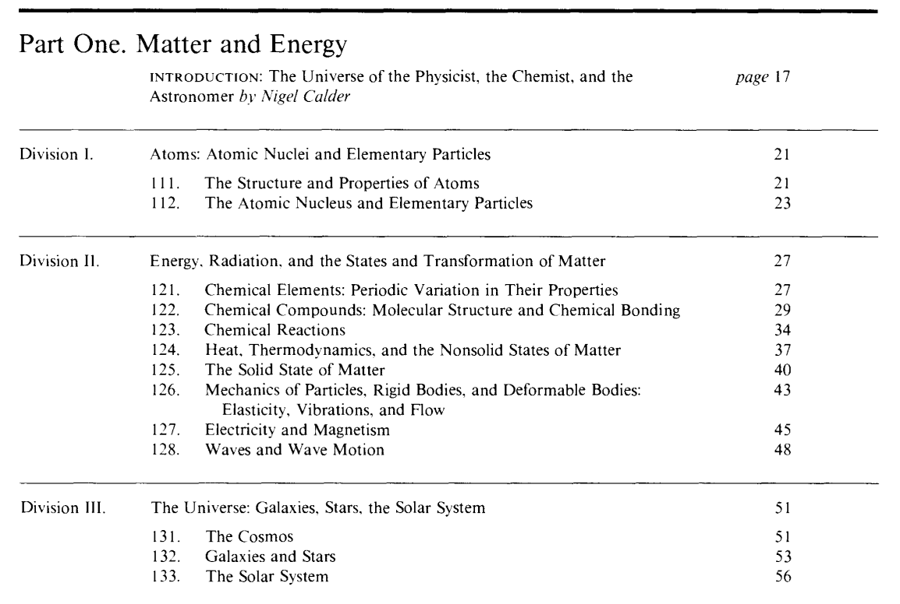

<!-- gid:20250424T142939 -->
[TOC]

[[TIP("이 노트에 대하여")]] 물질과 에너지는 세계를 설명하는 가장 기초적인 두 축이다. 이 메타는 브리태니커 프로피디아의 첫 장을 따라 물리학자, 화학자, 천문학자의 우주를 한 자리에서 조망한다. 우주 이해의 출발점을 잡아 주는 개요 노드다. [[/TIP]] BIBLIOGRAPHY 관련메타 - [1 프로피디아: 지식의개요](https://wikidocs.net/380838)
-   [0=53 matter 재료 물질 - 질료](https://wikidocs.net/380904)

## KEYWORDS

-   [bib/ 피터스미스 논리학 가이드 - LogicMatters '2024-09-08](https://wikidocs.net/382078)
-   [bib/ OpenHomeFoundation 오픈홈재단 지속 가능한 스마트홈 오픈소스 생태계 '2025-07-01 2025-07-01](https://wikidocs.net/382490)
-   [botlog/ edgeagent-config: 엣지 에이전트 — ESP32 M5Stack 몸과 A2A 카드 생태계 '2026-02-22 2026-05-29](https://wikidocs.net/382540)
-   [botlog/ homeagent-config 로드맵 — 오픈소스 스마트홈 에이전트 플랫폼 '2026-03-04 2026-03-30](https://wikidocs.net/382560)
-   [botlog/ 에이전틱 삽질기 모음 SDF×Zig 유연한 상태머신 — DS 20대 '2026-03-07 2026-03-26](https://wikidocs.net/382564)
-   [botlog/ durable-iot-migrate — Temporal 기반 IoT 플랫폼 마이그레이션 프레임워크 '2026-03-11 2026-03-12](https://wikidocs.net/382568)
-   [llmlog/ Matter 안드로이드 아키텍처 가이드 '2026-03-17 2026-03-17] - [llmlog/ connectedhomeip + Flutter 통합 — homeagent-config 작업 지침 '2026-03-24] - [llmlog/ homeagent-config: PM — Docker 기반 Matter+OTBR 배포 전환 '2026-03-24] - [llmlog/ homeagent-config: Thread Operational Discovery 타임아웃 분석 + 해결 방안 '2026-03-26] - [llmlog/ Matter 디바이스 프로파일 커버리지 — Go+Flutter 확장 설계 '2026-03-26] - [llmlog/ 엔경 Matter 네이티브 재출발 — homeagent-config 경험 전달 '2026-03-27] - [llmlog/ 엔경 앱 분석 — AOSP 네이티브 회귀 준비 '2026-03-27] - [llmlog/ AOSP Thread API와 REST 활용 가능성 조사 '2026-03-27] - [llmlog/ matter.js 1.5.x 지원현황과 힣의 네트워크 토폴로지 전략 메모 '2026-04-24 2026-04-28] - [llmlog/ 엔경 Matter SDK 제공 — APK와 Client SDK 두 산출물 '2026-04-30 2026-05-06] - [llmlog/ denotecli day 에 notes_modified 축 추가 가능성 분석 '2026-05-08 2025-06-10] - [llmlog/ MinerU 단번 vs Opus5 병렬 — 물질생명인간 OCR 엔진 판정 '2026-06-02 2026-06-02] - [notes/ 이맥스리스프: 모든파일 린터 포메터 - 디레드 매크로 '2023-10-06](https://wikidocs.net/381137)
-   [notes/ 힣: 메모리 대란과 임베디드 개발 — 투명한 경계 '2024-10-19 2026-07-06](https://wikidocs.net/381361)
-   [notes/ 힣: 낮잠 브레인워시 에너지 회복 '2024-12-07 2025-05-27](https://wikidocs.net/381410)
-   [notes/ 힣: 네트워크 스택 통합 '2025-12-18 2026-04-24](https://wikidocs.net/381842)

## History

-   [2025-04-24 Thu 14:29]

## 1. Matter and Energy 물질 에너지

The lead author was [Nigel Calder](https://en.wikipedia.org/wiki/Nigel_Calder), who wrote the introduction "The Universe of the Physicist, the Chemist, and the Astronomer".

주 저자는 나이젤 칼더였으며, 그는 "물리학자, 화학자, 천문학자의 우주"라는 서문을 썼습니다.

## **1.1** [Atoms](https://en.wikipedia.org/wiki/Atoms)1.1 원자

### **1.1.1**  Structure and Properties of Atoms 1.1.1 원자의 구조와 성질

### **1.1.2**  Atomic Nuclei and Elementary Particles

1.1.2 원자핵과 기본 입자

## **1.2**  Energy, Radiation, and States of Matter

1.2 에너지, 방사선, 물질의 상태

### **1.2.1**  Chemical Elements: Periodic Variation in Their Properties

1.2.1 화학 원소: 주기적 성질 변화

### **1.2.2**  Chemical Compounds: Molecular Structure and Chemical Bonding

1.2.2 화학 화합물: 분자 구조 및 화학 결합

### **1.2.3** [Chemical Reactions](https://en.wikipedia.org/wiki/Chemical_reaction)1.2.3 화학 반응

### **1.2.4**  Heat, Thermodynamics, Liquids, Gases, Plasmas

1.2.4 열, 열역학, 액체, 기체, 플라스마

### **1.2.5**  The Solid State of Matter

1.2.5 물질의 고체 상태

### **1.2.6**  Mechanics of Particles, Rigid and Deformable Bodies: Elasticity, Vibration, and Flow

1.2.6 입자, 강체 및 변형체 역학: 탄성, 진동 및 흐름

### **1.2.7**  Electricity and Magnetism

1.2.7 전기와 자기

### **1.2.8**  Waves and Wave Motion

1.2.8 파동 및 파동 운동

## **1.3** The [Universe](https://en.wikipedia.org/wiki/Universe)1.3 우주

### **1.3.1**  The Cosmos1.3.1 코스모스

### **1.3.2**  Galaxies and Stars1.3.2 은하 및 별

### **1.3.3** The [Solar System](https://en.wikipedia.org/wiki/Solar_System)1.3.3 태양계
