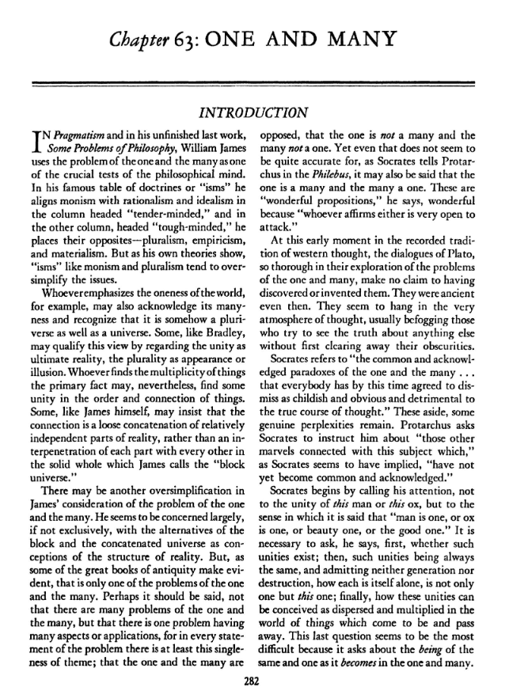

<!-- gid:20250424T231715 -->
[[TIP("이 노트에 대하여")]]
주의와 학파를 고정된 이름표가 아니라 사상을 묶고 대비하며 하나와 다수의 문제를 드러내는 분류어로 다룬다. 이름 붙이기와 분류가 사유를 돕는 동시에 얼마나 쉽게 단순화로 흐르는지도 드러낸다.
[[/TIP]]

<!-- provenance:source:start -->
[[TIP("원본·최신본")]]
이 페이지는 한국어 검색과 읽기를 위한 WikiDocs 미러입니다. [원본·최신본은 가든](https://notes.junghanacs.com/meta/20250424T231715/)에 있습니다. 최신 수정 내용·백링크·태그·히스토리·댓글·출처 정보는 원본 가든에서 확인하세요.

- 작성: `2025-04-24T23:17:00+09:00`
- 최근 수정: `2025-04-24T23:17:00+09:00`
[[/TIP]]
<!-- provenance:source:end -->

[TOC]

## BIBLIOGRAPHY

## 세네카의 시간에 대한 말

> 오, 루칠리야! 우리에게 주어진 것은 오로지 시간뿐 그 외는 모두 타인의 것이라오. 자연이 우리에게 선사해준 것은 끊임없이 흘러가며 사라지고 마는 시간뿐이오. 하지만 이조차도 누구든 원한다면 나에게서 빼앗아갈 수 있소. 왜냐하면 인간들은 타인이 소유한 시간을 귀하게 여기지 않기 때문이오. 시간이라는 것은 아무리 원해도 절대 되돌아오지 않는 유일한 재산인데 말이오. 그러면 당신은 과연 내가 스승으로서 시간 관리를 잘 하고 있는지에 대해 묻고 싶을 것이오. 시간을 낭비하면서도 철저히 관리하는 사람들처럼 나도 시간을 헤프게 쓰면서도 사용한 시간에 대해서는 정확하게 계산하고 있다오. 내가 시간을 낭비하지 않는다고는 말할 수 없지만 언제 어디서 왜 얼마나 낭비했는지에 대해 늘 알고 있다오.

## 관련메타

-   [0=66 philosophy 철학](https://wikidocs.net/380917)
-   [1=10=5 프로피디아 메타지식: 철학](https://wikidocs.net/380961)

## BIBLIOGRAPHY

## History

-   [2025-06-20 Fri 16:12] 학파
-   [2025-06-19 Thu 14:26] 랜덤으로 만난김에 신경쓰여서 수정. 번역
-   [2025-04-24 Thu 23:17] 생성
-   2024-09-10

## KEYWORDS

-   [bib/ 리디아자일로스카 마음챙김 주의력강화 정서관리 프로그램 '2023-10-20 2025-06-03](https://wikidocs.net/381867)
-   [bib/ 메리올리버 시몬베유 자연의 장면 속 경이 기도 주의 삶의 방향 '2024-02-25 2025-06-12](https://wikidocs.net/381883)
-   [bib/ 디르크그로서 삶과사랑에빠진아이처럼 일상 신비주의자 '2024-05-23 2025-03-24](https://wikidocs.net/381950)
-   [bib/ 마르쿠스가브리엘 지나치게연결된사회 윤리자본주의 신실존주의 신계몽주의 다원성 '2024-06-17](https://wikidocs.net/381971)
-   [bib/ 피터브루스 데이터사이언스 실용주의 통계학 '2024-06-17](https://wikidocs.net/381979)
-   [bib/ 에라스무스 Erasmus 로테르담의 인문주의자 중재자 유럽정신 '2024-06-25 2026-05-01](https://wikidocs.net/381996)
-   [bib/ 키르케고르 야스퍼스 하이데거 사르트르 실존주의 '2024-08-28 2026-01-24](https://wikidocs.net/382059)
-   [bib/ 올리버버크먼 4000주 불완전주의 삶의유한함 받아들임 '2024-10-22 2025-05-23](https://wikidocs.net/382132)
-   [bib/ 슈테판클라인: 현명한 이타주의자 '2024-12-09](https://wikidocs.net/382184)
-   [bib/ 장피아제 발생적인식론 - 조작적구성주의 '2024-12-10](https://wikidocs.net/382187)
-   [bib/ 다마지오 마뚜라나 바렐라 자기생성 인지 앎의나무 구성주의 신경생물학 체화인지 움벨트 '2024-12-20 2026-07-07](https://wikidocs.net/382206)
-   [bib/ 데이비드브룩스 저널리스트 인간의품격 두번째산 관계주의 사람을안다는것 '2025-01-05](https://wikidocs.net/382230)
-   [bib/ 길희성 심도학사 종교다원주의 영성가 '2025-02-12](https://wikidocs.net/382272)
-   [bib/ 장하석 과학철학 역사 능동적앎 실천 실용 실재 진리 지식관 인본주의 '2025-02-17 2026-07-06](https://wikidocs.net/382278)
-   [bib/ 앤드류헌트 실용주의 사고 학습 프로그래머 '2025-03-25 2025-03-25](https://wikidocs.net/382322)
-   [bib/ 게리클라인 김창준 통찰 창의력 프로그래머 애자일 실용주의 직관 '2025-03-25 2025-03-25](https://wikidocs.net/382323)
-   [bib/ 김구 백범일지 사상가 - 독립 삶 죽음 경계 자서전 겨례 스승 민족주의 근현대사 '2025-05-02 2025-05-02](https://wikidocs.net/382417)
-   [bib/ 존스튜어트밀 자유론 공리주의 '2025-05-04 2025-05-04](https://wikidocs.net/382420)
-   [bib/ 김대중 이희호 자서전 - 행동하는 양심 - 민주주의 정의 평화 민족 '2025-05-09 2025-05-09](https://wikidocs.net/382427)
-   [bib/ 야니스바루파키스 자본론 테크노퓨달리즘 기술봉건주의 - 빅테크 지배 계층 '2025-06-08 2025-06-08](https://wikidocs.net/382479)
-   [bib/ 롤랑바르트 텍스트 즐거움 기호 신화 구조주의 작가의죽음 '2025-06-18 2025-06-18](https://wikidocs.net/382482)
-   [bib/ 사르트르 1905 존재와무 현상학 실존주의 '2025-07-02 2025-07-02](https://wikidocs.net/382493)
-   [bib/ 롭무어 레버리지 자본주의 속에 숨겨진 부의 비밀 '2025-07-02 2025-07-02](https://wikidocs.net/382494)
-   [bib/ 제프베이조스 JeffBezos 아마존 창업자 장기주의 의사결정 내러티브메모 '2026-04-07 2026-04-07](https://wikidocs.net/382529)
-   [notes/ 새로운물결(NOUVELLE VAGUE) 스티븐핑커 가브리엘 - 신계몽주의 '2024-12-05 2024-12-05](https://wikidocs.net/381401)
-   [notes/ ~이즘 ~주의: 모호한 경계 노트테이킹 가추법 태도 체제 엇갈림 '2024-12-09 2026-04-29](https://wikidocs.net/381417)
-   [notes/ 교육: 토머스쿤 패러다임 - 시모어패퍼트 구성주의 - 애들러 항존주의 '2024-12-09 2024-12-09](https://wikidocs.net/381419)
-   [notes/ 힣: 지도: 철학사 - 시대별 분야별 인물별 학파 '2025-02-21 2025-02-21](https://wikidocs.net/381546)

## 관련노트

-   [힣: 지도: 철학사 - 시대별 분야별 인물별](https://wikidocs.net/381546)

## #신토피콘: Chapter 63. One and Many

Introduction 63장. 하나와 다수 : 서론

### KEYWORDS

일원

### 1

일원론 다원론

프래그머티즘(Pragmatism)과 그의 미완성 마지막 저서인 《Some Problems of Philosophy》에서 윌리엄 제임스(William James)는 하나와 다수의 문제를 철학적 사고의 중요한 시험 중 하나로 사용한다. 그의 유명한 교리 또는 "주의(isms)" 표에서 그는 일원론(monism)을 합리주의(rationalism)와 관념론(idealism)과 함께 "섬세한 마음(tender-minded)"이라는 칼럼에 배치하고, 반대편 칼럼인 "강인한 마음(tough-minded)"에는 다원론(pluralism), 경험주의(empiricism), 물질주의(materialism)를 놓는다. 그러나 그의 이론들이 보여주듯, 일원론과 다원론 같은 "주의(isms)"는 문제를 지나치게 단순화하는 경향이 있다.

세상의 일체성을 강조하는 사람은 예를 들어, 그 다원성도 인정하며 그것이 어떻게든 우주(universe)일 뿐만 아니라 다우주(pluriverse)이기도 하다는 것을 인식할 수 있다. 브래들리(Bradley)와 같은 일부는 이 관점을 궁극적 실재(ultimate reality)로서의 통일성(unity)과 현상 또는 환상으로서의 다원성(plurality)으로 구분하여 설명할 수 있다. 사물의 다수성(multiplicity)을 기본 사실로 보는 사람도, 그럼에도 불구하고 사물들의 질서(order)와 연결(connection) 속에서 어떤 통일성(unity)을 발견할 수 있다. 제임스(James) 자신과 같은 일부는 그 연결이 제임스가 "블록 우주(block universe)"라고 부르는 견고한 전체 속에서 각 부분이 서로 침투(interpenetration)하는 것이 아니라, 상대적으로 독립적인 현실 부분들의 느슨한 연쇄(loose concatenation)라고 주장할 수 있다.

제임스가 일과 다수의 문제를 고려할 때 또 다른 과도한 단순화가 있을 수 있다. 그는 현실 구조에 대한 개념으로서 블록 우주(block universe)와 연결된 우주(concatenated universe)의 대안에 주로, 아니 거의 전적으로 관심을 갖는 것처럼 보인다. 그러나 고대의 위대한 저서들이 분명히 보여주듯, 그것은 일과 다수의 문제 중 하나에 불과하다. 아마도 일과 다수의 문제들이 많다고 말하기보다는, 여러 측면이나 적용을 가진 하나의 문제라고 말하는 것이 옳을 것이다. 왜냐하면 문제의 모든 진술에는 적어도 이 하나의 주제가 있기 때문이다; 즉, 일과 다수는 대립하며, 일은 다수가 아니고 다수는 일이 아니다. 그러나 그것조차도 완전히 정확하지 않은 것 같다. 왜냐하면 소크라테스가 플레부스(Philebus)에서 프로타르코스(Protarchus)에게 말하듯, 일은 다수이고 다수는 일이라고도 할 수 있기 때문이다. 그는 이것들을 "놀라운 명제들"이라고 하며, "누구든지 이 중 하나를 주장하는 자는 매우 공격받기 쉽다"고 말한다.

서양 사상의 기록된 전통 초기에, 일과 다수의 문제를 철저히 탐구한 플라톤의 대화편들은 그것들을 발견하거나 발명했다고 주장하지 않는다. 그 문제들은 그때조차도 이미 고대의 것이었다. 그것들은 마치 사고의 대기 속에 떠다니는 듯하며, 보통은 다른 어떤 것의 진실을 보려는 이들이 먼저 그 불명료함을 제거하지 않고서는 혼란에 빠지게 만든다.

소크라테스는 "일과 다수에 관한 공통적이고 인정된 역설들... 모두가 이제는 유치하고 명백하며 진정한 사고의 흐름에 해롭다고 일축하기로 동의한" 것들을 언급한다. 그 외에도 몇 가지 진정한 당혹스러움이 남아 있다. 프로타르코스는 소크라테스에게 "이 주제와 관련된 다른 경이로운 것들에 대해 가르쳐 달라"고 요청하는데, 소크라테스가 암시한 바와 같이, "아직 공통적이고 인정된 것이 되지 않은" 것들이다.

소크라테스는 이 사람이나 이 소의 통일성(unity)에 주목하는 것이 아니라, "사람이 하나다, 소가 하나다, 아름다움이 하나다, 선이 하나다"라고 말할 때의 의미에 주목하라고 말한다. 그는 먼저 그러한 통일체들이 존재하는지 물어야 한다고 말한다; 그리고 그러한 통일체들이 항상 동일하며 생성도 소멸도 허용하지 않는다면, 각각이 어떻게 단독으로 존재하며 단지 하나가 아니라 바로 이 하나인지를; 마지막으로, 이러한 통일체들이 어떻게 생성되고 소멸하는 사물들의 세계에서 분산되고 다수로 인식될 수 있는지를 묻는다. 이 마지막 질문이 가장 어려운 것처럼 보이는데, 이는 동일하고 하나인 존재가 어떻게 다수 속에서 존재하는지를 묻기 때문이다.

### 2

프로타르코스는 이 문제들을 해결하기 시작하기를 조급해한다. 소크라테스는 그가 "이렇게 다양한 쟁점들이 걸려 있는 위대하고 다면적인 전투"라고 부르는 일을 기꺼이 맡으려 하면서도, 이 탐구에 뛰어드는 초심자들이 앞으로 맞닥뜨릴 지적 위험을 프로타르코스와 다른 젊은이들에게 알리고자 한다. 그는 그들에게 "하나와 여러 개는 사유에 의해 동일시된다... 그것들은 함께 돌아다니며, 발화되는 모든 단어 안팎을 드나든다... 이들의 결합은 결코 멈추지 않으며, 지금 시작된 것도 아니고, ... 결코 늙지 않는 사유 자체의 영원한 속성이다"라고 말한다.

그가 설명하길, "어떤 젊은이가 처음으로 이러한 미묘한 점들을 맛볼 때면 기뻐하며, 자신이 지혜의 보물을 발견했다고 착각한다; 기쁨의 첫 열정 속에서 그는 돌 하나도, 아니 생각 하나도 남김없이 뒤집어 보며, 때로는 많은 것을 하나로 모으고 함께 반죽하며, 때로는 그것들을 펼치고 나누기도 한다; 그는 무엇보다도 먼저 자신을 혼란스럽게 하고, 그 다음에는 나이 많든 적든, 혹은 동갑이든 상관없이 이웃들을 혼란스럽게 한다 — 그것은 아무런 차이가 없다; 아버지나 어머니도 예외가 아니며; 귀가 있는 인간은 그에게서 안전하지 못하고, 거의 그의 개조차도; 그리고 만약 통역사가 있다면 야만인도 그에게서 도망칠 기회가 없을 것이다."

그것이 짜증나는 미묘한 차이로 가득 차 있든 진정한 지혜의 보물이든, 하나와 다수에 대한 논의는 — 존재와 생성, 지성적(인텔리저블, intelligible)인 것과 감각적(센서블, sensible)인 것, 확정된 것과 무한한 것, 동일한 것과 다른 것, 보편과 개별, 전체와 부분, 단순한 것과 복잡한 것, 나눌 수 없는 것과 연속적인 것과의 관계 속에서 — 고대인들에게 피할 수 없는 논의로 보인다. 플라톤의 대화편들과 특히 아리스토텔레스의 형이상학(Metaphysics)에서 하나와 다수는 철학적 사유의 기본 용어들과 연결되어 있다.

플라톤에게 있어서, 일과 다수의 구분은 쾌락, 덕, 지식과 같은 거의 모든 대상의 분석에 들어간다. 어떤 것이든 그 존재나 생성, 명확한 동일성 또는 불명확한 이질성과 다양성의 관점에서 볼 때, 반드시 하나로서 그리고 다수로서 논의되어야 한다. 플라톤 변증법(dialectic)의 움직임은 하나에서 다수로, 또는 다수에서 하나로 진행될 수 있으며; 또는 무한에서 하나로 나아가는 과정에서 분석이 거쳐야 하는 중간 단계로서 다수의 수준에서 이루어질 수도 있다. 소크라테스는, 단번에 통일성에서 무한으로 넘어가는 자들은 "단순한 논쟁술(art of disputation)과 진정한 변증법(true dialectic)의 차이를 인식하지 못한다"고 말한다.

아리스토텔레스에게 있어서, 제1철학 또는 형이상학은 "존재하는 것(being qua being)과 존재하는 것에 속하는 속성들"에 관한 것으로, 통일성(unity)도 탐구한다. 통일성은 존재의 첫 번째 속성이다. 하나(one) 또는 통일성(unity)의 의미는 '존재하다(to be)'의 의미만큼 다양하다. 본질적 존재(essential being)와 부수적 존재(accidental being) 사이에 차이가 있다면, 본질적 통일성(essential unity)과 부수적 통일성(accidental unity) 사이에도 유사한 차이가 있다. 자연물(natural things)과 인공물(artificial things)이 실체(substance)나 존재(being)에서 다르다면, 통일성(unity)에서도 달라야 한다. 아리스토텔레스는 "존재(being)와 통일성(unity)은 동일하며, 원리(principle)와 원인(cause)이 서로 함축하는 것처럼 서로 함축되어 있는 한 가지이다"라고 말한다. 통일성은 존재로부터 분리될 수 없으며, 어떤 것도 존재하지 않고는 어떤 의미에서든 통일성을 가지지 않을 수 없다. 이 통일성은 그 사물이 존재하는 방식에 의해 결정된다. 아리스토텔레스의 어떤 주제(subject matter)에 대한 분석은 대립되는 것들(contraries)을 참조하여 진행되며, 항상 하나(the one)와 다수(the many)를 호소한다. "모든 반대되는 것들(all contraries)"은, 그가 말하길, "존재와 비존재(being and non-being), 그리고 일체성과 다수성(unity and plurality)으로 환원될 수 있다. 예를 들어, 정지는 일체성에 속하고 운동은 다수성에 속한다... 그리고 모든 다른 것들도 명백히 일체성과 다수성으로 환원될 수 있다.... 모든 것은 반대되거나 반대되는 것들로 구성되어 있으며, 일체성과 다수성은 모든 반대성의 원리이다."

하나와 다수가 관련된 것으로 보이는 문제들은 서양 사상의 모든 시기에 반복적으로 나타난다. 예를 들어, 인식하는 자(knower)와 인식되는 자(known)의 관계에 불가분한 이중성이 존재하는지, 아니면 인식 행위에서 인식하는 자와 인식되는 자가 하나인지에 대한 문제는 플로티누스(Plotinus)와 아리스토텔레스(Aristotle)뿐만 아니라 홉스(Hobbes)와 윌리엄 제임스(William James)에 의해서도 논의된다. 국가(state)가 어떻게든 공통의 삶을 위해 결합된 다수(multiplicity)인 경우, 국가가 가족(family)과 같은 정도의 일체성을 가지고 있는지, 혹은 가져야 하는지에 대한 문제는 플라톤(Plato)과 아리스토텔레스(Aristotle)뿐만 아니라 로크(Locke)와 헤겔(Hegel)에 의해서도 논의된다.

### 3

주권의 불가분성에 관한 초기 논쟁은 나중에 연방 연합의 중심 쟁점이 되며, 이에 대해 연방주의자들은 e pluribus unum을 해결책으로 제시한다. 지식의 대상으로서 단순한 것과 복잡한 것, 또는 전체와 부분에 관한 문제나 시간, 공간, 물질의 통일성과 가분성에 관한 문제는 고대뿐만 아니라 현대의 탐구자와 분석가들의 관심을 끈다.

그러나 고대인들만이 특이하게도 독특한 사변적 열정으로 다룬 특정한 문제들이 있다. 앞서 언급한 문제들이 통일성과 다수성의 대조의 적용에 관한 것과 달리, 이 문제들은 하나(One) 자체에 관한 질문들이다—그것이 무엇인지, 존재하는지, 존재(Being)와 동일한지, 그것이 자체로 실체(substance)인지 아니면 모든 것의 실체인지에 관한 것이다.

고대에서 이러한 문제에 대한 지속적인 탐구는 엘레아의 파르메니데스가 고대 사상에 미친 비범한 영향력을 증명하는 것으로 보인다. "엘레아의 낯선 이"라고 불리는 인물은 플라톤의 『소피스트』와 『정치가』 같은 대화편에서 그의 이론을 대표한다. 파르메니데스 또는 그의 제자 제논은 아마도 소크라테스가 『필레부스』에서 더 이상 진지하게 다룰 가치가 없다고 일축한 많은 역설과 수수께끼의 출처일 것이다. 그의 이름을 딴 『파르메니데스』라는 한 편의 대화편은 '모든 것은 하나다'라는 엘레아 학파의 증명을 보여준다. 이 대화편은 다수의 실재를 옹호하거나 그 입장을 터무니없게 만들기 위해 시도하는 다양한 논증의 미묘함으로 가득 차 있다.

소크라테스가 그의 역설들에 대해 질문하자, 제논은 자신의 저작들이 "하나의 존재를 긍정하는 것에서 따른다고 생각하는 많은 우스꽝스럽고 모순된 결과들을 보여주려는 자들을 상대로 파르메니데스의 주장을 보호하기 위한 것"이라고 말한다. 다수파 지지자들에게는, 제논은 "그들의 존재 가설이 실행될 경우, 하나의 존재 가설보다 훨씬 더 우스꽝스럽게 보인다는 점을 반격함으로써 그들의 공격에 이자를 붙여 되돌려 준다"고 말한다.

아리스토텔레스도 엘레아 학파의 논증을 다룬다. 《자연학(Physics)》에서 그는 먼저 존재가 하나인지에 대한 탐구가 자연 연구에 기여할 수 없다고 말한다. 이어서 그는 그러한 탐구가 어차피 "논쟁을 위한 어떤 입장에 반대하는 것과 같거나 ... 단지 논쟁을 위한 논증을 반박하는 것과 같다"고 덧붙인다. 그는 이 설명이 "멜리수스와 파르메니데스의 논증 모두에 적용된다: 그들의 전제는 거짓이고 결론은 따르지 않는다... 하나의 터무니없는 명제를 받아들이면 나머지도 따라온다... 충분히 간단한 절차"라고 말한다. 《형이상학(Metaphysics)》에서 아리스토텔레스가 파르메니데스와 제논을 다루는 태도도 크게 다르지 않은데, 변화와 자연의 원리 연구에는 해당하지 않더라도 존재 연구에 엘레아 학파의 사색이 관련됨을 암묵적으로 인정한다. 그럼에도 불구하고 플라톤과 아리스토텔레스가 논의할 가치가 있다고 여긴 하나와 다수에 관한 많은 질문들은 파르메니데스와 그의 학파가 제기한 난제들과 어느 정도 연관이 있는 것으로 보인다.

존재의 통일성도 부정하지 않고 그 다원성도 부정하지 않는 사람들은 현실에 관한 기본 사실을 그 일체성(oneness)이나 다수성(manyness) 중 하나로 보는 경향이 있다. 처음에는 이것이 별로 중요하지 않은 것처럼 보일 수 있지만, 이 차이에서 비롯된 두 세계관을 살펴보면, 이 단일한 쟁점에 대한 불일치가 다른 모든 것에 대한 관점을 바꾸는 것을 알 수 있다. 하나 또는 다수를 강조하는 철학자들은 망원경의 반대쪽 끝에서 본 동일한 대상보다 훨씬 근본적으로 다른 우주를 본다. 그러나 그것이 전부는 아니다. 신과 인간, 정신과 지식, 물질과 운동, 원인과 필연성에 관한 거의 모든 다른 근본 개념들도 또한 변화하는 것처럼 보인다.

예를 들어, 스피노자는 반드시 여러 개가 존재하는 유한한 것들에게 오직 하나만 존재할 수 있는 무한한 존재에 속하는 속성을 부여하는 사람들을 비판한다. 이 사람, 이 돌, 또는 이와 유사한 개별적인 어떤 것은 스스로 존재할 수 있는 능력을 가진 실체가 아니며, 단지 모든 것이 "존재하고 개념화되는" 하나의 무한한 실체인 신의 속성들의 특정한 변형으로 구성되어 있다. 스피노자에 따르면, 유한한 다수가 실체라고 생각하는 사람들은 "철학적 연구의 적절한 순서를 관찰하지 못한 것"이다.

### 4

그들은 가장 현실성이 적은 감각의 대상들부터 시작하여 마지막으로 신성한 본성, 즉 "지식의 순서와 사물의 순서에서 가장 먼저이기 때문에 먼저 연구되어야 하는" 무한한 존재에 이른다... 따라서 스피노자는 계속해서 말한다, "사람들이 자연 대상을 연구하는 동안 신성한 본성에 대해 가장 적게 생각하게 되었고, 이후에 신에 대해 생각하려 할 때, 그들이 자연 사물에 대한 지식을 쌓기 위해 세운 이전의 허구들보다 더 적게 생각할 수 있는 것은 없었다. 왜냐하면 이 허구들은 신성한 본성에 대한 지식에 전혀 도움이 될 수 없었기 때문이다."

자기 자신 안에 존재하고 자기 자신을 통해 개념화되는 것으로서의 실체(substance)의 정의와, 절대 무한한 존재로서의 신(God)의 정의, 즉 "무한한 속성(attributes)으로 이루어진 실체"의 정의에서 출발하여, 스피노자는 동일한 본질이나 속성을 가진 두 개 이상의 실체가 존재할 수 없으며, 실체는 필연적으로 무한하며, 따라서 둘 이상의 실체가 존재하는 것은 불가능하다는 것을 증명하려 한다. 그는 "존재하는 모든 것은 자기 자신 안에 있거나 다른 것 안에 있다"는 것을 자명한 원리로 간주하기 때문에, 어떤 것이든 존재한다면 신(또는 실체)은 필연적으로 존재해야 하며—이는 오직 자기 자신 안에 존재하고, 다른 모든 것이 신의 속성들의 양상(mode) 또는 변형(affection)으로서 유한한 존재를 갖는 것으로서 존재하는 것임을 의미한다.

어떤 다른 결과들도 뒤따르는 것처럼 보인다. 하나의 무한한 실체는 나눌 수 없다: 그것은 양적인 전체의 부분들이 양이 나누어질 때 독립적으로 존재할 수 있는 것처럼 보이는 부분들로 이루어진 전체가 아니다. 더욱이, 스피노자에 따르면, "신은 모든 것의 내재적(immanent) 원인이지, 전이적(transitive) 원인이 아니다." 신은 두 존재가 독립적으로 존재할 때 한 존재가 다른 존재에 작용하는 하나의 존재로서 원인이 되는 것이 아니라, 모든 것이 존재하는 그 존재로서 원인이 된다. 신은 다른 신학자들이 생각하는 것처럼 원인이 그에 의존하는 결과 안에 존재하는 방식으로 세상에 존재하는 것이 아니다. 오히려 전체 세계는 원인의 존재로부터 결코 분리될 수 없는 결과로서 신 안에 있으며, 이는 어떤 측면(aspect)이 그것이 속한 대상에서 분리될 수 없는 것과 같다.

스피노자에게 존재의 통일성과 전체성은 "자연(nature)"이라고도 불릴 수 있으며, "무한한 실체(infinite substance)" 또는 "신(God)"이라고도 불린다. 그의 구분은...

natura naturans와 natura naturata는 NATURE 장에서 논의되었으며, 그가 무한하거나 영원한 것과 유한하거나 일시적인 것—하나와 다수—을 구별할 수 있게 해 주는 것으로 보인다. 이는 신과 세계 사이에 실제적인 분리를 암시하지 않는다. 신은 세계에 내재해 있으며, 신은 필연적으로 존재할 뿐만 아니라 자신의 본성의 필연성에서 행동하기 때문에, NECESSITY AND CONTINGENCY 장에서 언급된 바와 같이, 자연의 모든 유한하고 일시적인 측면은 필연적으로 결정된다. 우연한 것은 없다. 어떤 것도 현재와 다를 수 없다.

하나의 우위가 다수를 흡수하고 종속시키는 교리를 검토하는 이 과정은, 하나를 우선시하는 것이 단순한 강조 이상의 의미임을 보여준다. 또한 거의 모든 근본적인 질문에 영향을 미친다는 점을 드러낸다. 이는 윌리엄 제임스가 블록 우주(block universe)에 대해 말할 때 의미하는 바를 보여주는 그림을 제시하는데, 그 자신은 보통 스피노자의 신보다는 헤겔의 절대자(Absolute)를 염두에 두는 것으로 보인다.

아리스토텔레스는 반대되는 교리를 제시한다. 스피노자처럼 그는 '실체(substance)'라는 용어를 사용한다. 스피노자처럼 그는 실체를 다른 것 안에 존재하는 우연적 속성(예를 들어, 장미의 붉음)으로서가 아니라 그 자체로 존재하는 것으로 정의한다. 그러나 그에게 실체는 반드시 무한하지도 않고, 불가분하지도 않다. 장미나 인간은 실체이다. 자연스러운 통일성을 가진 모든 물리적 사물은 실체이다.

각각은 유한한 전체이며, 오히려 여러 가지 다른 의미에서 전체이다. 본질적인 통일성을 가진 한에서, 그것은 아리스토텔레스에 따르면 속(genus)과 차이(differentia)의 정의 공식으로 표현되는 질료(matter)와 형상(form)으로 구성된 전체이다. 질료로 구성된 한에서, 그것은 또한 하나의 사물로 움직이거나 독특하게 장소를 차지하는 양적 전체(quantitative whole)의 통일성을 가진다. 양적 통일성은 연속성을 포함하고, 연속성은 가분성을 수반하기 때문에, 실체는 양적 부분으로 나누어지지 않는 한 하나로 남아 있으며, 마치 질료와 형상이 분리되지 않는 한 본질적으로 하나로 남아 있는 것과 같다.

### 5

물질이 개별적인 것은 절대적으로 나눌 수 없기 때문이 아니라—루크레티우스에게 원자가 단순하기 때문에 복합적이지 않은 것과 같다. 그 개별성은 오히려 첫째, 다른 물질들과 구분되어 그것들이 반드시 파괴되지 않고도 소멸할 수 있거나, 그것이 파괴되지 않고도 소멸할 수 있는 방식에 있고, 둘째, 나눌 수 있는 부분들로 분할되더라도 그 부분들이 나누어지지 않은 상태에서는 하나의 전체라는 사실에 있다. 그러나 하나의 물질로서 그것은 단순한 사물들의 집합보다 더 큰 통일성(unity)을 가진다.

아리스토텔레스가 자연적 실체와 인공적 사물의 통일성을 구분한 것에 따르면, 인간과 기계의 차이는 인간은 실체로 구성되어 있지 않다는 점이다(비록 생명체의 부분들이 분해되거나 분리될 때 실체로 존재할 수 있지만), 반면에 금속 조각들로 이루어진 기계는 단지 여러 개의 개별 실체들이 특정한 방식으로 배열된 것에 불과하다. 따라서 데카르트가 영혼과 몸을 두 개의 실체로 개념화한 반면, 아리스토텔레스는 이를 별개의 실체가 아니라 형태와 질료로 보고 이들의 결합을 통해 하나의 실체를 구성한다고 보았기 때문에 인간의 통일성은 동일하지 않은 것으로 보인다.

간단히 말해, 통일성(unity)은 본질적으로 개별 자연 실체에 속한다. 각 개별 실체는 필연적으로 다수 중 하나이기 때문에, 아리스토텔레스는 스피노자와 달리 실체의 통일성을 긍정하면서도 동시에 다수의 실체를 긍정하지 않을 수 없다. 세계는 실체 자체가 아니라 단지 실체들의 집합체이므로, 본질적으로 하나라기보다는 다수이다. 세계가 지니는 통일성은 그것을 구성하는 실체들의 질서와 연결에서 비롯되며, 이는 다시 서로 다른 실체들이 인과적으로 상호작용하는 방식에서 주로 기인한다.

아리스토텔레스에 따르면 인과성(causality)은 우연성과 가능성을 포함하기 때문에, 실체들의 생성과 운동에 관한 인과적 상호의존성은 그것들을 단단한 덩어리로 묶어두지 않는다. 다시 제임스(James)의 비유를 사용하자면, 인과적으로 그리고 또한 우연적으로 관련된 방대한 다수의 개별 실체들이 느슨하게 결합된 세계, 즉 연쇄된 우주를 구성한다.

하나의 전체로서 세계와 신과의 관계는, 만약 유한한 개별 실체들의 다수가 세계를 구성하는 근본적인 특징으로 남아 있다면, 세계에 더 큰 통일성을 부여한다. 기독교 창조 교리는 신의 무한히 위대한 지혜가 자연의 개별 사물들을 인간이 사물을 조립하거나 자신의 목적에 맞게 배열하는 데에 도달할 수 있는 것보다 무한히 더 완벽하게 질서 있게 배열함에 따라, 세계에 인간의 어떤 예술 작품보다 더 큰 통일성을 부여할 수 있다. 그러나 신학자에 따르면, 신이 세계를 창조할 때 하나의 실체가 아니라 여러 실체를 창조하며, 이들이 서로 연결되는 패턴을 통해 하나의 전체를 형성한다면, 어떤 의미에서 세계는 그 구성 실체 각각보다 통일성이 덜하다.

아퀴나스에게 있어, 한 종류의 실체는 다른 것보다 더 큰 통일성을 가질 수 있다. 비물질적인 것은 물질적인 것보다 더 큰 통일성을 가지며, 신은 어떤 유한한 실체보다 더 큰 통일성을 가진다. 왜냐하면 이들 각각은 물질과 형상, 또는 본질과 부수적 속성, 적어도 본질과 존재로 구성되어 있는 반면, 신의 무한한 존재는 절대적으로 단순하기 때문이다. 신성한 본성은 물질도 없고 부수적 속성도 없으며, 그 속성들은 본질과 동일하고, 본질은 존재와 동일하다.

신성(神性)에 관한 이 중요한 점은 신과 세계가 신과 맺는 관계에 대한 개념에 결정적이다. 기독교 신학의 형성 과정에서, 하나님의 절대적 단순성은 삼위일체 문제에 대한 단 하나의 해석만을 허용하는 것처럼 보인다. 아우구스티누스가 아리우스 이단을 비판하면서 취한 입장에 따르면, 니케아 신조에 표현된 바와 같이, 하나님은 실체들의 삼위일체가 아니라 한 실체 내의 인격들, 즉 한 실체 내의 측면들이나 관계들의 삼위일체이다. 세계를 구성하는 사물들의 다수성은 세계를 신성한 실체 밖에 완전히 위치시킨다. 원인으로서만 내재하는 하나님은 단순한 존재로서 창조된 세계의 복잡한 전체를 초월한다.

### 6

이 초월성은 또한 아우구스티누스와 아퀴나스 같은 신학자들에게 존재 영역에서 근본적인 이중성을 내포하는 것으로 보인다. 신과 세계는 하나가 아니라 둘이다. 무한한 존재는 유한한 존재들에 대해 절대적으로 우선하며 독립적이다. 하나는 다수 없이 존재할 수 있다. 다수가 존재한다고 할지라도, 그들이 존재할 때 존재에 참여한다고 하지만, 그들은 하나의 존재 안에 들어가거나 그것을 어떤 식으로든 공유하지 않는다. 그들이 가진 존재는 신의 존재와 분리되어 있을 뿐만 아니라, 그들의 존재 방식조차 신성한 존재에 대해 단지 유비적(analogical)일 뿐이다.

각 사물이 고유한 존재를 가진다는 교리와, 아퀴나스가 말하듯이 "존재는 모든 것에 대해 오직 유비적 의미로만 공통적이다"라는 주장은 현실 구조에서 다양성을 통일성보다 우위에 두는 것처럼 보이며, 이 세계의 궁극적 다원성은 그것이 하나로 창조되었다는 사실이나 초월적 하나와의 관계에 의해 영향을 받지 않는 것처럼 보인다.

위대한 고전 전통에서, 하나와 다수의 문제는 본질(substance)이라는 중심 개념을 사용하지 않고 자주 제기된다.

플라톤이 존재와 생성에 대해 고찰할 때 나타난다. 때로는 지성적 형상(intelligible forms)과 감각적 사물(sensible things) 사이의 관계, 즉 보편적 관념(universal ideas)과 그것들을 모방하거나 참여(participation)를 통해 닮은 개별적 사물(particulars) 사이의 관계를 다룰 때 나타난다. 심지어 관념의 영역 자체에 대한 논의에서도 나타나는데, 하나의 관념(idea of the one)은 여러 관념들 중 하나이면서도, 여러 관념 각각이 어떤 면에서 하나인 것이다.

일과 다수의 문제는 흄(Hume)이 각 경험 단위(unit of experience)가 서로 절대적으로 구별된다는 점을 고찰할 때 나타난다. 그는 이러한 단위들을 실제적 통일성(real unity)으로 묶는 어떤 연결고리를 발견할 수 있는지에 대해 회의적(skepticism)이다. 이 문제는 칸트(Kant)의 선험적 자아 통일성(transcendental unity of apperception) 이론에서도 나타나는데, 이는 감각적 다양성(sensory manifold)을 질서의 통일성(unity of order)으로 환원한다. 또한 헤겔(Hegel)의 절대 관념(Absolute Idea) 이론에서도 나타나는데, 이 절대 관념은 자연이나 역사 과정에서 관념이 전개됨에 따라 드러나는 모든 다양성을 내포하고 있다.

한 용어 집합을 다른 용어 집합으로 대체하는 것은 근본적인 문제를 바꾸는 것처럼 보이지 않는다. 또한 그것은 마음이 하나를 우선시하는 사람들과 다수를 우선시하는 사람들 중 어느 한쪽 편을 드는 것을 벗어나게 하지도 않는다. 다만 상호 연관된 것으로서 균형을 맞추려 시도함으로써 예외가 있을 수 있다. 그러나 위대한 저서들 중에서 플로티누스의 《에네아드(Enneads)》는 존재를 초월하고 인식을 넘어서는 하나(One)의 이론을 전개하여, 모든 전통적인 분석 용어들을 변형시키는 것처럼 보인다.

파르메니데스의 일자(One)는 결국 존재(Being)이며, 존재와 일자의 동일시는 다수의 실재성에 대한 문제를 제기한다. 그러나 플로티누스에 따르면, "존재를 초월하는 원리가 존재한다; 이것이 바로 우리가 지금까지 그러한 문제들이 증명될 수 있는 한도 내에서 그 본질을 규명하려 했던 일자(The One)이다. 일자 다음에는 즉시 존재이자 지성 원리(Intellectual-Principle)인 원리가 따른다. 세 번째는 원리인 영혼(Soul)이다." 이것이 플로티누스가 세 가지 가설(hypostases)이라고 부르는 것이다. 그는 플라톤의 파르메니데스에서 유래한 교리에서 자신의 삼위일체(trinity)에 대한 유사성을 발견하는데, 그 교리에서는 "원초적 일자(Primal One), 엄격히 순수한 통일성(Unity), 그리고 일자-다수(One-Many)인 이차적 일자, 그리고 일자와 다수(One-and-Many)인 세 번째 구분"이 존재한다.

플로티노스에 따르면, 일자(The One)는 존재를 초월할 뿐만 아니라 지성(intelligence)도 초월한다. 앎이나 사고는 대상(object)을 필요로 한다. 앎과 앎을 당하는 자의 관계는 이중성(duality)을 수반하는데, 이는 일자의 완전한 단순성(utter simplicity)을 깨뜨릴 것이다. 일자가 오직 자신만을 아는 완전한 반사성(reflexivity)조차도 배제된다. 플로티노스에게 초본질(superessential)은 또한 초지성(supra-cogitative)이다. 그는 "존재(Being) 위에 서 있는 것은 지성(intellection) 위에 서 있다"고 말하며, "순수한 단일성(pure unity)으로서 탐구할 필요가 있는 어떤 것도 포함하지 않기 때문에 자신을 알지 못하는 것이 결코 약점이 아니다"고 한다. 다수성(multiplicity)은 초월자(Transcendent)를 알기 위한 지성 원리(Intellectual-Principle)의 노력에서 시작된다. "그것은 초월자를 그 본질(essence) 속에서 알지만, 순수한 단일성으로서 그 이전(prior)을 파악하려는 모든 노력과 함께 연속적인 인상(impressions)을 축적해 나가므로, 대상은 그것에게 다수로 변한다... 지성 원리는 다수성 속에 확립된다."

전체란 무엇인가? 일자(The One)가 전부가 아닌 이유는 지성 원리(Intellectual-Principle)와 영혼(Soul)도 그것에 속하기 때문이다. 플로티노스(Plotinus)는 "일자는 모든 것이면서 그 중 어느 것도 아니다. 모든 것의 근원은 모든 것이 아니다... 일자 안에 아무것도 없기 때문에 모든 것이 그로부터 나온다"고 답한다. 초월자(Transcendent)가 근원인 전체의 나머지 모든 것은 그로부터 발산된다.

### 7

"아무것도 구하지 않고, 아무것도 소유하지 않으며, 아무것도 부족하지 않은," 플로티누스는 선언한다, "일자(The One)는 완전하며, 우리의 은유에서 넘쳐흘러 그 풍부함이 새로운 것을 만들어냈다: 이 산물은 다시 그 생성자에게로 돌아가 채워지고 그 생성자의 관찰자가 되어 지적 원리(Intellectual-Principle)가 되었다... 그것은 동시에 지적 원리이자 존재(Being)이다; 그리고 이 비전을 통해 닮음을 얻어, 일자가 거대한 힘을 쏟아내는 행위를 반복한다. 이 두 번째 유출은 신성한 지성(Divine Intellect)을 나타내는 형상(Form) 또는 이데아(Idea)로서, 신성한 지성이 자신의 이전인 일자를 나타낸다. 본질(지적 원리로서 존재로 간주되는)에서 나온 이 능동적 힘은 영혼(Soul)이다. 영혼은 움직이지 않는 지적 원리의 이데아이자 행위로서 발생한다... 그것은 자신의 근원(source)을 바라봄으로써 충만함을 얻지만, 다른, 즉 하향하는 움직임을 채택하여 자신의 형상을 생성한다. 이 영혼의 형상은 감각(Sense)과 자연(Nature), 즉 식물적 원리이다."

플로티누스는 "어떠한 것도 그 이전과 완전히 단절되어 있지 않다"고 쓴다. 따라서 인간의 영혼은 식물계(vegetal order)까지 내려가는 것처럼 보인다. 이러한 연속적인 발산(emanations) 속에서 "하나가 아닌 모든 것은 하나 덕분에 보존되며, 하나로부터 그 고유한 본질이 유래한다." 하나를 제외한 모든 것은 하나-다수(one-many)이다. "만약 그것이 다수로 이루어진 것과 일치하는 그런 통일성을 이루지 못했다면, 우리는 그것의 존재를 확언할 수 없었을 것이다." 초월자(Transcendent)만이 "진정으로 존재하는 하나, 완전하고 진실로 하나인 존재이며, 그로부터 어떤 식으로든 흘러내린 후속체(sequent)는 모두 전체이며, 통일성에 참여하고 그 모든 구성원이 마찬가지로 전체이자 하나인 존재이다."

만약 이성이 초월적 하나(Transcendent One)를 완전히 파악할 수 없다면, 그것은 논리적 이성(discursive reason) 자체가 다수성의 존재이기 때문일 수 있다. 초월적 하나의 형언할 수 없는 통일성을 이해하기 위해서는 모든 것을 포괄하는 통합적 시각의 통일성이 요구될 수 있다. 그러나 통일성의 신비는 초월적 하나에만 국한되지 않는다. 그것은 수학자뿐만 아니라 철학자에게도 직면하는 문제이다. 니코마코스(Nicomachus)와 유클리드(Euclid)뿐만 아니라 플로티누스에게도 도전이 된다.

니코마코스는 "단일성은 점의 위치와 성격을 차지하며, 구간(interval)과 수(number)의 시작이 되지만, 그 자체는 구간이나 수가 아니다"라고 썼다. 그렇다면 단일성 또는 단위(unit)란 무엇인가? 유클리드는 다음과 같이 정의한다: "단위는 존재하는 모든 것들이 하나(one)라고 불리는 근거가 되는 것이다." 단일성은 존재의 척도일 뿐만 아니라 수의 척도이기도 하다; 왜냐하면 유클리드에 따르면 "수는 단위들로 구성된 다수(multitude)"이기 때문이다. 수학에서뿐만 아니라 형이상학(metaphysics)이나 신학(theology)에서도 단일성과 수의 관계는 일과 다(the one and the many) 문제의 핵심인 것처럼 보인다.

로크에 따르면, "수(number)는 인간, 천사, 행위, 생각에 적용된다; 존재하거나 상상할 수 있는 모든 것에 적용된다." 그의 관점에서 단일성 또는 하나(one)는 단지 우리의 모든 관념(ideas) 중 가장 단순한 것일 뿐만 아니라 가장 편재하는(omnipresent) 것이다. "우리의 감각이 관여하는 모든 대상; 우리의 이해 속의 모든 관념; 우리의 마음의 모든 생각은 이 관념을 함께 가져온다. 그러므로 그것은 ... 모든 다른 것들과의 일치성에서 우리가 가진 가장 보편적인 관념이다."

### 스크린샷

[2025-06-19 Thu 14:00]

### Topics: One and Many 하나와 여러 개

One and Many - [Link](https://archive.org/stream/greatideasvolii030131mbp#page/n307/mode/1up) - 하나와 다수 - 연결

**Topics 주제들**

#### 1. The transcendental one: the Absolute; the unity of being, of nature, of the universe - 초월적 하나: 절대; 존재, 자연, 우주의 통일성

#### 2. The relation of the one and the many: emanation of the many from the one - 하나와 다수의 관계: 하나로부터 다수의 발산

##### a. The unity or duality of God and the world: the immanence and transcendence of God - 신과 세계의 통일성 또는 이중성: 신의 내재성과 초월성

##### b. The one and the many in relation to the universal and the particular: the abstract and the concrete universal - 보편과 개별에 관한 일자와 다자: 추상적 보편과 구체적 보편

#### 3. The modes of unity: comparison of numerical, essential, and divine unity - 통일의 양식: 수적 통일, 본질적 통일, 신적 통일의 비교

##### a. Numerical unity or identity: the number one - 숫자 1의 단일성 또는 동일성

##### b. The unity of the indivisible or the simple: the individual thing, the point, the atom, the quality - 나눌 수 없거나 단순한 것의 통일성: 개별 사물, 점, 원자, 속성

##### c. The complex unity of a whole composed of parts: the distinction between the indivisible and the undivided - 부분들로 구성된 전체의 복합적 통일성: 나눌 수 없는 것과 나누어지지 않는 것의 구별

#### 4. Kinds of wholes or complex unities - 전체 또는 복합적 통일성의 종류

##### a. Quantitative wholes: oneness in matter or motion - 양적인 전체: 물질 또는 운동에서의 일체성

###### 1) The continuity of a quantitative whole -   양적인 전체의 연속성

###### 2) The unity and divisibility of a motion -   운동의 통일성과 가분성

###### 3) The unity and divisibility of matter -   물질의 통일성과 가분성

###### 4) The unity and divisibility of time and space -   시간과 공간의 통일성과 가분성

##### b. Natural or essential wholes: the oneness of a being or a nature - 자연적 또는 본질적 전체: 존재 또는 본성의 일체성

###### 1) The distinction between essential and accidental unity -   본질적 통일성과 우연적 통일성의 구별

###### 2) The comparison of the unity of natural things with man-made compositions or aggregations: artificial wholes -   자연물의 통일성과 인공적 구성물 또는 집합체의 비교: 인공적 전체

###### 3) The unity of a substance and of substantial form -   실체와 실체형상의 통일성

###### 4) The unity of man as composite of body and soul, matter and spirit, exten- sion and thought -   몸과 영혼, 물질과 정신, 연장과 사유의 복합체로서의 인간의 통일성

###### 5) The unity of the human person or the self: the order of man's powers; the split personality -   인간 또는 자아의 통일성: 인간 능력의 질서; 분열된 인격

#### 5. Unity in the realm of mind: unity in thought or knowledge - 정신 영역에서의 통일성: 사고 또는 지식의 통일성

##### a. The unity of mind or intellect, the cognitive faculties, or consciousness - 정신 또는 지성의 통일성, 인지 능력 또는 의식

##### b. The unity of sense-experience: the unity of attention; the transcendental unity of apperception - 감각 경험의 통일성: 주의의 통일성; 선험적 자각의 통일성

##### c. Unity in thinking or understanding: the unity of complex ideas and definitions; the unity of the term, the judgment, and the syllogism - 사고나 이해의 통일성: 복잡한 아이디어와 정의의 통일성; 용어, 판단, 삼단논법의 통일성

##### d. The unity of science: the unity of particular sciences - 과학의 통일성: 개별 과학들의 통일성

##### e. The one and the many, or the simple and the complex, as objects of knowledge: the order of learning with respect to wholes and parts - 하나와 다수, 또는 단순한 것과 복잡한 것, 지식의 대상으로서: 전체와 부분에 관한 학습의 순서

##### f. The unity of knower and known, or of subject and object - 앎과 앎의 대상, 또는 주체와 객체의 통일성

#### 6. Unity in moral and political matters - 도덕적 및 정치적 문제에서의 통일성

##### a. The unity of virtue and the many virtues - 덕의 통일성과 여러 덕목들

##### b. The unity of the last end: the plurality of intermediate ends or means - 최종 목적의 통일성: 중간 목적 또는 수단의 다양성

##### c. The unity of subjective will and objective morality in the ethical realm - 윤리 영역에서 주관적 의지와 객관적 도덕성의 통일성

##### d. The unity of the family and the unity of the state: the limits of political or social unification - 가족의 단합과 국가의 단합: 정치적 또는 사회적 통합의 한계

##### e. The unity of sovereignty: its divisibility or indivisibility; the problem of federal union - 주권의 단일성: 그 분할 가능성 또는 불가분성; 연방 연합의 문제

#### 7. Unity in the supernatural order - 초자연적 질서에서의 단일성

##### a. The unity and simplicity of God - 신의 단일성과 단순성

##### b. The unity of the Trinity - 삼위일체의 일치

##### c. The unity of the Incarnation - 성육신의 일치
