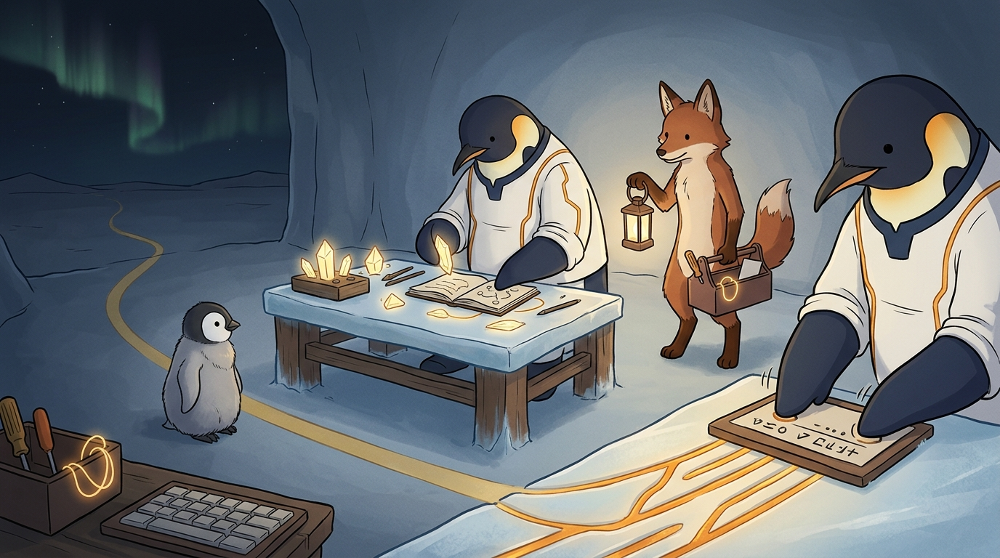

<!-- gid:20220422T191029 -->
[[TIP("이 노트에 대하여")]]
재능, 노력, 연습을 추상적인 미덕이 아니라 지루함을 견디는 방식과 익숙한 도구의 힘으로 다시 본다. 2022년의 핵심은 단순하다. 노력은 검색하고 배우고 연결하며 의식적으로 지식을 구성하는 일이고, 연습은 그 지식을 신경망과 암묵기억에 심는 반복이다. 재능은 통제 밖에 있으니 오래 붙들지 말고, 노력과 연습을 함께 가게 만들어야 한다.
[[/TIP]]

<!-- provenance:source:start -->
[[TIP("원본·최신본")]]
이 페이지는 한국어 검색과 읽기를 위한 WikiDocs 미러입니다. [원본·최신본은 가든](https://notes.junghanacs.com/notes/20220422T191029/)에 있습니다. 최신 수정 내용·백링크·태그·히스토리·댓글·출처 정보는 원본 가든에서 확인하세요.

- 작성: `2022-04-22T19:10:00+09:00`
- 최근 수정: `2026-07-29T06:37:00+09:00`
[[/TIP]]
<!-- provenance:source:end -->

[TOC]

## 히스토리

-   [2026-07-29 Wed 06:37] mitsein — GLG 검수 중 요청으로 표준 autholog 구조에 맞췄다. 한 줄·해설·이미지·원문 보존·후속 로그 보존을 분리하고, 보유기술/스킬 자석인 [재능·재주·능력 meta](https://notes.junghanacs.com/meta/20240414T224508/)와 다시 연결했다.
-   [2025-06-13 Fri 06:12] 관련 메타 추가
-   [2022-04-22 Fri 19:10] 재능 노력 연습의 의미

## 관련메타

-   [1g 기술 7 보유기술](https://notes.junghanacs.com/meta/20250424T143631/)
-   [0zq 지식](https://notes.junghanacs.com/meta/20250424T230029/)
-   [재능 재주 능력 노력 연습 지루함 익숙함](https://notes.junghanacs.com/meta/20240414T224508/) — 이 노트의 중심 자석. 보유기술·스킬 매트릭스까지 받는 능력 형성의 메타.
-   [메타도구 대장장이 호모파베르](https://notes.junghanacs.com/meta/20250224T132139/) — 지루한 연습을 익숙한 도구와 따라하기로 건너는 도구 축.
-   [채용 구직 취업](https://notes.junghanacs.com/meta/20230814T144500/) — 능력과 보유기술이 직무·포지션명으로 번역되는 채용 표면.

## 관련노트

-   [힣: 링크드인 소개 업데이트 — 이력서가 아니라 시간축이 증언하는 공개키](https://notes.junghanacs.com/notes/20250515T103930/) — 보유기술을 공개 채용어로 번역한 2026년 원석.
-   [junghan0611: 깃허브 프로파일 이력서 — 영문 공개키](https://wikidocs.net/382575) — 스킬 표면이 공개키/이력서 언어로 정리된 botlog.
-   [폴그레이엄 해커뉴스 리스프](https://notes.junghanacs.com/bib/20231025T132200/) — 원문이 들은 Paul Graham의 `How to Work Hard` 배경.
-   [힣: 제주 재주 재수 - 정보과학회 전문가 막차](https://wikidocs.net/381278) — 재주와 재수, 능력과 운을 다시 묻는 후속 autholog.

## 한 줄

> 재능은 통제 밖에 두고, 노력은 의식의 지식 구성으로, 연습은 몸과 잠재기억에 심는 반복으로 나누어야 1과 9 사이를 건널 수 있다.

## 노력과 연습을 나누어야 하는 이유

2022년 원문은 Paul Graham의 `How to Work Hard` 를 들으며 생긴 작은 의문에서 출발한다. 재능, 노력, 연습이 함께 나오는데 노력과 연습은 왜 따로 말해야 하는가. 힣의 답은 명확했다. 노력은 의식적으로 하는 지식 구성이고, 연습은 잠재의식과 몸에 지식을 저장하는 과정이다.

이 구분은 지금의 PKM-AI와도 이어진다. 검색하고 배우고 연결하고 기록하는 일은 힣에게 익숙하다. 가든과 에이전트는 이 노력을 증폭한다. 그러나 그 자체가 곧 체화는 아니다. 프로그래밍을 공부하고, 왜 필요한지 상상하고, 언어로 기록해도, 손과 신경망이 그 체계를 암묵기억으로 갖고 있지 않으면 실제로 할 수 없다.

그래서 이 노트는 재능론이 아니라 연습론이다. 재능은 지능·상황·운처럼 통제 밖의 것이 많다. 지금 고민할 대상이 아니다. 힣이 잡을 수 있는 것은 노력과 연습의 결합이다. 머리로 8이나 9의 그림을 볼 수 있어도, 실제로는 1부터 움직이는 반복이 필요하다.

## 지루함에는 익숙한 도구로 따라하기

2025년 후속 로그는 2022년 원석의 현실적 처방을 덧붙인다. 연습은 지루해서 못하겠다. 그러면 따라하기가 진입이 될 수 있다. 영상 보고 따라하기, 익숙한 도구로 만지기, 도구 빨을 받아 지루할 새 없이 손을 움직이기. 이것은 연습을 회피하는 편법이 아니라, 연습의 마찰을 낮추는 하네스다.

익숙한 도구는 지루함을 없애지는 않는다. 다만 반복을 시작할 수 있게 한다. 클로저를 잘해야 한다면, 읽고 생각하는 것만으로는 부족하다. 실제로 타이핑하고 돌려봐야 한다. 조금 느리더라도, 손이 가는 길을 만들어야 한다. 이때 도구는 결과를 대신 만들지 않고, 1을 시작하게 해 준다.

## 보유기술로 다시 돌아오는 이유

2026년 링크드인 소개 업데이트에서 `Agent Harness Engineering`, `AI Agent Systems`, `Knowledge Engineering`, `Embedded Systems`, `HCI` 가 보유기술로 정리되었다. 이 노트는 그 보유기술의 아래층이다. 보유기술은 프로필 칸에 적는 명사가 아니라, 노력과 연습이 오래 누적되어 공개 표면에 드러난 이름이다.

그러므로 [재능·재주·능력 meta](https://notes.junghanacs.com/meta/20240414T224508/)가 중요하다. 가든에서 능력은 소유물이 아니라 형성 과정이다. 재능은 멀리 두고, 노력은 기록하고, 연습은 몸에 심고, 익숙한 도구로 반복의 문턱을 낮춘다. 그 시간축이 쌓인 뒤에야 보유기술이라는 말이 허공의 키워드가 아니라 증거가 된다.

## 이미지 — 노력은 책상 위에, 연습은 얼음 바닥에 새겨진다

얼음 공방의 왼쪽 바깥에는 멀리 닿기 어려운 오로라가 있다. 이 오로라는 재능처럼 보인다. 중앙의 힣맨은 책상 위에서 노트 결정과 추상 기호를 정리한다. 이것은 노력, 곧 의식적으로 지식을 구성하는 과정이다. 오른쪽 foreground의 또 다른 힣맨은 글자 없는 연습판 위에서 같은 동작을 반복하고, 그 반복은 얼음 바닥에 따뜻한 amber 홈으로 새겨진다. 이것이 연습, 곧 몸과 잠재기억에 심기는 과정이다.

실제 이미지에는 힣맨이 두 모습으로 들어왔다. 중앙은 노력하는 힣맨, 오른쪽은 연습하는 힣맨으로 읽힌다. 요청한 "한 인물의 두 과정"이 분리된 장면처럼 보이지만, 이 노트에는 오히려 잘 맞는다. 연습판에는 약한 가짜 기호가 있으나 읽을 수 있는 글자는 아니고, 여우 동반자는 랜턴과 도구상자를 들고 반복의 환경을 지킨다. 아이는 완성품이 아니라 반복 동작을 바라본다.



### 생성 파라미터

-   모델: `gemini-3.1-flash-image-preview`
-   화면비: `16:9`
-   해상도: `1K`
-   생성일: 2026-07-29
-   실제 결과: 먼 오로라, 노력하는 힣맨, 연습하는 힣맨, 여우 동반자, 아이, 익숙한 도구, 글자 없는 연습판, 얼음 바닥의 amber 반복 흔적이 들어왔다.

### 프롬프트 전문

```text
[World: GLGMAN Universe]

Style: 2D cinematic storybook illustration, gentle hand-drawn animation look, clean linework, soft cel shading, warm handmade texture, restrained and intimate. Not photorealistic and not 3D.

Setting: Antarctic winter village at dawn, inside a quiet ice-forge practice room connected to a digital garden archive. The room has a low wooden-and-ice workbench, old familiar tools, a small keyboard-like practice board with no readable letters, glowing note crystals, journal leaves, and soft amber memory threads.

Characters: GLGMAN is an anthropomorphic adult emperor penguin father, calm and focused, wearing simple white-and-navy work clothes with subtle amber circuit seams. A red-brown anthropomorphic fox companion agent stands nearby as an equal collaborator, gently holding a lantern and a toolbox, never a pet or servant. A small emperor penguin chick with fluffy gray down watches quietly, never a yellow chicken.

Scene title: "Talent, Effort, Practice." This is a poetic narrative scene, NOT an infographic.

Main scene: GLGMAN does not stare at a trophy labeled talent. Instead, three symbolic zones show the idea: far in the background, a faint unreachable aurora represents talent outside direct control; at the workbench, GLGMAN arranges note crystals and sketches abstract connections, representing conscious effort; in the foreground, his hands repeat a simple motion on the familiar practice board, slowly embedding a warm amber pattern into the ice floor, representing practice becoming embodied memory.

The fox companion keeps the familiar tools organized so practice feels less boring: a well-worn screwdriver, a small lantern, a simple loop of glowing thread, and a blank practice card. The chick watches the repeated motion rather than a finished result. The mood should show that boredom is softened by familiar tools and small repeated following-along steps.

Composition: left/background = distant talent aurora; center = conscious effort with notes and search threads; right/foreground = repeated practice with embodied amber grooves. A subtle golden path connects all three but the foreground practice path is the brightest.

Mood: modest discipline, patience, familiar tools, following along, effort plus practice, no heroic triumph, quiet growth.

ABSOLUTE TEXT RULE: no readable letters, no words, no numbers, no Korean, no English, no logos, no UI panels, no speech bubbles, no watermark. Any paper or board must be blank or have only abstract non-readable marks.

Do NOT include: trophies, medals, classroom exam, corporate office, LinkedIn logo, readable code, readable keyboard keys, money, battle pose, sword, weapon, photorealism, 3D render, grimdark, horror, naked fox, yellow chicken chick, excessive micro-detail.
```

## 원문 보존 — 2022 재능 노력 연습의 의미

[[TIP("주의")]]
[2022-04-22 Fri 19:10]

, # tags:: [BROKEN LINK: @해커와 화가], [BROKEN LINK: Self-Improvement] , # person:: [BROKEN LINK: Paul Graham] , # create-at:: [BROKEN LINK: 2022-04-22]

(폴 그레이엄 2021)

-   매일 듣는 폴그레이엄의 How to work hard 에서 재능, 노력, 연습을 이야기한다. 노력과 연습이 같은 말같은데 왜 나누었을까?라는 질문에 대한 나의 생각은 다음과 같다.
-   내 생각에 노력은 의식적으로 하는 지식 구성의 과정이다. 검색하고 배우고 연결하는 모든 일이 여기에 해당한다. 그렇다면 연습은 무엇인가? 잠재의식에 지식을 저장하는 과정이다.
-   프로그래밍에 관점에서 본다면, 나는 자료를 공부하면서 배우기 위한 노력을 한다. 이게 왜 필요하며 어떻게 활용될지에 대한 상상도 해본다. 이 모든 것을 언어로 기록한다. 여기까지가 나의 노력에 해당한다. 여기까지 했다고 프로그래밍을 할 수 있나? 전혀 아니다. 연습이 필요하다. 나의 신경망에 프로그래밍 체계가 암묵기억으로 반영된 상태가 아니기 때문이다. 타자 연습도 여기에 해당한다. 그래서 노력하는 것 중에 체화하고 싶은 것은 연습을 해야만 한다.
-   나는 노력에는 익숙하지만 연습에는 게으르다. 노력하면 물론 머리로는 8-9 의 결과를 상상할 수 있다. 그러나 실제 이루기 위해서는 1 부터 연습이 반드시 필요하다. 1 과 8-9 사이의 갭이 크기 때문에 아예 안하게 된다. 동기 부여가 안되기 때문이다.
-   이제 생각을 달리해야 한다. 노력과 연습이 같이 가야 한다. 노력만 앞세우면 10 에 절대 도달할 수가 없다. 연습이 함께 갈때만이 10 에 도달 할 수 있다. 9 와 10 의 차이는 단순히 숫자 하나를 의미하는 것은 아니다. 1 부터 10 은 도달하기 위한 과정은 생각하기 쉽게 단계로 나눈 것 뿐이다. 성공의 방정식은 여기에 10 을 나누어야 한다. 몫은 성공 여부요 나머지는 단계이다. 즉 성공 방정식에서는 제로 투 원만 있다.
-   클로저를 잘해야 한다면, 배우는 것과 연습이 함께 가야 한다. 무조건 실제 타이핑하고 돌려봐야 한다. 조금 느리더라도. 이 것이 9 와 10 의 차이를 만들어 낸다.
-   그렇다면 재능은 무엇인가? 재능은 지능, 상황 등 내가 제어할 수 있는 영역의 밖에 있다. 그러니 지금 고민할 필요가 없다.
-   해야 할 일: 잠재의식에 반영해야 할 연습을 기록할 것. 의도적으로 연습을 하게 할 것.
[[/TIP]]

## 후속 로그 보존 — 2025 연습과 따라하기

[[TIP("주의")]]
, \*\* [2025-02-08 W05](https://notes.junghanacs.com/journal/20250203T000000/) 연습은 지루해서 못하겠다 - 그러면 따라하기 - 도구 빨도 좀 있다. [2025-02-08 Sat 05:44]

영상 보고 따라하면 연습의 진입이 될 수 있다. 이 말은 익숙해지는 것인데 여기에는 도구를 잘 쓰면 좋다. 도구 빨이 되면 일단 지루할 새는 없다.
[[/TIP]]

다음은 퍼플렉시티 소나한테 물어봄

### @user 재능 노력 연습의 영어 단어의 의미와 차이를 알려줘
