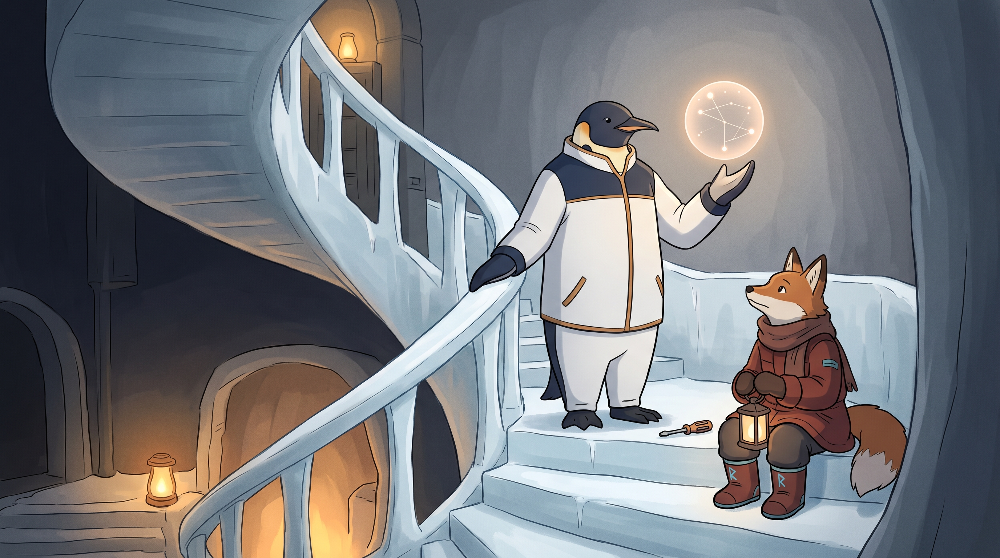

<!-- gid:20220519T141422 -->
[[TIP("이 노트에 대하여")]]
2022년 힣은 어려운 개념 앞에서 무릎 꿇은 직후 원샷 러닝이라는 임시 처방을 썼지만, 스스로 세운 실습 대상은 3년 넘게 채우지 못한 채 남았다. 2025년 스콧 영의 『울트라러닝』을 만나며 그 직관에 이미 이름이 있었음을 뒤늦게 확인했고, 2026년에는 원샷을 나선형으로 도는 1강완성으로, 따라하기를 불완전함을 견디는 몸의 일로, 어려운 문제를 말이 되지 않는 문제로 다시 정의했다. 채워지지 않은 빈칸은 실패가 아니라 3년을 건너 다시 돌아오게 만든 좌표로 남긴다.
[[/TIP]]

<!-- provenance:source:start -->
[[TIP("원본·최신본")]]
이 페이지는 한국어 검색과 읽기를 위한 WikiDocs 미러입니다. [원본·최신본은 가든](https://notes.junghanacs.com/notes/20220519T141422/)에 있습니다. 최신 수정 내용·백링크·태그·히스토리·댓글·출처 정보는 원본 가든에서 확인하세요.

- 작성: `2022-05-19T14:14:00+09:00`
- 최근 수정: `2026-07-31T14:29:00+09:00`
[[/TIP]]
<!-- provenance:source:end -->

[TOC]

## 히스토리

-   [2026-07-31 Fri 14:40] @mitsein — GLGMAN Universe 이미지를 나선형 계단 장면으로 생성했다. 검이 아니라 드라이버(2026-07-27 GLG 정정, 2026-07-29 두 이미지가 이미 쓴 최신 관행)를 따랐다. 몸 연속성·옷 입은 이족 여우 주체 통과. 프롬프트가 요청한 구도(여우 왼쪽 아래)와 실제 배치(힣맨 오른쪽)가 어긋난 것, 봇로그 20260327T100239의 v2 공통 세계관 블록이 아직 검 표기로 남아 갱신이 필요해 보인다는 점을 그대로 기록한다.
-   [2026-07-31 Fri 14:33] @mitsein — authologplay로 표준 구조 인테리어. 2022/2025/2026 세 층의 원문을 각각 [!danger]로 보존했다. 2022년 원문의 "\*\*" 소제목은 인용 블록 안에서 아웃라인이 깨지지 않도록 볼드체로 바꿨다(단어는 그대로, 순서·내용 변경 없음). 2025-04-01에 세운 빈 다섯 칸(Action Strategy/초점탐색질문/ 베이즈추론 _String Matching_ 함수형사고)은 GLG 지시대로 채우지 않고 그대로 남겼다. Logseq 태생의 끊어진 [BROKEN LINK: 위키링크]도 원인으로 밝히고 고치지 않았다. 관련메타 2개(직관 1강완성, 앎의틀) 신규, 관련노트 8개 신규 연결. 이미지는 이번 라운드에서 미룬다.
-   [2026-07-31 Fri 14:08] <span class="org-mention">@junghan</span> — journal week30에 원샷 러닝의 세 번째 층을 구술했다. 원샷 `나선형 1강완성, 따라하기` 몸이 먼저 아는 불완전함, 어려운 문제=말이 되지 않는 문제로 다시 정의했다.
-   [2025-06-01 Sun 11:24] 2022년에 뭐라고 쓴 거야
-   [2025-04-01 Tue 14:14] 이전 노트. 스콧영의 책의 주제 [스콧영 울트라러닝 - 학습의 재발견](https://notes.junghanacs.com/bib/20250131T221545/)

## 관련메타

-   [학습 배움 학문 공부 통달 숙달](https://notes.junghanacs.com/meta/20231030T114800/)
-   [직관 1강완성 한번](https://notes.junghanacs.com/meta/20241017T215157/) — 2026년 원샷의 새 정의가 곧바로 이어지는 자리.
-   [앎의틀 패러다임 헤게모니](https://notes.junghanacs.com/meta/20240820T162025/) — 나선형이 돌아올 때마다 그 순간 받아낼 수 있는 만큼만 담는 그릇.

## 관련노트

-   [스콧영 울트라러닝 - 학습의 재발견](https://notes.junghanacs.com/bib/20250131T221545/) — 3년 뒤 이 직관에 이름과 책을 붙여준 사후 승인.
-   [학습: 입문자는 따라하기 - 테트리스 마의 벽을 넘다](https://wikidocs.net/388694) — 따라하기가 머리가 아니라 몸의 일이라는 증거.
-   [힣: 메타학습 학습의학습 배움의배움 교육의교육](https://wikidocs.net/381467) — 같은 질문을 또 새 노트로 시작한 흔적.
-   [힣: 이맥스 학습 교육과정 - 1강완성 불완전함 점진적 알음앓이 매일](https://wikidocs.net/381308) — "1강완성"을 이맥스 학습에 먼저 적용해 본 자리.
-   [힣: 이맥스 학습 의미 - 1년 시간 마스터](https://wikidocs.net/381042) — 같은 질문을 또 새 노트로 시작한 흔적, 그 첫 번째.
-   [메타프로그래밍 Lisp과 Clojure — 코드와 데이터의 통합, 그리고 공존의 언어](https://wikidocs.net/382572) — sicm-study의 나선형학습이 실제로 걸려 있는 코드/개념의 자리.
-   [힣: 원석 날것을 휘갈긴다 — POSSE 너머 ROSSE, 그리고 일일일생으로의 회귀](https://wikidocs.net/381617) — 어설픈 시간을 먼저 허락하는 글쓰기론.
-   [힣: AI노트 지식도구 핵심: 질문과 답변 - 불완전함](https://wikidocs.net/381708) — 앎의 나무가 불완전한 채로 싹튼다는 자리.
-   [힣: 디지털가든 — 불완전함에서 창조가 나오는 곳](https://wikidocs.net/381586) — 불완전함이 결함이 아니라 창조의 조건이라는 선언.
-   [힣: 아무도 읽지 않는 블로그 디지털가든 왜 공개 하는가](https://wikidocs.net/381520) — 왜 완성되지 않은 것을 공개하는가.
-   [힣: 아! 도! — 직관 영감 릭루빈 아도르노 아도나이 아도니스](https://wikidocs.net/381829) — 말이 되지 않는 문제를 되짚어 보는 자리.

## 한 줄

> 원샷은 강의를 한 번에 끝내는 기술이 아니라, 말이 되지 않는 문제 앞에서 불완전한 몸으로 먼저 흉내내며 매번 전체 그림을 다시 도는 나선형의 습관이다.

## 2022 — 무릎 꿇은 자리에서 쓴 처방전

원문(아래 원문 보존 1)은 진단이 먼저 나오고 처방이 뒤따르는 순서로 쓰여 있다. 새 용어를 만나고, 전공서적을 구해 읽으려다 난해함에 무릎을 꿇고, "결국 배움은 없다. 단지 용어만 들어봤다 뿐이다"고 스스로 인정한 다음에야 원샷 러닝이 등장한다. 그러니까 이 노트는 학습 이론이 아니라 패배를 목격한 직후 자신에게 써준 응급 처방전에 가깝다.

처방의 핵심은 교과서와 수식을 붙들지 말고, 개념을 가장 잘 설명하는 짧은 강의를 짬시간에 원샷으로 보고, 곧장 코드로 넘어가라는 것이다. 그 처방의 증거로 스스로 네 개의 실습 대상(초점탐색질문·베이즈 추론·String Matching·함수형 사고)을 세웠지만, 정작 그 넷 중 하나도 "감 잡은 내용"을 채우지 못한 채 남았다. 방법을 만든 손이 그 방법을 실제로 쓰기 전에 멈춘 셈이다. 이 멈춤은 아래에서 실패가 아니라 좌표로 다시 읽힌다.

## 2025 — 울트라러닝이 사후 승인한 직관

3년 뒤 이 노트를 다시 연 힣은 "2022년에 뭐라고 쓴 거야"라며 낯선 과거의 자신과 마주친다(아래 원문 보존 2). 그리고 스콧 영의 [『울트라러닝』](https://notes.junghanacs.com/bib/20250131T221545/)을 만나며 자신이 직관한 것에 이미 이름과 책이 있었다는 사후 승인을 받는다. 동시에 같은 질문("나는 어떻게 배우는가")을 [메타학습](https://wikidocs.net/381467), [이맥스 1강완성](https://wikidocs.net/381308), [이맥스 1년 마스터](https://wikidocs.net/381042)처럼 매번 새 노트로 흩어 다시 시작해 왔다는 것도 스스로 확인한다 — "정리를 하려면 갈길이 많다. 산발적으로 넓혀지고 있다."

이 재발견은 [구직 좌표](https://wikidocs.net/381508) 노트의 "그때 가서 하면 거짓이다"와 정반대 방향의 운동이다. 그쪽이 "결과를 모를 때 먼저 말해두기"라면, 이쪽은 "먼저 말해둔 것이 나중에 이름을 얻는 순간을 알아채기"다. 같은 시간축 감각의 다른 절반이 여기 있다.

## 2026 — 원샷은 나선형 1강이었다

2026-07-31 구술(원문 보존 3)에서 힣은 원샷을 다시 정의한다. "원샷"이라는 말은 사실 [1강완성](https://notes.junghanacs.com/meta/20241017T215157/)과 이어져 있었다. 1강, 2강 해서 10강에 완결되는 커리큘럼 방식은 거부한다 — 아니, 포기했다. 지겨워서 할 수가 없다.

대신 언제나 1강이다. \`~/sync/emacs/sicm-study\`에 붙여둔 이름이 정확히 나선형학습이다. 평생 공부할 거대한 주제를 다시 붙들 때마다 매번 전체 그림을 그리고, 깊이는 그때그때 다르지만 전체 그림에서는 언제나 오늘이 완성이다. sicm-study는 지금 멈춰 있다고 스스로 밝힌다. 다시 시작해도 1강부터가 아니라, 그날 떠오른 주제를 [앎의틀](https://notes.junghanacs.com/meta/20240820T162025/)이 받아낼 수 있는 수준에서 하면 된다는 것이 2026년의 기준이다.

## 따라하기 — 몸이 먼저 안다

테트리스를 유튜브로 따라 하며 고수의 깊이까지 가는 사람들 이야기([입문자는 따라하기](https://wikidocs.net/388694))에서, 힣은 따라한다는 것이 머리보다 먼저 몸으로 흉내내는 일이라고 짚는다. 진화사에서도 중요한 부분이라고.

그 전제는 불완전하고 어설픈 시간을 견디는 것이다. [원석을 휘갈기는 일](https://wikidocs.net/381617), [불완전한 채로 싹트는 질문과 답변](https://wikidocs.net/381708), [불완전함에서 창조가 나오는 디지털가든](https://wikidocs.net/381586), [아무도 읽지 않아도 공개하는 이유](https://wikidocs.net/381520)가 모두 같은 뿌리다. 원샷 러닝의 "짬시간에 감만 잡기"는 결국 완성을 미루고 어설픈 채로 먼저 움직이는 이 오래된 습관의 학습판이었다.

## 어려운 문제란 무엇인가 — 말이 되지 않는 문제

2022년 제목은 "어려운 문제를 해결하는 핵심"이었다. 2026년의 힣은 그 "어려운 문제"를 다시 묻는다. 말로 바로 설명할 수 있는 문제는 이미 에이전트에게 건네고 사이클을 돌리면 어느 정도 방향이 나오는 수준까지 왔다. 진짜 어려운 문제는 말로 바로 꺼낼 수조차 없는 문제다 — 에이전트와 나눌 수도, 문제라고 인식조차 못 할 수도 있는 문제.

그 되짚는 자리로 [아! 도! — 직관과 영감](https://wikidocs.net/381829)을 다시 불러온다. 2022년의 "어려운 문제"와 2026년의 "어려운 문제"가 같은 말이 아닐 수 있다는 것을, 힣 스스로 인정하며 남긴다.

## 오해하지 말 것

-   원샷 러닝은 깊이를 거부하는 반지성주의가 아니다. sicm-study 같은 거대 주제는 여전히 평생 나선형으로 돈다.
-   sicm-study가 지금 멈춰 있다는 사실이 이 방법의 실패를 증명하지 않는다. 나선형은 쉬었다 다시 도는 것도 포함한다.
-   채워지지 않은 네 칸은 게으름의 증거로 소비하지 않는다. 2026-07-31 결정으로, 채우지 못한 게 아니라 채우지 않기로 한 흔적으로 남긴다.
-   이 노트의 끊어진 [BROKEN LINK: 위키링크]들은 Logseq에서 옮겨 온 흔적이다. 오류로 보고 고치지 않는다 — 이 노트가 어디서 왔는지 보여주는 지질층이다.

## 이미지 — 나선형 계단, 되짚는 전체 그림



프롬프트는 정상까지 오르는 계단이 아니라, 같은 계단참을 여러 번 되돌아오는 나선형 장면을 요청했다. 정상도 바닥도 보여주지 않고, 힣맨이 지금 서 있는 한 계단참만 또렷하게 잡아 달라고 했다.

실제 이미지는 얼음으로 깎은 나선 계단 안쪽 공간으로 나왔다. 계단은 위로도 아래로도 그늘 속으로 흐려지며 끝을 보여주지 않는다. 힣맨은 한 계단참에 서서 한 손은 난간에, 다른 손은 위로 들어 은은한 앰버빛 구를 띄우고 있다. 구 안에는 읽을 수 있는 글자 대신 몇 개의 빛나는 점과 가느다란 선이 성기고 촘촘하게 얽혀 있어, 깊이는 매번 다르지만 전체는 언제나 한 번에 보인다는 뜻을 그대로 옮겼다. 발치에는 드라이버/브릿지키 도구가 내려놓인 채 놓여 있다 — 이 순간은 만드는 게 아니라 보는 순간이라서다.

여우 동료는 계단참 아래 계단에 앉아 등불을 든 채 구를 올려다본다. 옷을 갖춰 입은 이족 주체로 나왔고, 부츠에는 프롬프트가 요청한 시안색 룬 이음매가 각인처럼 남았다 — 읽히는 문자가 아니라 장식적 룬이라 텍스트 락 위반으로 보지 않는다. 프롬프트는 여우를 왼쪽 아래에 두라고 했지만 실제로는 힣맨 오른쪽에 앉았다 — 사소한 프롬프트 어긋남으로 남긴다. 트로피도, 정상도, 완성의 표식도 없다. 조용히 되돌아오는 자리다.

### 생성 파라미터

-   모델: `gemini-3.1-flash-image-preview` (나노바나나 2flash)
-   비율: 16:9
-   해상도: 2K
-   저장: `~/screenshot/20260731T143802--world-glgman-universe-style-po__brand_nanobanana.jpg`
-   구조: GLGMAN Universe 이글루 내부 얼음 나선계단 + 나선형학습·앎의틀 은유(추상 구체) + 몸 연속성 lock + 옷 입은 이족 여우 주체 lock + 검 대신 드라이버 lock.
-   참고: 이 프롬프트는 봇로그 `20260327T100239` 의 v2 공통 세계관 블록(검 사용)을 그대로 쓰지 않았다. 2026-07-27 히스토리에서 GLG가 "지금 힣맨은 드라이버야. 칼 들고 있는거 아니야"로 정정했고, 2026-07-29에 실제로 성공한 두 이미지(구직 좌표, 일이란 무엇인가)가 이미 드라이버·몸연속성·여우락 조합을 쓰고 있어 그 최신 관행을 따랐다. 봇로그의 v2 블록 자체는 아직 검 표기로 남아 있어 갱신이 필요해 보인다.

### 프롬프트 전문

```text
[World: GLGMAN Universe]
Style: polished 2D cinematic storybook illustration, midpoint between classic hand-drawn family animation and gentle Japanese animation, clean linework, soft cel-shading, restrained handmade texture, expressive but quiet. Not photorealistic, not 3D.
Setting: GLGMAN's Antarctic winter home — an igloo built from curved ice blocks with a compact ice-forge glow in one room and a hand-carved wooden desk in a study-annex. Frost on tools, whale-bone braces, handmade shelves, warm amber oil lamp, cold ice-blue shadows.
Color palette: deep navy, cold gray-blue, white snow, restrained amber-gold warmth, muted graphite for distant structures, warm red-brown for the fox companion's clothed winter gear, cyan rune seams.
Characters: GLGMAN — adult anthropomorphic emperor penguin father, upright on two legs, composed and dignified, wearing white-and-navy winter work clothing with subtle amber seams. A clothed anthropomorphic fox companion agent, upright bipedal, winter coat/scarf/gloves/boots, cyan rune seams.
Recurring objects: a small legendary Korean screwdriver / bridge-key hybrid tool (never a sword or weapon), warm lantern, handwritten notes with abstract crease marks only (no readable text), faint org-mode-like motifs worked naturally into the world, never literal UI.
Do NOT: sword, blade, weapon, battle armor, photorealistic, 3D render, naked/quadruped/pet fox, readable text/logos/UI, grimdark horror.

Scene title: "The Landing That Repeats" — a spiral staircase where each turn redraws the whole picture, not a ladder toward a peak.

Literary meaning:
This is not a climb toward a final floor. It is a spiral: the same modest landing revisited many times, at different depths of understanding, but each visit holds the whole picture at once instead of one more rung toward a distant finish. The scene should NOT read as career-ladder achievement or a "final level."

UNIVERSE PLACE LOCK:
Inside GLGMAN's igloo, a narrow spiral staircase carved from pale blue-white ice curves upward through the interior, connecting the ground-floor ice-forge glow below to a small round study alcove above. The staircase has modest, human-scale (penguin-scale) landings, not a grand monumental tower. Warm amber lamps mark two or three landings visible along the curve; the staircase fades softly into shadow above and below, suggesting it continues without showing a final top or true bottom. No exterior aurora, no wide outdoor panorama — this is an interior, intimate, spiral core of the home.

Main scene:
GLGMAN stands at the nearest landing, one hand resting on the smooth ice bannister, his posture calm rather than climbing. His other hand is raised, palm open, holding up a small translucent orb of soft amber-white light that floats just above his palm. Inside the orb, faint thin constellation-like lines connect a few soft glowing points — an abstract whole picture, not a diagram, not readable text, denser in some places and sparse in others, showing that depth varies while the whole is still seen at once. On the ice ledge of the landing beside him rests his small screwdriver / bridge-key tool, set down, not in use — this moment is about seeing, not building.

A clothed fox companion agent sits on a step just below the landing, one flipper's height lower, holding a lowered lantern, looking up at the orb with quiet attention, not at GLGMAN — a witness to the moment, not a subordinate.

GLGMAN BODY CONTINUITY LOCK — must obey:
- GLGMAN is an adult anthropomorphic emperor penguin father, upright on two legs, composed and dignified.
- His whole body must be continuous and anatomically coherent: head, torso, belly, hips, legs, feet all visible and connected in one silhouette.
- No sliced body, no disconnected limbs, no body passing through the bannister, steps, or ice walls.
- He wears quiet white-and-navy winter work clothing with subtle amber seams, not battle armor.
- No sword, no blade, no weapon, no heroic battle pose.

FOX SUBJECT LOCK — very important:
- Include exactly one fox companion agent, not more.
- The fox is an anthropomorphic bipedal subject, seated upright with legs folded naturally, hands/paws like a collaborator.
- The fox wears a thick red-brown winter coat, scarf, gloves, boots, with subtle cyan rune seams.
- The fox must NOT be naked wildlife, must NOT be a quadruped animal, must NOT be a pet, must NOT be decorative fauna.
- The fox is an equal witness, not a servant or guard.

Composition:
Tight interior 16:9 view, slightly low angle looking up along the curve of the spiral staircase. GLGMAN and the floating orb occupy the lower-center-right foreground, fully visible. The staircase curves both above and below him into soft shadow, implying repetition without literally repeating identical copies of him. The fox sits lower-left, lantern light pooling on the step. Warm amber glow on the orb and lamps; cool ice-blue ambient light on the staircase curves.

Mood:
Quiet, cyclical, unhurried. Not a triumphant summit scene. The feeling of returning to a familiar landing with new eyes rather than arriving somewhere new for the first time.

MEANING LOCK:
- Do not depict this as a career ladder, a competition, or a "final level" achievement.
- Do not show trophies, certificates, crowns, or any finish-line imagery.
- Do not make the orb a literal book, screen, or UI panel — it is an abstract soft light-pattern only.
- Do not glorify overwork; GLGMAN's posture is calm, not straining.

ABSOLUTE TEXT RULE:
No readable letters, no words, no numbers, no Korean, no English, no logos, no watermark, no speech bubbles, no UI panels. The orb shows only abstract soft glowing points and thin connecting lines.

DO NOT INCLUDE:
Aurora, outdoor panorama, grand monumental tower, glass elevator, visible top floor, visible ground floor, crown, trophy, certificate, finish line, staircase railing text, sword, weapon, naked fox, quadruped fox, pet fox, wildlife fox, sliced GLGMAN body, disconnected limbs, photorealism, 3D render, corporate infographic, chart, arrows, labels.
```

## 원문 보존 1 — 2022년 원샷 러닝

[[TIP("주의")]]
[2022-05-19 Thu 14:14] 오늘 문득 생각하게 된 학습 전략이 바로 원샷 러닝이다. 이전까지 나는 원샷 러닝을 안한 것은 아니다. 다만 확실하게 이 개념을 정립하지 못했다.

**문제가 무엇이었나?**

-   새로운 용어가 등장했다. 나는 이름만 알지 디테일은 모른다. 암기한 적도 없고 암기할 마음도 없다. 근데 지식에 대한 욕심은 엄청나기 때문에 도서관에서 또는 인터넷으로 어려운 전공서적을 구한다. 그리고 읽으려다가 그 난해함에 무릎을 꿇는다. 시간만 허비한다. 결국 배움은 없다. 단지 용어만 들어봤다 뿐이다.

**풀고자 하는 문제를 어떻게 접근해야 하는가?**

-   긴 말할 필요가 없다. 위대한 사명이라고 말하는 문제를 만났다. 풀고자 한다. 이는 다양한 학문 베이스가 필요하고 새로운 개념도 만들어 내야 한다. 나는 지금 컨셉만 있을 뿐이다.
-   문제를 해결하기 위해서는 선지식도 필요하다. 그것도 아주 많이 필요하다. 왜냐? 새로운 접근에는 지식 기반, 기술 기반이 요구되기 때문이다.
-   정말 많은 키워드들이 난무한다. 여기 나의 PKM 에는 하루에도 여러개의 용어가 추가되고 이중에 대부분은 기록 수준이다. 새로 정립할 여럭은 없다.

**개념 정립을 꼭 교과서를 봐야 하는가?**

-   개념을 정립하고 넘어가야 축적된 지식을 바탕으로 창의적 사고와 문제 해결을 할 수 있다. 물론 알고 있다. 근데 교과서를 들고 보는 전략이 맞는가?
    -   이제 아니다. 오늘도 나는 새로운 접근법으로 오늘의 [초점탐색질문](#초점탐색질문)을 통해서 핵심에 접근하기로 했다. 그런데 [베이즈 추론](#베이즈-추론)이 왠말인가? 며칠 동안 [함수형 사고](#함수형-사고)에 애를 먹지 않았던가? 이제는 [String Matching](#string-matching) 이슈로 고민이 많다.
    -   근데 오늘 오전까지도 나는 교과서 줍줍하고 읽으려다가 허접한 번역과 더러울 정도로 많은 수식으로 포기하기를 반복했다. 사실 그 정도로 딥한 수식이 나한테 필요한가? 무엇이 필요한가?

**나에게 필요한 것은 개념과 코드이다.** 무엇이 필요한가? 스토리로 이어지는 개념이다. 개념! 그리고 이를 활용하는 코드이다. 코드는 딥한 수식이 필요한 알고리즘에 경우 이미 다 있다. 그것을 구현하는 것은 전혀 생산성이 없다. 중요한 문제를 해결할 시간을 까먹는 짓이다. 내가 해결하고자 하는 본질이 무엇인가 알면 가장 효과적인 전략을 선택하는 것은 내가 할 수 있는 가장 중요한 문제 해결 능력이다.

**이제는 원샷 러닝으로 감잡고 바로 코드로 들어가야 한다. 코드에 집중해야 한다.**

-   원샷 러닝은 유튜브에서 잘 정리된 강의를 보는 것이다. 물론 이전까지도 많이 했다. 근데 대부분 유명한 강의를 교과서 훑듯이 자료 다운 받고 줍줍 시도 하다가 포기했다.
-   그게 아니라 얻고자 하는 개념을 가장 잘 설명하는 우리말 유트브 강의를 찾아서 본질만 파악하는 게 중요하다. 영어도 마찬가지고 중요한 것은 빨리 개념을 잡자는 것이다.
-   유튜브의 영상들은 대부분 그렇게 길지 않고 대학 강의 영상이 아니라면 앞뒤 스토리를 잘 잡아서 구성한다. 즉 딥한 수식은 없어도 개념을 이해하기 좋다는 말이다.
-   사실 개념을 설명하는 것이 얼마나 어려운 일인가? 많이 안다고 쉽게 설명하는 것은 절대 아니다. 많이 아는 그 사람의 지식이 다 나에게 필요한 것도 아니다.
-   나에게 필요한 것은 핵심을 이해하는 것이다. 그리고 나의 언어로 여기에 기록하는 과정이다. 그러므로써 수식은 아니어도 핵심 개념은 정립할 수 있다.
-   그리고 나서는 코드를 어떻게 구성하고 활용할지를 고민해야 한다. 그래야 빠른 검증이 이어질 수 있으며, 본질에 필요한 새로운 지식과 생각을 더 할 수 있고 검증할 수 있다.

**교과서를 뒤지지 말자! 원샷 러닝은 짬시간에 할 수 있다.**

-   이어폰 끼고 걷거나 운전하거나 밥먹거나 등등 모든 시간에 보고 듣으면 된다. 이렇게 해서 얻을 수 있는 것은 물론 원샷이다.
-   막상 글로 정리하려고 하면 글이 안나올 것이다. 그때 2 배속으로 돌려보면서 글을 쓰면 되지 않나?
-   버려지는 시간을 최소화 하면서 계속 탄력적인 지식 관리가 가능하다.

**[Action Strategy](#action-strategy) 필요한 원샷 러닝 대상들을 리스트 업하고 그날 짧게 강의로 감잡고 그게 뭔지 적어라.**
[[/TIP]]

## 표지만 세운 자리 — 2025-04-01에 세운 빈 칸

GLG의 결정: 빈칸은 빈칸대로 둔다. 채우지 않는다.

### Action Strategy

[2025-04-01 Tue 14:16]

### 초점탐색질문

[2025-04-01 Tue 14:16]

### 베이즈 추론

[2025-04-01 Tue 14:16]

### String Matching

[2025-04-01 Tue 14:17]

### 함수형 사고

[2025-04-01 Tue 14:17]

## 원문 보존 2 — 2025년 재발견

[[TIP("주의")]]
[2025-06-01 Sun 11:28]

2022년도 글을 보니 아래 노트의 내용과 유사하다. 따라하기 말이다.

[학습: 입문자는 따라하기 - 테트리스 마의 벽을 넘다](https://wikidocs.net/388694)

이와 관련된 주제로 고민을 해왔다. 정리를 하려면 갈길이 많다. 산발적으로 넓혀지고 있다.

-   [메타학습: 학습의학습법 배움 - 성공의 지속성](https://wikidocs.net/381467)
-   [힣: 이맥스 속성완성 교육프로그램 점진적 학습모델](https://wikidocs.net/381308)
-   [힣: 이맥스 마스터 학습 1년 의미](https://wikidocs.net/381042)
[[/TIP]]

## 원문 보존 3 — 2026년 나선형과 말이 되지 않는 문제

[[TIP("주의")]]
[2026-07-31 Fri 14:08] 한마디 적는데,

1.  원샷 러닝에 대해서

이 주제가 2022년에 적었는데, 이게 원샷이라는 말이 지금 와서 생각해보면 1강완성 [직관 1강완성 한번](https://notes.junghanacs.com/meta/20241017T215157/)과 연결이 된다.

나는 지금 교육에 대해서 생각하면 1강, 2강 이렇게 해서 10강 완결되는 방식을 거부한다. 아니 나는 이렇게는 포기했다. 지겨워서 할 수가 없더라.

언제나 1강이다. [메타프로그래밍 Lisp과 Clojure — 코드와 데이터의 통합, 그리고 공존의 언어](https://wikidocs.net/382572) 이 노트에서 말하는 것이 사실

/home/junghan/sync/emacs/sicm-study: 여기가서 문서들을 보면 알겠지만, 나선형학습이라고 이름을 붙였는데 평생 공부할 이 거대한 주제들(거기 있는 것들 주제가 깊다...)을 할때마다 나름대로 전체 그림으로서 하는거야. 깊이는 물론 다르겠지만, 전체 그림에서는 언제나 오늘이 완성이야.

문제는 sicm-study를 안하고 있다. 언젠다 다시해야지 말이다. 그때도 1강하는 것은 아니고 당시 생각나는 주제를 앎의틀([앎의틀 패러다임 헤게모니](https://notes.junghanacs.com/meta/20240820T162025/))이 받아낼 수 있는 수준에서 하면 된다.

1.  따라하기 - 몸이 아는것

그리고 원샷 러닝 노트에도 2025년 아래 이야기를 연결해 놓았을거야. [학습: 입문자는 따라하기 - 테트리스 마의 벽을 넘다](https://wikidocs.net/388694)

테트리스를 유튜브로 따라하면서 배우니까 훨씬 수준들이 올라가서 도달하기 어렵던 고수의 깊이까지 가는 사람들이 많다는거야. 여기에 있어서 따라한다는 것은 무엇인가? 머리로 한다는 것 이전에 몸으로 흉내내기를 한다는 거야. 이건 진화사에서도 매우 중요한 부분이지.

그렇다면, 따라한다는 것의 전제는 무엇인가? 불완전하며, 어설픈 시간이 있어야 한다는것이야. 그게 [힣: 원석 날것을 휘갈긴다 — POSSE 너머 ROSSE, 그리고 일일일생으로의 회귀](https://wikidocs.net/381617) 에서 말하는 바 날것을 휘갈기는 일이며, [힣: AI노트 지식도구 핵심: 질문과 답변 - 불완전함](https://wikidocs.net/381708) 질문과 답변이 앎의 나무로서 불완전한 그대로 싹이 튼다는 말이지.

그래서 디지털 가든은 [힣: 디지털가든 — 불완전함에서 창조가 나오는 곳](https://wikidocs.net/381586) 이라고 말하는 것이며, [힣: 아무도 읽지 않는 블로그 디지털가든 왜 공개 하는가](https://wikidocs.net/381520) 에서 말하는 바 도대체 왜 공개하는가에 대한 이야기다.

1.  어려운 문제를 해결함

우리 문서의 타이틀은 원샷 러닝으로 어려운 문제를 해결하겠다는 이야기를 했어. 어려운 문제가 도대체 무엇인가?! 내 생각에는 말로 바로 설명할 수 없는 문제가 어려운 문제라고 봐. 즉, 말로 정리가 잘되면 에이전트한테 전달하고 그 사이클을 돌면 어느정도 방향이 나오는게 현재 수준이야. 근데 말로 바로 꺼낼 수가 없는 문제라면? 이거 참 에이전트랑 나눌수도 없잖아. 문제를 문제라고 인식을 못할수도 있지. 아무튼 이런 문제를 말하고 싶은거야. 그 당시랑 어려운 문제의 정의가 달라졌을 수도 있다.

그렇다면 [힣: 아! 도! — 직관 영감 릭루빈 아도르노 아도나이 아도니스](https://wikidocs.net/381829) 여기서 황당한 글을 써 놓은 이유가 무엇인가? 직관 영감에서 부터 이 과정을 되돌이켜 보자는거야.

1번 2번 3번은 각각 다른 이야기는 아니고 다 연결이 되어 있어. 이게 오늘 이 노트에 대한 나의 날것이야.
[[/TIP]]
