<!-- gid:20220928T112300 -->
[TOC]

[[TIP("이 노트에 대하여")]]
안드로이드 덱스와 이맥스를 엮은 범용 지식도구 환경이 시간에 따라 어떻게 개선되었는지 스크린샷 중심으로 남긴 기록이다. 화면 구성, 한글 폰트, 장치 제약을 넘어 사용자 경험이 성숙해 가는 과정을 한 자리에서 볼 수 있다.
[[/TIP]]

## #히스토리

힣의 이맥스 사용자 경험이 얼마나 개선되고 있는가에 대한 기록이다.

-   [2025-05-26 Mon 11:53] 여기 스크린샷 모으자!
-   [2024-09-21 Sat 22:00] #2022 기록을 보며 폰트부터 뭐하나 제대로 맞춰지는 것이 없었다. 특히 한글에 굉장히 비협조적이었다. 지금 와서 보면 그 마저도 자유를 위한 선물이었다.
-   [2022-09-28 Wed 11:23] 자랑스러운 스크린샷들

## 안드로이드 - GUI

-   사용 중인 기종은 갤럭시 S10 5G
-   [안드로이드 이맥스](https://wikidocs.net/380513) 기대가 크다.

터미널 말고 리얼 네이티브 앱 입니다.

### 이미지

#### 리얼 GUI 안드로이드 이맥스 지식도구

가운데 뱀장어 같은 것은 이맥스 로고 이미지 파일. 한 마디로 터미널 이맥스에서 볼 수 없음. 메가 커피에서 물류 창고 일나가기 전에. 정성을 다해.

<https://www.threads.com/@junghanacs/post/DJL909NzMYm?xmt=AQF0HXXKSL2z_8c2jBMvVdNs28vvZXx6iQXzOsN8RaXTuA>

#### 조직모드(org-mode) 편집 후 내보내기(markdown) 퍼블리싱(디지털가든)

[2025-05-26 Mon 12:36]

<https://www.threads.com/@junghanacs/post/DJL909NzMYm?xmt=AQF0HXXKSL2z_8c2jBMvVdNs28vvZXx6iQXzOsN8RaXTuA>

글쓰기 워크플로우의 완성화 메타 형식으로써의 조직모드

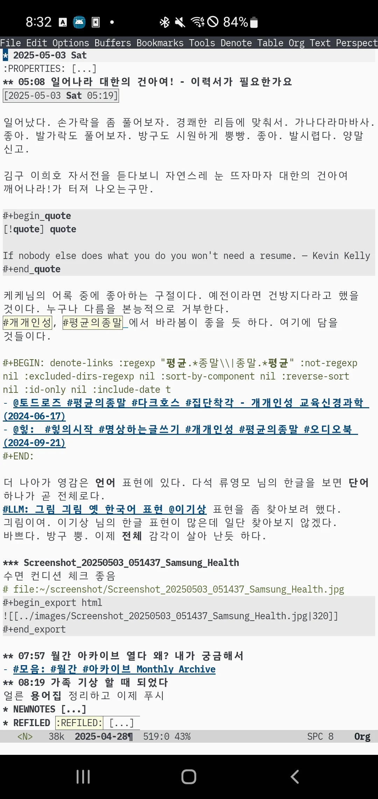

내보내기(마크다운) 결과 - 디지털가든

#### 고성 바닷가 - 커피와 어울리는 그대

별거 없지만 멋지다.

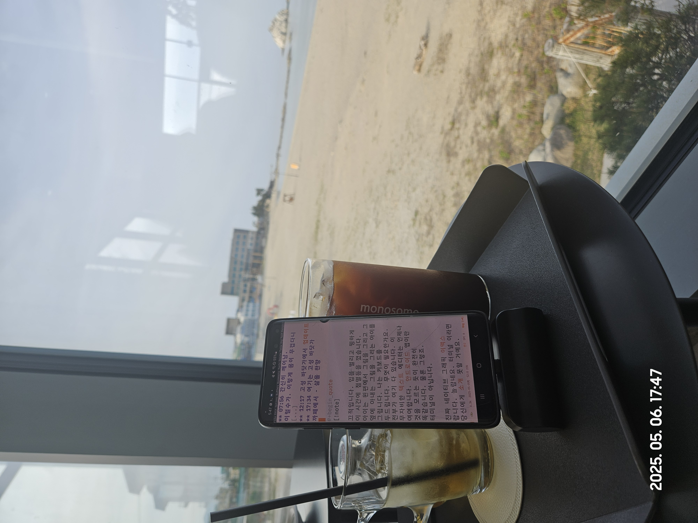

#### 이른아침 - 구글타이머와 친구

[2025-05-26 Mon 12:39]

<https://www.threads.com/@junghanacs/post/DJFfg7wB8DO?xmt=AQF0HXXKSL2z_8c2jBMvVdNs28vvZXx6iQXzOsN8RaXTuA>

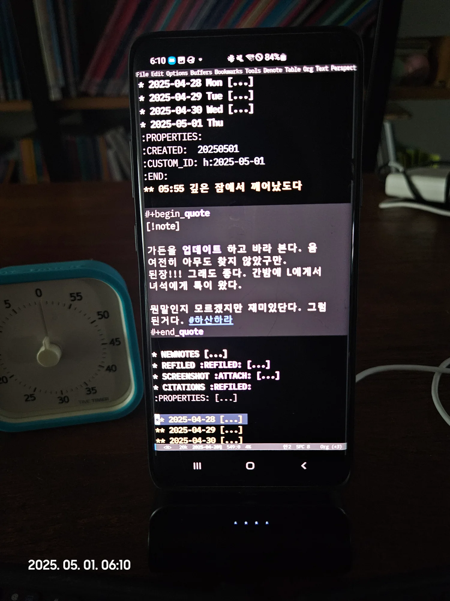

#### 접이식 키보드와 환상 조합

<https://www.threads.com/@junghanacs/post/DKCHcXHT7OA?xmt=AQF0HXXKSL2z_8c2jBMvVdNs28vvZXx6iQXzOsN8RaXTuA>

-   키보드 1만원?
-   폰 거치대 다이소 천원
-   폴그레이엄의 해커와화가 책 뒷부분에 100년 뒤 프로그래밍에 대한 이야기가 생각 납니다. 그는 LISP 애호가기에 추상화로 인한 성능 이슈는 문제가 되지 않을거라는 의견이였죠. 제가 GUI 이맥스를 안드로이드에서 써보니 당연 데스크톱과 다를게 없기에 놀랍습니다. 제 손안에 지식베이스의 모든 것을 풀 기능으로 들고 다닐 수 있잖아요. 그러기에 온디바이스AI가 더욱 기대가 됩니다. AI반도체

#### 트리시터 지원 검증 - 안드로이드 IDE 이만한게 있나?!

[2025-05-25 Sun 19:54]

안드로이드 이맥스 빌트인 트리시터 좋아요. android gui emacs with built-in treesit

<https://www.threads.com/@junghanacs/post/DKFKXIXzjDM?xmt=AQF0HXXKSL2z_8c2jBMvVdNs28vvZXx6iQXzOsN8RaXTuA>

-   [이맥스 내장 트리시터 지원 - 둠이맥스](https://wikidocs.net/381723)

![[../images/Screenshot_20250524_230517.jpg|640]]

### 동영상 - 삼성폰 화면녹화 기능 이용

#### 새로운 저널 엔트리 작성

04/30/25 'SPC n j j' New Journal Entry

-   toolsforlife, toolsforthought, toolsforAI
-   GNU Emacs 30 Android

notes.junghanacs.com/today

<https://www.threads.com/@junghanacs/post/DJCw0mjhF1y?xmt=AQF0HXXKSL2z_8c2jBMvVdNs28vvZXx6iQXzOsN8RaXTuA>

</images/Screen_Recording_20250430_045044.mp4>

![[../images/Screen_Recording_20250430_045044.mp4|640]]

#### 둠이맥스 테마 변경

<https://www.threads.com/@junghanacs/post/DJCE3riSD7D?xmt=AQF0HXXKSL2z_8c2jBMvVdNs28vvZXx6iQXzOsN8RaXTuA> doom-themes #pkm toolsforlife, toolforthought, toolforAI - GNU Emacs 30 on Android Native GUI APP for AI notetaking. notes.junghanacs.com #

</images/Screen_Recording_20250429_221328.mp4>

![[../images/Screen_Recording_20250429_221328.mp4|640]]

#### 웹브라우징(EWW)

버벅여서 뭐하는가 했네. 디지털가든 들어가는 거임. 내장 브라우저 후리구리깔끔함

</images/Screen_Recording_20250501_061410.mp4>

![[../images/Screen_Recording_20250501_061410.mp4|640]]

#### GPTEL AI 클라이언트 스무스하게

Happy morning with Emacs GPTEL, kicking off my AI notes! Journal entry: recording that I’m alive. And I’m curious about something!! What on earth is the difference between Instagram Stories, Feeds, and Reels? notes.junghanacs.com/today \#dailyjournal

</images/Screen_Recording_20250501_061828.mp4>

![[../images/Screen_Recording_20250501_061828.mp4|640]]

#### 폰트 스케일 서브헤딩 Narrowing 포커스 모드

글씨 줄이고 키우고 헤딩이 포커스 맞춰서 글쓰기

</images/Screen_Recording_20250506_175643.mp4>

![[../images/Screen_Recording_20250506_175643.mp4|640]]

## 안드로이드 - 삼성 덱스(DEX)

-   [2025-04-29 Tue 12:24] FDH 모니터에서 삼성 덱스 활용
-   [2025-05-26 Mon 12:49] 삼성과 안드로이드 데스크탑 모드만든다는게 이런식일 것이다. 그때가 되면 아주 훌륭하지 : [안드로이드 이맥스 삼성 덱스](https://wikidocs.net/381283)

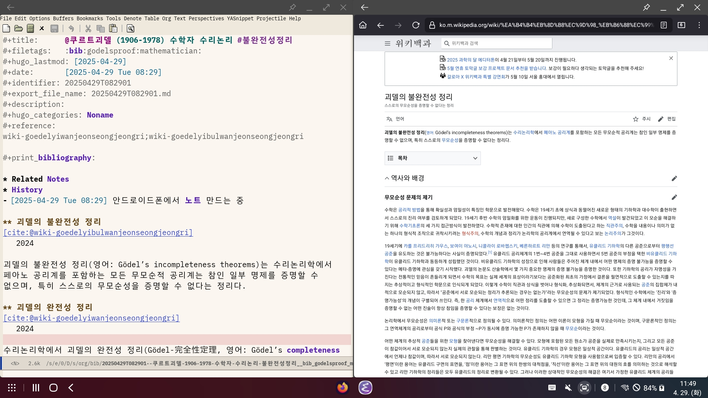

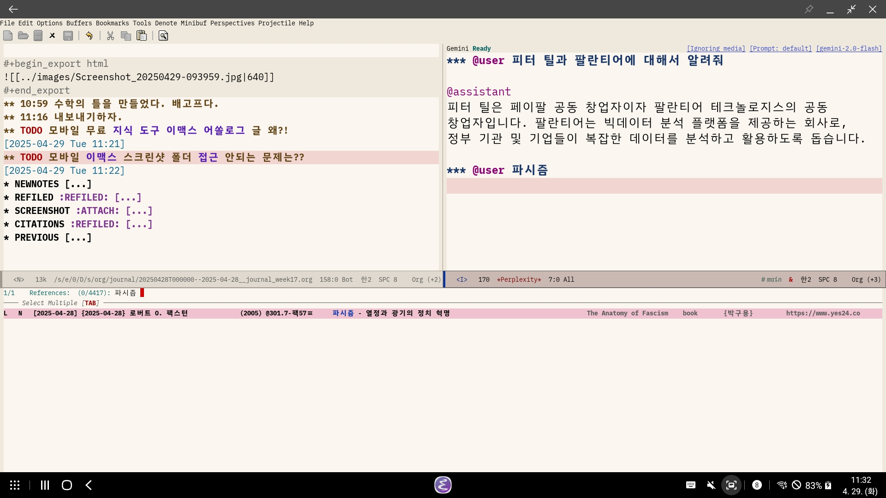

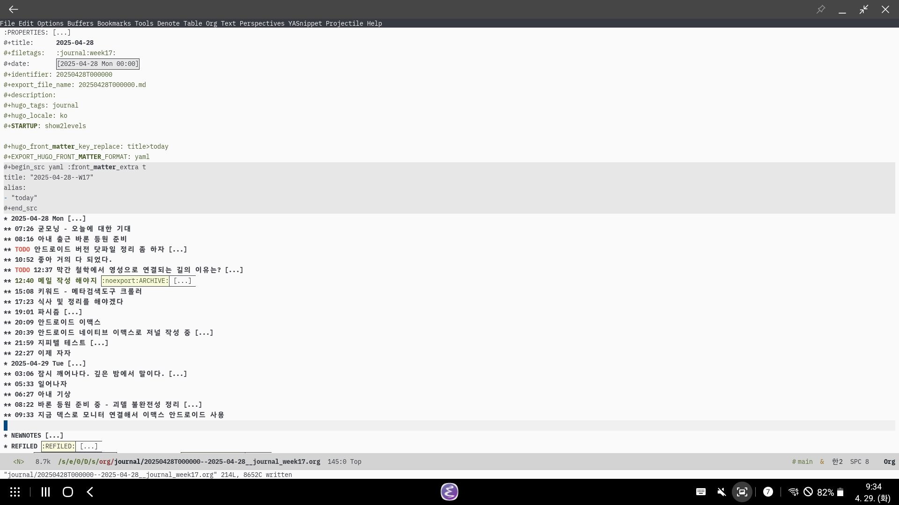

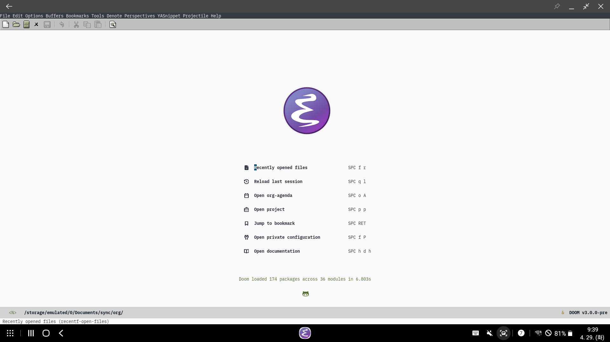

## 노트북 FHD

### 이맥스 브라우저 조직모드 연동

[이맥스 조직모드 EAF 그래픽브라우저 EWW 텍스트브라우저](https://wikidocs.net/381671) 여기서 가져옴

#### 이맥스: 조직모드, EAF 그래픽브라우저, EWW 텍스트브라우저

#### 실제 웹브라우저 추가 (네이버 웨일 - 크롬엔진)

### 야외에서 안드로이드가 더 편함

![[../images/20250506_121735.jpg|640]]

### GPTEL 연동 - 비동기 답변

-   [힣: ADHD AI 인공지능 활용 의미 예시](https://wikidocs.net/381394)

![[../images/20241219T124955--screencast.mp4|480]]

### 온생명 5세 키보드 마술사

[온생명: 채티 대화 인공지능 소통](https://wikidocs.net/381390)

[2023-10-21 Sat 11:49]

## 데스크톱 4K

### 34인치 커브드 모니터 활용 사례

[2024-12-31 Tue 16:18]

[커브드 모니터 추억](https://wikidocs.net/381483)

삼성 오디세이 G5 C34G55T 34인치 커브드 모니터 - 당근에 이슬로 사라짐

#### 모니터와 행복했던 기억

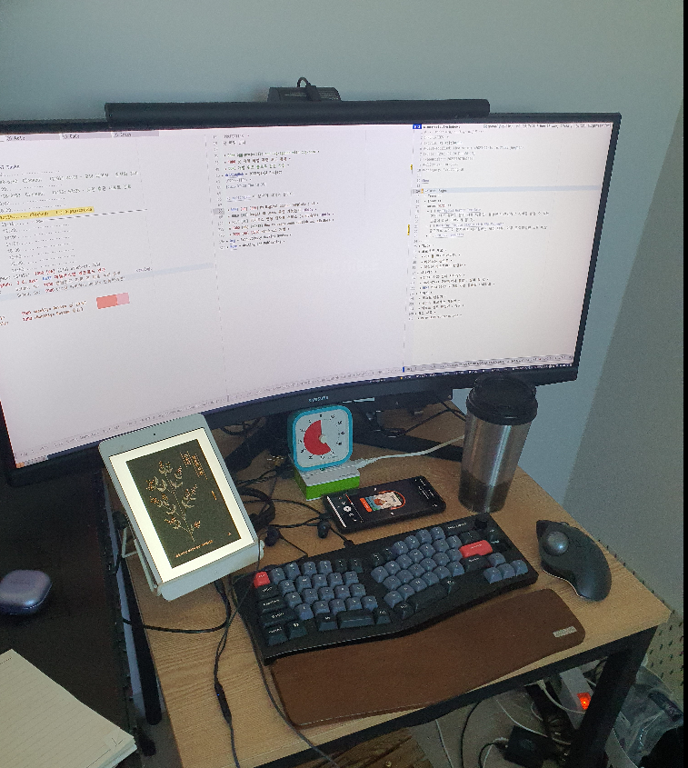

#### 압도적인 몰입감

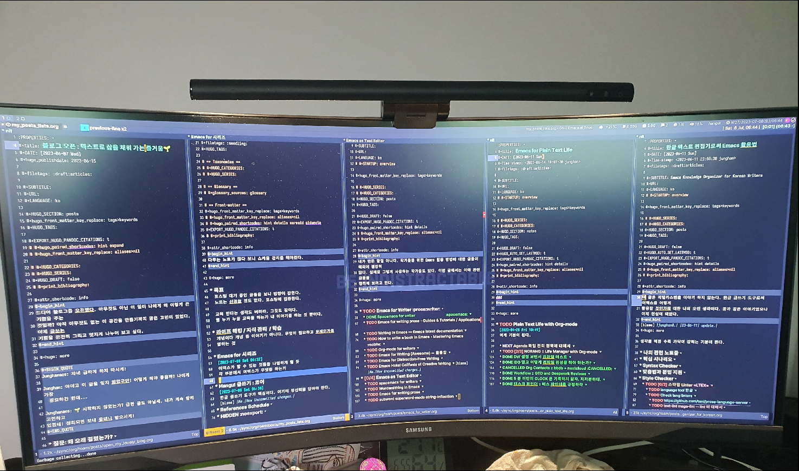

## 아카이브

### 2022 스크린샷 아카이브

#### 09-28 스크린샷 : FHD 완벽 커버 설정을 보라!

설명을 하자면, fill-column 을 완벽하게 맞춘 2 개 버퍼와 imenu 를 보여주는 이맥스다. modus 테마를 아주 고급지게 세팅해서 부족함이 하나도 없다. 이맥스가 아무래도 성능이 후달린다. QHD 모니터로 돌리니까 버겁다. 그래서 FHD 로 사용하도록 했다. 폰트 사이즈는 12 로 줄였는데 오히려 좋다. 그러니 편하게 가자. 이맥스는 FHD 모니터 1 개로 모든 일을 할 수 있다. 노트북도 같은 해상도니까 딱이지.

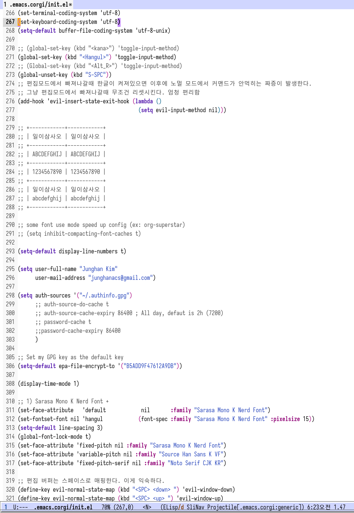

##### 09-29 뭘 설정해야 최선인가요?

그러게요. 성능이 가장 중요합디다. savehist-mode, recentf-mode, save-place-mode, custom-var files, emoji, all-the-icons 삭제할거야.

#### 10-05 어느 정도 도달한 것일까?

키 바인딩도 자리를 잡아가고 시스템도 테마도 패키지도 필요한 것을은 다 가진 것 같다. 로그시크 옵시디언 포켓 웹 프로젝트 이메일 뉴스피드 홈페이지 개발 일기 일정 관리 안 넣은게 있나?! 아직 더 모르는게 많을 것이다. 최근에는 Compleseus layer in spacemacs 를 넣으면서 확 개선 되었다. 아 모델라인이 resposive 를 넣으니까 반응을 하는 듯하구나. 몇초있다가 업데이트가 되네?! 그런 느낌이다. 꼭 1 줄이여야 하나? 두줄이면 안되나? 시간 타이머 정보는 반영을 해줬으면 하는데 별 수가 없다.

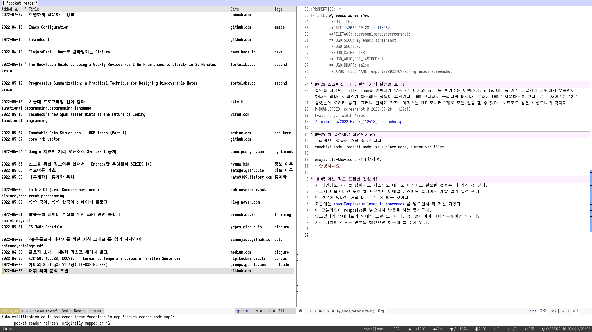

뭐 대단한 스크린샷은 아니다. 색상이 좀 촌스러워서 제거 했다만. 포켓이 입력한 글 중에 아티클은 org 모드로 잘 나온다. 수집할 대상을 잘 선별해서 넣어야 한다. 그리고 왜 볼드가 붙는 건지? 별로다.
