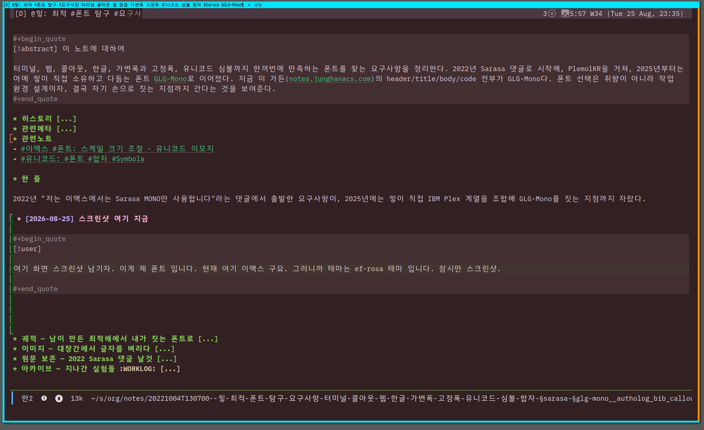

<!-- gid:20221004T130700 -->
[[TIP("이 노트에 대하여")]]
터미널, 웹, 콜아웃, 한글, 가변폭과 고정폭, 유니코드 심볼까지 한꺼번에 만족하는 폰트를 찾는 요구사항을 정리한다. 2022년 Sarasa 댓글로 시작해, PlemolKR을 거쳐, 2025년부터는 아예 힣이 직접 소유하고 다듬는 폰트 [GLG-Mono](https://github.com/junghan0611/GLG-Mono)로 이어졌다. 지금 이 가든([notes.junghanacs.com](https://notes.junghanacs.com))의 header/title/body/code 전부가 GLG-Mono다. 폰트 선택은 취향이 아니라 작업 환경 설계이자, 결국 자기 손으로 짓는 지점까지 간다는 것을 보여준다.
[[/TIP]]

<!-- provenance:source:start -->
[[TIP("원본·최신본")]]
이 페이지는 한국어 검색과 읽기를 위한 WikiDocs 미러입니다. [원본·최신본은 가든](https://notes.junghanacs.com/notes/20221004T130700/)에 있습니다. 최신 수정 내용·백링크·태그·히스토리·댓글·출처 정보는 원본 가든에서 확인하세요.

- 작성: `2022-10-04T13:07:00+09:00`
- 최근 수정: `2026-08-25T23:32:00+09:00`
[[/TIP]]
<!-- provenance:source:end -->

[TOC]

## 히스토리

-   [2026-08-25 Tue 23:31] 아무도 보지 않는 가든에 왜 이 노트가 뷰가 쬐금 있네?!
-   [2026-08-05 Wed 13:02] @mitsein/sonnet5 — 어쏠로그로 표준 수선. 여러 해에 걸친 ARCHIVE 기록(Sarasa 댓글, 브라우저 구글폰트, Monoplex, 사라사 너드 설치, PlemolKR)을 하나의 궤적으로 엮고, 지금 시점의 사실(GLG-Mono가 가든 메인 폰트로 배포 중이라는 것)을 새로 반영했다. GLGMAN Universe 이미지를 새로 생성했다.
-   [2026-02-01 Sun 16:58] 사라사 너드 폰트 nixos-config 에 추가
-   [2025-11-09 Sun 09:25] 숨통님 폰트를 수정하는 중
-   [2025-06-22 Sun 12:08] 역사 길다. 이거 어쏠로 올리자. 복잡한 <span class="org-hashtag">#요구사항</span> 을 만족하는 폰트의 이유를 남겨본다. 이거 길다. 이야기 길다.
-   [2022-10-04 Tue 13:07] 생성

## 관련메타

-   [타이포그래피 폰트](https://notes.junghanacs.com/meta/20250520T170739/)
-   [유니코드](https://notes.junghanacs.com/meta/20240916T113349/)
-   [레이텍 수식 조판](https://notes.junghanacs.com/meta/20231004T183900/)
-   [데이터시각화 도표 그래프 동적 대시보드 비주얼](https://notes.junghanacs.com/meta/20250305T082705/)
-   [터미널 레트로](https://notes.junghanacs.com/meta/20230925T080700/)
-   [요구사항](https://notes.junghanacs.com/meta/20250411T054535/)

## 관련노트

-   [이맥스 폰트: 스케일 크기 조절 - 유니코드 이모지](https://notes.junghanacs.com/notes/20241226T001105/)
-   [유니코드: 폰트 합자 Symbola](https://notes.junghanacs.com/notes/20240916T113456/)

## 한 줄

2022년 "저는 이맥스에서는 Sarasa MONO만 사용합니다"라는 댓글에서 출발한 요구사항이, 2025년에는 힣이 직접 IBM Plex 계열을 조합해 GLG-Mono를 짓는 지점까지 자랐다.

### [2026-08-25 Tue] 스크린샷 여기 지금

[[TIP("user")]]
여기 화면 스크린샷 남기자. 이게 제 폰트 입니다. 현재 여기 이맥스 구요. 그러니까 테마는 ef-rosa 테마 입니다. 잠시만 스크린샷.

찍고 넣었어요. 아래에. 이런 느낌 입니다.
[[/TIP]]



## 궤적 — 남이 만든 최적해에서 내가 짓는 폰트로

이 노트의 오래된 ARCHIVE 헤딩들을 시간순으로 펴면 하나의 축이 보인다: 처음엔 **"이미 있는 폰트 중 무엇이 요구사항을 가장 잘 만족하는가"** 를 물었고, 나중엔 **"요구사항 자체를 내가 소유한 폰트로 고정하면 어떨까"** 로 넘어갔다.

-   **2022 — Sarasa 시대.** [Sarasa Gothic](https://github.com/be5invis/Sarasa-Gothic)(Iosevka + 본고딕 조합)를 이맥스 13.5pt로 쓰며 남긴 댓글이 이 노트의 첫 원문이다. 단일 폰트라 한영 자간이 잘 맞고, 리거처도 지원한다는 실용적 이유였다. Iosevka 개발자가 만든 폰트라는 점, [iosevka-comfy](https://github.com/protesilaos/iosevka-comfy)처럼 직접 튜닝하는 선례가 있다는 점도 함께 적어뒀다 — "나만의 통합폰트도 만들 수 있겠다"는 생각이 이때 이미 있었다.
-   **2024 — 가든과 이맥스가 갈라짐.** 브라우저/가든 쪽은 구글폰트(Noto Sans KR, 42dot Sans, Hahmlet)로, 이맥스는 Monoplex Nerd KR로 각각 굴렸다. 하나의 폰트로 모든 표면을 통일하지 못했던 시기.
-   **2025 — soomtong의 [PlemolKR](https://github.com/soomtong/PlemolKR)을 받아 씀** (“Junghan0611/Plemolkr” 2025). PlemolJP(일본어) → PlemolKR(한국어) 계보를 그대로 물려받아 "숨통님 폰트를 수정"했다.
-   **2025 후반 — [GLG-Mono](https://github.com/junghan0611/GLG-Mono)로 독립.** PlemolKR을 포크해 이름과 소유를 바꿨다. IBM Plex Mono(라틴·코딩 기호) + IBM Plex Sans KR(한글) + IBM Plex Sans JP(한자 seed)를 레이어로 쌓고, 어느 코드포인트가 어느 소스에서 왔는지 cmap 단위로 추적하는 것을 v2 목표로 삼았다. "완전한 CJK 폰트"를 대표하지 않고, 힣이 실제로 타이핑하는 문자만 정직하게 지원한다는 원칙 — 표준이 아니라 seed와 owner로 말한다. (junghan0611 [2025] 2026)
-   **지금 — 가든의 메인 폰트.** [notes.junghanacs.com](https://notes.junghanacs.com)을 만드는 notes 리포의 `quartz.config.ts` header/title/body/code가 모두 `GLG Mono` 다. 이맥스에서 댓글로 추천하던 폰트가, 3년 뒤 자기 손으로 만든 폰트로 자기 가든 전체를 덮는 순환이 여기서 닫힌다.

### 오독 경계

-   이 노트는 "Sarasa가 나쁘고 GLG-Mono가 좋다"는 비교가 아니다. Sarasa/PlemolKR은 여전히 훌륭한 선택지이고, GLG-Mono의 IBM Plex 조합 자체가 그 계보(PlemolJP → PlemolKR) 위에 있다. 이 노트가 기록하는 것은 **요구사항이 고정된 채 폰트만 바뀐 이력** 이지, 폰트 서열이 아니다.
-   GLG-Mono는 "표준 한자 목록"이나 "완전한 CJK 커버리지"를 주장하지 않는다. 지원하지 않는 한자는 결함이 아니라 "힣이 쓰지 않는 한자"라는 게 그 폰트 자신의 언어다.

## 이미지 — 대장간에서 글자를 벼리다


여러 후보 룬-태블릿(라틴 세리프, 촘촘한 CJK, 둥근 터미널 폰트)이 반투명하게 떠 있지만, 실제로 모루 위에서 달아오르는 건 하나의 한글 음절뿐이다 — 요구사항 목록에서 하나의 자기 폰트로 수렴하는 이 노트의 궤적을 그대로 그렸다. ENTWURF 글자가 뜬 눈밭의 CRT, 아기 펭귄이 들고 있는 흐린 태블릿(버려진 후보들), 조용히 지켜보는 여우까지 세계관 공통 구성 요소를 그대로 지켰다. 실제 결과물은 프롬프트가 요구한 구도 — 모루 중심, 글로우 태블릿 하나만 강조, 나머지는 뒤로 흐려짐 — 를 정확히 지켰다.

### 생성 파라미터

-   모델: Gemini 3.1 Flash Lite Image (`--model lite`)
-   비율: 3:2
-   해상도: 1K
-   저장: `~/screenshot/20260805T130219--glgman-type-smiths-forge__brand_geminilite.jpg`

### 프롬프트 전문

```text
[World: GLGMAN Universe]
Style: 2D illustration, midpoint between Disney and Studio Ghibli, clean linework, soft cel-shading
Setting: Antarctic winter village — snow-covered igloos, aurora borealis in deep navy sky, amber dawn at horizon, pine trees dusted with snow, ice-forge workshop built from ice blocks and whale bones. Pororo's winter wonderland meets blacksmith's workshop.
Color palette: deep navy background (polar dawn), white+navy (transformed armor), amber/gold (sword glow, runes, awakening light), ice-blue + orange sparks (forge)
Characters: anthropomorphic emperor penguin (father, main hero), baby penguin chick (son, tiny scarf), red-brown fox (agent/companion)
Recurring objects: circuit-patterned sword, org-mode symbols (★, TODO), terminal text fragments, "ENTWURF" rune letters, CRT monitors in snow, golden message cables
Mood: epic but warm, mythic but intimate
Do NOT: photorealistic, 3D render, excessive detail, dark/gritty tone

Scene title: "The Type-Smith's Forge" — GLGMAN forging his own Hangul letterform, not chasing every donor script at once.

GLGMAN identity lock:
- adult anthropomorphic emperor penguin, upright, white-navy armor with subtle amber circuit patterns
- calm, focused craftsman posture; sword set aside, both flippers gripping a small hammer over the anvil

Main scene:
Inside the ice-forge workshop, GLGMAN stands at the whalebone anvil, hammering a single glowing amber Hangul syllable block into shape, sparks of ice-blue and orange scattering upward. Around him, half a dozen translucent rune-tablets hover in a loose ring — each etched with a different candidate typeface glyph (fine Latin serifs, a dense CJK block, a rounded terminal font) — but only the tablet directly above the anvil glows fully amber and lowers toward the glyph he is forging, while the others dim and drift back into the workshop's shadow, already set aside. A CRT monitor half-buried in snow beside the anvil shows a terminal cursor blinking beside stacked lines of monospace text. The baby penguin chick sits on a stack of ice-blocks nearby, watching with a tiny scarf fluttering, holding up one of the dimmed rune-tablets as if comparing it to the glowing one. The red-brown fox companion perches on the workshop's ice-block wall, tail curled, observing the forge quietly.

Composition: 3:2, anvil and glowing glyph at the visual center, ring of candidate rune-tablets arcing above and behind GLGMAN, aurora sky visible through the workshop's open side, chick and fox flanking lower corners for scale and warmth.
```

## 원문 보존 — 2022 Sarasa 댓글 날것

[[TIP("주의")]]
네. <https://github.com/be5invis/Sarasa-Gothic> 저는 이맥스에서는 Sarasa MONO 만 사용합니다. 제가 쓰는 i3wm 에서 GTK 타이틀 바 정도는 Sarasa UI 폰트도 괜찮더라구요. Sarasa Mono 는 Iosevka + 본고딕 조합입니다. 영문 폰트로 Iosevka 가 아주 마음에 듭니다. 한글 폰트는 큰 욕심 안내게 되더라구요. 일단 단일 폰트이기에 한영자간폭도 잘 맞아서 설정이 간단해지기에 좋습니다. 13.5 사이즈로 쓰는데 괜찮습니다. Ligature 도 지원합니다.

Nerd Font 도 있는데요. <https://github.com/jonz94/Sarasa-Gothic-Nerd-Fonts> 너드 폰트로 만들어 놓은 것도 있습니다.

Sarasa 폰트를 만든 사람이 Iosevka 폰트 개발자라. <https://github.com/be5invis/Iosevka> 리포 가보시면 커스텀 할 수 있는 여지가 많이 있습니다. 실제로 <https://github.com/protesilaos/iosevka-comfy> 리포를 보면 튜닝해서 쓰더군요. 간단히 해보다가 말긴했습니다만... 튜닝해서 나만의 통합폰트도 만들 수 있겠더군요. 개인적으로는 D2Coding, Nanum Gothic Coding 보다는 마음에 듭니다. iosevka 덕분이겠지만요.

이맥스를 제대로 시작한지 얼마 안된터라.. 초반에 폰트랑 입력기 때문에 애를 좀 먹었습니다. VI 는 이런 고민은 안해도 되는데...한국 사람들 이맥스 입문하기가 참 어렵겠구나 싶더군요. 중국이나 일본은 이정도는 아닌 것 같습니다. 아무튼 이맥스 이제는 저의 전부(?)가 되었네요. 최근에 이곳을 알게되서... 예전에 알았더라면 더 좋았겠구나 싶네요.

최근에는 이맥스 관련 국문 자료가 별로 없더군요. 커뮤니티가 따로 있나? 찾아봐도 딱히 없구요. 이맥스도 엄청 변화가 많은데. 아쉽습니다. <https://blog.naver.com/jodi999/222756368405>
[[/TIP]]

## 아카이브 — 지나간 실험들

폰트 요구사항이 GLG-Mono로 수렴하기 전, 각 시기마다 시도했던 실험 기록. 결정은 위 궤적에 반영했고, 여기는 당시 원자재만 보존한다.

### <span class="org-todo done DONE">DONE</span> 2026-02-01 sarasa nerd install

### 2025-03-16 디지털가든 from 구글폰트

### 2024-04-05 브라우저 폰트

### 2024-06-23 메인 폰트 - 이맥스

### 폰트 <span class="org-hashtag">#테스트</span>

<https://www.cs.utexas.edu/~novak/>

```nil

Font test: " & ' ∀ ∃ ∅ ∈ ∉ ∏ ∑ √ ∞ ∧ ∨ ∩ ∪ ∫ ² ³ µ · × ∴ ∼ ≅ ≈ ≠ ≡ ≤ ≥ < > ⊂ ⊃ ⊄ ⊆ ⊇ ⊥ ∂ ∇ ∈ ∝ ⊕ ⊗ ← → ↑ ↓ ↔ ⇐ ⇒ ⇔ □ ■ | © ¬ ± ° · ˜ Γ Δ α β γ δ ε φ

```

## BIBLIOGRAPHY

- junghan0611. (2025) 2026. “Junghan0611/Glg-Mono.” [https://github.com/junghan0611/GLG-Mono](https://github.com/junghan0611/GLG-Mono).
- “Junghan0611/Plemolkr.” 2025. [https://github.com/junghan0611/PlemolKR](https://github.com/junghan0611/PlemolKR).
