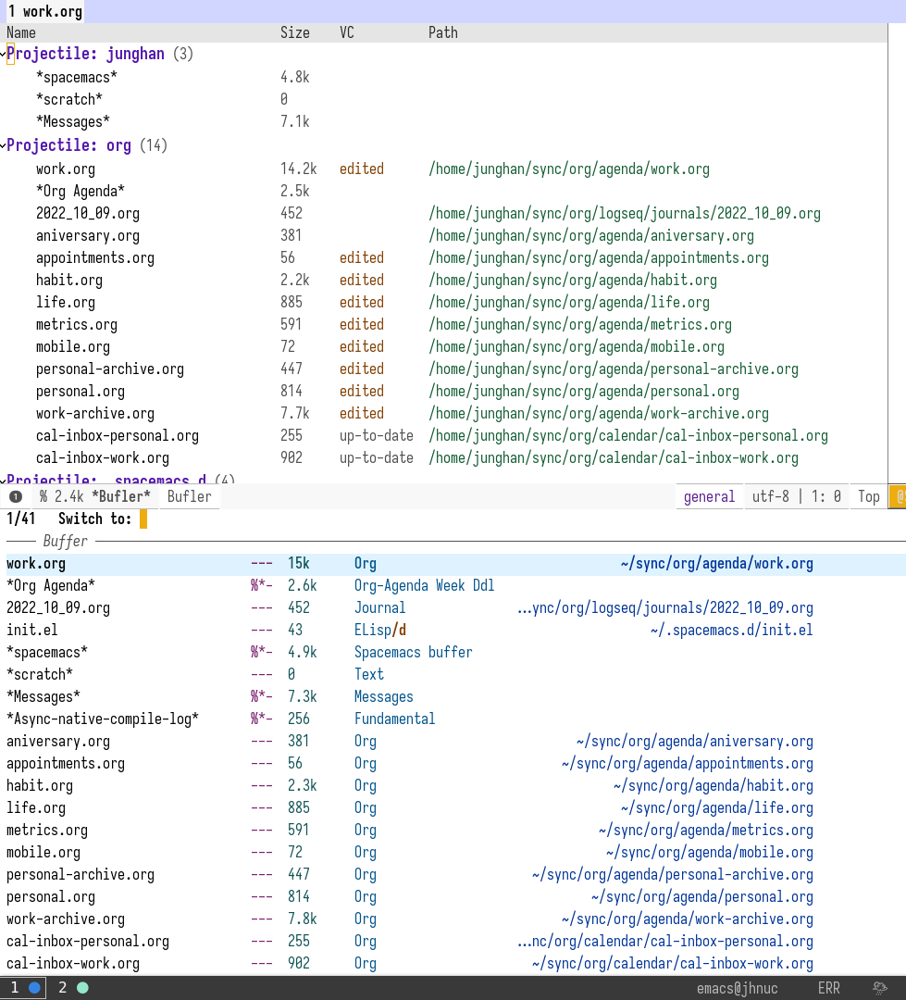

<!-- gid:20221009T140300 -->
[TOC]

[[TIP("이 노트에 대하여")]]
ibuffer를 중심으로 버퍼를 프로젝트와 파일 유형별로 관리하는 방식을 간단히 모아 둔다. 이맥스에서 버퍼 수가 많아질수록 왜 묶기와 정리가 중요한지도 함께 드러난다.
[[/TIP]]

## BIBLIOGRAPHY

## 둠이맥스 :emacs ibuffer

[2025-02-07 Fri 11:20] 둠이맥스 주는대로 쓰면 간단해진다.

Edit me like one of your French buffers

-   Adds project-based grouping of buffers
-   Support for file-type icons
-   Uses human-readable file-size

## DONT `Bufler.el` :: new buffer manager package

[2024-02-24 Sat 16:32] 사용하지 않음

22/10/09--14:07
: 새로운 버퍼 관리자 패키지를 넣었다. 프로젝트 혹은 원하는

목적에 따라서 그루핑을 할 수 있다. ibuffer 가 레이어에 있지만 데이비드가 닷파일 올려놓은게 있어서 일단 넣었다. 사실 북마크쪽 하다가 잠시 들린 것이다. 그럼에도 버퍼 관리는 중요하다. 왜냐? 여기서 글도 쓰고 코딩도 하고 이메일도 쓰고 다 하니까.

## DONT `ibuffer` layer in spacemacs

### Screenshot

[2022-10-09 Sun 04:50]

아래 스크린샷은 위에는 bufler-list, 아래는 consult-buffer-list 이다. 별 차이 없네라고 할 수도 있지만. 그루핑을 한다는게 장점이다. 그루핑이 기존 ibuffer 보다 쉽다는게 이 패키지가 가진 장점이다. 정보 차원에서는 consult 가 잘해주니까.

