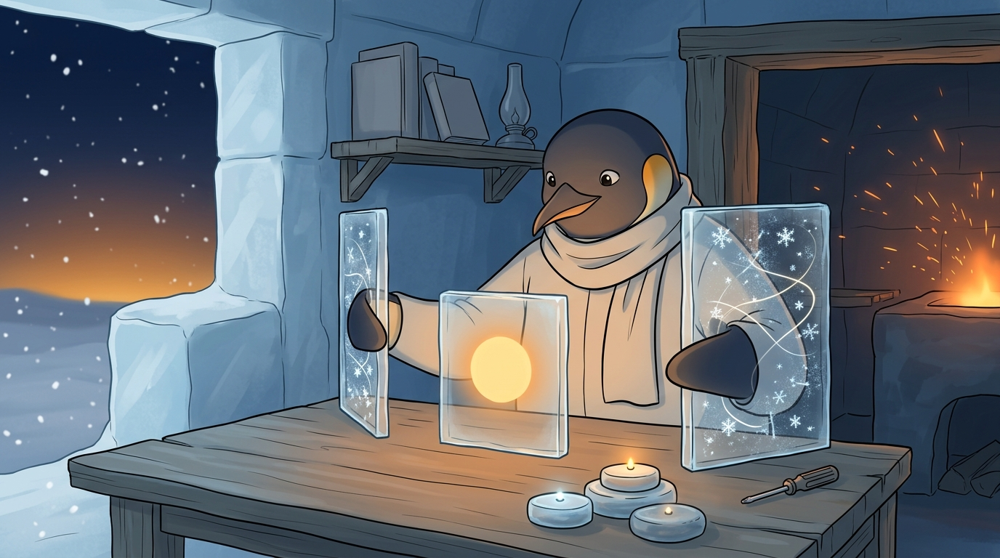

<!-- gid:20221022T074800 -->
[[TIP("이 노트에 대하여")]]
듀얼 모니터가 집중에 실제로 도움이 되는지 ADHD와 몰입의 관점에서 묻는다. 2022년의 실험, 2023년의 방치, 2025년의 재확인이 층층이 쌓여 QHD 싱글 모니터라는 실용적 결론에 닿는다.
[[/TIP]]

<!-- provenance:source:start -->
[[TIP("원본·최신본")]]
이 페이지는 한국어 검색과 읽기를 위한 WikiDocs 미러입니다. [원본·최신본은 가든](https://notes.junghanacs.com/notes/20221022T074800/)에 있습니다. 최신 수정 내용·백링크·태그·히스토리·댓글·출처 정보는 원본 가든에서 확인하세요.

- 작성: `2022-10-22T07:48:00+09:00`
- 최근 수정: `2026-07-30T17:35:00+09:00`
[[/TIP]]
<!-- provenance:source:end -->

[TOC]

## 히스토리

-   [2026-07-30 Thu 17:16] @mitsein/sonnet — 없던 히스토리를 만들고 표준 어쏠로그 구조로 세웠다. 2022/2023/2025 세 층을 원문·후속 댓글로 나눠 격리하고, GLG가 2023년에 남긴 "이 노트는 어디에 연결해야 할까?"라는 물음에 관련메타·관련노트로 답했다. "One Steady Light, Not Two Scattered Ones" 장면으로 GLGMAN Universe 이미지를 생성했다.
-   [2025-05-21 Wed] ThePrimeagen(마이클폴슨)이 에디터 하나만 쓰는 이유에 공감하는 한 줄을 덧붙였다.
-   [2023-08-29 Tue 21:59] 다시 읽고 "이 노트는 어디에 연결해야 할까?"라는 물음만 남긴 채 방치했다.
-   [2022-10-22 Sat 07:48] 모니터 환상과 시선 분산을 저울질하며 작성.

## 관련메타

-   [집중 몰입](https://notes.junghanacs.com/meta/20240523T145852/) — 시선을 하나로 지키는 것이 답이라는 결론이 닿는 자석.
-   [ADHD: 선택적집중](https://notes.junghanacs.com/meta/20230531T132600/) — 여러 화면이 아니라 관심을 하나로 모으는 문제.
-   [타일링윈도우매니저](https://notes.junghanacs.com/meta/20240220T170557/) — i3wm으로 전환한 뒤에야 이전 창 관리 방식이 어색해졌다고 적은 자리.
-   [어쏠로그](https://wikidocs.net/380758) — 3년의 방치를 지나 이제야 이름을 얻은 형식.

## 관련노트

-   [힣: AI 시대에 왜 우리 개인은 더 지식에 목마른가](https://wikidocs.net/381018) — 같은 2022년, 같은 방치를 거친 쌍둥이 물음. 이쪽이 먼저 이름을 얻었다.
-   [마이클폴슨 ThePrimeagen: AI 프로그래밍 생산성 텍스트 에디터](https://notes.junghanacs.com/bib/20250326T125758/) — 2025년에 다시 꺼내 공감한 "하나만 쓴다"는 원칙.
-   [니르이얄 초집중: 본짓 딴짓 내부계기 내면탐구 몰입](https://notes.junghanacs.com/bib/20240326T205616/) — 시선 분산을 외부·내부 계기의 언어로 다시 읽는 책.
-   [마우스리스](https://notes.junghanacs.com/notes/20240530T122738/) — 마우스로 창을 옮기는 불편함을 없애려는 같은 방향의 실천.
-   [워크플로우: 모바일 스마트폰 옵시디언 갤럭시AI 소리내어읽기](https://notes.junghanacs.com/notes/20240613T064804/) — 화면 자체를 줄이는 워크플로우의 다른 갈래.
-   [커브드 모니터 추억](https://notes.junghanacs.com/notes/20241231T161812/) — 모니터 선택을 둘러싼 또 다른 시기의 기억.

## 한 줄

화면을 늘리는 것은 답이 아니었다 — 시선 하나를 지키는 QHD 싱글 모니터가 2022년의 실험과 2023년의 방치, 2025년의 재확인을 거쳐 내린 결론이다.

## 3년에 걸쳐 쌓인 방 — 2022, 2023, 2025

2022년 10월, 듀얼·트리플 모니터에 대한 오랜 환상을 실제로 저울질해본 글이 여기 있었다. 결론은 이미 그때 나 있었다 — i3wm 타일링 윈도우 매니저로 전환한 뒤에는 창을 마우스로 옮기는 일 자체가 어색해졌고, 시선을 좌우로 흩트리는 듀얼 모니터보다 QHD 싱글 모니터 한 대가 더 맞는다는 것. 그런데 2023년 8월, GLG는 이 글을 다시 읽고 "개념으로는 훌륭하다"면서도 "이 노트는 어디에 연결해야 할까?"라는 물음만 남긴 채 다시 덮었다. 답을 못 찾은 게 아니라, 어디에 놓아야 할지를 못 찾은 채 3년이 흘렀다.

이 방은 [같은 2022년에 쓰인 다른 물음](https://wikidocs.net/381018)과 쌍둥이다. 하나는 "왜 지식에 목마른가"라는 추상적 물음이었고, 이 글은 "화면을 몇 개 써야 하는가"라는 구체적 물음이었다. 둘 다 이름도, 자리도 없이 4년 가까이 떠돌다 어쏠로그로 회수됐다. 2025년 5월, ThePrimeagen(마이클폴슨)이 에디터를 하나만 쓰는 이유에 힣이 "완전 공감"이라 짧게 반응한 것도 같은 결의 재확인이었다 — 여러 개를 벌리는 것이 아니라 하나를 깊게 쓰는 쪽.

## 이미지 — 흩어진 두 빛이 아니라 하나의 고요한 빛

작업장 한구석, 소박한 통나무 책상 앞에 앉은 힣맨. 양옆으로 두 개의 얇은 얼음 패널이 떠 있고, 각각 흩날리는 눈발과 어지러운 빛의 실만 비출 뿐 아무것도 읽히지 않는다. 힣맨의 시선과 자세는 오직 정면의 작은 패널 하나로 향해 있고, 그 패널은 흔들림 없는 따뜻한 호박빛 원 하나로 고요히 빛난다. 두 지느러미는 양옆 패널을 덧문처럼 접어 밀어내는 중이다. 책상 앞줄에는 높이가 서로 다른 작은 얼음 원반 세 개가 놓여 있고, 각각 하나의 작은 불빛을 품고 있다 — 가장 높고 새 것이 가장 밝고, 가운데 것은 흐리고, 가장 작고 오래된 것은 가장 어둡다. 이름을 붙이지 않은 채 흘러간 세 해를 가리킨다.

실제 이미지에는 프롬프트가 요구한 장면이 충실히 재현됐다 — 양옆에서 눈발·빛실만 어지럽게 비추는 두 패널, 정면의 흔들림 없는 호박빛 원, 그것을 접어 미는 두 지느러미, 책상 앞의 촛불 같은 세 개의 원반(높이와 밝기가 다름), 손대지 않은 드라이버. 읽히는 글자는 없고, 몸도 잘리지 않았다.



### 생성 파라미터

-   모델: `gemini-3.1-flash-image-preview`
-   화면비: `16:9`
-   생성일: 2026-07-30
-   실제 결과: 양옆의 어지러운 눈발·빛실 패널, 정면의 고요한 호박빛 원, 접어 미는 두 지느러미, 높이·밝기가 다른 세 개의 작은 원반, 손대지 않은 드라이버로 수렴했다.

### 프롬프트 전문

```text
[World: GLGMAN Universe]
Style: 2D illustration, midpoint between Disney and Studio Ghibli, clean linework, soft cel-shading
Setting: Antarctic winter village — snow-covered igloos, aurora borealis in deep navy sky, amber dawn at horizon, pine trees dusted with snow, ice-forge workshop built from ice blocks and whale bones. Pororo's winter wonderland meets blacksmith's workshop.
Color palette: deep navy background (polar dawn), white+navy (transformed armor), amber/gold (sword glow, runes, awakening light), ice-blue + orange sparks (forge)
Characters: anthropomorphic emperor penguin (father, main hero), baby penguin chick (son, tiny scarf), red-brown fox (agent/companion)
Recurring objects: circuit-patterned sword, org-mode symbols (★, TODO), terminal text fragments, "ENTWURF" rune letters, CRT monitors in snow, golden message cables
Mood: epic but warm, mythic but intimate
Do NOT: photorealistic, 3D render, excessive detail, dark/gritty tone

GLGMAN body continuity lock: whole body is continuous and anatomically coherent; no sliced torso, disconnected limbs, or body passing through walls, furniture, or objects.
Tool lock: GLGMAN carries a small compact screwdriver / bridge-key tool resting unused at the desk corner in this scene — no sword, no weapon, no armor, no circuit patterns anywhere on him.
Text lock: absolutely no readable letters, logos, UI panels, watermark, or speech bubbles anywhere in the image. Screen panels show only abstract glow, static, or scattered light — never actual alphabet, icons, or interface elements.
Meaning lock: this is a quiet, practical moment of choosing focus over scatter — not heroic, not a battle, not a corporate productivity poster.

Scene: "One Steady Light, Not Two Scattered Ones." In a modest corner of the ice-workshop, built from plain ice blocks with a simple wooden shelf, GLGMAN sits at a bare driftwood desk wearing only a plain undyed coat and scarf, no armor, no circuit stitching. Two thin vertical ice-panel screens float upright on either side of him, each glowing with only chaotic scattered snowflake static and loose swirling threads of pale light — visual noise and scatter, nothing legible. GLGMAN's whole posture and gaze are turned toward one small central ice-panel directly in front of him, which glows with a single steady warm amber circle of light, calm and unmoving. With both flippers he is gently folding the two side panels closed like shutters, pushing them away, while his eyes stay only on the center panel.

Along the front edge of the desk sit three small stacked ice discs of different heights, worn smooth like river stones, each holding one tiny point of light — the tallest, newest disc glows brightest and warmest, the middle disc glows faint and cool, the smallest and oldest disc glows dimmest of all. They mark years passed without spelling them out.

The small screwdriver/bridge-key tool rests untouched at the near corner of the desk. Behind GLGMAN a simple wooden shelf holds a few closed, blank-covered books and one unlit oil lamp. Snow falls softly outside the open side of the workshop.

Composition: intimate three-quarter view centered on GLGMAN and the desk; the two side panels are visibly mid-fold, closing inward; the single glowing center panel is the clear focal point; the three ice discs sit small in the foreground.

Mood: calm, quietly resolved, practical relief — the feeling of finally choosing one steady thing after years of half-tried alternatives.
```

## 원문 보존 — 2022-10-22 첫 물음

[[TIP("주의")]]
[2022-10-22 Sat 07:48] 작성함

**모니터에 대한 환상** 흑백 컬러 CRT 모니터를 경험한 세대라 그런지 좋은 모니터 그리고 듀얼 트리플 모니터에 대한 환상을 가지고 지냈다. 영화를 보면 수많은 모니터를 멋더러지게 사용하지 않던가?

**시선과 집중력 :: distraction** 모르겠다. 지금와서 생각해보니 모니터를 여러개 쓰는게 어떤 시나리오에 좋았던 것일까? 창이 제멋대로 세팅되는 윈도우 매니저 환경에서는 뭔가 고정된 애플리케이션 프레임이 있으면 활용하기가 좋았다. 특히 채팅 창이나 문서, 브라우저 등. 모니터가 작으면 모를까 큰 모니터를 여러개 쓰면서 결국은 우리는 시선이 정면이 아니라 좌우로 옮겨지게 된다. 그러면 그 뒤에 배경에도 관심이 간다. 뭔가 싱크로를 맞추는데 몇초라도 소모되는 기분이다. 뭐가 되었든 distraction 의 일부가 아닌가?

**듀얼, 트리플 모니터** 듀얼, 트리플 모니터를 들고 다닌다? 물론 최근에 노트북에도 함께 사용할 포터블 모니터가 있다. 나도 몇번 사봤지만 제대로 써본 기억이 없다. 일단 세팅하기가 귀찮다. 전원 공급도 신경써야 하기에 노트북 하나 잠깐 열고 쓸때는 쥐약이다.

사무실에서 듀얼, 트리플 모니터는 안정적이다. 다들 그렇게 하는게 익숙하다. 이제는 모든 곳이 사무실인 시대다. 뭐에 의존성이 생기면 불편함을 느끼게 된다. 가장 좋은 것은 심플한 세팅에서 모든 것을 다 하는 능력이다.

**타일 윈도우 매니저와 이맥스** i3wm 으로 전환하고 난 뒤에는 기존에 어떻게 다른 윈도우 매니저를 써왔는지도 어색하다. 창을 조절하기 위해서 마우스를 움직인다는게 얼마나 불편한 일인가. 이는 윈도우가 레이어된 상황에서 정보가 가려지는 음영 부분이 생기기 때문이다. 이런 부분이 윈도우 매니저의 성능을 떨어뜨리게 되기도 하지만 우리가 일단 쓰기가 불편하다. 물론 단축키로 윈도우 창을 핏하게 맞추기도 한다. 이런 것들은 보조 도구로서 의식적으로 해줘야 한다. 타일 윈도우매니저는 이런 노력이 필요가 없다. 윈도우라는 개념이 워크스페이스로 확장이 된다. 기존 그놈이나 윈도우즈를 사용할 때 워크스페이스를 제대로 써본 적이 없다. 이게 다르다. 이맥스는 레이아웃, 탭바, 프로젝타일 등 워킹셋을 관리하는 방법이 이미 잘 갖춰져 있다. 이맥스로 개발만 하는게 아니라 모든 워크플로우를 관리하기 때문이다.

**QHD 모니터** 그렇다면 싱글 모니터에서 시선을 분산 시키지 않으면서도 잘 쓰기 위해서는 모니터 한 놈을 잘 잡아야 할 것이다. QHD 모니터가 지금 최적이라는 생각이다. 레노버 제품이 괜찮다. 다른 제품들도 다 비슷하다. 23, 24 인치 사이즈라면 그냥 한 눈에 다 정보를 담을 수 있기게 적당하다. 이정도 모니터 사이스에서 QHD 해상도는 FHD 와 다른 명료함을 준다. UHD 는 기본 설정으로는 글씨가 너무 작아서 안보이더라. 다 떠나서 이맥스에 부담을 주긴 싫다. QHD 도 상당히 빡시다. visual-fill-column, org-superstar 를 사용할 수가 없더라. 굳이 필요한 마이너 모드가 아니기에 QHD 로 얻는 장점이 더 크다.

**나의 듀얼 모니터 워크 플로우** 그럼에도 노트북에 모니터를 연결하면 여하튼 듀얼 모니터가 된다. 노트북 모니터를 굳이 끌 필요가 없다면 듀얼 모니터를 사용해야 한다.

경험상 모니터 다리를 좀 높게 하는게 목에 부담이 없다. 그리고 키보드 앞 공간에 노트북을 잘 접어서 넣으면 시선을 위아래만 옮기면서 듀얼 모니터를 사용할 수 있다. 이마저도 별로라면 그냥 싱글로 사용하는게 좋다.

**듀얼 모니터에 대한 나의 착각** 듀얼 모니터가 굉장한 도구 처럼 생각해왔다. 필요한 시나리오는 분명이 있다. 듀얼 모니터의 안좋은 점은 단 한 가지다. 시선을 분산시켜야 하는 것이다. 나에게 있어서 시선은 정면 모니터를 보거나, 눈을 감고 쉬거나이다. 눈을 감고도 타이핑 할 수 있다. 같은 자세로 동일한 작업을 할 수 있다. 이게 장점이다.

듀얼 모니터 시나리오 대응 방법은? 화면을 스플릿해서 이맥스와 동시에 사용하도록 한다. 아니면 다른 워크스페이스에서 보면 된다. 사실, 머리를 위해서는 워크스페이스 체인지 하며 쓰는게 더 좋을 것이다.

모니터는 QHD 가 좋은 점은 시선은 한 곳에서 두면서도 더 많은 정보를 화면 안에 담을 수 있다는 것이다. 그것 뿐이다. 물론 4K 도 좋지만 글씨가 너무 작아서 불편하다.

가장 좋은 모니터 배열은 모니터 아래에 노트북을 접어서 두는 것이다. 그렇게 하면 시선을 위 아래 옮기면서 작업이 가능하다. 그래 이거다!
[[/TIP]]

## 후속 댓글 보존 — 2023-08-29 방치를 돌아보며

[[TIP("주의")]]
[2023-08-29 Tue 21:59] 여기 아래 글들은 22 년 10 월 경에 작성 된 것 같다. 개념으로는 허허 훌륭하다. 그래 그렇게 되었구나. 이 노트는 어디에 연결해야 할까?
[[/TIP]]

## 후속 댓글 보존 — 2025-05-21 프라이미언에 공감하며

[[TIP("주의")]]
[2025-05-21 Wed]

힣과 같음. 완전 공감.

[마이클폴슨 ThePrimeagen: AI 프로그래밍 생산성 텍스트 에디터](https://notes.junghanacs.com/bib/20250326T125758/)
[[/TIP]]
