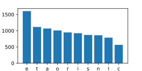

<!-- gid:20221122T113500 -->
[[TIP("이 노트에 대하여")]]
조직모드 바벨과 리터레이트 프로그래밍을 익히기 위한 예제와 참고 링크를 모아 둔다. export, tangling, 언어별 샘플을 한 곳에서 비교하며 실전에 쓸 기반을 다지려는 자료이다.
[[/TIP]]

<!-- provenance:source:start -->
[[TIP("원본·최신본")]]
이 페이지는 한국어 검색과 읽기를 위한 WikiDocs 미러입니다. [원본·최신본은 가든](https://notes.junghanacs.com/notes/20221122T113500/)에 있습니다. 최신 수정 내용·백링크·태그·히스토리·댓글·출처 정보는 원본 가든에서 확인하세요.

- 작성: `2022-11-22T11:35:00+09:00`
- 최근 수정: `2025-02-20T00:00:00+09:00`
[[/TIP]]
<!-- provenance:source:end -->

[TOC]

## BIBLIOGRAPHY

- “Junghan0611/Orgmode-Examples.” 2024. [https://github.com/junghan0611/orgmode-examples](https://github.com/junghan0611/orgmode-examples).

## 업그레이드 하려면

[2025-02-20 Thu 10:12]

-   [HowardAbrams 구루 리터레이트 이맥스 - hamacs::Literate programming for the 21st Century](https://wikidocs.net/382285.md#h-4a6fc006-f385-4565-9b35-c8770e8e184c/)

## 관련노트

-   [emacs-jupyter 이맥스 파이썬 주피터 프로그래밍 환경](https://wikidocs.net/381236)

## 히스토리

-   2022-11-22 바벨 샘플 모음 [2022-11-22 Tue 11:36]
-   2024-06-05 kimim-emacs 예제 문서 링크 추가
-   2024-11-15 add clojure with babashka

:babel:examples:literate:notes:orgmode:samples:

## 참고예제 kimim

-   (“Junghan0611/Orgmode-Examples” 2024) 슬라이드 예시, 내보내기 예시 등

## AWK [AWK: 스크립트](https://wikidocs.net/380482)

-   [이맥스통합개발환경: AWK](https://wikidocs.net/381348)
-   [AWK: Herrlin (2022) Learn the AWK programming with Emacs Org-drill](https://wikidocs.net/382106)

<!--listend-->

<a id="org-example-block--text-example"></a>
```text
Item1 100
Item2 200
Item3 50
```

Sum field nr 2.

```awk
BEGIN {OFS="|"}; { sum+= $2}; END { print "Sum", sum}
```

|     |     |
|-----|-----|
| Sum | 350 |

## Shell

```shell
echo "Hello Spacemacs"
```

```text
Hello Spacemacs
```

## Ditaa

[2022-11-22 Tue 17:35]

```ditaa
+--------------+
|              |
| Hello World! |
|              |
+--------------+
```

## Clojure with BB - babashka

-   [2022-11-22 Tue 17:39]
    -   CIDER Jack-in 하면 REPL 에 연동되서 결과가 출력 된다.
    -   파일 마다 별도로 레플을 생성해야 되니까 별로 좋지 않다. BB 가 있어야겠다.
    -   BB 설정해서 넣었다. 잘된다.

-   2024-11-15 babashka 들어가 있더라. [2024-11-15 Fri 12:50]

<!--listend-->

```clojure
(println "Hello World!")
(+ 1 4)
```

```text
Hello World!
```

```clojure
(println "Hello World!")
(+ 1 4)
```

```clojure
Hello World!
5
```

```clojure
(+ 1 4)
```

```clojure
[ 1 2 3 4]
```

|   |   |   |   |
|---|---|---|---|
| 1 | 2 | 3 | 4 |

```clojure
(def small-map {:a 2 :b 4 :c 8})
(:b small-map)
```

```clojure
(def small-map {:a 2 :b 4 :c 8})
(:b small-map)
```

```text
4
```

```clojure
(def small-map {:a 2 :b 4 :c 8})
(:b small-map)
```

```clojure
4
```

```clojure
(def small-map {:a 2 :b 4 :c 8})
(:b small-map)
```

```clojure
4
```

## Racket

[2022-11-23 Wed 11:16]

```racket
(define (factorial n)
  (if (= n 1)
      1
      (* n (factorial (sub1 n)))))
(factorial input)
```

```text
3628800
```

## JavaScript

[2023-01-13 Fri 05:50]

results output 과 output code 의 차이는 다음과 같다.

```js
console.log("Hello, World!");
```

```text
Hello, World!
```

```js
console.log("Hello, World!");
```

```js
Hello, World!
```

## Python

[2022-11-22 Tue 17:40]

-   [emacs-jupyter 이맥스 파이썬 주피터 프로그래밍 환경](https://wikidocs.net/381236) 참고

<!--listend-->

```python
print("Hello World!")
```

```python
Hello World!
```

,#+RESULTS:

```python
Hello World!
```

### 히스토리

-   2024-06-05 생성. 미니콘다와 기본 기능 검증

### 관련 파일

-   book-computational-literary-analysis 참고

### Python 버전 확인

Check Python version in shell:

```shell
python --version
```

```text
Python 3.12.2
```

-&gt; conda 사용 버전 : 2024-06-05

Evaluate Python code:

```python
print("Python is " + str(year - 1991) + " years old")
```

```text
Python is 33 years old
```

```text
Python is 32 years old
```

, #+RESULTS:

### Python 환경 체크

[2022-11-22 Tue 17:40]

```python
print("Hello World!")
```

```python
Hello World!
```

,#+RESULTS:

```python
Hello World!
```

### Python pyplot

#### code

<a id="code-snippet--python-pyplot"></a>
```python
import matplotlib.pyplot as plt
import pandas as pd
data = pd.DataFrame(tbl)
fig=plt.figure(figsize=(4,2))
fig.tight_layout()
plt.bar(data[0], data[1])
fgname = '/images/python-pyplot.svg'
plt.savefig(fgname)
```

#### output


