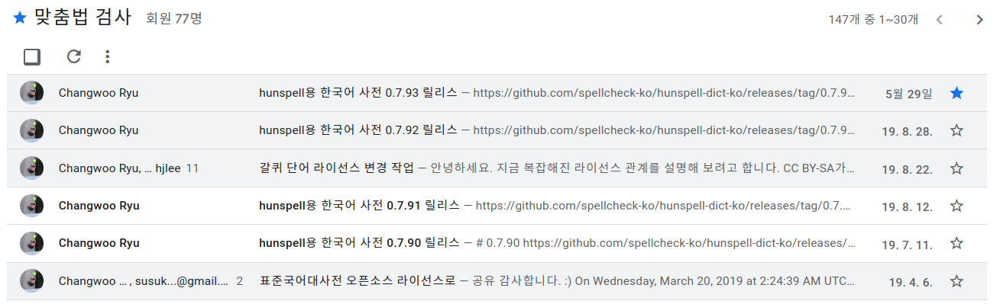
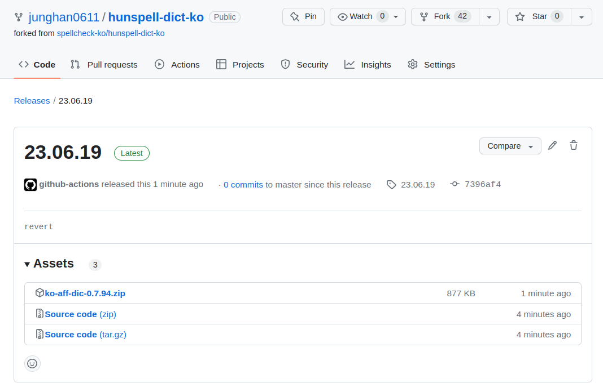

<!-- gid:20230117T123100 -->
[TOC]

[[TIP("이 노트에 대하여")]]
hunspell-ko 한국어 맞춤법 사전의 업데이트와 활용 맥락을 추적한 자료이다. 맞춤법 검사와 사전 기능의 차이, 한국어 도구 생태계의 공백과 감사함이 함께 드러난다.
[[/TIP]]

## BIBLIOGRAPHY

  “Junghan0611/Hunspell-Dict-Ko.” 2023. [https://github.com/junghan0611/hunspell-dict-ko](https://github.com/junghan0611/hunspell-dict-ko).

## 히스토리

-   [2026-03-22 Sun 00:49] 혹시 이에 대한 메타노트는? [ 한글 한국어 우리말](https://wikidocs.net/380544), [린터 맞춤법 린팅 오류 검사](https://wikidocs.net/380549)
-   [2023-06-11 Sun 22:34] 아!맞춤법 검사와 사전 기능은 다른 것이다. 다른 관점에서 접근한다. 4 년만에 한국어 사전이 업데이트 되었다 감사할 일이다. - [이맥스 : 맞춤법 검사](https://wikidocs.net/381056) 이 노트를 검토해야 한다

## junghan0611/hunspell-dict-ko

(“Junghan0611/Hunspell-Dict-Ko” 2023)

-   Han, Jung
-   Korean spellchecking dictionary for Hunspell

## `hunspell-dict-ko` 훈스펠 한국어 사전

[2023-06-11 Sun 22:34]

<https://github.com/junghan0611/hunspell-dict-ko>

먼저 훈스펠 설치 잘했는가? 최신 버전을 사용하자. 창우님이 관리하시는 최신 버전에다가 나의 사용자 사전을 추가하도록 구성한다. 한글 스펠은 이렇게 하면 최고의 퀄리티로 커버하는 것이다.

먼저 한국어 관련 사전 데이터가 최신이 되었다. 감사할 일이다. 그러고 보니 4 년만에 업데이트다. 감사할 일이다.



```text
- 국립국어원 사전 단어 가져오기 (2023/05/01 버전)
- 한국어기초사전, 표준국어대사전, 우리말샘 갱신
```

한 가지 더! 국립국어원 사전 데이터를 잘 활용해서 오프라인 사전을 만들어야 한다.

### 빌드 및 설치 방법

[2023-06-11 Sun 22:34]

$ git clone git@github.com:junghan0611/hunspell-dict-ko.git -b main

내가 포크해서 관리하는 것을 받으면 아래 내용이 반영되어 있다.

오랜만이라 어떻게 빌드하는지도 까먹었다. 위에 기록이 있지만 믿을 수 없으니 일단 리포도 리베이스하고 진행한다.

$ ln -s ~/.spacemacs.d/dict-ko-mydata.yaml dict-ko-mydata.yaml

dict-ko-mydata.yaml 을 Makefile 에 넣어준다.

```text
DICT_DATA = dict-ko-builtins.yaml dict-ko-data.yaml dict-ko-mydata.yaml
```

그리고 make 해주면 된다.

```text
> cd hunspell-dict-ko
> make
python3 make-aff-dic.py ko.aff ko.dic dict-ko-builtins.yaml dict-ko-data.yaml
Progress: 중복 제거...
Status: 중복 제거 후 단어 수: 51149...
Progress: 보조용언 확장...
Progress: 플래그 계산...
Progress: dic 출력...
Progress: aff 출력...
```

Before

```text
-rw-rw-r--  1 junghan junghan 11094418  6월 11 22:20 ko.aff
-rw-rw-r--  1 junghan junghan  2864524  6월 11 22:20 ko.dic
```

After

```text
-rw-rw-r--  1 junghan junghan 11094418  6월 11 22:34 ko.aff
-rw-rw-r--  1 junghan junghan  2864635  6월 11 22:34 ko.dic
```

여기 잘 반영되면 된다.

```text
+ #  373  cd /usr/share/hunspell
+ #  374  sudo rm ko.aff ko.dic
+ #  376  sudo ln -s /home/junghan/sync/emacs/hunspell-dict-ko/ko.aff ko.aff
+ #  377  sudo ln -s /home/junghan/sync/emacs/hunspell-dict-ko/ko.dic ko.dic
```

### Github Actions

[2023-06-19 Mon 11:42] 매우 유용하다. 나의 단어를 포함해서 빌드하기 어렵지 않는가? 그냥 workflow 를 이용하는게 좋다. 사전만 추가해서 돌리면 된다.

<https://github.com/junghan0611/hunspell-dict-ko/releases/download/23.06.19/ko-aff-dic-0.7.94.zip>

```text
$ git tag 23.06.19
$ git push origin --tags
```

로직은 내가 변경한게 없으니까 파일은 위와 같다. 일단 그냥 두고. 파일 안에는 내가 추가한 단어가 들어가 있을 것이다. 저걸 다운 받아서 사용하면 된다.



## 맞춤법 검사 구글 : 훈스펠

[2023-06-11 Sun 22:49] [맞춤법 검사 - Google Groups](https://groups.google.com/g/spellcheck-ko)

그러고 보니 구글 그룹이 있었다. 한국어 사전을 안 쓰는 곳이 거의 없을 텐데 아주 조용하다. 더 큰 기대를 하지 않는 것 같다.

## <span class="org-todo done DONE">DONE</span> librea office 완벽하다

대규모 영어 사전 - 리브레용 <https://proofingtoolgui.org/>

_home/junghan_.config/libreoffice/4 여기에 사전이 있다. 훈스펠 용으로 잘 관리되고 있다. 코드에 여러 사전 지원하는 로직이 있을 것이다. 리브레는 너무 매끄럽게 되는데 사실 마찬가지로 된다. 계속 프로그램 올리고 내리는게 싫어서 그런 것 뿐.

## <span class="org-todo done DONE">DONE</span> obsidian :: 일렉트론

[2023-02-08 Wed 05:25] 잘 된다. 쥑여준다. 일렉트론이 해준다. 근데 엔진 버전이 완전 구식이다. 옵시디언은 스펠체커를 여러개 등록할 수 있다. 검사를 하면 리브레와 마찬가지로 동작한다. 엔진은 일렉트론에서 다 제공해주는 것이기에 크롬과 다를 게 없다. 업데이트는 따로 안되는 것 같다. 엄청 구식이다. 7-8 년 전 인듯.

## 맞춤법 검사 관련 -- 훈스펠 작업 로그 (2023-02)

[2023-02-09 Thu 11:55]

### <span class="org-todo done DONE">DONE</span> 훈스펠 테스트

ko.dic 파일을 보니까 VSCode/10

가문/3 -- 형용사 가문/10 가문비나무/25 가마니/25 가마솥/10 가상현실/10 가상화/25 ㅂ/10 ㅃ/10 ㅅ/10 25 와 10 의 차이가 뭐지?! 받침 0, 영단어 -- 10

위에 기능은 훈스펠 수정해야 한다. 그냥 내 방식 대로 훈스펠 빌드하는 게 쉬운 일이다. VSpaceCode 한스펠 훈스펠 [2023-01-31 Tue 07:20]

#### <span class="org-todo done DONE">DONE</span> 훈스펠 멀티 사전 인식 관련 -- 잘 안된다.

이건 en_US 바인딩이 제대로 안되는 문제가 있는 것 같기도 하다. 커맨드로 2 개 준다고 되는게 아니다.

> 이전과 달라진 부분은 OTHERCHARS 부분을 숫자와 영문자로 바꾼 것입니다. 이렇게 하면 "3 을", "James 를" 과 같은 표현이 나왔을 때에도 "를", "을" 등을 각각의 단어로 인식하지 않고 조사로 인식하게 됩니다. (불행하게도 flyspell 모드에서는 잘 동작하지 않습니다.)

아. 위 분은 한글 스펠링만 처리 했다. 나눠서 적용하는게 좋겠는ㄴ데 어짜피 글은 한글만 쓰지?! 아니라면 아무튼 개인 사전에 처리 수정을 해야 한다.

##### <span class="org-todo done DONE">DONE</span> 사전 ispell hunspell 등등 자동 완성을 껐다. : 훈스펠은 멀티 사전이 된다.

ispell 자동 완성을 조금 더 잡아봐야겠다. 번쩍이는게 안뜨니 좋구나. 자동 완성 없으니까 이상하기도 하다. 근데 너무 뜨니까 문제였던거다. 수정을 해야 한다. [2023-01-24 Tue 07:29]

#### <span class="org-todo todo TODO">TODO</span> 훈스펠 멀티 사전 이슈

[2023-02-06 Mon 13:41]

멀티 사전이 멀티 언어가 아니다. 메뉴얼 보고 수정하고 커맨드에서 해결 못보면 안된다. &gt; man hunspell -- manual page, section 1 (general commands) -- hunspell -- manual page, section 3 (library functions) -- hunspell -- manual page, section 5 (file formats and conventions) -- hunspell

<https://github.com/jihuichoi/korean-spellchecker>

### <span class="org-todo done DONE">DONE</span> hunspell with spellfu -- 동작 X

[2023-02-10 Fri 11:01]

### <span class="org-todo done DONE">DONE</span> Hunspell for Japanese (X)

<https://lists.gnu.org/archive/html/help-gnu-emacs/2018-02/msg00141.html>

#### 왜?! 새로운 접근 방법 훈스펠 만으로는 안된다.

[2023-02-10 Fri 11:02] 무엇이 필요한가? 하나의 버퍼에서 체크를 하면 한국어 영어를 모두 검사 해줘야 한다. 리브레오피스, 옵시디언 에서 유려하게 동작한다. 이 둘은 둘 다 훈스펠을 사용한다. 그러기에 훈스펠로 다 해결 할 수 있지 않을까 생각하게 된다. 근데 실제 멀티 사전 기능으로 영어, 한국어 를 넣으면 제대로 동작하지 않는다. AFF 파일을 언어 별로 처리해주지 않기 때문이다. 여기에 여러 방법을 생각했었다. 무엇하나 간단하지 않다. 수정을 안 하는게 최선이다. 수정하면 계속 관리해야 한다.

guess-langauge 를 사용하면 현재 단락의 언어를 검출해서 자동으로 사전을 바꿔서 검사를 한다. 이게 자동화로서는 최선이다. 근데 나는 사전을 바꿀 때마다 훈스펠을 다시 시작해야 하는게 영 마음에 안 든다. 이 와중에 일본어 사례에서 좋은 방향을 알게 되었다. 이게 괜찮을 것 같다. Aspell 과 훈스펠을 섞어서 사용하는 것이다. 아직 해보지 않아서 애매하긴 하나... 사전 변경 시 훈스펠을 끄지 않을까 싶긴하다. 아마 그럴 것 같은데... 일단 내용을 좀 더 확인해보자. 전략은 간단하다. 영어는 에스펠에서 잘 지원되니까 그걸 쓰고, 한국어는 훈스펠을 사용하는 것이다.

[EmacsWiki: Fly Spell](https://www.emacswiki.org/emacs/FlySpell#toc14) Emacs 위키서 처음 확인했고 메일링 리스트에서 논의된 결과를 기록해 놓은 것이라 의미 없는 접근은 아닐 것이다.

다시 보니까, 단락에서 언어가 섞여 있는 경우에 문제를 해결하는 방법이었다. 근데 이건 alist 에 이미 적어 놓아서 문제가 되지 않는다. 내가 원하는 것은 aspell 과 hunspell 을 섞어 사용하는 경우이다. 흠. 그렇다면 아래 wcheck-mode 가 더 매력적인 접근이 아닐까?!

#### wcheck-mode

[2023-02-10 Fri 11:12]

external tool 을 여러 개 연동하는 범용 시나리오로 생각해 볼 수도 있다. 즉, Flyspell 을 사용하지 않고, wcheck-mode 를 이용해서 훈스펠을 언어 별로 띄워 놓고 사용하는 것이다. 하나의 버퍼에 대해서 깔끔하게 동작만 된다면 나쁘지 않은 접근이다.

ㄹㄴ

#### spell-fu

[2023-02-10 Fri 11:23]

이 녀석은 최신 패키지 인데 나름의 솔루션을 가지고 있지 않을까? 아. 이 녀석이 더 매력적이다. Doom-Emacs 는 아마 이게 기본이었던 것 같은데 거기에 더 나은 팁이 있을 것 같다. 다만, 훈스펠을 지원하고 있는가?! 안된다. 그렇다면 Aspell 로 한글이 되는가? 이건 모르겠다. 인제님의 예가 있긴 한데. 한번 해보자. 그게 되면 spell-fu 로 대동단결 할 수 있다.

#### Category Spelling Check

[2023-02-10 Fri 11:35] [EmacsWiki: Category Spelling](https://www.emacswiki.org/emacs/CategorySpelling) Emacs 에서 스펠링 관련 카테고리를 보았다.

#### Doom-Emacs 에서 찾아보다

[2023-02-10 Fri 11:37] Doom-Emacs 로 가보니 modules/checkers/ 에 grammar, spell, syntax 로 나누어서 보고 있다.

스펠 측면에서 보면, spell-fu 가 기본이다. 굉장히 놀랄만한 점이다. flyspell 는 빌트인인데도 밀려난 것이다. 이렇게 하는 점에서 관련 최적화 코드를 주목해야 한다. 그리고 하나 다 Vertico 를 사용하지 않는 경우에만 correct-popup 을 설치한다. 역시 나는 경험으로 알게 된 점이다.

아. 문서에 보면 spell-fu 는 aspell 만 지원한다고 한다. 쩝... 실제로 기대하기 어려울 것 같다.

관련 내용을 기준으로 조금 트라이를 해볼 수 있을 것 같다. /home/junghan/sync/man/dotsamples/vanilla/artem-dot-files/spelling.el:1

여기서 보면 이 친구는 실제 사용하고 있다.

```emacs-lisp
  (package! spell-fu :pin "8185467b24f05bceb428a0e9909651ec083cc54e")

- +flyspell ::
  Use [[doom-package:flyspell]] instead of [[doom-package:spell-fu]]. It's significantly slower, but supports
  multiple languages and dictionaries.

```

#### CANCELLED Hunspell AFF/DIC KR-EN

### <span class="org-todo done DONE">DONE</span> 훈스펠 업그레이드 전략

<span class="timestamp-wrapper"><span class="timestamp">&lt;2023-02-09 Thu&gt;</span></span>

정리! 이 작업이 쉽지 않을 수도 있다. 훈스펠을 수정하는 것은 좋은 방법도 아니고 훈스펠 메인에 반영하는 것은 더욱이 어려운 일이다. 매우 중요한 주제라 고민해야 하는 것은 아주 명확하다. 그 전에 전반적인 이슈 부터 정리를 하자.

더 급한 이슈들이 여전히 있다. 문득 나는 사용자 사전 시나리오가 중요해진다. 코드 없이 푸는 게 가장 효과적인 방법이다. 전체 시나리오와 스텍에 대한 공부가 더 중요하다.

#### 왜 갑자기 다시 훈스펠!?

문득 명상 중에 방법이 생각이 났다. 훈스펠을 다루는 것 자체가 배움이다. 근데 이 녀석이 너무 구리다. 왜 한영이 동시에 안 되는가? 물론 크롬, 리브레에서는 된다. 이건 훈스펠을 ispell 인터페이스로 사용하는게 아니라 직접 구동하는 방식일 것이다. dbic 으로 만들어서 처리하지 않는가? 이렇게 되면 훈스펠의 사전 양식만 활용하는 것이다. 물론 훈스펠 라이브러리를 사용할 수도 있지. 근데 이 또한 사전이 업데이트 안되는 것을 봐서는 이 마저도 모를 일이다. 크롬 계열의 이야이기다. 파이어폭스는 좀 다를 수 있겠다.

이맥스는 ispell - hunspell 을 사용해야 한다. 훈스펠 바이너리로 한 _영, 영_ 한에 따라서 결과가 달라진다. 이는 aff, dic 파일이 서로 문제를 일으킨다는 것이다.

해결하는 방법은 어느 정도 공부가 필요하다만,

1.  영어 또는 한글 aff dic 을 일부 수정해서 둘 간의 문제를 잡아 낸다. 그러니까 hunspell -d en_US,ko_KR 이렇게 사용하는 이야기다.
2.  훈스펠 한글을 심플하게 다시 정리한다. iconv 를 사용하지 않고 만들 수 있는가? 안될 것 같다. 그냥 쓰는게 맞다. 프랑스어도 쓰더이다. 이게 문제가 아니다. 위에 방법이 더 맞다. 쉽다.

#### hunspell 한국어 맞춤법 검사의 원리 (류창우 님)

[2023-02-09 Thu 05:04] [Hunspell 한국어 맞춤법 검사의 원리](https://www.slideshare.net/changwoo/hunspell-works)

#### aff 파일로 검증하면 된다. 간단하게 테스트.

한영 파일을 각각 만들어서 기본 단어로 테스트 [2023-02-09 Thu 05:14]

#### hunspell git 해줄 수 있는 것! (개인화 사전)

[2023-02-09 Thu 05:15] hunspell 1.7.3 이다. 많은 변화도 가능할지 모른다. 근데 여전히 사전은 변화가 없다. 사실 변화할 수도 없다. 왜냐? 저작권 문제로 데이터는 건들기가 어렵기 때문이다. 이게 중요한 게 아니다. 필요한 것이 있다면?! 개선된 지점을 반영하는 것이다.

#### hunspell tests 폴더를 공략하라!

[2023-02-09 Thu 05:22] 여기에 aff/dic 실용 예제가 다 들어 있다. 이걸로 실제로 써봐야 된다.

### <span class="org-todo done DONE">DONE</span> guess language

[2023-02-09 Thu 11:55] _home/junghan_.spacemacs.d/spacemacs.org:5747 아래 처럼 killed 를 하는 것은 좋지 않다. 다른 시나리오가 필요하다. Ispell process killed Local Ispell dictionary set to ko_KR Detected language: Korean 이렇게 되는가?

## 훈스펠 업데이트 Hunspell update

[2023-01-30 Mon 12:12]

### Download Ubuntu pkgs version 1.7.0

보면 실행 파일이 전부라고 볼 수 있다. 그렇다면 hunspell-ko 는? 스펠 데이터 파일이 끝이다. 그건 앞서 기록해 놓음. [2023-01-30 Mon 12:15]

```text
usr  control  control.tar.zst  data.tar.zst  debian-binary  hunspell_1.7.0-4build1_amd64.deb  md5sums
> cd usr
> tree
.
├── bin
│   └── hunspell
└── share
    ├── doc
    │   └── hunspell
    │       ├── changelog.Debian.gz -> ../libhunspell-1.7-0/changelog.Debian.gz
    │       └── copyright
    └── man
        ├── hu
        │   └── man1
        │       └── hunspell.1.gz
        └── man1
            └── hunspell.1.gz

8 directories, 5 files
```

### hunspell 최신 버전에 한글용 패치가 들어갔다.

[2023-01-30 Mon 12:16]

```text
Resolves: rhbz#2158548 allow longer words for hunspell-ko
#903

A problem since the sanity check added in:

commit 05e44e0
Author: Caolán McNamara <caolanm@redhat.com>
Date:   Thu Sep 1 13:46:40 2022 +0100

    Check word limit (#813)

    * check against hentry blen max
```

### 그렇다면 빌드 버전을 설치하자.

[2023-01-30 Mon 12:17] 아래와 같이 빌드한다. 이전 버전은 지워버린다. 실행 파일 하나 빼곤 패키지에 특별한게 없으니 문제가 없다. stow 로 설치하는 게 편하다. 나중이 지우기도 좋고

```text
> sudo apt install autoconf automake autopoint libtool libncurses5-dev libreadline-dev

> sudo apt-get remove hunspell

autoreconf -vfi
./configure --with-ui ; --with-warnings for optional
make
sudo make install prefix=/usr/local/stow/hunspell
cd /usr/local/stow/hunspell
sudo stow hunspell
sudo ldconfig

> tree
.
├── bin
│   ├── affixcompress
│   ├── analyze
│   ├── chmorph
│   ├── hunspell
│   ├── hunzip
│   ├── hzip
│   ├── ispellaff2myspell
│   ├── makealias
│   ├── munch
│   ├── unmunch
│   ├── wordforms
│   └── wordlist2hunspell
├── include
│   └── hunspell
│       ├── atypes.hxx
│       ├── hunspell.h
│       ├── hunspell.hxx
│       ├── hunvisapi.h
│       └── w_char.hxx
├── lib
│   ├── libhunspell-1.7.a
│   ├── libhunspell-1.7.la
│   ├── libhunspell-1.7.so -> libhunspell-1.7.so.0.0.1
│   ├── libhunspell-1.7.so.0 -> libhunspell-1.7.so.0.0.1
│   ├── libhunspell-1.7.so.0.0.1
│   └── pkgconfig
│       └── hunspell.pc
└── share
```

### 훈스펠 놀아보자. 간단한 개인 사전 테스트 + 최신 기능 검토

[2023-01-30 Mon 12:32]

3 주 전에 추가된 한글 패치도 테스트해보고 품사 관련 개인 사전 기능도 테스트해 본다.

Junghanacs/3 이런 식으로 넣으면 뒤에 붙는 조사까지 패스가 되는 줄 오늘 알았다. 그게 아니라면 이 단어를 hunspell-ko 에 사전 데이터에 명사로 넣어 놓고, 빌드해야 한다. 그렇게 해서 사용하고 있었다. 이게 어디냐!? 라고 엄청 좋아했는데ㅋㅋ

맥이나 리눅스 계열에서는 한글 맞춤법에 훈스펠 피할 수가 없다. 알아야 한다. 배워야 한다. 그래서 이 작업이 의미도 있고 재미도 있는 것이다.

### hunspell + ispell -- flyspell -- 개인 사전 품사 지원이 flyspell 연동 안된다는 말

현재 버전은 다음과 같다. 그렇다면, 한글 관련 이전 이야기가 지원 될 것인가? 예를 들어 hunspell 개인 사전에 뒤에 품사 정보를 넣을 경우 말이다.

&gt; hunspell --version @(#) International Ispell Version 3.2.06 (but really Hunspell 1.7.0) [2023-01-30 Mon 11:38]

### Emacs 현재 관련 설정 현황 점검

먼저 알아야 할 것. 훈스펠은 이맥스와 관계가 없다. 훈스펠이 커맨드라인에서 되는지 확인 되면 여기에 이맥스를 연동하는 것이다. 훈스펠이 독립적으로 동작하기에 다른 오피스 프로그램에서 연동이 되는 것이니까.

다만, 설정 파일을 먼저 보자면, Emacs 버전을 나누어서 다음과 같이 설정을 했다. 이건 멀티 사전을 고려하지 않은 것 같다. 다만 버전에 따라서 왜 다른가?

```text
;; 사전 목록에 한국어("korean") 추가
(if (>= emacs-major-version 23)
    (setq ispell-local-dictionary-alist
          '(("korean"
             "[가-힣]"
             "[^가-힣]"
             "[0-9a-zA-Z]" nil
             ("-d" "ko_KR")
             nil utf-8)))
  (setq  ispell-local-dictionary-alist
         '(("korean"
            "[가-힝]"
            "[^가-힝]"
            "[0-9a-zA-Z)]" nil
            ("-d" "ko_KR")
            nil utf-8))))
;; 한국어를 기본 사전으로 지정
(setq ispell-dictionary "korean")
```

[2023-01-30 Mon 15:02]
