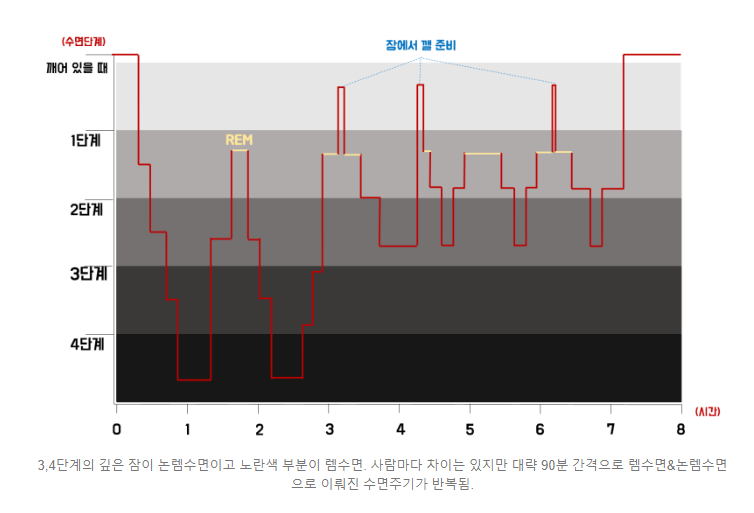

<!-- gid:20230517T223409 -->
[TOC]

[[TIP("이 노트에 대하여")]] 깊은 수면과 루틴, 그리고 과도한 협업 뒤에 찾아오는 브레인오링의 관계를 추적한 기록이다. 회복의 핵심을 숙면에서 찾으며 장기적으로 몸과 작업을 함께 조율하려는 의지가 담겨 있다. [[/TIP]] History - [2026-03-20 Fri 06:28] 브레인오링 발생 깊은 수면으로 바로 가야함 - [2025-08-26 Tue 09:23] 2022년 수면 기록 옮겨 담음 - [2025-05-27 Tue 20:01] 수면은 루틴은 기록한다. 깊은 수면은 회복의 근원 - [2023-05-17 Wed 05:46] 깊은 수면 루틴 2023 작성 노트 관련메타 - [ 수면 낮잠 브레인워시 숙면](https://wikidocs.net/380819)

## 2026 수면 질의 변화와 브레인오링

[2026-03-20 Fri 06:29] 이 주제는 나의 오랜 수면 기록에서 데이터로 드러난다. 인공지능과 협업으로 별개의 프로젝트를 병렬로 가다보면 그것을 8시간 이상 할 경우에 브레인오링 발생 한다. 지금 아침이라 더 길게 안남긴다. [힣: ADHD AI 시대 - 해방에서 경계까지](https://wikidocs.net/381022)

## 2023 Deep sleep 깊은 수면 루틴

[2023-05-17 Wed 05:46] 수면 루틴 9 시 ~ 어제도 9 시부터 아이를 재우고 그다음에 누워서 헤르만 헤세의 '삶을 견디는 기쁨'을 들었다. 요즘에는 전자책을 보지 않고 들어도 참 괜찮아졌다. 20 분 타이머를 해놓고 듣기 시작하면 어느 순간 잠이 든다. 이것이 나의 수면에 들어가는 루틴이다. 자연스럽게 이렇게 하고 있다. 물론 아이를 재우고 나서 조금 더 일을 할까? 싶기도 하지만 밤 10 시에 잠을 자는 것보다 더 중요한 일이 있을까? 기상 루틴 ~ 5 시 지금은 새벽 4 시. 조금 전에 일어났다. 알람을 한 것도 아니고 그냥 자연스럽다. 어제도 오늘도 그렇다. 자연스러운 일이다. 10 시에는 잠을 청했기에 가능한 시간이 아닐까? 6 시에 일어 나는 게 더 적절한 것은 알고 있다. 적정 수면량이 있지 않은가? 아무튼 이 새벽은 나에게 귀중하다. 대단한 일을 하지 않더라도 괜찮다. 모든 게 허락되는 시간이다. 일단 컴퓨터 앞에서 명상으로 시작을 한다. 뇌를 천천히 깨워주는 과정이다. 적어도 나는 그렇다. 나를 좀 기다려줘야 한다. 이게 더 빠른 길이며 오래가는 길이더라. 때론 좋은 아이디어가 툭툭 의식으로 올라오기도 한다. 내가 나를 안아줘야 한다. 명상을 하고 그리고 나의 일을 한다. 오늘은 '깊은 수면' 이야기를 쓰고 있다. 깊은 수면 20% 나는 '갤럭시 핏 2'를 왼쪽 손목에 차고 잔다. 운동할 때도 물론 사용하지만 잠을 잘 때는 꼭 챙긴다. 다른 시간에는 거의 착용하지 않는다. 수면 체크 기능은 나에게 '깊은 수면의 기쁨'을 알려주었다. 일단! 일어나면 수면 차트를 자연스레 힐끗 본다. 그중에서도 먼저 '깊은 수면'을 본다. 오늘 이 글을 쓰는 이유이기도 하다. 흠... 수면 차트가 아름답구먼!! 놀라울 것도 없다. 처음에는 깊은 수면이 거의 없었다. 아예 없는 날도 있었다. 깊은 수면은 신체 전반의 회복 과정이라고 한다. 깊은 수면을 늘리려면 이른 시간에 자라고 한다. 아무튼 이게 나의 수면 루틴의 시작이다. 신기하게도 일찍 자면 깊은 수면이 더 많이 측정되더라. 여기에 집착할 필요도 없지만 우리는 원시인의 몸과 똑같다. 원시인이 해가 지고 무엇을 했겠는가 생각해 보면 이해가 된다. 자연스러운 것이다. 수면과 뇌 수면이 중요하다는 말은 나도 이 블로그에서 여러 번 했었다. 말은 쉽다. 얕은 지식도 쉽다. 실제 행동하기는 어렵다. 습관으로 만들기는 더욱 어렵다. 진정한 앎은 설명이 필요 없기는 것이기도 하다. 그냥 자연스러운 것일 뿐이니까. 그래도 시작은 의식적인 노력이 필요하다. 그렇다면 무엇이 도움이 될까? 김주환 교수님의 '내면 소통'이 지금 나에게 최선이다. 변화의 시작에서는 약간 우직하게 하나를 믿고 밀고 가는 게 도움이 된다. 너무 많은 정보와 말들로 뭐 하나 시작하기가 어려운 시대이다. 책은 처음에는 안 사는 게 차라리 좋겠다. 김주환 교수 유튜브에서 관련 영상을 그냥 다 보면 된다. 하나로 연결되는 이야기다. 책이 어렵고 두꺼워서 책으로 시작하면 부담만 된다. 이건 공부의 대상이 아니다. 공부로 접근하면 삶에 이르기 전에 지칠 수도 있다. 참고로 일전에 김주환 교수님은 '회복탄력성', '편안전활' 등의 이야기로 글을 썼던 것 같다. 참 이분 덕분에 '정리'가 많이 되었다. - [김주환: 편안전활 내면소통 명상](https://wikidocs.net/381881)
-   [힣: 낮잠 브레인워시 에너지 회복](https://wikidocs.net/381410)
-   [힣: 그는누구인가](https://wikidocs.net/381392)

## 2022 신체 회복 - 수면 루틴

[2022-07-08 Fri 09:20]

-   삼성 헬스 앱에서 갤럭시 워치와 연동해서 알려주는 수면 점수
    -   총 수면 시간 (6-9 시간)
        -   대부분의 성인은 충분한 휴식을 위해 7-8 시간의 수면이 필요합니다.
    -   수면 주기 (3-7 번)
        -   잠들 때, 뇌와 신체는 특정한 주기로 활동합니다. 대부분 성인의 경우, 하루밤 자는 동안 주기가 4-5 번 정도 반복됩니다.
        -   90 분 단위가 일반적인듯
    -   뒤척이거나 깸 (1-40%)
        -   뒤척이거나 깬 시간을 의미 합니다. 이 시간이 줄어들수록 수면 점수가 높아집니다. 자주 깨거나, 뒤척거리거나, 깨고 나서 쉽게 다시 잠들지 못하면 수면 점수는 낮아집니다.
    -   신체 회복 [BROKEN LINK: 깊은 수면]
        -   세포의 성장이나 재생. 10 시-02 시 멜라토닌 나올 시간에 자야 확실히 확보되된다.
    -   정신 회복 [BROKEN LINK: 렘 수면]
        -   렘 수면은 학습, 기억 및 정서적, 정신적인 건강과 연관
    -   수면의 규칙성
        -   잠들 때, 뇌와 신체는 몇 가지 단계를 거친다. 전체 수면 시간 대비 각 단계에 머문 시간의 비율을 보면 나의 수면의 질을 파악할 수 있다.
        -   첫 주기(90 분)의 깊은 수면에서 신체 회복을 할 수 있다. collapsed:: true
            
            

-   수면 주기를 이용한 짧고 개운한 수면법
    -   [수면주기 수면법](https://www.newswire.co.kr/newsRead.php?no=576720)
    -   얕은 수면 단계에서 깨야 한다. 3 사이클을 돌고 난 4 시간 30 분 정도 후즈음이 좋다.
    -   낮잠은 30 분 이내로 보충하면 된다.
