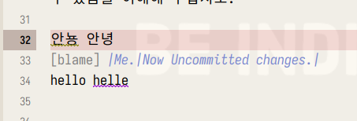

<!-- gid:20230526T175200 -->
[TOC]

[[TIP("이 노트에 대하여")]]
이맥스에서 한글과 영어 맞춤법 검사를 함께 돌리기 위한 환경 구성을 다룬다. Hunspell, Flyspell, Jinx 같은 도구를 실제 사용 맥락에서 어떻게 엮을지 탐색한 흔적이 남아 있다.
[[/TIP]]

## BIBLIOGRAPHY

  “Enchant - Spelling Libraries and Programs with a Consistent Interface - Jinx.” 2025. 2025. [https://rrthomas.github.io/enchant/](https://rrthomas.github.io/enchant/).
  “Flyspell - Spelling (Gnu Emacs Manual).” n.d. Accessed January 31, 2025. [https://www.gnu.org/software/emacs/manual/html_node/emacs/Spelling.html](https://www.gnu.org/software/emacs/manual/html_node/emacs/Spelling.html).
  “Minad/Jinx Enchant.” 2024. [https://github.com/minad/jinx](https://github.com/minad/jinx).

## 히스토리

-   [2026-03-22 Sun 00:47] hunspell-ko 생각하다가. [hunspell-ko 한글: 맞춤법 검사 훈스펠](https://wikidocs.net/381046)

## 2025

김정한

### enchant ordering 파일 2.8

[2025-06-24 Tue 06:04] ```text
(base) /usr/share/enchant-2🔒
➜ cat enchant.ordering
*:hunspell,nuspell,aspell
en_AU:aspell,hunspell,nuspell
en_CA:aspell,hunspell,nuspell
en_GB:aspell,hunspell,nuspell
en_US:aspell,hunspell,nuspell
fi:voikko,hunspell,nuspell,aspell
fi_FI:voikko,hunspell,nuspell,aspell
he:hspell,hunspell,nuspell
he_IL:hspell,hunspell,nuspell
tr:zemberek,nuspell
tr_TR:zemberek,nuspell

``` 한글 영어 동시 검사 - 핵심 - [2025-04-20 Sun 10:23]2023년부터 이것 뿐 먼저 훈스펠을 설치하고 활용해야 한다. [2025-01-31 Fri 13:41] 다음 문서에 잘 적혀 있다. - [notes/ hunspell-ko 한글: 맞춤법 검사 훈스펠 '2023-01-17 2026-03-22](https://notes.junghanacs.com/notes/20230117T123100/)

#### minad/jinx enchant

(“Minad/Jinx Enchant” 2024) Daniel Mendler 2024

🪄 Enchanted Spell Checker

#### Enchant - spelling libraries and programs with a consistent interface - jinx

(“Enchant - Spelling Libraries and Programs with a Consistent Interface - Jinx” 2025) 2025

#### flyspell : built-in checker

-   Flyspell Spelling (GNU Emacs Manual) (“Flyspell - Spelling (Gnu Emacs Manual)” n.d.)

### 2024 Flyspell and Jinx

[2024-02-09 Fri 10:16] 스펠푸로 아래 글이 있는데, 지금은 Flyspell + Jinx 를 사용하고 있다. - [다니엘멘들러 minad 이맥스 구루](https://notes.junghanacs.com/bib/20241223T092335/)의 (“Minad/Jinx Enchant” 2024)

#### Jinx Appendix Tips

[2023-05-27 Sat 13:34] [Home · minad/jinx Wiki · GitHub](https://github.com/minad/jinx/wiki)

위 위키에 나와 있다. 한글을 가지고 자동으로 영어로 바꿔 줄 수 있는 팁들이 있다. abbr 를 제대로 활용 하는 방법.

#### enchant2 2.5.0  update

[2023-05-26 Fri] ```text
./configure --with-aspell-dir=/usr/lib/aspell

junghan-laptop➜  enchant-2.5.0  ᐅ  enchant-lsmod-2 -list-dicts
en (aspell)
en_AU (aspell)
en_CA (aspell)
en_GB (aspell)
en_US (aspell)
ko (hunspell)
ko_KR (hunspell)
``` enchant 2 컴파일 및 설치 - [2025-06-24 Tue 05:59] 회사 내 토 아. enchant 는 wcheck-mode 로 연동해서 여러 개 사전 활용 시나리오가 가능하다. 아래와 같이 hunspell 과 연동하니까 어렵지 않다. ```text
sudo apt-get install -y groff
sudo apt-get install aspell-en libaspell-dev --reinstall

# 컴파일

./configure --with-aspell-dir=/usr/lib/aspell
# --with-hunspell-dir=/usr/share/hunspell
make -j
sudo make install
# /usr/local/bin 에 설치 기존 패키지로 설치된 버전은 /usr/bin 에 있음.

# rm ordering file
cd /usr/share/enchant-2/ .. 파일 삭제

# 이렇게 나와야 된다.
> enchant-lsmod-2 -list-dicts
en (aspell)
en_AU (aspell)
en_CA (aspell)
en_GB (aspell)
en_US (aspell)
ko (hunspell)
ko_KR (hunspell)

``` enchant with hunspell (en/ko) 시나리오 테스트 동시에는 안되지만 여러 개 를 띄워 놓고 사용하는 시나리오라면 문제가 없다. 이 부분은 wcheck-mode 의 역할이다. 김정한 안녕 안뇽 hello helle hello helle spell-fu (?) 안될 것 같은데?! 해보면 되는 거지뭐. ```text
> enchant-lsmod-2 -lang en
en (hunspell)
> enchant-lsmod-2 -lang ko
ko (hunspell)

> enchant-2 -d ko -a
@(#) International Ispell Version 3.1.20 (but really Enchant 2.3.4)
안녕
안뇽
& 안뇽 1 0: 안녕

> enchant-2 -d en -a
@(#) International Ispell Version 3.1.20 (but really Enchant 2.3.4)
helle
& helle 6 0: hell, hello, belle, helve, hell e, heel

helllo
& helllo 5 0: hello, hell lo, hell-lo, hellhole, hell

hello
``` ehchant with aspell (en_US) 시나리오 ```text
> enchant-lsmod-2 -lang en_US
en_US (aspell)
> enchant-lsmod-2 -lang en_US
> enchant-2 -d en_US -a
@(#) International Ispell Version 3.1.20 (but really Enchant 2.3.4)
hello

helle
& helle 29 0: Heller, hell, hello, heel, he'll, helve, belle, Halley, Hallie, Holley, Hollie, healer, holler, huller, Hale, Hall, Hill, Hull, hale, hall, heal, hill, hole, hull, Holly, Hoyle, hilly, holly, hell's
``` 둠이맥스 테스트 진행 [2023-02-20 Mon 15:21] 둠의 init.el 에 Flyspell 과 enchat 를 설정했다. 사전을 변경할 때마다 아래와 같이 enchant 가 실행되어 처리한다. 이렇다면 wcheck-mode 로 가능할 것이다. hunspell 에서 제공하는 기능을 이용할 수 없다는 말인가? 예컨데 개인화 사전 말이다. 스펙상으로는 지원한다. ```text

/usr/local/bin/enchant-2 -a -m -d ko
``` wcheck-mode enchant 테스트 [2023-02-20 Mon 15:35] 지금 스페이스맥스로 테스트 중이다. abbrev 모드가 안되는가? 한글 스펠링 검사가 되고 있다. 잠시만, 이게 별도니까 flyspell 은 영어로 박아 버리면?! 아 되는구나. 그렇다면 한글은 hunspell 로 하고 영어는 wcheck-mode 를 사용하면 된다. 설정하고 오자. ARCHIVE - [2025-04-20 Sun 10:19] 저장 2023 맞춤법 검사 현황 : 한글 영어 동시 검사 지원 - [2023-06-11 Sun] 아래 작업 로그를 보면 이리 저리 찔러 본 이야기가 많이 있다. 그때 고민했던 부분들은 지금은 다 해결된 상태이다. 동시에 한영 스펠 검사가 진행 된다. - 한글 : jinx -&gt; enchant -&gt; hunspell -&gt; hunspell-ko 로 동작한다. - 영어 : spell-fu -&gt; aspell en-us <span class="org-todo done DONT">DONT</span> 2023 Jinx + Spellfu 한글 영어 동시 검사 [2023-05-27 Sat 13:36] ```text
스페이스맥스에서 작업한 기록임
``` 23-05-27 1:36 PM 참으로 나에게 있어서 의미 있는 일이다. 한글, 영어를 동시 검사 하는게 뭐 그렇게 어려운 일인가?! 근데 생각보다 잘 안된다. Emacs 뿐만이 아니다. 한글 영어는 각자 다른 언어 사전을 활용한다. 하나의 툴을 쓰려면 하나의 언어를 포기해야 한다. 나는 툴을 각각 돌려서 검사하는 방법을 이전 부터 확인했다. 근데 속도 문제와 더불어 서로 확실하게 검사 구역을 나누는 데에 실패 했다. 여튼 여기에 관심이 많았기에 jinx 가 나오자 마다 바로 붙였다. 한글도 잘 된다. 멀티 언어가 안된다는 것을 일찍이 검증 했기 때문에 언어 별로 각각 어떻게 할 것인가를 결정해야 했다. - flyspell 은 빌트인이고 내부에서 hunspell 을 프로세스로 띄워서 ispell 인터페이스로 검사한다. 한글을 이걸로 커버 가능. 좋은 옵션. - spell-fu 는 aspell 로 영어만 검출. 캐싱 기능으로 영어 검사에는 성능이 좋다고 한다. - wcheck-mode 자유도가 높다. 별도의 프로세스로 동작시킨다. 지금은 거의 안쓰는데 참 동작은 되니까 애매했다. 나는 그래서 jinx 를 한글로 커버하고 spell-fu 로 영어를 검사한다. jinx 는 한글만 검사하게 해놓아서 부담이 적다. 그 외는 다 영어이니 spell-fu 가 역할을 한다. spell-fu 는 한글을 건들지도 않는다. 좋은 일이다. 그 다음에는 어느 주기로 검사를 하는가가 중요한 포인트이다. 그리고 한글 문단에 있는 영어를 검사할 것인가도 포인트가 된다. 즉 단어 수준의 검사다. 이 부분도 스펠푸가 자기것만 챙기니까 괜찮다.  <span class="org-todo done DONT">DONT</span> spellfu : Doom's Default checker <span class="org-todo done DONT">DONT</span> 2024 jinx (ko) spellfu(en) dual on doomemacs [2024-05-24 Fri 11:40] 둠 이맥스에서 최적의 성능을 내는 방법을 적용. 한글은 jinx 로 처리한다. 영어는 spellfu 로 한다. 둠에서는 스펠푸가 기본이다. 이렇게 하면 동시에 한글 영어를 검사한다. flyspell 에서 느끼는 버벅임은 없다. 아주 훌륭하다. 로그 [|2025-06-24 Tue 06:12|](https://notes.junghanacs.com/journal/20250623T000000.md#h-2025-06-24/) 새 노트북

enchant-2.8.0 enchant-lsmod-2 -list-dicts

```text
enchant-lsmod-2 -list-dicts
de_AT (hunspell)
de_AT_frami (hunspell)
de_CH (hunspell)
de_CH_frami (hunspell)
de_DE (hunspell)
de_DE_frami (hunspell)
en (aspell)
en_AU (aspell)
en_CA (aspell)
en_GB (aspell)
en_US (aspell)
en_ZA (hunspell)
es_AR (hunspell)
es_BO (hunspell)
es_CL (hunspell)
es_CO (hunspell)
es_CR (hunspell)
es_CU (hunspell)
es_DO (hunspell)
es_EC (hunspell)
es_ES (hunspell)
es_GT (hunspell)
es_HN (hunspell)
es_MX (hunspell)
es_NI (hunspell)
es_PA (hunspell)
es_PE (hunspell)
es_PR (hunspell)
es_PY (hunspell)
es_SV (hunspell)
es_US (hunspell)
es_UY (hunspell)
es_VE (hunspell)
fr (hunspell)
fr_BE (hunspell)
fr_CA (hunspell)
fr_CH (hunspell)
fr_FR (hunspell)
fr_LU (hunspell)
fr_MC (hunspell)
it_CH (hunspell)
it_IT (hunspell)
ko (hunspell)
ko_KR (hunspell)
nl (hunspell)
nl_AW (hunspell)
nl_BE (hunspell)
nl_NL (hunspell)
nl_SR (hunspell)
pt_BR (hunspell)
ru_RU (hunspell)
(base) ~/.config/enchan
```
