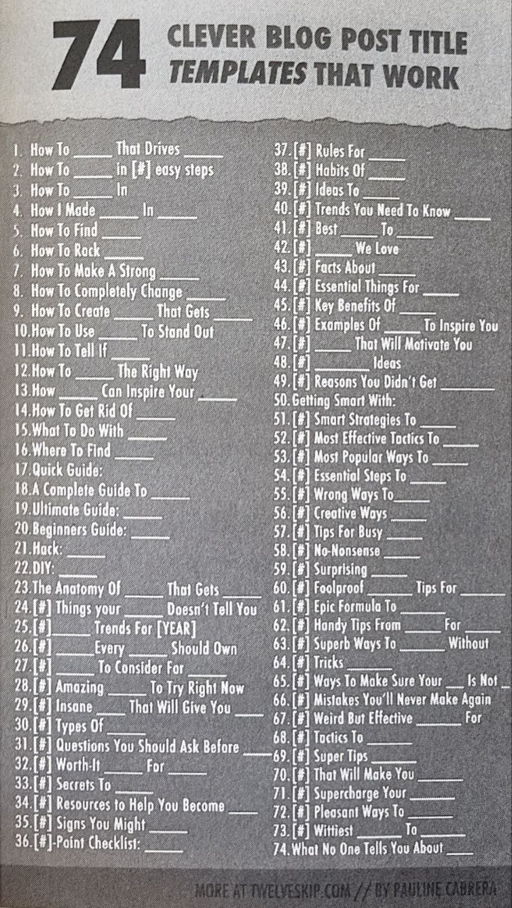

<!-- gid:20230531T121300 -->
[TOC]

[[TIP("이 노트에 대하여")]]
블로그 글 제목을 지을 때 써먹을 수 있는 템플릿과 추천 패턴을 모아 둔다. 막연한 아이디어를 발화 가능한 제목으로 바꾸는 데 도움이 되는 출발점 역할을 한다.
[[/TIP]]

Clever Blog Title Templates 74

```text
적절한 시기에 만난 자료
```

## how i use

[2025-01-22 Wed 06:58]

추가

## 74 Clever Blog Post Title Templaces That Work

[74 Clever Blog Post Title Templates That Work - Samith Pitch](https://samithpich.com/74-clever-blog-post-title-templates-work/) Did you get some great Blog post ideas? Share them below!



-   How To <span class="underline"><span class="underline">\_\_</span></span> in [] easy steps - How To <span class="underline"><span class="underline">\_\_</span></span> In <span class="underline"><span class="underline">\_\_</span></span> - How To Find <span class="underline"><span class="underline">\_\_</span></span> - How to Rock <span class="underline"><span class="underline">\_\_</span></span> - How To Make A Strong <span class="underline"><span class="underline">\_\_</span></span> - How To Completely Change <span class="underline"><span class="underline">\_\_</span></span> - How To Create <span class="underline"><span class="underline">\_\_</span></span> That Gets <span class="underline"><span class="underline">_</span></span> - How To Use <span class="underline"><span class="underline">\_\_</span></span> To Stand Out - How To Tell IF <span class="underline"><span class="underline">\_\_</span></span> - How To <span class="underline"><span class="underline">\_\_</span></span> The Right Way - How <span class="underline"><span class="underline">\_\_</span></span> Can Inspire Your <span class="underline"><span class="underline">\_\_</span></span> - How To Get Rid Of <span class="underline"><span class="underline">\_\_</span></span> - What To Do With <span class="underline"><span class="underline">\_\_</span></span> - Where To Find <span class="underline"><span class="underline">\_\_</span></span> - Quick Guide: - A Complete Guide To <span class="underline"><span class="underline">\_\_</span></span> - Ultimate Guide: <span class="underline"><span class="underline">\_\_</span></span> - Beginners Guide: <span class="underline"><span class="underline">\_\_</span></span> - Hack: <span class="underline"><span class="underline">\_\_</span></span> - DIY: <span class="underline"><span class="underline">\_\_</span></span> - The Anatomy Of <span class="underline"><span class="underline">\_\_</span></span> That Gets <span class="underline">\_\_</span> - [] Things your <span class="underline"><span class="underline">\_\_</span></span> Doesn’t Tell You - []_____\_ Trend For [YEAR] - []_____\_ Every <span class="underline"><span class="underline">\_\_</span></span> Should Own - []_____\_ To Consider For <span class="underline"><span class="underline">\_\_</span></span> - [] Amazing <span class="underline"><span class="underline">\_\_</span></span> To Try Right Now - [] Insane <span class="underline"><span class="underline">\_\_</span></span> That Will Give You \_\_ - []Types Of <span class="underline"><span class="underline">\_\_</span></span> - []Questions You Should Ask Before <span class="underline">_</span> - [] Worth-It <span class="underline"><span class="underline">\_\_</span></span> For <span class="underline"><span class="underline">\_\_</span></span> - [] Secrets To <span class="underline"><span class="underline">\_\_</span></span> - [] Resources To Help You Become <span class="underline">\_\_</span> - [] Signs You Might <span class="underline"><span class="underline">\_\_</span></span> - [] –Point Checklist - [] Rules For <span class="underline"><span class="underline">\_\_</span></span> - [] Habits Of <span class="underline"><span class="underline">\_\_</span></span> - [] Ideas Of <span class="underline"><span class="underline">\_\_</span></span> - [] Trends You Need To Know <span class="underline"><span class="underline">\_\_</span></span> - [] Best <span class="underline"><span class="underline">\_\_</span></span> To <span class="underline"><span class="underline">\_\_</span></span> - [] <span class="underline"><span class="underline">_</span></span> We Love - [] Facts About <span class="underline"><span class="underline">\_\_</span></span> - [] Essential Things For <span class="underline"><span class="underline">\_\_</span></span> - [] Key Benefits Of <span class="underline"><span class="underline">\_\_</span></span> - [] Examples Of <span class="underline"><span class="underline">\_\_</span></span> To Inspire You - []_____\_ That Will Motivate You - []_____\_ Ideas - [] Reasons You Didn’t Get <span class="underline"><span class="underline">\_\_</span></span> - Getting Smart With: - [] Smart Strategies To <span class="underline"><span class="underline">\_\_</span></span> - [] Most Effective Tactics To <span class="underline"><span class="underline">\_\_</span></span> - [] Most Popular Ways To <span class="underline"><span class="underline">\_\_</span></span> - [] Essential Ways To <span class="underline"><span class="underline">\_\_</span></span> - [] Wrong Ways To <span class="underline"><span class="underline">\_\_</span></span> - [] Creative Ways To <span class="underline"><span class="underline">\_\_</span></span> - [] Tips for Busy <span class="underline"><span class="underline">\_\_</span></span> - [] No-Nonsense <span class="underline"><span class="underline">\_\_</span></span> - [] Surprising <span class="underline"><span class="underline">\_\_</span></span> - [] Foolproof <span class="underline"><span class="underline">\_\_</span></span> Tips For <span class="underline"><span class="underline">\_\_</span></span> - [] Epic Formula To <span class="underline"><span class="underline">\_\_</span></span> - [] Handy Tips From <span class="underline"><span class="underline">\_\_</span></span> For <span class="underline"><span class="underline">\_\_</span></span> - [] Superb Ways To <span class="underline"><span class="underline">\_\_</span></span> Without - [] Tricks <span class="underline"><span class="underline">\_\_</span></span> - [] Ways To Make Sure You <span class="underline"><span class="underline">_</span></span> Is Not - [] Mistakes You’ll Never Make Again - [] Weird But Effective <span class="underline"><span class="underline">\_\_</span></span> For - [] Tactics To <span class="underline"><span class="underline">\_\_</span></span> - [] Super Tips <span class="underline"><span class="underline">\_\_</span></span> - [] That Will Make You <span class="underline"><span class="underline">\_\_</span></span> - [] Supercharge Your <span class="underline"><span class="underline">\_\_</span></span> - [] Pleasant Ways To <span class="underline"><span class="underline">\_\_</span></span> - [] Wittiest <span class="underline"><span class="underline">\_\_</span></span> To <span class="underline"><span class="underline">\_\_</span></span> - What No One Tells You About <span class="underline"><span class="underline">\_\_</span></span> Related-Notes - [네이밍](https://wikidocs.net/380723)
-   [추천](https://wikidocs.net/380784)

## BIBLIOGRAPHY
