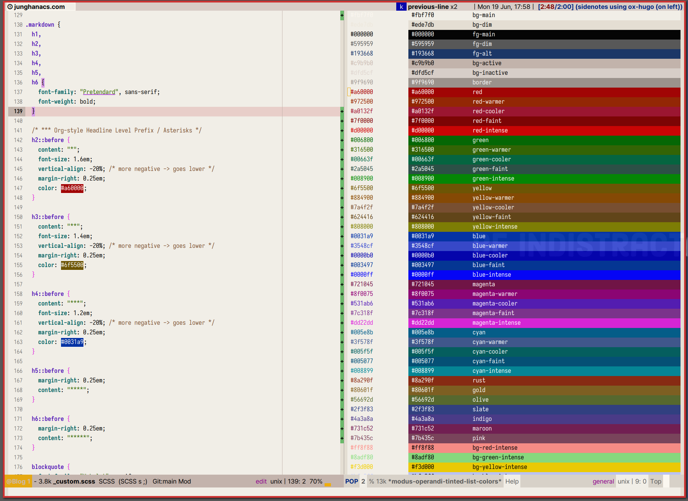
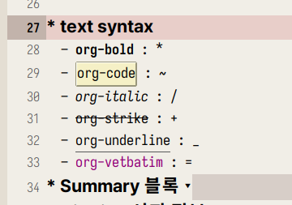

<!-- gid:20230605T121800 -->
[TOC]

[[TIP("이 노트에 대하여")]]
조직모드에서 각주, 수식, 인용, lastmod 같은 퍼블리시 요소를 점검하기 위한 예제 템플릿 모음이다. export 결과를 안정적으로 만들기 위해 어떤 설정을 확인해야 하는지 빠르게 짚어 준다.
[[/TIP]]

Org-mode 에서 작성한 문서를 Hugo Markdown 으로 변환하기는 쉽다. 근데 각주, 인용, 태그, 요약, 코드, 일부 내용 감추기 등을 어떻게 하는가? 여기에 대한 답을 찾는다. ox-hugo 의 모든 예제는 다음 주소에 있다. 여기서 찾아보자.&nbsp;[^fn:1]

<!--more-->

## <span class="org-hashtag">#lastmod</span> <span class="org-hashtag">#timestamp</span>

[2024-11-27 Wed 11:55]

문제를 정의하자면, org-hugo-auto-set-lastmod 을 쓰면 내보낼 때 마다 마크다운에 lastmod가 갱신 된다. 자동을 끄고, 조직모드 파일에 hugo_lastmod를 넣고 관리한다.

어떻게?! 다음과 같이 하면 된다.

```elisp
(progn
  ;; Append and update time-stamps for
  ;; #+hugo_lastmod: Time-stamp: <>
  ;; org-hugo-auto-set-lastmod should be nil
  (require 'time-stamp)
  (add-hook 'write-file-functions 'time-stamp))
```

조직모드 파일에 다음 정보를 넣어주고 싶다면, 일괄 변경.

```elisp
(progn
  (defun my/insert-hugo-lastmod-time-stamp ()
    (interactive)
    (save-excursion
      (goto-char 0)
      (search-forward "date:")
      (end-of-line)
      (insert "\n#+hugo_lastmod: Time-stamp: <>"
              )))

  ;; (defun my/insert-hugo-lastmod-time-stamp-on-directory (directory)
  ;;   "Export all Org files in the specified DIRECTORY to Markdown using `org-hugo-export-to-md`."
  ;;   (interactive "DSelect directory: ")
  ;;   (let ((org-files (directory-files-recursively directory "\\.org\\'")))
  ;;     (dolist (org-file org-files)
  ;;       (with-current-buffer (find-file-noselect org-file)
  ;;         (my/insert-hugo-lastmod-time-stamp)
  ;;         ))))
  )

```

## Embedded Video

-   video copy : using filelink &gt; cae-org-insert-file-link
-   and make `hugo-video` template
-   github graphic image path for exporting other blogs

## <span class="org-todo done DONT">DONT</span> Ox-Hugo Header and Toc Generation

[2024-01-03 Wed 10:45] Toc 생성을 누가 할 것인가? 섹션 번호를 넣을 것인가? 헤드라인 레벨을 어디까지만 넣을 것인가? 에 대해서 문서에 따라 설정한다. 기본 정책은 Hugo 에서 생성하며 섹션 넘버

아래에 대략 정리

```text

#+title:
#+author:
#+email: junghanacs@gmail.com
#+language: ko
#+startup: fold
#+description:
,
#+macro: latest-export-date (eval (format-time-string "%F %T %z"))
#+macro: word-count (eval (count-words (point-min) (point-max)))
,
#+HUGO_SECTION:
#+HUGO_SERIES: "Emacs Guide"
#+hugo_categories: Emacs
#+EXPORT_FILE_NAME: jh-emacs.md

# #+options: ':t toc:4 num:t H:8
# #+hugo_custom_front_matter: :toc false

#+EXPORT_HUGO_PANDOC_CITATIONS: t
#+cite_export: csl

#+hugo: more
```

## Math Typesetting 수식 입력

ox-hugo/doc/ox-hugo-manual.org:1486

By default, the inline and block equations are exported to Markdown in a format that can be rendered using [MathJax](https://www.mathjax.org/#gettingstarted). You can find one MathJax config example

기본적으로 인라인 및 블록 방정식은 [MathJax](https://www.mathjax.org/#gettingstarted)를 사용하여 렌더링할 수 있는 형식으로 Markdown 으로 내보내집니다. 하나의 MathJax 구성 예제를 찾을 수 있습니다

`ox-hugo` indirectly extends from `ox-html` and so it also inherits a different way of exporting latex equations --- by exporting them to images.

`ox-hugo` 는 `ox-html` 에서 간접적으로 확장되므로 라텍스 방정식을 이미지로 내보내는 다른 방식도 상속받습니다.

### `Inline` equations

-   Inline equations are wrapped between `\(` and `\)`.
    -   `$` wrapping also works, but it is not preferred as it comes with restrictions like "there should be no whitespace between the equation and the `$` delimiters".
        
        So `$ a=b $` will not work (it will look like: $ a=b $), but `$a=b$` will work (it will look like: \\(a=b\\)).
        
        On the other hand, both `\(a=b\)` (it will look like: \\(a=b\\)) and `\( a=b \)` (it will look like: \\( a=b \\)) will work.

-   One-per-line equations are wrapped between `\[` and `\]` or `$$` delimiters.

For example, below in Org:

```org
LaTeX formatted equation: \( E = -J \sum_{i=1}^N s_i s_{i+1} \)
```

will look like this in Hugo rendered HTML (using MathJax):

LaTeX formatted equation: \\( E = -J \sum\_{i=1}^N s\_i s\_{i+1 }\\)

이걸 어떻게 쉽게 입력할 수 있을까?

Here's another example, taken from [Org Info: LaTeX fragments](https://orgmode.org/manual/LaTeX-fragments.html "Emacs Lisp: (info \"(org) LaTeX fragments\")"):

```text
If $a^2=b$ and \( b=2 \), then the solution must be either
$$ a=+\sqrt{2} $$ or \[ a=-\sqrt{2} \]
```

Above renders to below using Mathjax:

If \\(a^2=b\\) and \\( b=2 \\), then the solution must be either \\[ a=+\sqrt{2} \\] or \\[ a=-\sqrt{2} \\]

Note that the last two equations show up on their own lines because those equations are wrapped in `\[ .. \]`.

### `latex` Environments

`ox-hugo` support latex environments.

So below in Org buffer:

```org
\begin{equation}
\label{eq:1}
C = W\log_{2} (1+\mathrm{SNR})
\end{equation}
```

will render as below using MathJax:

\begin{equation}
\label{eq:1}
C = W\log\_{2} (1+\mathrm{SNR})
\end{equation}

You can find many more equation examples at testtag(equations).

### Org mode Manual

[2023-10-24 Tue 13:08]

Org mode can contain LaTeX math fragments, and it supports ways to process these for several export back-ends. When exporting to LaTeX, the code is left as it is. When exporting to HTML, Org can use either MathJax (see Math formatting in HTML export) or transcode the math into images (see Previewing LaTeX fragments).

조직 모드에는 LaTeX 수학 조각이 포함될 수 있으며, 여러 내보내기 백엔드에서 이러한 조각을 처리하는 방법을 지원합니다. LaTeX 로 내보낼 때는 코드가 그대로 남습니다. HTML 로 내보낼 때 Org 는 MathJax 를 사용하거나(HTML 내보내기의 수학 서식 참조) 수학을 이미지로 트랜스코딩할 수 있습니다(LaTeX 조각 미리 보기 참조).

<https://orgmode.org/manual/LaTeX-fragments.html> <https://orgmode.org/manual/Math-formatting-in-HTML-export.html>

### Org-mode Markdown Preview

mathjax 로 Org-mode 와 Markdown 을 커버한다. Typst 는 호환이 안되는것 같다. 굳이 그럴 필요 없다.

-   [MathJax로 LaTeX 사용하기 - 기계인간 John Grib - johngrib.github.io](https://johngrib.github.io/wiki/mathjax-latex/)
-   <https://tyami.github.io/blog/practice-for-mathjax/>

-   [2024-01-07 Sun 15:26]

\begin{aligned}
H(Play)&=-\sum\_{i=1}^c p\_i\log\_2 p\_i \\\\
&=-(\frac{5}{14}log\_2\frac{5}{14}+\frac{9}{14}log\_2\frac{9}{14}) \\\\
&=0.94
\end{aligned}

-   [2024-01-07 Sun 15:27]

\begin{eqnarray}
H(Play)&=&-\sum\_{i=1}^c p\_i\log\_2 p\_i \\\\
&=&-(\frac{5}{14}log\_2\frac{5}{14}+\frac{9}{14}log\_2\frac{9}{14}) \\\\
&=&0.94
\end{eqnarray}

## Heading

[2023-06-19 Mon 17:51]

h2 은 레드 계열 heading 은 숫자보다는 정통 별표로 가는게 예쁘다.



### Heading 2

헤딩 h3 yello 계열

#### Heading 3

h4 blue [2023-06-19 Mon 17:51]

### Paragraph

Xerum, quo qui aut unt expliquam qui dolut labo. Aque venitatiusda cum, voluptionse latur sitiae dolessi aut parist aut dollo enim qui voluptate ma dolestendit peritin re plis aut quas inctum laceat est volestemque commosa as cus endigna tectur, offic to cor sequas etum rerum idem sintibus eiur? Quianimin porecus evelectur, cum que nis nust voloribus ratem aut omnimi, sitatur? Quiatem. Nam, omnis sum am facea corem alique molestrunt et eos evelece arcillit ut aut eos eos nus, sin conecerem erum fuga. Ri oditatquam, ad quibus unda veliamenimin cusam et facea ipsamus es exerum sitate dolores editium rerore eost, temped molorro ratiae volorro te reribus dolorer sperchicium faceata tiustia prat.

Itatur? Quiatae cullecum rem ent aut odis in re eossequodi nonsequ idebis ne sapicia is sinveli squiatum, core et que aut hariosam ex eat.

### Blockquotes

The blockquote element represents content that is quoted from another source, optionally with a citation which must be within a `footer` or `cite` element, and optionally with in-line changes such as annotations and abbreviations.

#### Blockquote without attribution

> Tiam, ad mint andaepu dandae nostion secatur sequo quae. **Note** that you can use _Markdown syntax_ within a blockquote.

#### Blockquote with attribution

> Don't communicate by sharing memory, share memory by communicating. --- Rob Pike

### Tables

Tables aren't part of the core Markdown spec, but Hugo supports them out-of-the-box.

| Name  | Age |
|-------|-----|
| Bob   | 27  |
| Alice | 23  |

#### Inline Markdown within tables

| Italics   | Bold     | Code   |
|-----------|----------|--------|
| _italics_ | **bold** | `code` |

### <span class="org-todo todo TODO">TODO</span> Code Blocks

#### Code block with backticks

```html { linenos=true }
<!doctype html>
<html lang="en">
<head>
  <meta charset="utf-8">
  <title>Example HTML5 Document</title>
</head>
<body>
  <p>Test</p>
</body>
</html>
```

#### Code block indented with four spaces

```text
<!doctype html>
<html lang="en">
<head>
  <meta charset="utf-8">
  <title>Example HTML5 Document</title>
</head>
<body>
  <p>Test</p>
</body>
</html>
```

#### Code block with Hugo's internal highlight shortcode

,{{&lt; highlight html &gt;}}

&lt;!doctype html&gt; &lt;html lang="en"&gt; &lt;head&gt; &lt;meta charset="utf-8"&gt; &lt;title&gt;Example HTML5 Document&lt;/title&gt; &lt;/head&gt; &lt;body&gt; &lt;p&gt;Test&lt;/p&gt; &lt;/body&gt; &lt;/html&gt;

{{&lt; /highlight &gt;}}

### List Types

#### Ordered List

1.  First item
2.  Second item
3.  Third item

#### Unordered List

-   List item
-   Another item
-   And another item

#### Nested list

-   Fruit
    -   Apple
    -   Orange
    -   Banana
-   Dairy
    -   Milk
    -   Cheese

#### List with checkbox

-   [X] Create a Hugo site
-   [X] Add content
-   [ ] Add a style

### <span class="org-todo todo TODO">TODO</span> Other Elements --- abbr, sub, sup, kbd, mark

```markdown
<abbr title="Graphics Interchange Format">GIF</abbr> is a bitmap image format.

H<sub>2</sub>O

X<sup>n</sup> + Y<sup>n</sup> = Z<sup>n</sup>

Press <kbd><kbd>CTRL</kbd>+<kbd>ALT</kbd>+<kbd>Delete</kbd></kbd> to end the session.

Most <mark>salamanders</mark> are nocturnal, and hunt for insects, worms, and other small creatures.
```

GIF is a bitmap image format.

H2O

Xn + Yn = Zn

Press CTRL+ALT+Delete to end the session.

Most salamanders are nocturnal, and hunt for insects, worms, and other small creatures.

## Markup

org-mode 마크업은 다음의 주소에서 확인 바람.&nbsp;[^fn:2] ox-hugo 관련 내용은 다음 주소에서 확인.[^fn:3] 결과를 비교하면 org-code 와 verbatim 이 다르다. 맞춰줘야 한다. verbatim 은 맞추기가 까다롭다. `kbd` 을 많이 사용하라!

> -   헤딩에는 _ 만 사용하라!
> -   본문에는 ~, = 깔끔하다.
> -   \*, / 은 편하게 사용하되 헤딩에만 피해라!

-   **org-bold** : \*
-   `org-code` : ~ (org-hugo-use-code-for-kbd t)
-   _org-italic_ : /
-   ~~org-strike~~ : +
-   <span class="underline">org-underline</span> : _
-   `org-verbatim` : =



### Markup with CJK + Pangu-spacing

아래 모든 경우에 강조 표기가 MD 로 전달 되는가? 일단 마크업 문제만 해결 하는 것이 목적이니까 정상 동작

-   `HELLO` 입니다.
-   `HELLO` 입니다
-   `HELLO`
-   `HELLO 안녕`
-   `안녕`
-   `안녕 세상`
-   `안녕 HELLO` 입니다
-   안녕 Hello
-   Hello 안녕

아래와 같이 내보내기 된다. 그럼 된것 이다.

```text
- `F3` 입니다.
- `HELLO`
- `HELLO안녕`
- `안녕`
- `안녕 세상`
- `안녕HELLO`
```

## Summary 블록

요약문은 한글, 컬럼 80 으로 2.5 줄 정도 가능하다. 간단히 쓰는게 항상 답이다. 간단히 요약하기란 쉽지 않다. 하지만 중요하다. 아래와 같이 포스팅 맨 위에 짧은 글을 넣으면 된다. `#+hugo: more` 이 구분자 역할을 한다. 왠만하면 문서에 html 코드를 넣고 싶지 않다. 제공하는 방법을 사용한다.

```text
My post summary.

#+hugo: more

My post content.
```

## Citation 서지 정보

다음과 같이 상/하단에 넣어야 한다. 레퍼런스를 달아 봅니다. `SPC B i` 로 바인딩을 해 놓았다. (NO_ITEM_DATA:HaekeowaHwaga14) (Jethro Kuan 2022) citar 사용법을 여기서 다룰 것은 아니다. 아무튼 깔끔하게 들어간다.

```text
#+hugo_pandoc_citations: t
#+cite_export: csl
,[cite:@HaekeowaHwaga14]
,
#+print_bibliography:

Below, the "References" heading will be auto-inserted.
```

현재 라인 다음에 References 이 추가 된다.

## BIBLIOGRAPHY

  Jethro Kuan. 2022. “How I Take Notes with Org-Roam.” 2022. [https://jethrokuan.github.io/org-roam-guide/](https://jethrokuan.github.io/org-roam-guide/).
  NO_ITEM_DATA:HaekeowaHwaga14

## Footnote 각주 관리

각주는 이렇게 들어갑니다.&nbsp;[^fn:4] No Export 블로그 리포는 공개되어 있다. 여기에 Markdown 파일이 그대로 있다. 숨기고 싶은 또는 숨겨야 하는 내용이 분명히 있을 것이다. 그렇다면 org 파일에서 아래와 같은 방법으로 숨기면 된다. 아예 private 프로퍼티를 넣고 ox-hugo 에서 걸러주는 방법도 있다. 나는 왠만하면 다 내용을 오픈하고자 한다. 다만 문제가 되거나 퀄리티가 많이 부족한 부분은 `헤딩` 수준에서 숨기길 원한다. PRIVATE 설정 [2023-07-10 Mon 10:10] 내보내기 할 때 연결 된 노트가 미리 내보내기 되어 있어야 한다. 불편한 부분이다. 아직 내보내기 할 상태가 아닌데도 내보내기 할 필요가 있을까? 그렇다면 방법은 :private: 를 프로퍼티에 넣는다. (커스텀 수정) URL 이 있다면 URL 링크로 변경 되고 그게 아니라면 텍스트로 표시 된다. noexport 태그 활용 아래 헤딩은 안보입니다. 뭔가 더 있는데 안보이죠? 그럼 된겁니다. ```text
* 숨기고 싶은 헤딩이라면 태그를 달아라 :noexport:
``` 파일 숨기기 (비추) 연결 된 노트를 작성하는 경우라면 좋지 않은 방법이다. 링크를 블록하는 처리를 해줘야 한다. ```text
,:EXPORT_FILE_NAME: excluded-post
``` 코드, 인용, 예시 블록 - ':' 을 애용한다. 1 라인 블록.     ```text
    안녕하세요. 간단해서 좋습니다.
    ``` - example : 앞에 탭 사이즈 공백이 들어 간다.     ```text
    위에 요약문의 분량입니다. 대략 2.5 줄 정도 입니다. 한글로.
    ``` - quote > 위에 요약문의 분량입니다. 대략 2.5 줄 정도 입니다. 한글로. - src 소스코드 블록이다.     ```emacs-lisp
    (with-eval-after-load 'ox-hugo
      (setq org-hugo-auto-set-lastmod 't
            org-hugo-section "posts"
            org-hugo-suppress-lastmod-period 43200.0
            )
    ``` - center <style>.org-center { margin-left: auto; margin-right: auto; text-align: center; }</style> 위에 요약문의 분량입니다. 대략 2.5 줄 정도 입니다. 한글로. - verse 위에 요약문의 분량입니다. 대략 2.5 줄 정도 입니다. 한글로.<br /> 태그를 키워드로 변환 키워드로 빼고 태그는 명시하는게 좋겠다. 태그와 카테고리는 관리가 필요하다. 지식 관리를 할 때 태그, 카테고리는 매우 중요한 분류 방법이다. 태그를 마구잡이로 잡는 것은 좋지 않은 방법이다. 대략 분류를 해놓고 그 안에서 설정을 하는게 좋다. 특히 디지털 가든에서는 태그 관리가 더 중요하다. 그래서 파일 태그가 이리저리 많더라도 변환 할 때는 키워드로 할당되도록 한다. 즉 블로그의 태그는 적절하게 관리한다. 자동화가 언제나 효과적인 것은 아니다. ```text
#+hugo_front_matter_key_replace: tags>keywords
``` 태그 내보내기를 위한 공백 하이픈 활용 방법 [2024-05-02 Thu 11:42] filtags and hugotags with ox-hugo configuration "org mode" 의 정식 명칭은 공백이 필요하다. ox-hugo 는 가운데 하이픈이 필요하다. 이 녀석들은 키워드로써 활용 하려고 한다. 둘다 기본 값은 t 이다. ```elisp
(setq org-hugo-allow-spaces-in-tags t)
(setq org-hugo-prefer-hyphen-in-tags t)
``` 즉, 다음과 같이 태그를 넣으면, ```text
#+filetags: :index:org__mode:ox_hugo:
``` 다음과 같이 md 로 변환 된다. 괜찮다. 좋다. 그래. ```text
tags: ["index", "org mode", "ox-hugo"]
``` 다른 방법으로, HUGO_TAGS 를 사용하는 방법도 있다. ```text
# #+HUGO_TAGS: "org mode" ox-hugo
``` 위와 같이 내 보낼 태그를 직접 명확하게 기입해도 된다. 중요한 것은 정책을 세우고 나가아는 것이다. Org-translate 블록 번역 [2023-06-08 Thu 12:52] 블록 번역 테스트. ```text
,#+BEGIN_SRC translate :src en :dest ko :noexport
``` 코드 블록을 번역 하여 하단에 삽입한다. ```translate
Doom is a configuration framework for GNU Emacs tailored for Emacs bankruptcy
veterans who want less framework in their frameworks, a modicum of stability
(and reproducibility) from their package manager, and the performance of a
hand rolled config (or better). It can be a foundation for your own config or
a resource for Emacs enthusiasts to learn more about our favorite operating
system.
``` Doom 은 프레임워크에 적은 프레임워크, 패키지 관리자의 약간의 안정성(및 재현성), 수동 구성의 성능(또는 그 이상)을 원하는 Emacs 파산 베테랑을 위해 맞춤화된 GNU Emacs 용 구성 프레임워크입니다. 자신의 구성을 위한 기초가 될 수도 있고 Emacs 애호가가 선호하는 운영 체제에 대해 자세히 알아볼 수 있는 리소스가 될 수도 있습니다. Header Template [2023-06-22 Thu 09:35] capture 를 하면 아래와 같이 노트의 타입에 맞게 헤더가 생성 된다. publish, lastmod 는 직접 수정 한다. 그래야 깔끔하다. ```text
,:PROPERTIES:
,:CUSTOM_ID:       3dcd5b7a-9e78-41a9-a3da-xxxxxxxx
,:END:
#+title: HELLO WORLD
#+date: [2023-06-22 Thu 10:27]
#+hugo_publishdate: <2023-06-22 Thu 10:27>
#+filetags:
#+HUGO_DRAFT: true
,
``` 노트를 캡처 하면 아래와 같다.  그 다음에 template 을 가져 온다. 자동으로 가능한 부분을 거의 다 제거 했다. 내보내기 전에 확인하고 직접 하는 것이 노트에 대한 나의 자세가 아닐까 싶다. 아 물론 SETUPFILE 을 이용해서 표준화 시킬 수 있다. 그렇게 했었다. 근데 이 또한 섣부른 자동화가 아닐까? 하루에 1-2 개 노트를 만드는데 뭘 더 자동화 하려는 것인가?! 귀하게 다루자. 받들어 모시자. ```text

(hugofront "
,# :ROAM_ALIASES: \"==\"
#+SUBTITLE:
#+URL:
#+LANGUAGE: ko
,# #+STARTUP: overview

,# == TAGS ==
,# 🌱 🪴 🌳
#+filetags: :draft:
#+filetags: :seedling:
,# #+HUGO_TAGS:

,# == Taxonomies ==
,# #+hugo_categories:
,# #+HUGO_SERIES:

,# == Glossary ==
#+glossary_sources: glossary-general

,# == Front-matter ==
#+hugo_front_matter_key_replace: tags>keywords
,# #+hugo_front_matter_key_replace: aliases>nil
,# #+hugo_paired_shortcodes: hint details mermaid sidenote
#+EXPORT_HUGO_PANDOC_CITATIONS: t
,# 
#+print_bibliography:


,# == Summary ==

#+attr_shortcode: info
#+begin_hint" n> r> n>
",#+end_hint

#+hugo: more

* HIDDEN :noexport:
* ChangeLog :noexport:

")
``` Images [2023-12-31 Sun 07:34] 이미지 내보내기 방법 org-download or org-attach 둘다 가능하다. image [2024-01-03 Wed 11:05] - org-download  - org-attach  Remote Images  Sidenote [2023-06-19 Mon 16:30] 테스트  사이드 노트에 대한 나의 사랑은 엄청 납니다.  사이드 노트 예제 입니다. 사이드노트  아직 메뉴와 겹쳐지는 문제를 해결해야 합니다. 다만 사용하는데 지장 없습니다.  는 좋습니다. 숏코드는 tempel 에 hugoside 로 만들어 두었습니다. Diagram : Mermaid <span class="underline">mermaid</span> diagram [2023-06-08 Thu 11:45] 벡터 포멧을 지원하지 않지만 PNG 로 바로 결과를 확인하고 내보내기가 가능한 ob-mermaid 를 활용하는게 더 편하다. 보는 입장에서도 이미지가 더 활용하기 쉽다. mermaid 다이어그램을 생성하는 방법은 2 가지다. 1. org-babel : ox-mermaid 2. Short-code : mermaid 아래와 같은 코드를 변환한다고 하자.  stateDiagram-v2 State1: The state with a note note right of State1 Important information! You can write notes. end note State1 --> State2 note left of State2 : This is the note to the left.  org-babel 의 이점은 org 문서에서 바로 결과를 확인할 수 있다는 점이다. 편집하면서 바로 보고 블로그로 바로 내보내면 된다. 물론 로컬에 mermaid 를 설치해 놓아야 한다. 물론 ob-mermaid 로 설정은 기본이다.&nbsp;[^fn:5] ```text
sudo npm install -g @mermaid-js/mermaid-cli
``` 단점은 명확하다. png 만 지원 된다. Ob-mermaid 이용한 결과다. png 파일의 한계. `:exports` 옵션은 code, results, both, none&nbsp;[^fn:6] ```mermaid { width="80%" align="center" }
stateDiagram-v2
    State1: The state with a note
    note right of State1
        Important information! You can write
        notes.
    end note
    State1 --> State2
    note left of State2 : This is the note to the left.
``` <span class="src-block-number">Code Snippet 1:</span> My class diagram (code and png) Short-code 를 이용한 결과. 벡터 포멧의 장점 적절히 사용하면 된다. 다만 캡션이 왜 안들어가는지 확인이 필요하다. 위의 방식과 다르게 해야 한다. ```mermaid
stateDiagram-v2
    State1: The state with a note
    note right of State1
        Important information! You can write
        notes.
    end note
    State1 --> State2
    note left of State2 : This is the note to the left.
``` <span class="org-todo todo TODO">TODO</span> Shotcodes 지원 [2023-06-08 Thu 12:19] Hugo Book 데모 페이지를 확인한다.&nbsp;[^fn:7] 여기에 보면 문서 편집하기 위한 여러 코드들을 제공하고 있다. 나는 마크다운으로 편집하지 않기 때문에 각각 기능 검증이 필요하다. ox-hugo 가 있으니 문제 될 것은 없다. 오히려 이맥스의 확장성을 제한하기 때문에 선택과 집중이 필요하다. hint and details [2023-06-05 Mon 13:44] org 파일에서 제공하는 기능은 아니지만 블로그에서 보다 정보를 깔끔하게 정리하기 위해서 short-code 를 사용할 수 있다. 스니펫으로 만들어 놓으니 아주 편리하다. 이맥스의 기본 Quote 변환. 나는 serif 폰트로 변경했다. > Quote 인용문 hint 에서 레벨에 맞는 컬러 효과가 가능하다. hint info 인포 hint warning 경고 hint error 에러 expand 도 가능하다. (details)  *Markdown content* Lorem markdownum insigne. Olympo signis Delphis! Retexi Nereius nova develat stringit, frustra Saturnius uteroque inter! Oculis non ritibus Telethusa  결과에 `caption` 넣는 방법 [2023-06-08 Thu 12:25] 변환 된 코드 블록의 결과 이미지에 캡션을 넣어야 한다. Related-Notes - [템플릿](https://notes.junghanacs.com/meta/20231005T141800/)

## BIBLIOGRAPHY

  Jethro Kuan. 2022. “How I Take Notes with Org-Roam.” 2022. [https://jethrokuan.github.io/org-roam-guide/](https://jethrokuan.github.io/org-roam-guide/).
  NO_ITEM_DATA:HaekeowaHwaga14

[^fn:1]: <https://raw.githubusercontent.com/kaushalmodi/ox-hugo/main/test/site/content-org/all-posts.org>
[^fn:2]: <https://orgmode.org/manual/Markup-for-Rich-Contents.html>
[^fn:3]: <https://ox-hugo.scripter.co/doc/formatting>
[^fn:4]: [How I Take Notes with Org-roam](https://jethrokuan.github.io/org-roam-guide/)
[^fn:5]: <https://github.com/arnm/ob-mermaid>
[^fn:6]: <https://orgmode.org/manual/Exporting-Code-Blocks.html>
[^fn:7]: <https://hugo-book-demo.netlify.app/docs/shortcodes/katex/>
