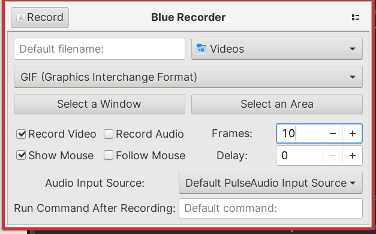

<!-- gid:20230608T125600 -->
[[TIP("이 노트에 대하여")]]
리눅스 작업 흐름에 맞는 정지 화면, GIF, 터미널 데모 도구를 비교하며 활용 시나리오를 정리한다. 문서화와 README 데모 제작을 위해 어떤 캡처 방식이 효율적인지, 실제로 어떤 조합이 남았는지를 기록한 노트다.
[[/TIP]]

<!-- provenance:source:start -->
[[TIP("원본·최신본")]]
이 페이지는 한국어 검색과 읽기를 위한 WikiDocs 미러입니다. [원본·최신본은 가든](https://notes.junghanacs.com/notes/20230608T125600/)에 있습니다. 최신 수정 내용·백링크·태그·히스토리·댓글·출처 정보는 원본 가든에서 확인하세요.

- 작성: `2023-06-08T12:56:00+09:00`
- 최근 수정: `2026-04-30T15:53:00+09:00`
[[/TIP]]
<!-- provenance:source:end -->

[TOC]

이맥스 화면을 저장하고 싶다면 2 가지를 구분해야 한다. 화면 구성 측면에서는 버퍼, 윈도우, 프레임을 선택해야 할 것이다. 정지 화면인가 아닌가도 중요하다. 물론 운영체제에 따라서 다르다.

## Related-Notes

-   [이맥스: 화면구성 스크린샷 - 기록](https://wikidocs.net/381028)
-   [스크린샷 이름일괄변경 스크립트](https://wikidocs.net/381307)

## BIBLIOGRAPHY

- “Firatkiral/Pypeek Peek Screen Recorder and Screenshot with Annotation.” 2024. [https://github.com/firatkiral/pypeek](https://github.com/firatkiral/pypeek).
- “Xlmnxp/Blue-Recorder.” 2024. [https://github.com/xlmnxp/blue-recorder](https://github.com/xlmnxp/blue-recorder).

## `질문:` 화면을 어떻게 저장하고 싶은가?

[2023-06-08 Thu 14:51] 요즘 잘나가는 방법 다 알려주면 된다. 일단 정지 화면은 기본이고 GIF 를 저장해야 한다. 빌트인 기능이 있다면 좋고 아니면 리눅스에서 쉽게 활용할 수 있어야 한다.

## 글쓰기 워크플로우와 연계 한다면?!

[2023-06-08 Thu 21:06]

일단 이미지로 스크린샷을 넣고, 필요에 의해서 추가로 GIF 로 넣을 생각이었는데 만약 GIF 스크린샷이 이미지 넣는 것과 플로우 상 별 차이가 없다면 사용한다.

GIF 프리뷰도 물론 깔끔하게 되야 한다. org 모드에서 해본 적이 없는 것 같다. 될 것 같지만 버벅인다면 과감히 별도의 글쓰기 플로우로 뺄 생각이다. 큰 문제는 없을 것 같다.

## GIF 를 매끄럽게 다룰 수 있는게 핵심이다.

[2023-06-08 Thu 21:10] 말로 백번 천번 말할 것을 보여주면 한 방에 넘어간다. Emacs 는 특히 키바인딩이 걸려 있기 때문에 커맨드로그와 같이 보여줘야 한다. 이미 고수들은 다 이렇게 해왔다.

## `고급` Replay 기능

[2023-06-08 Thu 21:11] 리플레이 스타일로 만들어서 직접 해당 기능을 입력해 보는 게 연습에 직빵이다. 이맥스에서는 안될 이유가 없으나 내가 해본적은 없다.

## <span class="org-hashtag">#리눅스</span> <span class="org-hashtag">#애플리케이션</span>

[2023-06-08 Thu 21:02] 리눅스 애플리케이션으로 이미지, GIF, Video 는 하나 씩 잡고 있어야 한다.

### Flameshot : Image only

[2023-06-08 Thu 17:33] 크로스플랫폼 캡처 툴로 내가 애용한다. 좋다.

### <span class="org-todo done DONE">DONE</span> Blue-Recorder

[2023-06-08 Thu 20:41] [GitHub - xlmnxp/blue-recorder: Simple Screen Recorder wri...](https://github.com/xlmnxp/blue-recorder)

(“Xlmnxp/Blue-Recorder” 2024)

-   Yaslem, Salem 2024 "xlmnxp/blue-recorder" Simple Screen Recorder written in Rust based on Green Recorder

이거 된다

```shell

flatpak install flathub sa.sy.bluerecorder
flatpak run sa.sy.bluerecorder

스냅말고 x sudo snap install blue-recorder --edge
```

이 녀석이다. 믿고 한번 설치해 봅시다.

프레임은 10 으로 맞추자. 마우스도 안보이게 하자. 잘 된다. 프레임을 더 줄여야 할 것 같다.



### firatkiral/pypeek Peek screen recorder and screenshot with annotation

(“Firatkiral/Pypeek Peek Screen Recorder and Screenshot with Annotation” 2024) Firat 2024

Peek screen recorder and screenshot with annotations

#### <span class="org-todo done DONT">DONT</span> pypeek : gif screenshot on linux

### <span class="org-todo done DONT">DONT</span> kazam

### <span class="org-todo done DONT">DONT</span> kooha

## <span class="org-hashtag">#이맥스</span> <span class="org-hashtag">#패키지</span> <span class="org-hashtag">#스크린샷</span>

[2023-06-08 Thu 14:56] 아래 2 개가 최종 남았다. 각각은 훌륭하다. 이렇게 가져가면 된다.

### <span class="org-todo done DONE">DONE</span> gif-screencast

[2023-06-08 Thu 15:32] 이거 잘 된다. 저장하는 path 를 잡아주고 영역이 기본 Frame 이구나. 버퍼 또는 설정 위치로 잡도록 하면 좋겠다. 설정을 좀 하면 될 것 같다

```shell
sudo apt-get install gifsicle
```

설정 되는 것인가? 지금 찍고 있따. 장난아니다. 잘된다. Gif 용량도 아주 작다.

```elisp

;; (package! gif-screencast)
(use-package! gif-screencast
    :commands gif-screencast
    :bind (:map gif-screencast-mode-map
    ("<f8>". gif-screencast-toggle-pause)
    ("<f9>". gif-screencast-stop))
    ;; :init
    ;; (setq gif-screencast-args '("-x")
    ;;       gif-screencast-cropping-program ""
    ;;       gif-screencast-capture-format "ppm")
    )
```

### screenshot

```text
(screentshot :location (recipe :fetcher github :repo "tecosaur/screenshot" :files ("*.el" "*.org")))
```

## <span class="org-hashtag">#온라인</span> <span class="org-hashtag">#업로드</span>

[2024-10-11 Fri 15:53]

### Imgur (Upload) : 온라인 업로드

[2023-06-08 Thu 17:34]

Upload to Flameshot allows users to simply upload their screenshots directly to the cloud in order to easily share it with others. You can upload your image directly to Imgur with a single click and share the URL with others.

온라인에 이미지 또는 GIF 를 올려놓고 문서에 링킹하는 방법도 유용하다.

## <span class="org-todo done DONE">DONE</span> asciinema + agg — README용 터미널 GIF 문서화

<span class="timestamp-wrapper"><span class="timestamp">&lt;2026-04-30 Thu 15:49&gt;</span></span>

이제는 GUI 스크린샷 도구만이 아니라, 터미널 작업 흐름 자체를 GIF로 문서화한다. 특히 `pi-shell-acp` 리포에서는 아래 조합이 README 데모 제작의 기본 흐름이 된다.

### 산출물

-   `docs/assets/pi-shell-acp-demo.cast`
-   `docs/assets/pi-shell-acp-demo.gif`
-   `docs/assets/pi-shell-acp-doomemacs.cast`
-   `docs/assets/pi-shell-acp-doomemacs.gif`

### 제작 흐름

```shell
asciinema rec pi-shell-acp-doomemacs.cast --overwrite
agg --idle-time-limit 2 --fps-cap 15 --theme github-dark \
  ~/pi-shell-acp-doomemacs.cast \
  docs/assets/pi-shell-acp-doomemacs.gif
```

### 왜 좋은가

-   터미널 작업을 그대로 재현 가능한 흔적으로 남긴다.
-   README에 바로 붙일 수 있는 GIF 산출물이 나온다.
-   Emacs/TUI/ 에이전트 작업 흐름을 정지 화면보다 더 정확하게 보여준다.
-   `asciinema` 원본과 `agg` 변환본을 같이 두어 재가공이 쉽다.

### 위치

-   리포: `/home/junghan/repos/gh/pi-shell-acp/`
-   자산 폴더: `/home/junghan/repos/gh/pi-shell-acp/docs/assets/`

### 메모

-   이 노트는 이제 "스크린샷 도구"만이 아니라, 문서화용 `terminal demo pipeline` 까지 포함하는 노트로 본다.
