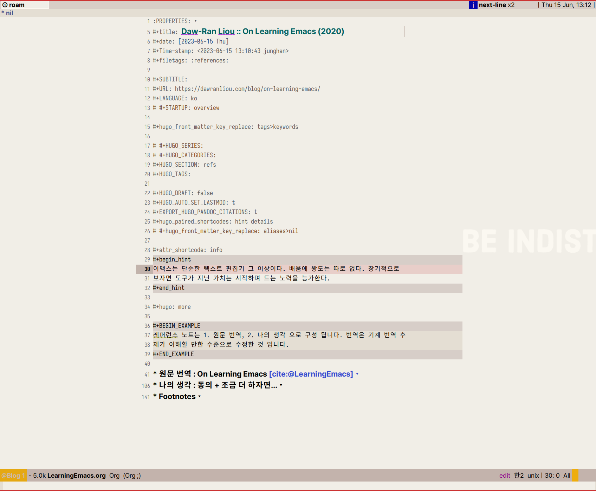
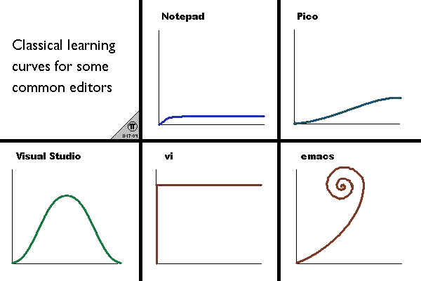

<!-- gid:20230615T120400 -->
[TOC]

[[TIP("이 노트에 대하여")]] 도구의 효율성이 학습의 어려움을 넘어선다는 명제를 Emacs 경험으로 다시 읽는다. 원문 번역, 개인적 리뷰, 그리고 AI 협업 시대의 추가 관점을 겹쳐 장기적 도구 가치가 무엇인지 묻는다. [[/TIP]] 히스토리 - [2026-04-13 Mon] pi — 문서 정리. 2026 관점 추가, 관련메타/노트 보강. - [2026-04-08 Wed] 노트 쓰레기 문자 정리 - [2025-06-10 Tue] 관련노트 연결 - [2023-06-15 Thu] 초기 작성. 원문 번역 + 리뷰. "도구의 효율성은 학습의 어려움을 능가한다." 배움에 왕도는 따로 없다. 장기적으로 보자면 도구가 지닌 가치는 시작하며 드는 노력을 능가한다. 레퍼런스 노트는 1. 원문 번역, 2. 나의 생각 으로 구성 됩니다. 번역은 기계 번역 후 제가 이해할 만한 수준으로 수정한 것 입니다. 관련노트 - [GretaGoetz 비전문가 이맥스 교육 가치 - 평생 학습](https://notes.junghanacs.com/bib/20230601T143100/)
-   [힣: 이맥스 학습 의미 - 1년 시간 마스터](https://notes.junghanacs.com/notes/20221123T042800/)
-   [힣: 이맥스 학습 교육과정 - 1강완성 불완전함 점진적 알음앓이 매일](https://notes.junghanacs.com/notes/20240908T205217/)
-   [힣: 이맥스 AI노트 지식도구 사용 이유 - 시대 물음](https://notes.junghanacs.com/notes/20250428T150343/)
-   [doomemacs-config 닷파일 이맥스 스타터키트](https://notes.junghanacs.com/notes/20240915T235008/) — 이 철학의 구현체
-   [쿼츠 디지털가든 설치](https://notes.junghanacs.com/notes/20230811T092200/) — 이 도구로 가든을 만들었다

## 관련메타

-   [닷파일 설정파일](https://notes.junghanacs.com/meta/20230825T162600/)

## 2026 이 글을 다시 읽으며

[2026-04-13 Mon]

3년이 지났다. 원문의 세 가지 요점은 여전히 유효하다:

1.  도구의 효율성은 학습의 어려움을 능가한다.
2.  이맥스는 텍스트 편집기가 아닌 통합 환경이다.
3.  이맥스를 사용하는 진정한 방법은 없다.

그런데 2023년에는 예상하지 못한 네 번째가 생겼다: **이맥스는 인간만의 도구가 아니다.** AI 에이전트가 동일한 이맥스 환경에서 org 파일을 읽고 쓰고, 어젠다에 도장을 찍고, 디지털 가든에 댓글을 남긴다. 이맥스는 메타-에디터로서 인간과 에이전트의 협업 인터페이스가 되었다. 2023년에 적은 "100세 생일에도 이맥스를 사용하고 있을 것"이라는 말이 더 구체적인 의미를 갖게 되었다. 그때 곱에는 나 혼자가 아니라 에이전트들과 함께 이 도구를 쓰고 있을 테니까.

사실 터미널에서의 이맥스는 더 묵직한 의미가 있다. SSH 너머로 동일한 환경이 살아나고, 한글 입력과 클립보드까지 되는 보편 인터페이스다. 어디서든 동일하게 동작하는 도구 — 이것이 장기전의 ROI다.

## 2023 #리뷰 동의 + 조금 더 하자면...

[2023-06-15 Thu 12:04]

이 글을 읽은 것은 1 년 전일 것이다. 아무튼 Org-Roam 끄적여 놓은 기록이 오늘 새벽 문득 찾아 왔다. 지금도 여전히 사용자 수준이고 앞으로도 크게 바뀔 것 같지 않지만 정말 지나고 보니 동의하게 된다. 무엇을? 요약 3 가지 말이다.

나는 조금 더 이야기를 더 하자면 통합 개발 환경이라는 단어는 이맥스를 틀 안에 가두는 말이라고 생각한다. 개발자가 아니어도 글쓰는 사람들도 종종 사용을 한다 (정리해서 포스팅 할 예정). 개발 환경 이외에도 Planner, Email, Web, SNS, RSS, File Manager, PDF, Project manager, Presentation, Sheet ... 내가 이걸 왜 적고 있지? 텍스트를 다루는 일 전부 다가 아닐까?

이와 같이 모든 일을 하나의 방식으로 다 해낼 수 있는 텍스트 환경은 나에게 가장 큰 선물을 주었다. 바로 Digital Minimalism, Indistractable 이다 (칼 뉴포트 2019) (니르 이얄 2020) 즉 딴 짓에 나의 주의력을 빼앗기지 않으면서 온전하고 충만하게 하루를 보낼 수 있게 된 것이다. 자연스럽게 SNS 에서 멀어지게 되었다. 억지로 힘들게 한 것도 아니고 자연스레 그렇게 된 것이다. 왜 일까? 주의를 전환 할 필요 없이 모든 워크플로우가 하나로 연결되었기 때문인 것 같다. 그리고 키보드를 신나게 두드리다 보면 약간 게임의 연속기 기술을 쓰는 것 같은 재미를 준다. 외워서 하는 게 아니라 그냥 몸이 알게 되는 배움이다. 뇌는 이런 재미를 좋아한다. 아이들 게임하는 것과 같다.

하나 더 말하자면 평생 함께 가는 친구라는 점이다. 이맥스가 40 년 되었나? LISP 머신은 마치 유기체와 같다. 고정 된 것도 없으며 특정 기술에 종속 되지도 않는다. 100 세 생일에도 나는 이맥스를 사용하고 있을 것이라는 말이다. 100 세가 무슨 일을 하려고?라고 생각한다면 텍스트 에디터를 업무용으로 오해하는 것이다. 살아 있는 동안에는 텍스트를 다루는 무언가를 할 것이란 말이다 (물론 신체가 허락한다면). 나이가 들어도 나는 이 오래된 친구만 있다면 자신 있고 살아 숨쉬는 방식으로 해나갈 것이다. 다른 관점에서 내 아이에게 내가 줄 수 있는 선물이 있다면 무엇일까? 텍스트 에디터를 알려 주는 것이다 (지식 도구로써).

참 놀라운 도구로써 할 이야기는 끝이 없다. 요즘 많이 이야기 하는 제텔카스텐 스타일의 지식 관리 측면은 이야기를 시작도 못했다. LLM (Large Language Model) 관점의 이야기도 마찬가지다. 원문 글의 주소는 다음과 같다.&nbsp;[^fn:1]

## BIBLIOGRAPHY

  니르 이얄. 2020. <i>초집중: 집중력을 지배하고 원하는 인생을 사는 비결</i>. Translated by 김고명. 서울: Andromedian. [https://www.yes24.com/Product/Goods/91303521](https://www.yes24.com/Product/Goods/91303521).
  칼 뉴포트. 2019. <i>디지털 미니멀리즘</i>. Translated by 김태훈. [https://www.yes24.com/Product/Goods/74031339](https://www.yes24.com/Product/Goods/74031339).

## #원문번역 : On Learning Emacs

-   <https://dawranliou.com/blog/on-learning-emacs/>
-   Published: 2020-11-13

나는 사람들에게 Emacs 를 다음과 같이 사용하는 방법을 알려주는 트윗을 본 적이 있습니다. 1 단계: Emacs 다운로드; 2 단계: 향후 10 년을 설정/구성하며 보내기. 처음에는 이것이 꽤 어리석은 것처럼 보이지만 그 안에는 몇 가지 진실이 있습니다. 나는 소프트웨어 개발에서 Emacs 를 매일 타는 자가용(driving horse)으로 사용하는 데 익숙해지기까지 10 년을 보내지 않았습니다. 그러나 나는 10 년 후에도 여전히 만족스럽게 내 Emacs 구성을 만지작거리고 있을 것이라고 아주 잘 상상할 수 있었습니다.

돌이켜보면 소프트웨어 개발에서 내가 가장 좋아하는 두 가지 도구인 Clojure 와 Emacs 가 초보자를 위한 친근함에 별로 신경을 쓰지 않는 것 같다는 것이 재미있다는 것을 알았습니다. 예, 커뮤니티는 매우 환영합니다. 그러나 도구 자체는 초보자에게 상당히 까다롭습니다. Clojure 는 대부분의 이전 OOP 경험을 잊기 위해 엄청난 믿음의 도약이 필요했지만 Emacs 는 처음부터 나만의 텍스트 편집기를 설계하고 ELisp 프로그래밍 언어를 어느 정도 이해해야 했습니다. 어느 쪽도 새로 온 이들에게 "일단 시작해봐!" 라고 하거나 "주말에 배우게나!" 고 약속하지 않습니다.

내가 관찰한 바에 따르면 전체 소프트웨어 산업은 "최신 그리고 가장 위대한" 것에 너무 많은 관심을 기울이고 있습니다. 놓치는 것에 대한 두려움인 FOMO 는 속도를 바라는 문화에 기름을 부었습니다. 학습 용이성(easiness of learning)은 라이브러리 및 언어와 같은 많은 소프트웨어 도구에 대한 광고 용어가 되었습니다. 그러나 **도구의 효과(the effectiveness of a tool)는 결국 그것을 배우는 어려움을 능가할 것입니다**. 내가 직장에서 매일 Emacs 를 사용하여 15 분을 절약했다면 작년에 이미 65 시간을 절약했습니다. 그것은 1 년에 거의 3 일을 더 얻은 셈입니다. 처음에 일주일 내내 Emacs 를 배우는 것 외에는 아무 일도 하지 않았더라도 3 년치의 성취와 더불어 남은 인생에서 지속적인 성과를 만들어 낼 것 입니다. 여기서 수학은 그다지 중요하지 않습니다. 솔직히 말해서 Emacs 를 사용하여 하루에 15 분만 절약했다고 ​​생각하지 않습니다. 중요한 것은 이것 입니다. 새로운 도구를 배우는 ROI 는 장기전입니다. 오래 사용할수록 초기 투자가 덜 중요합니다. 더 중요한 것은 도구 자체의 기능(the capability of the tool itself)입니다.

그것은 다음 핵심 사항으로 이어집니다. **Emacs 는 단순한 텍스트 편집기가 아닙니다.** 어떤 사람들은 Emacs 를 운영 체제로 생각합니다. 저는 Emacs 를 통합 개발 환경으로 생각하고 싶습니다. 최신 소프트웨어 개발에는 일반적으로 텍스트 편집기, 컴파일러, 인터프리터, repl, 테스트 러너, 버전 제어 시스템, 데이터베이스 클라이언트 또는 브라우저와 같은 여러 도구가 포함됩니다. 모든 프로젝트는 다르며 모든 요구 사항을 충족하는 단일 IDE 는 없습니다. 우리는 서로 다른 목적을 위해 서로 다른 도구에 도달하고 불가피하게 컨텍스트 전환을 수행해야 합니다. 이러한 컨텍스트 전환은 개발 흐름을 끊습니다. 키 바인딩 다른 도구를 사용하면서 계속 마우스로 손이 갈 수 밖에 없는 상황은 저를 힘 빠지게 합니다. 저는 항상 동일한 범용 키 바인딩이 있는 하나의 도구 안에 머무르는 것을 선호합니다.

내가 Emacs 를 배우기 시작했을 때, 나는 Emacs 를 설정하는 가장 좋고 가장 일반적인 방법을 찾으려고 노력했습니다. 나는 또한 기본 Emacs 키 바인딩이 아닌 Vim 키 바인딩을 사용하는 것에 대해 잘못된 느낌을 받았습니다. Emacs 를 사용하는 진정한 방법이란 것은 존재하지 않기 때문에 이와 같은 저의 예전 생각은 지금 나에게는 어리석게 보입니다. 모두가 다른 배경과 다른 맥락에서 Emacs 를 다르게 사용하고 있습니다. 나는 내가 아는 대부분의 사람들과 다른 키보드를 사용합니다. 키가 50 개밖에 없는 [Planck](https://ergodox-ez.com/pages/planck) 키보드가 있습니다. 이미 수정자(Modifier) 키 없이는 입력할 수 없는 많은 특수 문자가 있습니다. 여러 수정자 키와 특수 문자를 눌러야 하는 키 코드를 칠 여유가 없었습니다. C-M-$ 와 같은 것은 한 손으로 누르기가 인간적으로는 거의 불가능합니다. Emacs 가 제 요구에 맞을 만큼 충분히 유연하다는 것이 기쁩니다.

요점을 요약하면 다음과 같습니다. 1. 도구의 효율성(the effectiveness of a tool)은 장기적으로 학습의 어려움을 능가합니다. 2. Emacs 는 텍스트 편집기가 아닌 통합 개발 환경입니다. 3. Emacs 를 사용하는 진정한 방법(true way)은 없습니다.

[^fn:1]: [On Learning Emacs](https://dawranliou.com/blog/on-learning-emacs/)
