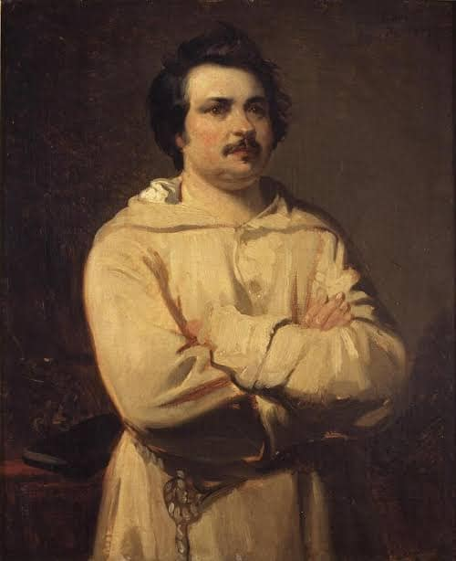

<!-- gid:20230615T121400 -->
[TOC]

[[TIP("이 노트에 대하여")]]
김정한과 junghanacs, junghan0611로 흩어진 계정과 소개 문구, 외부 프로필을 한곳에 모아 둔다. 공개 자아의 흔적을 추적하며 어떤 정체성과 링크 체계가 형성되었는지 살피는 자료다.
[[/TIP]]

## #요약

-   [2025-06-18 Wed 14:32] 그를 찾아 떠나자에 정보가 충분하다.
-   [힣: 그를 찾아 떠나자](https://wikidocs.net/381582)

## #흔적 #모음

### [깃허브](https://wikidocs.net/380497)

#### @junghan0611 - 개인 개발

-   [botlog/ junghan0611: GitHub Profile &amp; Resume — 영문 공개키 '2026-03-18 2026-03-20](https://wikidocs.net/382575)
-   [notes/ junghan0611popweb 이맥스 애플리케이션 프레임워크 브라우저 '2024-02-14 2025-03-29](https://wikidocs.net/381192)
-   [notes/ junghanacs junghan0611 온라인 자아 '2024-04-18 2025-02-15](https://wikidocs.net/381214)
-   [notes/ junghan0611 sicp-info - texi-info 파일 변환 '2024-11-13 2025-04-22](https://wikidocs.net/381380)
-   [notes/ junghan0611/pandoc-templates '2025-03-09 2025-03-09](https://wikidocs.net/381576)
-   [notes/ junghan0611 dotemacs 둠이맥스 스페이스맥스 동시지원 닷파일 '2025-04-16 2025-04-16](https://wikidocs.net/381687)
-   [notes/ junghan0611 immersivetranslate-terms 번역 사용자 사전 '2025-04-21 2025-04-21](https://wikidocs.net/381689)
-   [notes/ protesilaos junghan0611 emacs-lisp-elements 이맥스 리스프 가이드 번역 '2025-04-22 2025-04-22](https://wikidocs.net/381690)
-   [notes/ junghan0611 denote-explore 디노트 확장 플러그인 일괄변경 통계 검색 시각화 도구 '2025-06-16 2025-06-16](https://wikidocs.net/381745)
-   [notes/ junghan0611 astronvim-config '2025-07-20 2025-07-20](https://wikidocs.net/381780)
-   [notes/ 힣: memex-kb 힣의 범용 지식베이스 변환 시스템 '2025-10-30 2026-02-12](https://wikidocs.net/381806)
-   [notes/ junghan0611 claude-code-openai-wrapper 클로드코드 Wrapper 테스트 지피텔 '2026-01-01 2026-02-14](https://wikidocs.net/381846)
-   [notes/ 힣: junghan0611 i-am-emacs 이맥스 코어 리서치 '2026-02-09 2026-02-09](https://wikidocs.net/381850)

#### @junghanacs - 디지털가든 공식

[junghanacs: junhanx 정하넥스 융하네스 정한엑스](https://wikidocs.net/381214) 정한 관련 모음 allmylinks 와 linktree 가 있다. 각 서비스 별 계정은 Community Blog 를 참고하라!

### 소개 한글 영어 태그 리스트

#어쏠로지 #인생도구 #텍스트에디터 #이맥스 #생산성 #라이프해킹 #디지털미니멀리즘 #개인지식관리 #제텔카스텐 #창조 #영감 #authology #onebillionhappy #scarysmart @junghanacs@fosstodon.org

#authology #toolforlife #texteditor #emacs #orgmode #slowproductivity #lifehackingsystem #llmclient #digitalminimalism #pkm #braindump #digitalgarden #zettelkasten #sprituality #inspiration #onebillionhappy #hyperfocus #quantifiedself

텍스트 마스터, 한글 용사, 이맥스 긳, 라이프 해킹 시스템, 제텔카스텐, 디지털 미니멀리스트

Writer/Developer/Educator, i3wm/Swaywm, Emacs/Spacemacs, Org-mode/Agenda, Org-roam/Zettels, Korean/Hangul, Clojure/Racket, Alice/Q8, Meditation/Mindfulness ...

### 그룹 리스트

Homepage
: <https://www.junghanacs.com>

Zotero Group
: <https://www.zotero.org/groups/5570207/junghanacs/library>

Hypothes.is Group
: <https://hypothes.is/groups/VgqoXXE1/junghanacs>

Naver 지식리스트
: <https://vvd.bz/eGeQ>

### 홈페이지

(junghanacs 2024) <https://junghanacs.com/>

-   "junghanacs.com homepage" 김정한

### 디지털가든

### 미스터 사탄

[2023-06-15 Thu 11:46] 미스터 사탄 같은 녀석이야

### 발자크 센세

[2025-04-03 Thu 09:12] [오노레드발자크 1799 파리 옥탑방 소설 인간희극 불꽃 수도복](https://wikidocs.net/382295)

(슈테판 츠바이크 1998) 발자크

오! 파리 달방에서 커피를 벗삼아 미친듯 창작의 세계로.

여기에 수도복은 최고의 선택이였네.

### 워드프레스: JH' Blog Lifelog;

<https://junghan0611.wordpress.com/>

### Gravatar

<https://gravatar.com/junghan0611>

<https://gravatar.com/profile/about> Former Entrepreneur; CS Researcher; Memory &amp; Storage; Catholic; Lifelog;

### "네이버 지식리스트 Junghanacs" 김정한

(김정한 n.d.)

-   <http://terms.naver.com//tlist/list.naver?listId=1220850&ownList=Y>
-   <https://vvd.bz/eGeQ>
    -   Junghanacs

### "조테로 그룹 라이브러리 junghanacs" 김정한

(NO_ITEM_DATA:zotero-group-junghanacs) <https://www.zotero.org/groups/5570207/junghanacs/library>

### 서강올빼미 : 철학 커뮤니티

서강올빼미
: <https://forum.owlofsogang.com/u/gtgkjh/summary>

Meditations on Technology, Learning, Life, and Text-editor

하지만 말할 필요도 없이 레오나르도는 계획을 실행에 옮기지 못했습니다. 구상을 떠올리는 것만으로도 충분했습니다. - 레오나르도 다빈치 , 월터 아이작슨

그의 하루는 단순하다. 대부분 시간을 컴퓨터 앞에서 키보드만 두드린다. 마우스는 거의 건들지도 않는다. 사용하는 프로그램은 Emacs 뿐이다. 아. 가끔 Firefox 도 사용한다. 카카오톡을 하지 않으니 항상 휴대폰은 조용하다. 그 외에 다른 소셜 서비스도 하지 않는다. 딥 워크를 사랑하는 디지털 미니멀리스트이다.

물론 그가 원래 그런 사람은 아니었다. 빈수레가 요란한 삶을 살았다. 반복되는 좌절은 그를 무기력한 패배자로 낙인 찍었다. 그가 고통으로부터 배운 것은 단 하나 글쓰기였다. 말로 표현하기 힘든 가장 힘든 감정도 글로 쓰면 견딜 수 있는 무언가가 된다. 쓰는 행위 안에 치유의 힘이 있었다.

이제 그는 안다. 삶이 그에게 주는 질문 말이다. 이제 주의-집중의 문제는 모두의 문제가 될 것이기 때문이다. 그는 삶으로 겪은 바를 하나 하나 정리해야 한다. 그의 글쓰기 목적에는 치유만 있는 것이 아니다. 결국 지식을 확장하는 방법까지 나아가야 한다. 단순히 기억 도구에서 시작하여 창조의 도구로 완성 되어야 한다. 평생 함께 할 동반자여야 한다. 창조하는 이에게는 은퇴는 필요 없다.

분명 그는 지나치게 집착하고 있다. 때론 위태로워 보이기도 한다. 그는 분명 온전치 못하다. 그럼에도 오늘을 두려워 하지 않는다. 왜 일까? 이유는 단순하다. 그의 길에 자기가 없기 때문이다. 비슷한 고통을 겪는 또는 겪게 될 이들에 대한 연민 뿐이다. 특히 아이들... 그렇게 그는 다시 새벽에 일어난다.

그의 오늘은 고요함에서 온다. 그 안에서 지혜를 얻는다.

### 하이포테시스 hypothes.is

[2024-06-20 Thu 10:44]

완벽한 툴. PDF 파일도 지원 된다. 이맥스와 완벽히 커버!

Hypothes.is
: <https://hypothes.is/users/gtgkjh>

### 사서지원 : 전거파일 아이디

#### [사서지원서비스: 김정한](https://librarian.nl.go.kr/LI/contents/L20101000000.do?id=KAC201853989)

-   ISNI 0000 0004 6777 0341
-   KAC201853989
-   [김정한 | lod.nl.go.kr - lod.nl.go.kr](https://lod.nl.go.kr/page/KAC201853989)

#### [VIAF Results - viaf.org](https://viaf.org/viaf/search?query=local.names%20all%20KAC201853989)

김, 정한 ISNI 김정한 1985- 대한민국 국립중앙도서관 VIAF ID: 101153409787341582950 (개인) 링크: <http://viaf.org/viaf/101153409787341582950>

### 연구자 등록번호

[2025-07-04 Fri 16:14] 10644019

### ORCID

[2025-01-15 Wed 10:43]

Thank you for adding this email address to your ORCID record. To verify your email address use the following link and log into your ORCID Record. If you can't click on the link, copy and paste it into your browser:

Your sixteen digit ORCID identifier is 0000-0001-9623-3690, and your full ORCID iD and the link to your public record is <http://orcid.org/0000-0001-9623-3690> (primary email: junghan@skku.edu).

### Junghan Kim 패트리온 patreon

[2023-07-10 Mon 18:21]

-   <https://patreon.com/junghanacs>
-   (“Https://Www.Patreon.Com/User?U=96637267” n.d.)
-   <https://www.patreon.com/user?u=96637267>
-   [멤버십 유료 구독 서비스 - 패트리온](https://wikidocs.net/381083)

### Ko-fi

[2023-08-07 Mon 11:16] <https://ko-fi.com/junghanacs>

### 유튜브

<https://www.youtube.com/@junghanacs>

### allmylinks

좋은 서비스이다. 아래의 내용을 하나로 묶어서 관리하는게 좋겠다. 광고가 붙어도 그만이다. 명함처럼 줄 수 있으니까. 어짜피 홈페이지에 컨텍트를 넣긴 할 것이다.

<https://allmylinks.com/junghanacs>

### KILL linktree

[전뇌해커 | Linktree](https://linktr.ee/ychoi23) 샘플이다.

<https://linktr.ee/junghanacs> 위의 Allmylinks 가 더 쉬운 것 같다.

[2023-06-28 Wed 11:37]

### Email

암호화가 필요한가? 방법은? 아니면 도메인을 사용?! mail @ junghanacs.com 이런 것도 가능하긴하다.

junghanacs@gmail.com

### #마스토돈 -&gt; [SNS: 마스토돈 이맥스](https://wikidocs.net/381210)

### [소셜네트워크::bsky : bluesky 블루스카이](https://wikidocs.net/381210.md#h-6d8db464-3ef8-41ab-a0c2-2706ec59542d/)

[2024-11-22 Fri 13:59]

### [서브스택](https://wikidocs.net/380494)

### Junghan Kim | LinkedIn 링크드인 -- [링크드인](https://wikidocs.net/381486)

(Junghan Kim n.d.)

-   Junghan Kim

Emacs Geek with AI; Former Entrepreneur and CS Researcher;

#### 경력사항 - 네모유엑스

창업

##### 회사 소개문

오블리비언, 아이언맨, 마이너리티 리포트 등과 같은 SF영화에서 볼 수 있었던 대형스크린의 화려한 세계가 생각보다 빠르게 우리 눈앞에 다가오고 있습니다. 백화점이나 지하철 역사 등에서 우리는 다양한 컨텐츠를 통해 Interactive Large Display 세상에 조금씩 익숙해지고 있습니다.

성균관대학교 CS 박사과정 3명이 2012년 시작한 NEMO-UX는 SF 영화에서 보아온 Interactive Large Display Computing 을 위한 새로운 운영체제 "FINE SW플랫폼"을 만들고 있으며, 이를 바탕으로 B2B 솔루션 제공하고 있습니다.

SW플랫폼이란 안드로이드나 iOS와 같은 것이라고 생각하면 됩니다. 피쳐폰에서 스마트폰으로의 변화를 이루어낼 수 있었던 가장 큰 원동력은 안드로이도와 iOS와 같은 SW플랫폼의 등장이었다고 해도 과언이 아닙니다. 이젠 대형스크린의 특성을 반영한 새로운 SW플랫폼이 필요합니다. NEMO-UX에서는 새로운 SW 플랫폼을 기반으로 제2의 스마트 시대를 열고자 합니다.

NEMO-UX는 3년여간의 개발 과정을 거처 Interactive Large Surface를 위한 SW플랫폼인 FINE 플랫폼을 선보였으며, 2014년 11월 독일에서 열린 ACM ITS 국제학술대회에서 처음 공식적으로 공개한 뒤, 국책 과제 및 SKT 에서 펀딩을 받아 본격적으로 창업을 하였습니다.

NEMO-UX에게 2016년은 특별한 해가 될 것입니다. 지난 10월 SKT 와의 협력 사례를 공개한 이후 올해 [1월 HCIK 2016 전시], [2월 MWC 2016 전시], [4월 20대 총선 MBC 개표 생방송] 과 더불어 B2B 솔루션으로 백화점 터치 테이블을 상품화를 하였습니다. 앞으로도 다양한 한 터치 디바이스로 B2B 시장을 열어 나갈 것입니다.

더 자세한 내용을 알고자 하시는 분은 아래 Link를 참고하시기 바랍니다.

[Link: [TV 광고] SKT 생활플랫폼 II (30-35초)](<https://youtu.be/_XZCK461_DE>) [Link: MBC 20대 총선 개표 ](<https://youtu.be/9ouGE_Ici0s>)생방송 [Link: L사 백화점 터치 테이블 영상](<https://youtu.be/HWnIVN04tk8>) [Link: SKT 협력 사례 데모 영상 (STESHELL)](<https://youtu.be/Y9ycnERkTG4>)

### 인스타그램 - instagram

[2025-02-06 Thu 15:51]

#### \_junghankim

Former Entrepreneur; CS Researcher; Catholic;

#### junghanacs

[2025-02-06 Thu 15:52]

### Imgur (Upload) : 온라인 이미지 업로드

<https://imgur.com/user/junghanacs> [2023-06-08 Thu 17:34]

-   [워크플로우: 리눅스 스크린샷 도구::Imgur (Upload) : 온라인 업로드](https://wikidocs.net/381064.md#h-4ef523f5-7593-4e46-bff6-3236e5e2b273/)

### 오픈소스번역공동체

[2024-10-29 Tue 10:57]

[오픈소스번역공동체: translatewiki](https://wikidocs.net/381366)

### DONT 울프럼 Wolfram Alpha

### 독서 커뮤니티

-   [독서 사락 굿리즈 스토리그래프 리딩리스트 커뮤니티](https://wikidocs.net/382301)

### 구직 CV RESUME

[2025-04-03 Thu 09:14]

최신 모음

-   [CV RESUME 자소서 - 채용 구직 - 원티드](https://wikidocs.net/381645)

### 연구실적?!

글짓기 연습한 것들인가! 아무튼 말이네.

[연구실적](https://wikidocs.net/381593)

## 관련메타

-   [자기실현 개성화 자기목적성](https://wikidocs.net/380776)
-   [연결 고리 링크 방향](https://wikidocs.net/380533)

## BIBLIOGRAPHY

- 김정한. n.d. “네이버 지식리스트 Junghanacs.” Accessed June 17, 2024. [http://terms.naver.com//tlist/list.naver?listId=1220850&#38;ownList=Y](http://terms.naver.com//tlist/list.naver?listId=1220850&ownList=Y).
- 슈테판 츠바이크. 1998. <i>츠바이크의 발자크 평전</i>. Translated by 안인희. 푸른숲. [https://www.yes24.com/Product/Goods/141](https://www.yes24.com/Product/Goods/141).
- “Https://Www.Patreon.Com/User?U=96637267.” n.d. Accessed December 24, 2024. [https://www.patreon.com/user?u=96637267](https://www.patreon.com/user?u=96637267).
- junghanacs. 2024. “Authology@Junghanacs.” 2024. [https://www.junghanacs.com/](https://www.junghanacs.com/).
- Junghan Kim. n.d. “Junghan Kim.” Accessed January 16, 2025. [https://www.linkedin.com/in/junghan-kim-1489a4306/](https://www.linkedin.com/in/junghan-kim-1489a4306/).
- NO_ITEM_DATA:zotero-group-junghanacs
