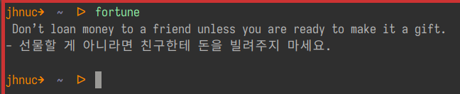

<!-- gid:20230621T121500 -->
[[TIP("이 노트에 대하여")]]
리눅스 fortune에서 출발해 구루들의 짧은 문장을 번역하고 개인 컬렉션으로 재구성하는 방식을 정리한다. 단순한 명언 수집을 넘어서, 문장을 일상 도구로 다시 불러오는 활용 감각이 중심에 있다.
[[/TIP]]

<!-- provenance:source:start -->
[[TIP("원본·최신본")]]
이 페이지는 한국어 검색과 읽기를 위한 WikiDocs 미러입니다. [원본·최신본은 가든](https://notes.junghanacs.com/notes/20230621T121500/)에 있습니다. 최신 수정 내용·백링크·태그·히스토리·댓글·출처 정보는 원본 가든에서 확인하세요.

- 작성: `2023-06-21T12:15:00+09:00`
- 최근 수정: `2025-04-07T00:00:00+09:00`
[[/TIP]]
<!-- provenance:source:end -->

[TOC]

세상에 좋은 말씀은 많다. 읽고 아아!! 하고 끝이다. 리눅스에서 애용하던 Fortune 을 보다 적극적으로 활용하고 있다. Emacs 홈을 열면 말씀하신다! 근데 무슨 말씀인가?

## BIBLIOGRAPHY

- Kelly, Kevin. n.d. “68 Bits of Unsolicited Advice.” Accessed June 23, 2023. [https://kk.org/thetechnium/68-bits-of-unsolicited-advice/](https://kk.org/thetechnium/68-bits-of-unsolicited-advice/).

## Related-Notes

-   [케빈켈리: 기술의충격 테크늄 포춘쿠키 구루 와이어드](https://wikidocs.net/381886)
-   [모음](https://wikidocs.net/380673)

## <span class="org-hashtag">#키워드</span>: 포춘쿠키

-   [bib/ 케빈켈리 kevinkelly 기술의충격 통제불능 미래 테크늄 포춘쿠키 구루 와이어드 사상 '2024-03-01 2025-06-27](https://wikidocs.net/381886)
-   [notes/ 힣: 포춘쿠키 삶과죽음 삶으로서일 도서목록 '2024-12-07](https://wikidocs.net/381411)
-   [notes/ 힣: 랜덤포춘쿠키 웨이 도 인생도구 깨어남 암울한시대 운명애 '2024-12-14 2025-06-03](https://wikidocs.net/381436)

## <span class="org-todo todo TODO">TODO</span> 기본 포춘 활용

[2023-10-04 Wed 20:32]

기본 포춘도 마찬가지다. 번역해서 활용하면 재미있다. 선배들의 모음이라 전통이 있다.

```text
apt-get install fortunes
```

많이 있더라.

## 요즘 원픽! 포춘

[2023-06-23 Fri 17:21]

2023-07-11 Become

Work to become, not to acquire.

-   얻기 위해 일하지 말고, 뭔가 가 되기 위해 일하세요.

2023-07-10 잠재의식

When you are stuck, sleep on it. Let your subconscious work for you.

-   뭔가에 막히면, 그거 위에 잠을 자세요. 당신의 잠재의식이 당신을 위해 일하게

하세요.

2023-07-08 고요함의 지혜

Calm is contagious.

-   평온은 전염성이 있습니다.

2023-06-21 유일한 사람이 되세요!

Don't be the best. Be the only.

-   최고가 되지 말고, 유일한 사람이 되세요.

## Fourtune 커맨드



리눅스 터미널에서 실행하면 뭐 간단하게 나온다. 문제는 추가 관리 안했다면 영어로 뭔가가 나올 것 이다. 기본 포춘 쿠키들이다.

/usr/share/games/fortunes 에 박혀있다. termux 라면 root-path 를 박아 놨다.

## 나를 위한 포춘 쿠키 관리

[2023-06-23 Fri 17:21] 포춘 쿠기 형식은 간단하다. 생성은 스크립트로 만들면 된다. 나는 Org 모드로 관리하고 있다. 몇 가지 나름 목록을 가지고 있는데 사실 거의 건들지 않는다.

### Fortune and <span class="underline">txt2tags</span> format

[2023-06-25 Sun 10:54]

`txt2tags` 심플 마크업 언어[^fn:1] 포멧이다. 아래 컬렉션과 같이 넣어준다. 그리고 dat 파일로 바꿔주기 위해서 다음과 같이 변경한다. 그리고 나서 적절한 경로에 넣어주면 된다.

```shell
fd -e t2t -x strfile
```

## Junghanacs Collections

[2023-06-23 Fri 17:36]

## Kevin Kelley 68

존경하는 케빈 선생님의 말씀 (Kelly n.d.)

## Kevin Kelley 99

## excellent_advice_for_living

[2025-01-28 Tue 16:32]

On my sixty-eighth birthday, I decided to give my young adult children some advice. I am not a frequent advice giver but soon I was able to write down 68 bits. To my surprise, I had more to say than I thought. So for the next several years I wrote down a batch of advice on my birthday, and shared it with my family and friends. They wanted more. I kept going until I had about 450 bits of advice I wished I'd known when I was younger.

환갑을 맞아 저는 청년이 된 자녀들에게 몇 가지 조언을 해주기로 결심했습니다. 저는 조언을 자주 하는 편은 아니지만 곧 68개의 조언을 적을 수 있었습니다. 놀랍게도 제 생각보다 할 말이 많았어요. 그래서 그 후 몇 년 동안 제 생일에 조언을 한꺼번에 적어 가족 및 친구들과 공유했습니다. 그들은 더 많은 것을 원했습니다. 어렸을 때 알았더라면 좋았을 조언이 450개 정도 될 때까지 계속 썼어요.

I am primarily channeling the wisdom of the ages. I am offering advice I have heard from others, or timeless knowledge repeated from the past, or a modern aphorism that matched my own experience. I doubt any of it is truly original, although I have tried to put everything in my own words. I think of these bits as seeds because each one of them could easily be expanded into a long essay. Indeed, I have spent most of my time writing by compressing these substantial lessons into as compact and tweetable forms as possible. You are encouraged to expand these seeds as you read to fill your own situation.

저는 주로 시대의 지혜를 전달하고 있습니다. 다른 사람에게서 들은 조언이나 과거로부터 반복되는 시대를 초월한 지식, 또는 내 경험과 일치하는 현대 격언을 제공하고 있습니다. 모든 것을 제 말로 표현하려고 노력했지만 그 어떤 것도 진정으로 독창적인 것은 아닐 것입니다. 저는 이 글들을 씨앗이라고 생각하는데, 각각의 글들이 긴 에세이로 쉽게 확장될 수 있기 때문입니다. 실제로 저는 이 방대한 교훈을 최대한 간결하고 트윗할 수 있는 형태로 압축하여 글을 쓰는 데 대부분의 시간을 보냈습니다. 여러분도 이 씨앗을 읽으면서 자신의 상황에 맞게 확장해 보시기 바랍니다.

If you find these proverbs align with your experience, share them with someone younger than yourself. 이러한 속담이 자신의 경험과 일치하는 부분이 있다면 자신보다 나이가 어린 사람과 공유하세요.

---Kevin Kelly, Pacifica, California, 2023 ---2023년, 캘리포니아주 퍼시피카, 케빈 켈리

## 에릭호퍼

[2025-06-18 Wed 13:54]

[에릭호퍼 1902 길 위의 철학자 - 아포리즘 노동 인간 조건 영혼 연금술](https://wikidocs.net/382307)

## Paul-Graham 34

[^fn:1]: <https://txt2tags.org/markup.html>
