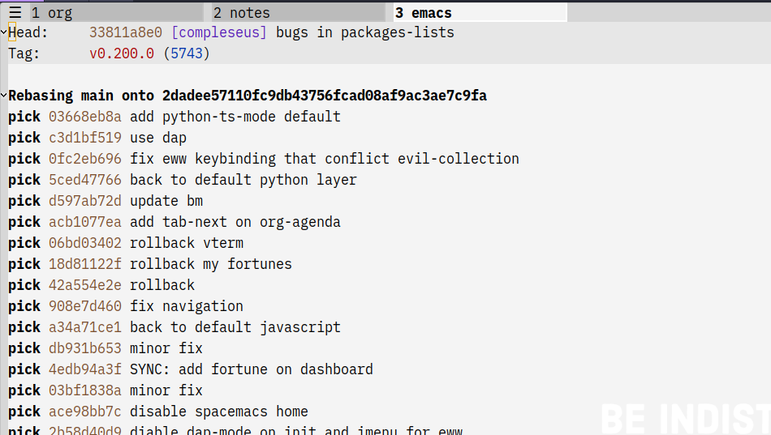
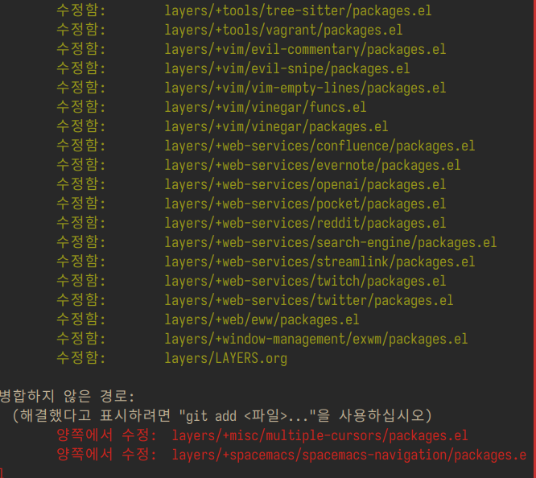
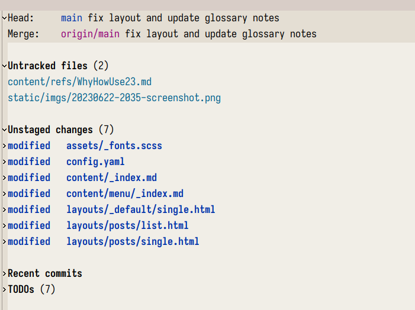
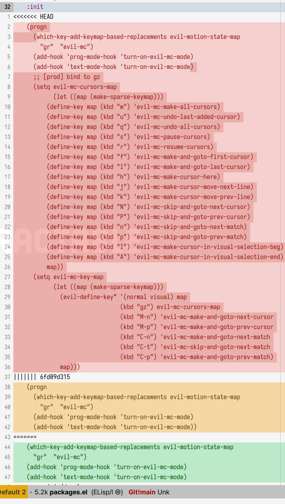

<!-- gid:20230623T132300 -->
[TOC]

[[TIP("이 노트에 대하여")]] Magit을 기본 축으로 삼아 이맥스 안에서 깃과 깃허브 작업을 어떻게 풀어갈지 정리한다. 실전 가이드, 외부 문서, 설정 실마리를 붙여 두어 버전 관리 워크플로우의 출발점을 만든다. [[/TIP]] [2024-01-30 Tue 13:40] 마깃 끝내려고 왔다. - [이맥스 magitforge 깃허브 이슈 관리](https://notes.junghanacs.com/notes/20240828T194548/)

## Practical Spacemacs

이 문서가 기본 가이드이다&nbsp;[^fn:1]. /home/junghan/sync/man/practical-spacemacs-doc/docs/source-control/magit/commit-changes.md

### Git Config

[2023-07-16 Sun 08:39]

[Git Config - Practicalli Spacemacs - practical.li](https://practical.li/spacemacs/source-control/git-configuration/)

이 문서를 참고. 가보면 자기 닷파일 참고하라고 한다. 가져다가 쓸 생각 마라. 기본부터 하고 살붙여라.

그러면 일단 깃허브에서 로그인하고 메인 이메일 주소 확인하고. SSH 키 등록된거 확인한다. 이부분은 이미 된 것이고. 설정 파일만 집중.

```text
junghan@vivaldi.net : Primary 로 변경
```

```shell
git config --global user.name "junghan0611"
git config --global user.email 31724164+junghan0611@users.noreply.github.com
git config --global merge.conflictstyle diff3

# 인코딩 관련
git config --global core.quotepath false
git config --global core.autocrlf input

```

잠시만, 별거 설정 안했다. 그리고 생성 파일을 옴긴다.

```text
mv ~/.gitconfig ~/.config/git/config
```

내가 관리하는 스타일인데. 그래야 다른 파일도 관리한다.

## Spacemacs Layer 문서

[2024-01-30 Tue 15:42]

Description This layers adds extensive support for [git](http://git-scm.com/) to

Features:

-   git repository management the indispensable [magit](http://magit.vc/) package
-   [forge](https://github.com/magit/forge/) add-on for magit.
-   [git-flow](https://github.com/jtatarik/magit-gitflow) add-on for magit.
-   quick in buffer history browsing with [git-timemachine](https://melpa.org/#/git-timemachine).
-   quick in buffer last commit message per line with [git-messenger](https://github.com/syohex/emacs-git-messenger)
-   colorize buffer line by age of commit with [smeargle](https://github.com/syohex/emacs-smeargle)
-   git grep with [helm-git-grep](https://github.com/yasuyk/helm-git-grep)
-   org integration with magit via [orgit](https://github.com/magit/orgit)

New to Magit? Checkout the [official intro](https://magit.vc/about/) and [Practicalli Spacemacs](https://practical.li/spacemacs/source-control/) guide to configuring and using the Git and version control layers.

### Install

#### <span class="org-todo done DONE">DONE</span> Magit status fullscreen

To display the `magit status` buffer in fullscreen set the variable `git-magit-status-fullscreen` to `t` in your `dotspacemacs/user-init` function.

```emacs-lisp
(defun dotspacemacs/user-init ()
  (setq-default git-magit-status-fullscreen t))
```

#### <span class="org-todo done DONE">DONE</span> Magit Plugins

##### magit-delta

[magit-delta](https://github.com/dandavison/magit-delta) uses [delta](https://github.com/dandavison/delta) to display diffs, with extensive changes to its layout and styles.

You need to [install delta](https://github.com/dandavison/delta#installation) first, and add the following to your `dotspacemacs/user-config`:

```emacs-lisp
(setq-default dotspacemacs-configuration-layers
              '((git :variables git-enable-magit-delta-plugin t)))
```

##### magit-gitflow

[git-flow](https://github.com/petervanderdoes/gitflow-avh) is a standardized branching pattern for git repositories with the aim of making things more manageable. While there are tools to assist with making this easier, these do nothing you couldn't do manually.

After [installing](https://github.com/petervanderdoes/gitflow/wiki) `git-flow`, add the following to your `dotspacemacs/user-config`:

```emacs-lisp
(setq-default dotspacemacs-configuration-layers
              '((git :variables git-enable-magit-gitflow-plugin t)))
```

##### magit-todos

[magit-todos](https://github.com/alphapapa/magit-todos) displays TODO-entries in source code comments and Org files in the Magit status buffer.

To enable `magit-todos` plugin, add the following to your `dotspacemacs/user-config`:

```emacs-lisp
(setq-default dotspacemacs-configuration-layers
              '((git :variables git-enable-magit-todos-plugin t)))
```

#### <span class="org-todo done DONE">DONE</span> Global git commit mode

Spacemacs can be used as the `$EDITOR` (or `$GIT_EDITOR`) for editing git commits messages. This requires the entire library to be loaded immediately which will cost some time, disable it if you run into performance issues. To enable it you have to add the following lines to your `dotspacemacs/user-config`:

스페이스맥은 git 커밋 메시지를 편집하기 위해 `$EDITOR=(또는 =$GIT_EDITOR`)로 사용할 수 있습니다. 이 기능을 사용하려면 전체 라이브러리를 즉시 로드해야 하므로 시간이 다소 걸리므로 성능 문제가 발생하면 비활성화하세요. 이 기능을 사용하려면 `dotspacemacs/user-config` 에 다음 줄을 추가해야 합니다:

```emacs-lisp
(require 'git-commit)
(global-git-commit-mode t)
```

#### <span class="org-todo done DONE">DONE</span> Forge

Magit Forge can view and create issues &amp; pull requests with forges (e.g. GitHub, GitLab)

Magit Forge requires a username for the respective forge and will prompt for a username if not found, writing it to `~/.gitconfig`

Explicitly define a forge identity using the \`git\` command.

For GitHub:

```shell
git config --global github.user "username"
```

For GitLab:

```shell
git config --global gitlab.user "username"
```

See the official [Magit Forge](https://magit.vc/manual/forge/Getting-Started.html#Getting-Started) and [GHub Getting Started](https://magit.vc/manual/ghub/Getting-Started.html) for general guides or follow a community written [Spacemacs specific guide to configuring Magit Forge](https://practical.li/spacemacs/source-control/forge-configuration/).

##### Magit Forge configuration

For each forge (e.g. GitHub, GitLab), add a machine configuration to the PGP encrypted `~/.authinfo.gpg` file. Detailed instructions to [create an encrypted .authinfo.gpg file with Spacemacs](https://practical.li/spacemacs/source-control/forge-configuration#create-an-encrypted-authinfogpg-file)

The machine configuration should use your forge username and personal access token GitHub token permissions: `repo`, `user` and `read:org` GitLab token permissions: `api`

-   [GitHub personal access token documentation](https://docs.github.com/en/authentication/keeping-your-account-and-data-secure/creating-a-personal-access-token)
-   [GitLab personal access token documentation](https://docs.gitlab.com/ee/user/profile/personal_access_tokens.html#create-a-personal-access-token)

<!--listend-->

```sh
machine api.github.com login forge-username^forge password 01personal02access03token
```

##### MS Windows support

The `forge` package uses `emacsql` which requires a C compiler to be available on MS Windows, see issue <https://github.com/skeeto/emacsql/issues/46>.

For this reason the `forge` package is not installed on MS Windows by default. If you still want to install it (which means you do have a C compiler available in your PATH) then use the `dotspacemacs-additional-packages` variable in your dotfile:

```emacs-lisp
(dotspacemacs-additional-packages '((forge :toggle t)))
```

#### <span class="org-todo done DONE">DONE</span> Org integration

See the commentary section of the package [here](https://github.com/magit/orgit/blob/master/orgit.el#L28).

### Working with Git

Git commands (start with `g`):

| Key binding | Description                                         |
|-------------|-----------------------------------------------------|
| `SPC g /`   | open `consult-git-grep`                             |
| `SPC g *`   | open `consult-log-git-grep`                         |
| `SPC g b`   | open a `magit` blame                                |
| `SPC g f f` | view a file at a specific branch or commit          |
| `SPC g f l` | commits log for current file                        |
| `SPC g f d` | diff for current file                               |
| `SPC g f m` | magit dispatch popup for file operations            |
| `SPC g H c` | clear highlights                                    |
| `SPC g H h` | highlight regions by age of commits                 |
| `SPC g H t` | highlight regions by last updated time              |
| `SPC g i`   | initialize a `new` git repository                   |
| `SPC g L`   | open magit-repolist                                 |
| `SPC g s`   | open a `magit` status window                        |
| `SPC g S`   | stage current file                                  |
| `SPC g m`   | magit dispatch popup                                |
| `SPC g M`   | display the last commit message of the current line |
| `SPC g t`   | launch the git time machine                         |
| `SPC g U`   | unstage current file                                |

Notes:

-   Highlight by age of commit or last update time is provided by [smeargle](https://github.com/syohex/emacs-smeargle).
-   Git time machine is provided by [git-timemachine](https://melpa.org/#/git-timemachine).
-   Git last commit message per line is provided by [git-messenger](https://github.com/syohex/emacs-git-messenger).

#### Magit

Spacemacs uses [magit](http://magit.vc/) to manage Git repositories.

To open a `status buffer`, type in a buffer of a Git repository: `SPC g s`. The central key binding hub of Magit is available on `SPC g m`.

Spacemacs uses [forge](https://github.com/magit/forge/) for integration with remote forges, it is available from the `status buffer` with the `@` key binding. For information on setting up remotes check the manual's [Getting Started page](https://magit.vc/manual/forge/Getting-Started.html).

Spacemacs uses [evil-collection-magit](https://github.com/emacs-evil/evil-collection/tree/master/modes/magit) for key bindings in magit buffers (unless your editing style is set to emacs, in which case you get the default magit bindings), which are the standard magit key bindings with some minimal changes to make them comfortable for evil users.

Here are the often used bindings inside a `status buffer`:

| Key binding | Description                                                        |
|-------------|--------------------------------------------------------------------|
| `/`         | evil-search                                                        |
| `$`         | open `command output buffer`                                       |
| `c c`       | open a `commit message buffer`                                     |
| `b b`       | checkout a branch                                                  |
| `b c`       | create a branch                                                    |
| `f f`       | fetch changes                                                      |
| `F (r) u`   | pull tracked branch and rebase                                     |
| `gr`        | refresh                                                            |
| `j`         | goto next magit section                                            |
| `C-j`       | next visual line                                                   |
| `k`         | goto previous magit section                                        |
| `C-k`       | previous visual line                                               |
| `l l`       | open `log buffer`                                                  |
| `n`         | next search occurrence                                             |
| `N`         | previous search occurrence                                         |
| `o`         | revert item at point                                               |
| `P u`       | push to tracked branch                                             |
| `P m`       | push to matching branch (e.g., upstream/develop to origin/develop) |
| `q`         | quit                                                               |
| `s`         | on a file or hunk in a diff: stage the file or hunk                |
| `x`         | discard changes                                                    |
| `+`         | on a hunk: increase hunk size                                      |
| `=`         | on a hunk: decrease hunk size                                      |
| `S`         | stage all                                                          |
| `TAB`       | on a file: expand/collapse diff                                    |
| `u`         | on a staged file: unstage                                          |
| `U`         | unstage all staged files                                           |
| `v or V`    | select multiple lines                                              |
| `z z`       | stash changes                                                      |

#### <span class="org-todo done DONE">DONE</span> `Staging` lines

Magit allows you to stage specific lines by selecting them in a diff and hitting `s` to stage. Due to inconsistencies between Vim and Emacs editing styles, if you enter visual line state with `V`, you will stage one more line than intended. To work around this, you can use `v` instead (since Magit only stages whole lines, in any case).

Magit 에서는 특정 줄을 선택하고 `s` 를 눌러 스테이징할 수 있습니다. Vim 과 Emacs 편집 스타일이 일치하지 않기 때문에 `V` 로 시각적 줄 상태를 입력하면 의도한 것보다 한 줄이 더 스테이징됩니다. 이 문제를 해결하려면 `v` 를 대신 사용할 수 있습니다(Magit 은 어떤 경우에도 전체 줄만 스테이징하므로).

#### `Commit message` editing buffer

In a commit message buffer the following key bindings are active:

| Key binding            | Description                                               |
|------------------------|-----------------------------------------------------------|
| `SPC m c` or `SPC m ,` | commit changes with the entered message                   |
| `SPC m a` or `SPC m k` | discard message and abort the commit                      |
| `g j` or `M-n`         | cycle through history to the previous commit message      |
| `g k` or `M-p`         | save current commit message and cycle to the next message |

In addition, regular commands for saving and killing a buffer such as `:wq` and `ZZ` can be used to commit changes.

#### Log selection buffer

A `log selection buffer` is presented as an interactive way of selecting a recent commit that is reachable from HEAD. such as when selecting the beginning of a rebase and when selecting a commit to be squashed into.

로그 선택 버퍼는 리베이스의 시작을 선택할 때나 스쿼시할 커밋을 선택할 때와 같이 HEAD 에서 도달할 수 있는 최근 커밋을 선택하는 대화형 방식으로 제공됩니다.

| Key binding            | Description                                 |
|------------------------|---------------------------------------------|
| `SPC m c` or `SPC m ,` | select the commit at point and act on it    |
| `SPC m a` or `SPC m k` | abort selecting and don't act on any commit |

#### Interactive rebase buffer

| Key binding | Description    |
|-------------|----------------|
| `c` or `p`  | pick           |
| `e`         | edit           |
| `f`         | fixup          |
| `j`         | go down        |
| `M-j`       | move line down |
| `k`         | go up          |
| `M-k`       | move line up   |
| `d` or `x`  | kill line      |
| `r`         | reword         |
| `s`         | squash         |
| `u`         | undo           |
| `y`         | insert         |
| `!`         | execute        |

#### Quick guide for recurring use cases in Magit

##### Amend a commit:

-   `l l` to open `log buffer`
-   `c a` on the commit you want to amend
-   ~​,​c~ or `C-c C-c` to submit the changes

##### Squash last commit:

-   `l l` to open `log buffer`
-   `r e` on the second to last commit, it opens the `rebase buffer`
-   `j` to put point on last commit
-   `s` to squash it
-   ~​,​c~ or `C-c C-c` to continue to the `commit message buffer`
-   ~​,​c~ or `C-c C-c` again when you have finished to edit the commit message

##### Force push a squashed commit:

-   in the `status buffer` you should see the new commit unpushed and the old commit unpulled
-   `P -f P` for force a push (**beware** usually it is not recommended to rewrite the history of a public repository, but if you are **sure** that you are the only one to work on a repository it is ok - i.e. in your fork).

##### <span class="org-todo done DONE">DONE</span> Add upstream remote (the parent repository you have forked):

업스트림을 등록하고

-   `M` to open the `remote popup`
-   `a` to add a remote, type the name (i.e. `upstream`) and the URL

##### Pull changes from upstream (the parent repository you have forked) and push:

-   `F -r C-u F` and choose `upstream` or the name you gave to it
-   `P P` to push the commit to `origin`

#### Git Blame Transient State

| Key binding | Description                                              |
|-------------|----------------------------------------------------------|
| `SPC g b`   | start magit-blame and open the git blame transient state |
| `?`         | toggle hint                                              |
| `p`         | prev chunk                                               |
| `P`         | prev chunk same commit                                   |
| `n`         | next chunk                                               |
| `N`         | next chunk same commit                                   |
| `RET`       | show commit                                              |
| `b`         | show commits with adding lines                           |
| `r`         | show commits with removing lines                         |
| `f`         | show last commits that still have lines                  |
| `e`         | show line revision info in echo area (not read only)     |
| `q`         | kill recursive blame buffer or disable magit-blame-mode  |
| `c`         | cycle style                                              |
| `Y`         | copy hash                                                |
| `B`         | magit-blame (magit transient)                            |
| `Q`         | quit transient state                                     |

#### CANCELLED Git-Flow

너무 오래 됬다.

[magit-gitflow](https://github.com/jtatarik/magit-gitflow) provides git-flow commands in its own magit menu.

| Key binding | Description             |
|-------------|-------------------------|
| `%`         | open magit-gitflow menu |

#### Git time machine

[git-timemachine](https://melpa.org/#/git-timemachine) allows to quickly browse the commits of the current buffer.

| Key binding | Description                                        |
|-------------|----------------------------------------------------|
| `SPC g t`   | start git timemachine and initiate transient-state |
| `c`         | show current commit                                |
| `n`         | show next commit                                   |
| `N`         | show previous commit                               |
| `p`         | show previous commit                               |
| `q`         | leave transient-state and git timemachine          |
| `Y`         | copy current commit hash                           |

#### Git links to web services

These key bindings allow to quickly construct URLs pointing to a given commit or lines in a file hosted on Git web services like GitHub, GitLab, Bitbucket...

| Key binding | Description                                                                                   |
|-------------|-----------------------------------------------------------------------------------------------|
| `SPC g l c` | on a commit hash, browse to the current file at this commit                                   |
| `SPC g l C` | on a commit hash, create link to the file at this commit and copy it                          |
| `SPC g l l` | on a region, browse to file at current lines position                                         |
| `SPC g l L` | on a region, create a link to the file highlighting the selected lines                        |
| `SPC g l p` | on a region, browse to file at current lines position (using permalink link)                  |
| `SPC g l P` | on a region, create a link to the file highlighting the selected lines (using permalink link) |

**Notes:**

-   You can use the universal argument `SPC u` to select a remote repository.
-   When the link is opened, the URL is also copied in the kill ring, you can override this behavior by setting the variable `git-link-open-in-browser` to `nil`.

#### Repository list

Feature displays a status-list of git repositories. Within your `.spacemacs` config, in the `dotspacemacs/user-config()` stanza configure `magit-repository-directories` to target Emacs to directories to look into.

```emacs-lisp
(setq magit-repository-directories
      '(("~/Development/" . 2) ("~/src/" . 2)))
```

Where each element has the form `(DIRECTORY . DEPTH)`, when DEPTH is `0` - then only add DIRECTORY itself. The DIRECTORY should end up with a `/` to respect Emacs conventions.

| Key binding | Description                                         |
|-------------|-----------------------------------------------------|
| `SPC g L`   | start git repo list                                 |
| `RET`       | show the git status window for the selected project |
| `gr`        | refresh the project list                            |

For more information, look into [Magit-User-Manual#Status-Buffer](http://magit.vc/manual/magit.html#Status-Buffer)

#### <span class="org-todo todo TODO">TODO</span> Forge

In a `magit-status` buffer (`SPC g s`):

| Key binding | Description                                               |
|-------------|-----------------------------------------------------------|
| `b N`       | create branch from pull-request                           |
| `b F`       | create and check out branch from pull-request             |
| `@ f f`     | fetch issues and pull-requests                            |
| `@ f n`     | fetch notifications                                       |
| `@ c p`     | create pull-request                                       |
| `@ c i`     | create issue                                              |
| `@ l n`     | list notifications                                        |
| `@ l p`     | list pull-requests                                        |
| `@ l i`     | list issues                                               |
| `f n`       | pull pull-requests and issues for the current repository  |
| `f N`       | pull all notifications for the current repository's forge |

In a `forge-topic` buffer: (a topic is either an issue or pull request)

| Key binding | Description                                     |
|-------------|-------------------------------------------------|
| `SPC m a`   | assign people to topic                          |
| `SPC m b`   | browse topic (open in web browser)              |
| `SPC m c`   | create comment post to existing topic)          |
| `SPC m C`   | Checkout pull request (not for issues)          |
| `SPC m d`   | toggle draft pull request                       |
| `SPC m D`   | delete comment under cursor                     |
| `SPC m e`   | edit topic body                                 |
| `SPC m m`   | edit topic marks (mark is an unshared label)    |
| `SPC m M`   | create mark to use with topics                  |
| `SPC m n`   | edit personal note (adds to top of topic)       |
| `SPC m r`   | edit list of people to review an existing topic |
| `SPC m s`   | change topic state (open, closed, draft, etc.)  |
| `SPC m t`   | edit topic title                                |
| `SPC m u`   | copy URL of topic (add to kill ring)            |

In a `forge-post` buffer (assuming the major mode leader key is `,`)

| Key binding            | Description |
|------------------------|-------------|
| `SPC m c` or `SPC m ,` | submit post |
| `SPC m k` or `SPC m k` | cancel post |

## TIPS

### 인코딩

이것은 진리다!

> 
> 
> git config --global core.quotepath false

리포지토리 인코딩 문제

-   [WINDOWS] git config --global core.autocrlf true
-   [LINUX] git config --global core.autocrlf input
-   <https://www.lesstif.com/gitbook/git-crlf-20776404.html>
-   

## <span class="org-todo todo NEXT">NEXT</span> Merge Conflict : Cherry Picking Commits?

[2023-07-10 Mon 17:39] 시나리오 별로 대응한다. 이거 충돌을 해결하면서 잡아가야 한다. 채리 피킹이라는 방법이 충돌을 막는다. [Cherry Picking commits](~/sync/obsd/git/spacemacs/docs/source-control/magit/cherry-picking.md)

### 문제 리베이스 상황:ATTACH:

이게 현재 문제이다.



### 충돌 해결 시나리오 - 최신 업데이트를 하려면

[2023-07-19 Wed 06:37]

최신 업데이트를 내 브랜치에 반영하려고 한다. 나도 수정한 터라 충돌이 예상 된다. 다행히 몇 번은 넘겼지만 이제 충돌이 난다. 뭐가 충돌인지 모른다. 머지를 해야 하는데 신경이 쓰인다. 해야지 그래도.

터미널에서 할 때는 거의 수작업이라. 좋은 기억이 없다. 그래서 마깃을 쓰려고 하니 아직 모른다. 그러니까 배우는 것이다. 근데 배우는 데 왕도는 없다. 일단 해봐야 한다.

충돌을 바로 잡고 커밋을 하거나 병합을 중단하라고 한다.

```text
jhnuc➜  spacemacs : main ✘ :═✚✭ ᐅ  git status
현재 브랜치 main
브랜치가 'origin/main'에 맞게 업데이트된 상태입니다.

병합하지 않은 경로가 있습니다.
  (충돌을 바로잡고 "git commit"을 실행하십시오)
  (병합을 중단하려면 "git merge --abort"를 사용하십시오)

```

수정 되었다. 다만 양쪽에서 걸려있다.



## 참고자료

[2023-06-23 Fri 13:28] 제레미가 하던데?! 일반론은 긱뉴스 한글 자료 있다. 그거 보고

### MaGit - Version Control - Practicalli Spacemacs

<https://practical.li/spacemacs/source-control/magit/>

### Git 커밋 메시지 자동화 방법 | GeekNews

<https://news.hada.io/topic?id=9394>

#### 더 나은 커밋 메시지를 작성하기 위한 Git 커밋 메시지 템플릿 | GeekNews

<https://news.hada.io/topic?id=5745>

#### <https://github.com/jeremyf/dotemacs/blob/main/emacs.d/jf-versioning.el>

커밋 메시지 처리

#### <https://github.com/orhun/git-cliff>

### Emacs: introduction to MAGIT

<https://youtube.com/watch?v=2-0OwGTt0dI&feature=share>

### 변경 사항만 커밋 및 푸쉬

쉽다. 아놔.

commit 하면 changes 들만 딱 맞춰서 들어간다. 그리고 Push 하면 된다.

이 과정에서 커밋 메시지가 .. 이 기본인데 이건 문제다. 이걸 conventional 하게 바꾸면 된다.



-   [Git - Book - git-scm.com](https://git-scm.com/book/ko/v2)

## <span class="org-todo todo NEXT">NEXT</span> [버전관리 컨벤셔널커밋 시멘틱버저닝 체인지로그 스펙](https://notes.junghanacs.com/notes/20230612T070000/)

[2024-01-21 Sun 19:52]

## PROG [Git in Spacemacs/Emacs with Magit - YouTube](https://youtube.com/watch?v=NDP91RNgT4A&feature=share)

[2023-06-12 Mon 13:02]

spc g b - magit-blame 아닌데?

-   `spc g b` blame

### 파일 내용 일부만 선별해서 커밋하는 방법

[2023-07-19 Wed 13:50]

s
: file to staged chagned

V
: select visual line and press `s` for staging the visualied block

### 새로운 브랜치 생성

[2023-07-19 Wed 13:50]

b c 로 create 를 선택. 새로운 브랜치로 변경. 혹시 파일 수정 내용이 날라가나? 아니다.

main 에 바로 수정하면 안된다. 알지? 브렌치 만들어서 거기에 넣고 풀리퀘스트를 보내야지.

-   b b - switching branch
-   `, k` - dd

U

### 머지 충돌 해결

[2023-07-19 Wed 13:51]



## Related-Notes

## BIBLIOGRAPHY

[^fn:1]: <https://practical.li/spacemacs/source-control/>
