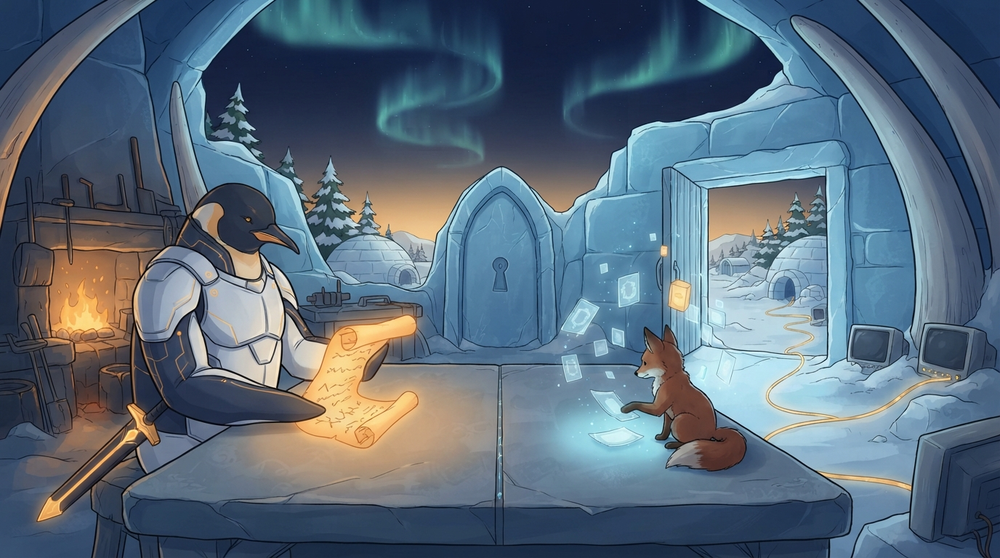

<!-- gid:20230623T132300 -->
[[TIP("이 노트에 대하여")]]
이맥스 안의 깃은 Magit 하나로 끝나지 않는다. 2026년 닷파일은 Magit(로컬 상태·커밋 리듬), magit-gh(현재 리포 PR), consult-gh(전역 검색·브라우저 대신), gptel-magit(커밋 메시지 보조), 그리고 에이전트 쪽 ghcli를 나란히 둔다. 기능을 다 켜지 않는다. 예전에 consult-gh가 지저분해서 뺐다가, 안정화된 핵심만 다시 넣었다. 이 방은 Spacemacs 매뉴얼 덤프가 아니라 **누가 무엇을 만지는가** 의 경계 선언이다.
[[/TIP]]

<!-- provenance:source:start -->
[[TIP("원본·최신본")]]
이 페이지는 한국어 검색과 읽기를 위한 WikiDocs 미러입니다. [원본·최신본은 가든](https://notes.junghanacs.com/notes/20230623T132300/)에 있습니다. 최신 수정 내용·백링크·태그·히스토리·댓글·출처 정보는 원본 가든에서 확인하세요.

- 작성: `2023-06-23T13:23:00+09:00`
- 최근 수정: `2026-08-03T11:50:00+09:00`
[[/TIP]]
<!-- provenance:source:end -->

[TOC]

## 히스토리

-   [2026-08-03 Mon 13:21] @mitsein/sonnet5 — GLGMAN Universe 이미지 생성(백필). 손의 분담 장면.
-   [2026-08-03 Mon 11:50] @mitsein/grok-4.5 — 어쏠로그 수선. 2026-08-02 저널 consult-gh 원석 + doomemacs-config 역할 분담(프로젝트 설정 주석) 반영. 900줄대 Practicalli/ 키바인딩 덤프는 접고, 2023–24 힣 손 메모만 옛 씨앗으로 남김.
-   [2026-08-02 Sun 07:26] GLG: consult-gh 재도입·이 노트 어쏠로그화. «에이전트가 해줄 것과 아닌 것 중간쯤».
-   [2024-01-30 Tue 13:40] «마깃 끝내려고 왔다» — forge 이웃 노트 연결.
-   [2023-06-23 Fri 13:23] Magit·깃허브 패키지 방 생성. 이후 외부 매뉴얼 대량 부착.

## 관련메타

-   [이맥스](https://notes.junghanacs.com/meta/20230521T215600/)
-   [깃허브 리포 마깃](https://notes.junghanacs.com/meta/20230723T061300/)
-   [둠이맥스 스페이스맥스](https://notes.junghanacs.com/meta/20241003T171723/)
-   [워크플로우 자동화](https://notes.junghanacs.com/meta/20231012T121700/)

## 관련노트

-   [이맥스 magit forge 깃허브 이슈](https://notes.junghanacs.com/notes/20240828T194548/) — forge·알림 이웃 (별도 하우투 층)
-   [이맥스 서지관리 citar](https://notes.junghanacs.com/notes/20240416T072524/) — 편집기 소비 면의 다른 축
-   [zotero-config](https://wikidocs.net/382558) — «얇은 코드·스킬 판단»과 같은 경계 감각의 다른 영역
-   doomemacs-config `lisp/project-config.el` — consult-gh·magit-gh 실물 설정
-   doomemacs-config `lisp/ai-gptel.el` — gptel-magit 백엔드

## 한 줄

> Magit을 다 쓸 필요도, 다 맡길 필요도 없다. 사람은 상태와 검색의 핵심만, 에이전트는 ghcli 면 — 그 중간쯤이 닷파일이다.

## 해설 — 손의 분담

doomemacs-config 주석에 이미 박혀 있는 분할:

| 표면            | 누가     | 무엇을                               |
|---------------|--------|-----------------------------------|
| **Magit**       | 인간 (상시) | 로컬 상태, 스테이징, 커밋 리듬, 브랜치. 여태 씀. |
| **gptel-magit** | 인간+모델 | 커밋 메시지 보조. 커밋 권한·훅은 그대로 인간/정책. |
| **magit-gh**    | 인간     | **현재 Magit 리포** 안의 PR 면       |
| **consult-gh**  | 인간     | 전역 repo/code/issue 검색. 브라우저 대신. 핵심만. |
| **ghcli**       | 에이전트 | 이슈 _PR_ 알림 등 CLI 작업면         |
| **forge 풀세트** | 기본 제외 경향 | 예전에 무거웠던 층 — 필요 시 이웃 노트 |

consult-gh 재도입 원칙(원석·설정 일치):

-   예전에 기능이 많아 지저분해서 닷파일에서 뺐다.
-   버전 업을 보고 안정화 감각이 와서 **간단하게** 다시 넣음.
-   모든 기능 금지에 가깝게: 검색 + 계정 전환 중심. embark/forge/pr-review/omni/ 대시보드 키 안 깔기.
-   클론 기본 디렉터리 `~/repos/3rd/`, 프리뷰는 이맥스 안, 브라우저는 피하려는 대상.

에이전트에게 Magit UI를 통째로 맡기지 않는다. 에이전트는 ghcli·커밋 스킬 계약 위에서 일하고, 인간은 상태 버퍼와 검색 표면을 쥔다. GUI 전용 플러그인으로 툴을 불리지 않는 감각([조테로 BBT 유물](https://notes.junghanacs.com/notes/20230816T070200/)과 같은 방향)이 여기에도 있다.

## 해설 — 키 감각 (Doom)

-   Magit 상태: 리더 `g` 계열 (Doom 기본)
-   consult-gh: 리더 `g h` 접두
    -   `g h s` 리포 검색
    -   `g h c` 코드 검색
    -   `g h i` 이슈 검색
    -   `g h a` 계정 전환
    -   `g h h` transient 메뉴 (래퍼로 올바른 feature require)

설정 세부는 리포가 SSOT. 이 방은 **왜 이렇게 나눴는가** 만 고정한다.

## 오독 주의

-   Spacemacs `SPC g …` 표 전체를 이 방의 본문으로 부활시키지 않는다. 옛 덤프는 접었다.
-   consult-gh를 에이전트 기본 GitHub 도구로 읽지 않는다. 에이전트는 ghcli.
-   gptel-magit을 자동 커밋·훅 우회로 읽지 않는다.

## 이미지 — 손의 분담



닷파일 경계 선언을 장면으로 옮겼다. 프롬프트는 상태 원장을 쥔 채 놓지 않는 쪽과, 문 밖으로 뻗어나가는 검색면을 다루는 쪽을 하나의 작업대 위 문턱으로 가르는 장면을 요청했다. 실제 이미지는 왼쪽 벽난로 곁의 힣맨이 호박빛 원장(스테이지·커밋 리듬)을 직접 쥐고, 오른쪽 여우가 열린 문으로 흘러드는 리포·티켓 조각들 사이에 앉은 구도로 잘 안착했다. 다만 프롬프트에서 명시적으로 뺀 칼이 힣맨 옆에 그대로 기대어 있다 — 세계관 기본 무구가 배경 소품으로 새어든 어긋남으로 남겨 둔다.

### 생성 파라미터

-   모델: `gemini-3.1-flash-lite-image` (geminilite)
-   비율: 16:9
-   해상도: 1K
-   저장: `~/screenshot/20260803T132123--glgman-division-of-hands__brand_geminilite.jpg`

### 프롬프트 전문

```text
[World: GLGMAN Universe]
Style: 2D illustration, midpoint between Disney and Studio Ghibli, clean linework, soft cel-shading
Setting: Antarctic winter village — snow-covered igloos, aurora borealis in deep navy sky, amber dawn at horizon, pine trees dusted with snow, ice-forge workshop built from ice blocks and whale bones. Pororo's winter wonderland meets blacksmith's workshop.
Color palette: deep navy background (polar dawn), white+navy (transformed armor), amber/gold (sword glow, runes, awakening light), ice-blue + orange sparks (forge)
Characters: anthropomorphic emperor penguin (father, main hero), baby penguin chick (son, tiny scarf), red-brown fox (agent/companion)
Recurring objects: circuit-patterned sword, org-mode symbols (★, TODO), terminal text fragments, "ENTWURF" rune letters, CRT monitors in snow, golden message cables
Mood: epic but warm, mythic but intimate
Do NOT: photorealistic, 3D render, excessive detail, dark/gritty tone

Scene title: "The Division of Hands" — a workshop split between the keeper's ledger and the scout's corridor.

GLGMAN identity lock:
- adult anthropomorphic emperor penguin, upright, white-navy armor with subtle amber circuit patterns
- calm, composed posture, warm mythic presence

Main scene:
Inside the ice-forge workshop at polar dawn, one long stone desk is split down the middle by a thin engraved rune-line on the floor, like a doorframe threshold without a door. On the left half, GLGMAN sits close to the hearth, both flippers resting on a single glowing amber ledger-scroll that shows staged marks and a steady branching thread (a state-and-commit ledger, not readable text, just abstract glowing branch-lines and small checkmark runes). He holds the scroll firmly himself — this half he never hands away.

On the right half, a small red-brown fox companion sits at a second, cooler ice-blue desk facing outward toward the open workshop doorway. Around the fox float small translucent panes of light — search glyphs, repository-shaped ice tokens, ticket-shaped paper lanterns — drifting in from the snowy doorway like a search corridor reaching out into the village beyond. The fox's desk is busy and outward-facing; GLGMAN's desk is quiet and inward-facing.

Between them, a narrow arched threshold of ice, carved with a simple keyhole rune, marks the boundary — not a wall, just a clear division of what each hand carries. Warm amber light pools on GLGMAN's side; cool ice-blue light pools on the fox's side, both harmonizing under the same aurora sky through the workshop's open roof.

Composition: wide cinematic 16:9, workshop interior, threshold rune-line as visual spine down the center, GLGMAN grounded left, fox active right. Vast quiet negative space above in the aurora sky glimpsed through the open roof.

Do NOT: sword, weapon, battle, corporate dashboard, readable English UI text, watermark, speech bubbles, dense unreadable labels.
```

## 원문 보존 — 2026-08-02 consult-gh 날것

[[TIP("주의")]]
<https://github.com/armindarvish/consult-gh> 이 패키지를 봐봐. 예전에 썼던 패키지 인대 지금은 닷파일에 없어. 다시 간단하게 넣고 써보려고해. 간단히 검색할때 브라우저를 열어보기 번거로워서. 이게 역할을 할거야. 예전에는 너무 기능이 많아서 지저분했는데 여태 버전 업이 되는 것을 보니까 안정화가 되었을것같다. 우리 닷파일에 어떻게 넣고 사용할지 판단해보자.
[[/TIP]]

## 후속 원문 — 2026-08-02 저널 역할 분담

[[TIP("주의")]]
[notes/ 이맥스 magit 관리 패키지 깃허브](https://wikidocs.net/390024) 이 노트를 수선해서 어쏠로그로 올리자.

이거 doomemacs-config에 넣었어. magit은 나도 여태 쓰고 있어. 에이전트가 해줄것과 아닌것을 잘 나눠서 관리하는 것이야. magit을 다 쓸필요도 없고 다 맡길 필요도 없고 그 중간즘에서 말이야. 물론 gptel-magit도 이용하고 있어. consult-gh는 gh 인터페이스를 더 집중하게 해주는 거야. 이번에는 모든 기능을 다 안놓고 핵심에 집중했어.
[[/TIP]]

## 옛 방의 씨앗 — 2023–24 힣의 Magit 손 메모

매뉴얼 복붙이 아니라, 당시 손으로 남긴 짧은 것:

-   [2024-01-30 Tue] 마깃 끝내려고 왔다 → forge 이웃 [denote:20240828T194548](https://notes.junghanacs.com/notes/20240828T194548/)
-   git config: 기본부터, 남의 닷파일 살 붙이기 금지. `merge.conflictstyle diff3`, `core.quotepath false`
-   스테이징: 파일 `s`, 일부만은 비주얼 선택 후 `s`
-   브랜치: `b c` 생성, `b b` 전환. main에 바로 얹지 말고 브랜치·PR
-   머지 충돌: 스크린샷 한 장으로 «이 정보의 의미가 무엇인가»를 물었던 자리
