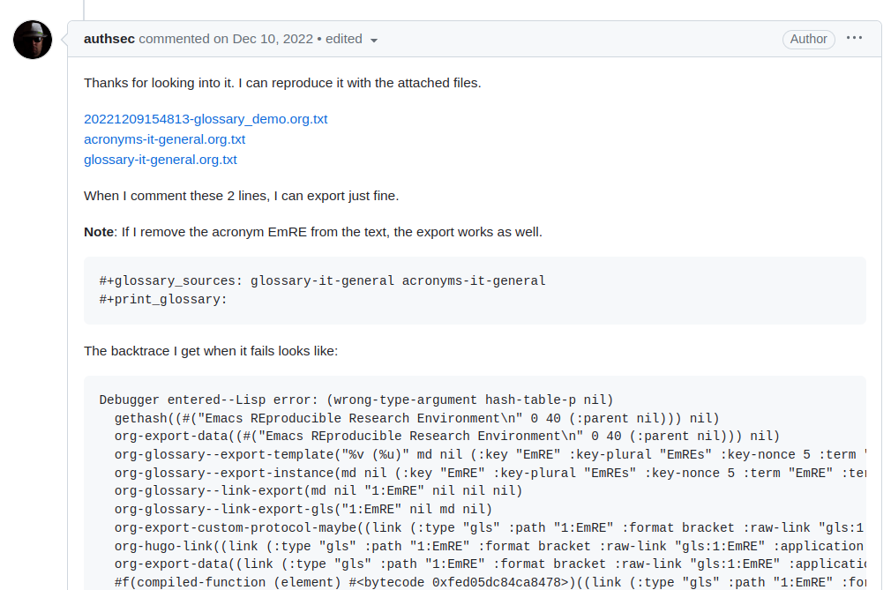

<!-- gid:20230623T150500 -->
[TOC]

[[TIP("이 노트에 대하여")]]
이맥스리스프 문제를 막연히 넘기지 않기 위해 백트레이스와 최소 재현 예제의 중요성을 정리한다. 오류 보고를 받거나 이슈를 올릴 때 무엇을 준비해야 하는지 감각을 잡게 해 주는 실전 메모다.
[[/TIP]]

어떻게 Emacs 에서 elisp 코드 작성하나

## Backtrace for Bug/Error Report

[2023-06-23 Fri]

막연하게 넘길 때가 아니다 깃허브 이슈에서 백트레이스 달라고 하는 걸 보니까&nbsp;[^fn:1].

아래와 같다. 그러면 어떠한 방법을 통해서 해당 문제의 백트레이스 정보를 가져와야 한다.

어떻게 하면 되는가? 나도 저 에러 메시지 받았는데 접근 방법을 몰랐다.

An MWE and/or backtrace would be a huge help here. With just that message I can't do much.

MWE (Minimal Working Example)



## `debug-on-error`

[2023-07-07 Fri 19:55] corfu 가 갑자기 말을 안들어 왜그러는거니?! 그러다가 좋은 방법을 알게 되었다. 그래! 이렇게 하면 되는 구나!

spacemacs/toggle-debug-on-error-on / off

```text
Debugger entered--Lisp error: (wrong-number-of-arguments #<subr cape--cached-table> 4)
  cape--cached-table(262 263 cape-yasnippet-candidates string-prefix-p)
  cape-yasnippet()
  corfu--capf-wrapper(cape-yasnippet)
  run-hook-wrapped(corfu--capf-wrapper cape-yasnippet)
```

## ElispCheatSheet

[2023-06-23 Fri 15:20] <http://alhassy.com/ElispCheatSheet/> 여기 참고하라. 포크했다. <https://github.com/junghan0611/ElispCheatSheet>

## Related-Notes

## BIBLIOGRAPHY

[^fn:1]: <https://github.com/tecosaur/org-glossary/issues/9>
