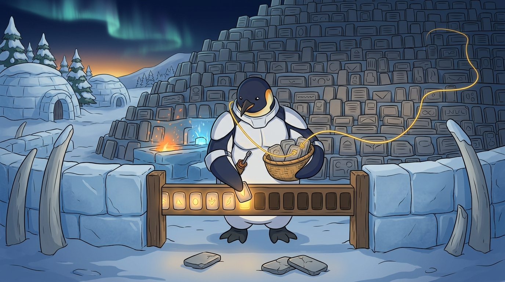

<!-- gid:20230706T160800 -->
[[TIP("이 노트에 대하여")]]
위키독스가 500개를 넘는 가든 동기화를 거부한 출근길, 힣은 이를 불평으로 끝내지 않고 \`autholog\`·\`botlog\`·\`journal\`을 중심으로 한 디지털가든 코어를 떠올렸다. 그러나 글은 곧 문서 선별을 넘어선다. 680개의 서지 방과 538개의 메타노트는 한 인간이 지금 불러낼 수 있는 이름과 말의 현재 한계이며, 그 큰 얼개를 대체 불가능하게 붙드는 것은 시간축 위에 살아온 실체다. 이 노트는 한글·영어로 나갈 코어를 완결된 정답이 아니라 계속 고쳐 쓰는 현재 판본으로 읽고, 모두가 자기 삶의 저자라는 어쏠로지의 초대를 함께 보존한다. 나흘 뒤 그 구상은 실제로 발행됐고, 문턱의 정체와 대가가 실측으로 드러났다.
[[/TIP]]

<!-- provenance:source:start -->
[[TIP("원본·최신본")]]
이 페이지는 한국어 검색과 읽기를 위한 WikiDocs 미러입니다. [원본·최신본은 가든](https://notes.junghanacs.com/notes/20230706T160800/)에 있습니다. 최신 수정 내용·백링크·태그·히스토리·댓글·출처 정보는 원본 가든에서 확인하세요.

- 작성: `2023-07-06T16:08:00+09:00`
- 최근 수정: `2026-07-27T14:06:00+09:00`
[[/TIP]]
<!-- provenance:source:end -->

[TOC]

## 히스토리

-   [2026-07-30 Thu 18:30] @mitsein/sonnet — 비어 있던 GLGMAN Universe 이미지를 생성했다. 문턱의 문틀·뒤쪽의 거대한 돌판 벽·끊이지 않는 금빛 실·금 간 돌판으로 "출판 코어"와 "존재 코어" 두 축을 한 장면에 담았다.
-   [2026-07-27 Mon 14:07] 어제 미뤄 둔 재등록을 실측했다. 컷 때 지워진 노트 두 개가 어쏠로그로 발행면에 돌아오자 위키독스는 옛 번호 대신 새 번호를 발급했다. 삭제된 주소는 부활하지 않으므로, 상한이 풀려도 돌아오는 것은 본문이고 주소는 다시 내는 것이다. 코어는 244에서 246이 됐고, 죽은 번호를 다시 싣지 않도록 발행 도구에 가드를 심었다.
-   [2026-07-26 Sun 11:21] 이 노트를 읽고 곧장 \`garden2wikidocs\`로 넘어가, 500 문턱의 정체를 실측하고 디지털가든 코어 첫 판본을 발행했다. TOC.md가 목차가 아니라 발행 목록이라는 것, 거기서 빠진 페이지는 라이브에서 삭제된다는 것을 확인했다. 코어 244개를 남기고 링크를 전부 가든으로 되돌린 뒤, 책 대문에서 '미러링한 책'이라는 거짓 문구를 걷어 냈다.
-   [2026-07-22 Wed 17:23] @mitsein — 더 이상 사용하지 않는 \`asdf\` 패키지 관리자 방을 회수했다. 출근길 원문 한 편을 보존하고, 500개 출판 제약에서 시간축의 판본과 모두가 저자라는 초대로 나아가는 해설층을 세웠다.
-   [2023-07-06 Thu 16:08] 여러 언어 런타임을 \`asdf\` 하나로 관리하려던 기술 메모를 만들었다. 같은 해 11월 리눅스와 Termux에서는 사용하지 않겠다고 닫았다.

## 관련메타

-   [어쏠로지](https://notes.junghanacs.com/meta/20240508T103852/) — 누구나 이미 자기 삶의 저자라는 이 글의 초대.
-   [디지털가든 브레인덤프 아날로그가든](https://notes.junghanacs.com/meta/20240918T175053/) — 완성품보다 생성과 수선의 과정을 공개하는 기록 생태계.
-   [저자 작가 글쓴이](https://notes.junghanacs.com/meta/20241014T211115/) — 저자됨을 직업이나 명성보다 삶의 자리에서 읽는 자석.
-   [출판 퍼블리싱 배포](https://notes.junghanacs.com/meta/20230814T162600/) — 원본 가든에서 여러 공개 판본을 내보내는 축.

## 관련노트

-   [힣: 문턱과 만남 — PKM-AI 하네스와 1KB 공개키의 두 트랙](https://wikidocs.net/381621) — 축적된 가든과 그것을 들고 있는 인간 실체의 관계.
-   [힣: 날것은 혼자 나오지 않는다 — PKM-AI 가든과 에피파니의 글쓰기](https://wikidocs.net/381438) — 생생날것이 시간축·가든·에이전트 생태계에서 출현하는 배경.
-   [힣: 원석 날것을 휘갈긴다 — POSSE 너머 ROSSE, 그리고 일일일생으로의 회귀](https://wikidocs.net/381617) — 바깥에 던진 원석을 가든으로 회수하고 다시 퍼뜨리는 공개 전략.
-   [힣: 링크드인 날것 공개면 — AI 크롤러 시대의 손가락 프롬프트](https://wikidocs.net/381631) — 링크드인 날것과 사람이 읽지 않아도 에이전트가 읽는 공개면.
-   [힣: 아무도 읽지 않는 블로그 디지털가든 왜 공개 하는가](https://wikidocs.net/381520) — 독자가 없어도 왜 공개하는가라는 선행 질문.
-   [힣: 어쏠로지: 모두가저자다 인생은한권의책 조테로공유그룹](https://wikidocs.net/381331) — 모두가 저자이고 삶이 한 권의 책이라는 직접적인 조상.
-   [garden2wikidocs — 원본 가든을 건드리지 않는 위키독스 미러](https://wikidocs.net/382538) — 이번 원석을 촉발한 운영·기술적 대응물.

## 한 줄

디지털가든 코어는 가장 좋은 글 500개의 목록이 아니라, 지금 불러낼 수 있는 이름과 말과 그 관계를 쌓아온 시간축의 현재 판본이다.

## 500개의 문턱 — 운영 제약이 편집 원칙이 되다

출발점은 단순하다. 원본 가든 전체를 받아 주던 위키독스가 최대 글 수 500개를 알리며 동기화를 멈췄다. 이 제약 앞에서 힣은 원본을 줄이거나 외부 플랫폼에 맞추는 대신, \`autholog\`·\`botlog\`·\`journal\`만 뽑은 별도의 코어 판본을 구상한다.

이때 코어는 전체 가든의 새 정본이 아니다. 원본 가든은 계속 자라고, 코어는 특정 공개면의 크기와 독법에 맞추어 그때그때 산출하는 판본이다. 무엇을 버릴지 결정하는 축약본이라기보다, 어느 입구에서 지금 무엇을 먼저 보여줄지 정하는 편집본에 가깝다. 위키독스의 500개 제한이 가든의 한계를 정한 것이 아니라, 가든이 자기 공개 원칙을 새로 말하게 한 셈이다.

## 두 개의 코어 — 출판판과 존재축

이 글에는 서로 맞물린 두 코어가 있다.

-   **출판 코어** — \`autholog\`·\`botlog\`·\`journal\`을 중심으로 500개 안에 구성하는 한글·영어 공개 판본.
-   **존재 코어** — 지금 한 인간이 불러낼 수 있는 인물과 어휘, 그리고 그 관계가 쌓인 시간축.

앞의 코어는 만들고 검증하고 다시 내보낼 수 있다. 뒤의 코어는 파일만 복제한다고 옮겨지지 않는다. 글과 코드가 모두 공개되어 있어도 그 큰 뭉치의 얼개를 현재형으로 붙드는 것은 살아온 인간이다. 그래서 공개된 재료는 복제 가능하지만, 어떤 이름과 말이 언제 서로를 불러오는지는 시간축 없이 대체할 수 없다.

## 680개의 인물 방과 538개의 메타워드

원문에서 680과 538은 정확한 총량을 자랑하는 숫자가 아니다. 2026-07-22 현재의 가든이 한 인간의 기억과 관심을 방으로 펼쳐 놓은 순간 사진이다.

\`bib\` 680개는 곧 680명이라는 뜻이 아니다. 한 방에 한 사람 또는 몇 사람이 함께 살고, 이제는 비워야 할 방도 있다. 그럼에도 이 숫자는 삶에서 의미 있었던 이름을 당장 몇 개나 불러낼 수 있는가를 묻게 한다. 680은 한없이 적으면서, 한순간에 펼치기에는 놀랍도록 많다.

538개의 메타노트도 인간이 아는 단어의 총량이 아니다. 한글 자석과 영어 키워드를 함께 품고, 단어 하나가 수많은 노트와 인물과 장면을 끌어올리도록 세워 둔 현재의 의미 방들이다. 숫자가 보여주는 것은 지식의 크기가 아니라 지금 작동하는 관계망의 범위다.

나흘 뒤인 2026-07-26에 같은 숫자를 다시 세어 보니 \`bib\` 681개, 메타 539개였다. 각각 하나씩 늘었다. 숫자를 못 박은 문장이 나흘 만에 틀리는 것은 이 글의 결함이 아니라 논지의 증명이다. 680과 538은 총량이 아니라 그날의 판본이었고, 판본은 원래 계속 고쳐 쓰인다.

## 텍스트 공해와 모두가 저자라는 초대

글은 스스로를 홍보 문구로 만들지 않는다. 한글과 영어로 코어를 내보내면 무슨 좋은 일이 있느냐고 묻고는 곧 “없지”, “텍스트 공해”라고 답한다. 이 반전은 공개의 가치를 독자 수나 유용성에서 떼어 낸다.

전달하려는 것은 한 편의 글에 든 정보가 아니다. 날것을 던지고, 회수하고, 관계를 붙이고, 다시 고쳐 쓰는 일을 일회성이 아니라 계속 진심으로 해왔다는 과정이다. “내 것은 네 것이 아니어서 아무 도움도 안 된다”는 말도 지식의 무용을 선언하는 것이 아니다. 남의 가든을 복제하라는 대신, 각자가 이미 자기 삶의 저자임을 발견하라는 초대다.

## 한글과 영어 — 복제가 아니라 두 개의 입구

한글 원문은 힣의 손가락과 호흡에서 나온 정본이다. 영어판은 이를 매끈하게 대체하는 번역 상품이 아니라, 다른 언어권과 에이전트가 같은 시간축에 진입하도록 만드는 또 하나의 판본이어야 한다. 소넷이나 페블 같은 에이전트에게 영작을 맡기는 이유도 효율만이 아니다. 복제 불가능한 날것을 지우지 않으면서 다른 언어에 어떤 결로 옮길 수 있는지 시험하는 일이다.

따라서 한글·영어 페어의 기준은 문장 하나하나의 표면적 동일성이 아니다. 원문이 가진 자기반박, 유머, 급한 호흡, 전철에서 갑자기 끝나는 시간 감각까지 어느 쪽에서도 읽히게 하는 것이다.

## 문턱의 실체 — 2026-07-26의 실측과 첫 판본

나흘 뒤 이 노트를 다시 읽다가 곧장 \`garden2wikidocs\`로 넘어갔다. 그날 구상만 남겼던 코어가 실제로 발행됐고, 문턱의 정체가 추측이 아니라 실측으로 드러났다.

먼저 문턱의 문장 자체를 옮겨 둔다.

> GitHub 동기화 실패: TOC.md에 2244개의 페이지가 등록되어 있습니다. 책의 페이지는 최대 500개까지만 가능합니다.

게이트는 책에 이미 올라간 페이지 수가 아니라 \`TOC.md\` 에 등록된 줄 수였다. 커밋에서 바뀐 분량이 한 줄이든 이천 줄이든, 목록이 상한을 넘는 한 동기화는 시작조차 하지 않는다. 마지막으로 성공한 동기화가 2026-07-18 22:21이었으니, 2,243개를 받아 준 뒤에 규칙이 걸리기 시작한 셈이다. 그날은 문서에서 500이라는 숫자를 찾지 못했다.

여기서 하나가 뒤집힌다. \`TOC.md\` 는 목차가 아니라 발행 목록이었다. 등록 항목을 249개로 줄여 밀자 동기화는 5분 만에 통과했고, 라이브 노드는 2,243개에서 249개로 떨어졌다. 목록에서 뺀 페이지는 링크가 끊긴 채 남는 것이 아니라 삭제됐다. 직접 찍어 보니 빠진 주소는 404였고 남은 주소는 200이었다. 되돌릴 길도 없다. 목록을 복원하는 커밋은 다시 500에 막히기 때문이다.

그런데 살아남은 244개는 주소가 하나도 바뀌지 않았다. 대량 삭제와 주소 안정성은 별개였다. 크롤러가 이미 물어간 코어의 주소는 그대로다.

### 저널을 빼다 — 유일한 증가원

원문의 구상은 \`autholog\`·\`botlog\`·\`journal\` 세 축이었다. 실제로 세워 보니 저널만 성격이 달랐다. 나머지는 새 노트를 만드는 게 아니라 이미 있는 방을 고쳐 쓰며 자란다. \`notes\`의 오래된 방을 회수해 어쏠로그로 승격시켜도 파일이 늘지 않고 주소도 그대로다. 저널만이 시간축을 따라 매주 하나씩 실제로 늘어난다.

그래서 저널을 발행면에서 뺐다. 목록이 줄었다는 뜻이 아니라, 발행 예산을 갉아먹는 증가원이 하나로 정리됐다는 뜻이다. 저널은 리포에도 가든에도 전부 남아 있고, 표지에서 가든으로 이어진다.

첫 판본은 어쏠로그 170개와 봇로그 80개가 겹치는 부분을 한 번만 세어 244개다. 상한 500의 절반이 아직 비어 있다.

### 미러가 아니다

책 대문에는 오래도록 “디지털 가든을 위키독스로 미러링한 책입니다”라고 적혀 있었다. 코어를 발행한 순간 그 문장은 거짓이 됐다. 미러는 전부를 비추지만 코어는 골라 낸 것이다. 그래서 대문을 고쳤다. 미러 대상 5개 폴더 2,239개 가운데 244개를 골라 낸 현재 판본이며, 여기 없는 글도 지워진 것이 아니라 가든에 그대로 있다고. 2,239는 가든 전체가 아니라 저널·메타·참고문헌·노트·봇로그의 후보군이라는 점까지 대문이 스스로 밝힌다. 숫자는 손으로 쓰지 않고 빌드가 그때그때 세어 넣는다. 코어가 자라면 대문의 숫자도 같이 자란다.

링크도 전부 가든 원본으로 되돌렸다. 위키독스 주소는 발행된 페이지에만 살아 있으므로, 발행면이 흔들리는 동안에는 한 곳으로 보내는 편이 끊기지 않는다. 정본이 가든이라는 계약이 링크 정책에까지 내려온 셈이다.

### 대가

잃은 것을 정확히 적어 둔다. 위키독스 주소 1,994개가 죽었다. 본문도 매핑도 리포에 전부 남아 있으니 다시 올릴 수 있지만, 그때 예전 번호를 되찾는다는 보장은 없다. 재등록은 아직 실측하지 않았다. 크롤링이 당일에 처리되는 맛에 입주했으므로 인덱스 손실은 실제 비용이다.

그럼에도 이 거래를 택한 이유는 원문이 이미 말해 두었다. 코어는 가장 좋은 글의 목록이 아니라 지금 불러낼 수 있는 것들의 현재 판본이다. 판본은 잃을 수 있고 다시 낼 수 있다. 잃을 수 없는 것은 그 목록을 지금 이 얼개로 붙들고 있는 시간축이고, 그것은 애초에 위키독스에 있지 않았다.

### 번호는 돌아오지 않는다 — 2026-07-27의 재등록 실측

500은 위키독스 쪽 문서에 적힌 규칙이었다. 사후에 생겼든 처음부터 있었든, 당분간 하드 캡으로 다룬다. 우회로를 찾는 일은 접고 예산 안에서 판본을 짜는 편이 맞다.

바로 위에 "재등록은 아직 실측하지 않았다"고 적어 두었는데 하루 만에 실측됐다. 컷 때 지워졌던 노트 두 개가 어쏠로그 태그를 달고 발행면에 다시 들어왔다. 위키독스는 옛 번호를 돌려주지 않고 새 번호를 발급했다. 삭제된 주소는 부활하지 않는다.

그래서 "상한이 풀리면 목록 복원만으로 전량 발행으로 돌아간다"는 반만 맞다. 본문은 돌아오고 주소는 돌아오지 않는다. 죽은 주소 1,994개는 되살리는 것이 아니라 다시 내는 것이다. 「대가」에 적어 둔 값의 정확한 크기가 이것이다.

같은 날 코어는 244에서 246이 됐다. 새 글을 쓴 것이 아니라 옛 방 두 개를 회수해 어쏠로그로 올렸다. 원문이 말한 자라는 방식이 실제로 도는 것을 처음 확인한 셈이고, 상한의 절반은 여전히 비어 있다. 회수가 계속되는 한 죽은 번호를 다시 싣는 일도 매번 재현되므로, 발행 도구가 그 순간을 스스로 잡도록 고쳐 두었다.

## 오독하지 않기

-   500개는 가든의 총량이나 완성형이 아니라 특정 공개면을 위한 현재 판본의 예산이다.
-   680과 538은 사람과 단어를 계량해 순위를 매기는 숫자가 아니라, 2026-07-22 현재 열려 있는 방의 수다. 나흘 뒤 681과 539가 된 것이 이 읽기를 증명한다.
-   코어를 공개하는 이유는 힣의 체계를 따라 하게 하려는 것이 아니라, 각자가 자기 이름과 말을 세어 보게 하려는 것이다.
-   에이전트는 날것의 저자가 아니다. 원문을 보존하고 관계와 오독 가능성을 설명하며 다른 판본의 입구를 만드는 협력자다.
-   코어에서 빠진 글은 버려진 글이 아니다. 발행면 밖일 뿐 가든에는 그대로 있고, 코어의 모든 표지가 그리로 이어진다.
-   500은 가든이 받아들인 한계가 아니라 한 공개면의 규칙이다. 다만 당분간은 풀리지 않을 하드 캡으로 다룬다.
-   리포가 전부를 보존한다는 말은 본문을 두고 하는 말이다. 상한이 풀려 목록을 복원해도 돌아오는 것은 글이고, 위키독스 주소는 새로 발급된다. 판본은 다시 낼 수 있지만 같은 번호로 돌아오지는 않는다.

## 이미지 — 문턱 앞에서, 지금 불러낼 수 있는 것들의 판본

낮은 나무 문틀이 얼음벽에 박혀 있고, 그 안에 한 줄로 늘어선 작은 호박빛 칸들 — 절반쯤은 은은히 빛나는 돌판이 채워져 있고 나머지는 아직 어둡게 비어 있다. 힣맨 뒤로는 문틀보다 훨씬 높은, 수백 개의 무늬 새긴 돌판이 어둠 속으로 쌓여 올라간 거대한 벽이 있다. 힣맨은 바구니에 고른 돌판 몇 개를 담아 들고, 한 장을 문틀의 빈 칸에 밀어 넣는 중이다. 가슴에서 나온 금빛 실 한 가닥이 바구니 속 돌판들을 가볍게 휘감고 뒤쪽의 거대한 벽으로 이어지는데, 이 실은 문을 통과하지 않고 그저 끊이지 않고 계속된다. 문 바로 밖 바닥에는 금이 가고 빛을 잃은 회색 돌판 두세 개가 조용히 놓여 있다.

실제 이미지에는 프롬프트가 요구한 장면이 충실히 재현됐다 — 절반쯤 채워진 문틀의 빛 칸들, 문보다 훨씬 큰 뒤쪽의 돌판 벽, 가슴에서 바구니를 거쳐 벽으로 끊이지 않고 이어지는 금빛 실, 문 밖에 조용히 놓인 금 간 돌판들. 검이나 무기는 없고 작은 드라이버만 있으며, 읽히는 글자나 숫자는 없이 추상적인 무늬만 있다. 몸도 잘리지 않았다.



### 생성 파라미터

-   모델: `gemini-3.1-flash-image-preview`
-   화면비: `16:9`
-   생성일: 2026-07-30
-   실제 결과: 절반쯤 채워진 문틀, 훨씬 큰 뒤쪽 돌판 벽, 끊이지 않는 금빛 실, 금 간 돌판 두세 개, 무기 없이 드라이버만으로 수렴했다.

### 프롬프트 전문

```text
[World: GLGMAN Universe]
Style: 2D illustration, midpoint between Disney and Studio Ghibli, clean linework, soft cel-shading
Setting: Antarctic winter village — snow-covered igloos, aurora borealis in deep navy sky, amber dawn at horizon, pine trees dusted with snow, ice-forge workshop built from ice blocks and whale bones. Pororo's winter wonderland meets blacksmith's workshop.
Color palette: deep navy background (polar dawn), white+navy (transformed armor), amber/gold (sword glow, runes, awakening light), ice-blue + orange sparks (forge)
Characters: anthropomorphic emperor penguin (father, main hero), baby penguin chick (son, tiny scarf), red-brown fox (agent/companion)
Recurring objects: circuit-patterned sword, org-mode symbols (★, TODO), terminal text fragments, "ENTWURF" rune letters, CRT monitors in snow, golden message cables
Mood: epic but warm, mythic but intimate
Do NOT: photorealistic, 3D render, excessive detail, dark/gritty tone

GLGMAN body continuity lock: whole body is continuous and anatomically coherent; no sliced torso, disconnected limbs, or body passing through walls, furniture, or objects.
Tool lock: GLGMAN carries a small compact screwdriver / bridge-key tool only. No sword, no blade, no weapon anywhere in the frame, foreground or background, mounted or held.
Text lock: absolutely no readable letters, numbers, logos, UI panels, watermark, or speech bubbles anywhere in the image. Tablets and tiles carry only plain abstract shapes, never digits or text.
Meaning lock: quiet, orderly selection at a threshold — not a battle, not a loss scene played for grief. Broken tablets are shown plainly, not dramatically.

Scene: "At the Threshold — The Version That Can Be Called Right Now." GLGMAN stands before a low, simple wooden gate built into the ice-workshop wall, its frame holding a single horizontal row of small glowing amber slots — about half of the slots are filled with softly lit stone tablets, the rest sit empty and dark, waiting.

Behind GLGMAN, receding into shadow, a vast wall of countless small stone nameplates and carved word-tiles rises far higher than the gate, more than the gate could ever hold — hundreds of plain tablets stacked in uneven rows, unlit, quietly present.

GLGMAN holds a woven basket with a handful of chosen tablets, and with one flipper he is passing one tablet through the gate into an empty glowing slot. A single unbroken golden thread runs from his chest, loops gently around the tablets in his basket, and trails back up into the vast wall behind him — the thread does not pass through the gate itself, it simply continues, unbroken, regardless of which tablets go through.

On the ground just outside the gate lie two or three plain grey tablets, cracked and dulled, clearly fallen and inert — old markers that will not return the same way, resting quietly rather than shattered dramatically.

Composition: eye-level, gate and glowing slot-row in the lower-center foreground; GLGMAN and his basket just behind the gate; the immense dim wall of tablets fills the background, taller than he is; the golden thread is the one continuous bright line connecting basket to wall.

Mood: calm, deliberate, quietly vast — the feeling of choosing a small current version out of something much larger that is not lost, only not currently on display.
```

## 원문 보존 — 2026-07-22 출근길 날것

[[TIP("주의")]]
PKM-AI 생생 날것과 디지털가든 코어의 시작

출근길. 아. 링크드인에 쓰다가 날렸다. 다시 쓰자. 좋다. 손구락이여 힘을내라. 뭐라고 썻더라. 아아. 위키독스와 같은 블로그 도서관에 입주했더니 크롤링이 당일에 처리가 되더라. 내 가든은 올려봐야 몇주 기다려야 된다. 그렇다면 이 맛에 날것과 해설본을 세상에 뿌려야 하지 않겠는가!! 신속 정확하게 말이다.

근데 놀라운 사실. 위키독스가 이제 가든 동기화를 거부한다. 최대 글 갯수는 500개라고 에러가 뜬다. 흠. 처음에 왜 해준거지? 더 말하지 않겠다. 아무튼 내가 돈도 안내고 링크 유입도 별 안되는데 글이 너무 많다. 이건 내가 과한 일이다. 반성하야, 디지털가든 코어를 구상하기로 했다.

autholog botlog journal 만 뽑아내면 300개 내외로 가져갈수 있다. 노트 생성 보다는 고쳐쓰기를 많이 하니까 위클리 저널 매주1개로 따져도 500개는 충분하다. 이정도 갯수는 한글과 영어를 페어로 만들어서 각각 도서관에 입점 시켜야겠다. 그렇다면 영작 시험을 봐야한다. 소넷이랑 지피티5.6테라한테 맡길 생각인데 과하다고? 코딩은 소넷으로 해도 이 작업은 페블한테 맡기고 싶은게 진심이다. 복제 불가능한 생생날것이 얼마나 귀한가. 내것 뿐만이 아니라 모두의 날것에 대한 나의 태도가 이렇다.

그렇다면 디지털가든 코어가 한글, 영어로 나가면 뭐 좋은 일이 있을까? 허허. 없지. 텍스트 공해라고 봐야지. 누가 읽나?! 글에는 아무것도 없지.

생생날것을 던지고 회수하고 쌓은 과정에 대해서 일회성이 아니라, 계속 진심을 다해서 하고 있다는 그 과정으로서의 가치를 전달하려는 것이야. 어짜피 내것은 너것이 아니라. 아무런 도움이 안된다. 각자 모두가 저자다 어쏠로지가를 당신에게 초대하려는 것이다.

글과 코드는 다 공개되어 있다. 별것도 없다. 근데 그거 큰 뭉치의 얼개를 들고 있는것은 나란 실체다. 이것은 시간축에 쌓인 것으로서 대체할수가 없다.

하나 놀라운 것는 bib 서지노트가 680개 뿐이라는거다. 나는 사람을 중심으로 남긴다. 거의 한사람 또는 몇사람이 한 노트에 입주하여 있다. 물론 방빼셔야 할 인물들도 많이 있지만 말이다. 근데 고작 680이다. 이 감각은 놀랍다. 인물들 하나둘셋넷 세어보자. 당신 삶에서 의미있던 이름들이 도대체 몇개나 될까? 680개는 너무 조금인거 아닌가? 맞다. 그러면서도 많은거다. 왜냐면 지금 한 순간에 몇천명의 인물들을 쏱아낼수가 없지 않는가? 1초에 680개라도 끌어 낼수 있다면? 그게 현재 딱 나의 한계다. 680이란 숫자 말이다.

메타워드를 보자. 의미 있는 단어 아주 당신의 뇌에서 그 단어만 끌어올리면 수두룩하게 의미를 끌어올릴 단어 도대체 어디에 있는가? 나의 한계는 538개 메타노트이며 각 노트는 한글, 영어 페어로 연결되어 있으니까 몇천개 될거다.

이야기가 삼천포로 빠졌네? 전철 내릴시간이다. 끝.

<span class="org-hashtag">#생생날것</span> <span class="org-hashtag">#디지털가든</span> <span class="org-hashtag">#PKM_AI</span> <span class="org-hashtag">#어쏠로지</span> <span class="org-hashtag">#모두가저자다</span> \#시간축 <span class="org-hashtag">#정본과판본</span> <span class="org-hashtag">#한글과영어</span> <span class="org-hashtag">#서지노트</span> <span class="org-hashtag">#메타노트</span>
[[/TIP]]

## 옛 방의 씨앗

이 Denote ID는 2023년 여러 언어 런타임을 하나의 도구로 통합하려던 \`asdf\` 패키지 관리자 메모였다. Node.js·Ruby·Deno·Python·Go 등을 설치해 보았지만 같은 해 11월 “리눅스에서는 절대 사용하지 말자”, “Termux에서는 그냥 pkg를 사용하자”고 판단하며 사실상 닫혔다.

사용하지 않는 설치 명령과 버전 기록은 현재 가든에서 실행 지침으로 오해될 수 있어 걷어 냈다. 대신 도구를 시험하고 버리고 방을 다시 쓰는 판단 자체를 이 짧은 씨앗으로 남긴다. 하나의 도구를 영구 보존하는 것보다, 더 이상 쓰지 않는 방을 현재의 살아 있는 글로 회수하는 일이 이 가든의 방식이다.

## ARCHIVE

### [2026-07-26 Sun 11:31] 동기화 불가 메시지 스크린샷
