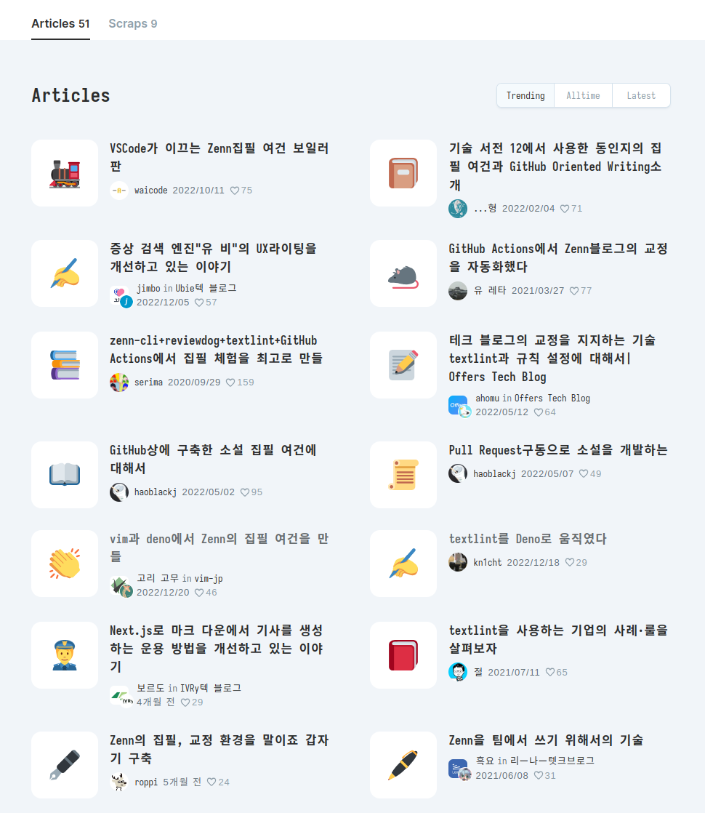

<!-- gid:20230707T094200 -->
[TOC]

[[TIP("이 노트에 대하여")]]
교열과 스타일 점검에 쓰이는 도구들을 한곳에 모아 각각의 역할을 비교한다. 특히 textlint 생태계를 중심으로 어떤 그림이 가능한지, 앞으로 무엇을 붙여야 하는지 파악하려는 탐색 기록이다.
[[/TIP]]

-   [한글 텍스트 린터 플러그인 :개발](https://wikidocs.net/381081)

주력으로 밀고 갈 린터로 textlint 를 선택했다. 바뀔 수도 있지만 일단.

이 주제의 글들을 묶어 준다.

## TODO prh - proofreading helper

[2023-07-24 Mon 11:59] <https://github.com/prh/prh> prh 의 역할과 사용법

## Zenn - textlink

<https://zenn.dev/topics/textlint>

내가 생각한 그림이 여기 다 있다. 이런 글들을 정리할 필요가 있다.

## 레드펜과 텍스트린트 정책 관련 글

[2023-07-25 Tue 10:23] 글쓰기 규칙을 검증에 관련하여 정리한 글

<https://qiita.com/azu/items/60764ed6f415d3c748bf>

## Emacs and textlint

[2023-07-10 Mon 17:55] <https://zenn.dev/yamada1961/articles/5f6408d10037b4>

## obsidian textlint pluging development

[2023-07-25 Tue 15:23] <https://zenn.dev/shivase/articles/011-obsidian-textlint-plugin> 텍스트린트 개발 이야기 남긴 분이라 여기에 넣는다. 데노와는 관계 없다. <https://zenn.dev/shivase/articles/008-how-to-create-new-textlint-plugin-3>

## Related-Notes

## BIBLIOGRAPHY
