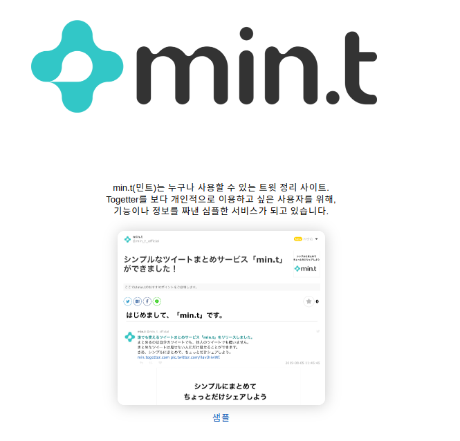
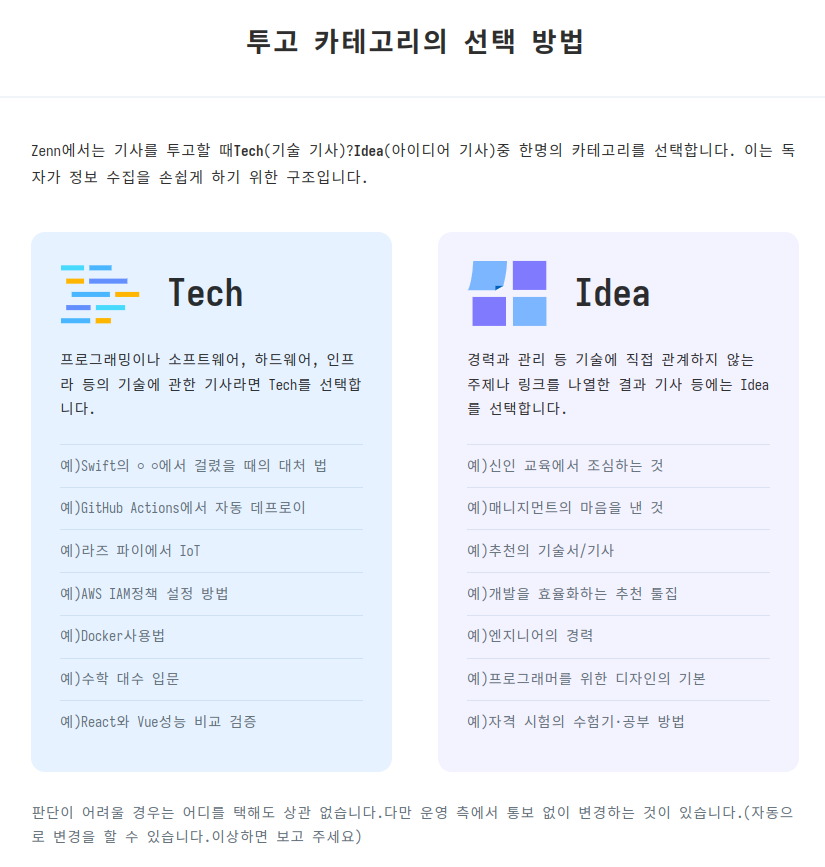
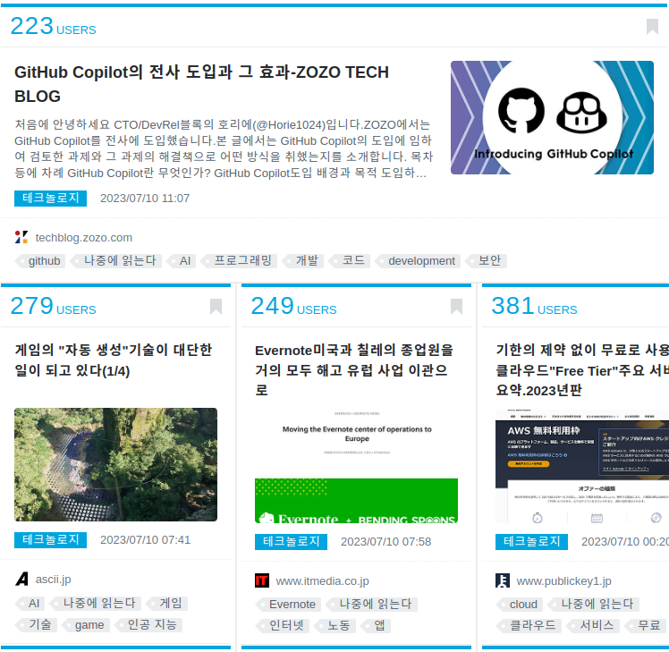

<!-- gid:20230710T170200 -->
[TOC]

[[TIP("이 노트에 대하여")]] 블로그와 글쓰기 서비스를 단순 플랫폼 비교가 아니라 글쓰기 워크플로우의 문제로 바라본다. 무엇을 쓰고, 어떻게 공개하고, 어디까지 유료화할 수 있는지 서비스 지형을 넓게 훑는 모음이다. [[/TIP]] 유료 멤버쉽 서비스 - [멤버십 유료 구독 서비스 - 패트리온](https://notes.junghanacs.com/notes/20230710T181900/)

## 요약

블로그?! 애매하구나. 글쓰기 워크 플로우를 중심에 두고 고민을 하면 장단점과 한계가 보인다.

Type of site Internet forum, blog 이라고 정의 할 수 있다.

[소셜네트워크서비스](https://notes.junghanacs.com/meta/20241006T083159/)는 제외하고, 블로그 글쓰기 관련하여 정리.

## `Global`

[2023-08-13 Sun 08:27] Medium [2023-07-15 Sat 12:01] <https://medium.com/me/lists> gtgkjh 로 계정이 있다. Dev.to [2023-07-24 Mon 07:19] <https://dev.to/junghan0611> github 계정 사용 [junghan 정한 모음](https://notes.junghanacs.com/notes/20230615T121400/) 참고해

### allmylinks

좋은 서비스이다. 아래의 내용을 하나로 묶어서 관리하는게 좋겠다. 광고가 붙어도 그만이다. 명함처럼 줄 수 있으니까. 어짜피 홈페이지에 컨텍트를 넣긴 할 것이다. <https://allmylinks.com/junghanacs>

### linktree

[전뇌해커 | Linktree](https://linktr.ee/ychoi23) 샘플이다.

<https://linktr.ee/junghanacs>

위의 Allmylinks 가 더 쉬운 것 같다.

[2023-06-28 Wed 11:37]

### SourceHut

[2023-06-20 Tue 05:34] <https://sr.ht/~junghanacs/>

-   Ssh <https://meta.sr.ht/~junghanacs.keys>
-   pgp 키로 암호화해서 이메일 주세요! <https://meta.sr.ht/~junghanacs.pgp>
    
    Encrypt with D601962D3F1F47F2CD07C218B5ADD9F47612A9DB

### GitLab

[2023-08-14 Mon 16:46] junghanacs@gmail.com 으로 가입 <https://gitlab.com/>

### twitter

[2023-07-11 Tue 13:24] <https://twitter.com/junghanacs>

#### min.t

[2023-07-25 Tue 15:46] <https://min.togetter.com/>

트위터 정리해서 보여주는 사이트 샘플 예제 <https://min.togetter.com/Hqz7ufB>

### mastodon

[2023-06-20 Tue 05:38] <https://emacs.ch/@junghanacs>

트위터 대신. 내가 사용하는 SNS

### youtube

[2023-06-20 Tue 05:38] <https://www.youtube.com/@junghanacs>

아마 영상을 올려야 한다. 교육 샘플

### matrix

[2023-06-20 Tue 05:39] junghanacs matrix 채팅방이 그것이다.

### Gumroad #검로드

[2023-07-10 Mon 18:22] <https://app.gumroad.com/dashboard>

gtgkjh@gmail.com 계정

뭐가 이렇게 예쁘냐. 큐티라는 국내 서비스는 이걸 카피했구나.

### Substack

[2023-07-16 Sun 04:28]

구독자들을 위한 에티켓?! 근데 편집을 여기서만 해야 되나?

## 일본 `Japan`

[2023-08-13 Sun 08:25]

### Zenn

뭐가 약점인가?!

<https://zenn.dev/dashboard/deploys?deployments_history> <https://zenn.dev/junghan0611>

#### 개발자 글쓰기 플랫폼

하여간 인터넷 세상에는 개발자들의 기록이 많다. 그럴 수 밖에 없다. 효과적인 방법이 필요하다.

#### 투고 카테고리 : Tech and Idea

[2023-07-10 Mon 17:04] 우와. 그래 이래야지. 이렇게 해야지. 잘했네!

#### TODO 스크랩 Scraps

[2023-07-14 Fri 13:38] <https://zenn.dev/zenn/articles/about-zenn-scraps> 스크랩 사용법. 기사는 나중에 쓰는 방식이라면 지금 여기에 기록을 남기는 것. 작업 로그 스레드 형식. 젠 홈페이지에서만 작성 가능.

이맥스에서 조직 모드 기반에 비슷한 워크플로우는?! 어젠다에 태스크가 이것이긴 하지만. 그냥 텍스트 파일에서 어떻게 이게 가능하겠니? 아아아아

어젠다에 등록된게 곧 스크랩이지. 노트는 그게 글이고.

#### 구글 분석 지원(GA4)

[2023-07-10 Mon 17:25] 검색에 반영이 될까?!

#### 일본어만 지원 왜?

[2023-07-10 Mon 17:06] 이 정도 서비스라면 영어 인터페이스가 있을 법도 한데 없네.

#### TODO Emacs 로 Zenn 에 투고와 갱신을 간단하게

[2023-07-10 Mon 17:49] <https://zenn.dev/megeton/articles/66b3769294b04b>

이거 좋은 글이다. 이게 바로 위키독스에 해야 할 일이다.

#### <https://github.com/catnose99> zenn 만든이

#### TODO RSS 리스트

[2023-07-25 Tue 14:51]

-   초보자 <https://zenn.dev/topics/%E5%88%9D%E5%BF%83%E8%80%85>
-   ...

### Hatena

<https://b.hatena.ne.jp/junghan0611/>

it 관련 <https://b.hatena.ne.jp/hotentry/it> 전통의 강자인듯

#### 하테나 북마크 연동

이건 뭔가! 굉장히 투박한 인터페이스. 연동했다.

<https://b.hatena.ne.jp/hotentry/it>

[2023-07-14 Fri 10:24]

### Qitta

일본 서비스. 젠이 나오기 전에는 최고 였을 것이다.

<https://qiita.com/junghan0611>

### Note

[2023-07-23 Sun 06:00] 일본 멤버십 기반 note 는 제작자가 문장, 이미지, 음성 및 동영상을 게시하여 사용자가 콘텐츠를 즐길 수 있도록 지원하는 미디어 플랫폼입니다.

노트 사용법 소개 <https://note.com/info/n/nea1b96233fbf#29ff7b71-2ba7-414e-9a7b-5907b2c5abce>

-   note 로 할 수 있는 일 : 자신이 좋아하거나 전하고 싶은

것을 게시 좋아하는 제작자 기사를 읽고 응원하십시오. 같은 취미와 생각을 가진 사람과 멤버십으로 연결 이 기사에서는, note 가 소중히 하고 있는 것나, 특징이나 보내는 방법을 소개합니다. <https://note.com/junghan0611>

### Scrapbox

[2023-07-25 Tue 13:26] 마스이 토시유키 [増井俊之 - Wikipedia](https://ja.wikipedia.org/wiki/%E5%A2%97%E4%BA%95%E4%BF%8A%E4%B9%8B) <https://scrapbox.io/junghan0611/>

왜?! 공유 위키로 활용 된다. 정말 많이 사용하고 있다.

## Velog 벨로그

[2023-07-14 Fri 13:33] 웹 편집기만 이용해야 한다. 시리즈가 눈에 띈다. 코드가 공개되어 있다. <https://velog.io/junghan0611/series> Tistory 티스토리 [2023-07-14 Fri 14:36] <https://living-with-adhd.tistory.com/> 여기에 그냥 활용하면 된다. DONT 요즘IT [2023-07-15 Sat 16:33] IT 분야 고정이다. <https://yozm.wishket.com/magazine/> maily 뉴스레터 [2023-08-13 Sun 08:23] 국내 뉴스레터 플랫폼 <https://maily.so/> 일일일 <https://oneoneone.kr/> [2023-08-13 Sun 08:23] 아 괜찮네. 본질은 홈페이지 글들을 모음. 각기 구독 가능. 개인 = 회사 같은 레벨로. 회사 광고 좋음. 홈페이지 링크만 연결 `메신저` Discord Telegram [2023-08-13 Sun 08:24] discord [2023-06-20 Tue 05:41] discord 가 슬랙보다는 더 유망하다. telegram [2023-06-20 Tue 05:38] me.t/junghanacs 이런 것을 만들면 좋겠다. `이미지` Gyazo Imgur [2023-07-11 Tue 14:34] 문서 파일에 이미지를 외부에 저장하고 링크를 박는 방법. 뭐든 좋다. Gyazo <https://gyazo.com/captures> junghanacsgmail.com Imgur <https://imgur.com/user/gtgkjh/favorites> 네이버 - [네이버 프리미엄콘텐츠 : 수익 비지니스](https://notes.junghanacs.com/bib/20240522T110335/)

-   [네이버 프리미엄콘텐츠 - 나무위키 - namu.wiki](https://namu.wiki/w/%EB%84%A4%EC%9D%B4%EB%B2%84%20%ED%94%84%EB%A6%AC%EB%AF%B8%EC%97%84%EC%BD%98%ED%85%90%EC%B8%A0)

콘텐츠가 올바른 가치로 평가되고, 공유되는 곳. 프리미엄콘텐츠에서 지금 당신의 콘텐츠를 판매해 보세요.

## 카카오 브런치 스토리

[2025-05-25 Sun 15:24] - [카카오 브런치 스토리 작가 - 연재하기] 위키독스 [2023-07-14 Fri 13:34] [박응용 위키독스](https://notes.junghanacs.com/bib/20250115T155735/)

일본 서비스와 가장 유사. 광고 기능 탑재. 업로드가 불편. 이미지 첨부는 외부 서비스 이용해야 할 듯. 독자 Markdown 문법 처리 필요.

## 위키북스

[2023-08-13 Sun 08:25] - [최용 위키북스 전뇌해커 번역가](https://notes.junghanacs.com/bib/20241019T145802/)

## #데보션

<https://devocean.sk.com>

## 해시노드

-   [VimGolf소개 - bbong.hashnode.dev](https://bbong.hashnode.dev/vimgolf) 이 글을 보는데 해시노드 서비스라서 한번 본다.
-   [개발자 버전 브런치 hashnode(해시노드/해쉬노드) 추천 : 네이버 블로그 - blog.naver.com](https://blog.naver.com/PostView.naver?blogId=marimagdalene&logNo=222969020025)
-   얼룩소 - 유료?
-   포스타입 - 그림 그리는 사람들

## #마이크로블로그:와 유사 서비스는? : 개인 블로그 -&gt; 소셜 미디어 변환

비용 청구하면 개인 블로그를 쇼셜화 해주는 것. 국내에도 있지. 아무렴. 구독 서비스와 유사하게도. 국내 서비스 실정에 맞는 접근이 필요하다. 샘플 찾아보라. (“Micro.Blog: Personal Blogging That Makes It Easy to Be Social” n.d.) "Micro.blog: Personal blogging that makes it easy to be social"

-   2024-08-22

## [750words: 글쓰기 서비스](https://notes.junghanacs.com/notes/20230904T144600/)

[2024-09-16 Mon 11:41]

## 2024-12-17

@user 한국에 서브스택과 유사한 서비스가 있는가?

@assistant 네, 한국에도 서브스택과 유사한 서비스가 몇 가지 있습니다:

1.  **클립(Clip)** - 주로 유튜브 영상의 자막을 제공하며, 사용자들이 자막을 추가하거나 수정할 수 있는 플랫폼입니다.

2.  **Viki** - 드라마와 영화의 자막을 제공하며, 사용자들이 자막을 번역하고 편집할 수 있는 커뮤니티 기반 서비스입니다.

3.  **자막뱅크** - 다양한 영상 콘텐츠의 자막을 제공하고, 사용자들이 자막을 업로드하거나 다운로드할 수 있습니다.

이 외에도 여러 개인 블로그나 커뮤니티에서 자막 파일을 공유하는 경우가 많습니다. 다만, 저작권 문제로 인해 이러한 서비스들이 항상 합법적인 것은 아니므로 주의가 필요합니다.

@user 한국에는 qitta, zenn 과 같은 일본 기술블로그 서비스가 없는가? 조사해줘

@assistant 한국에는 일본의 Qiita나 Zenn과 같은 기술 블로그 서비스가 몇 가지 있습니다:

1.  **Tistory** - 네이버에서 운영하는 블로그 플랫폼으로, 많은 개발자들이 기술 블로그를 운영하고 있습니다. 특정 카테고리나 태그를 통해 기술 관련 글을 쉽게 찾을 수 있습니다.

2.  **Medium Korea** - Medium의 한국 버전으로, 다양한 주제의 글을 작성할 수 있지만, 기술 관련 글도 많이 올라옵니다.

3.  **브런치** - 카카오에서 운영하는 글쓰기 플랫폼으로, 기술 관련 글도 많이 있지만, 주로 에세이, 여행, 리뷰 등 다양한 주제의 글이 올라옵니다.

4.  **Velog** - 개발자들을 위한 블로그 플랫폼으로, 깃허브 계정으로 로그인하여 글을 작성할 수 있습니다. 기술 관련 글을 주로 다루며, 코드 하이라이팅 등 개발자 친화적인 기능을 제공합니다.

5.  **Hashnode** - 글로벌 기술 블로그 플랫폼이지만, 한국에서도 많은 개발자들이 사용하고 있습니다.

이 외에도 개인 블로그나 GitHub Pages, Jekyll 등을 이용해 기술 블로그를 운영하는 개발자들이 많습니다. 다만, 일본의 Qiita나 Zenn처럼 특화된 기술 블로그 서비스는 한국에서는 아직까지는 상대적으로 적은 편입니다.

@user 국내에는 github 리포지토리를 바로 퍼블리시 해주는 서비스가 없는 것 같네. 조사해줄래?

@assistant 한국에서 GitHub 리포지토리를 바로 퍼블리시 해주는 서비스는 아직까지는 많이 알려져 있지 않습니다. 하지만 몇 가지 대안이 있습니다:

1.  **GitHub Pages** - GitHub 자체에서 제공하는 서비스로, GitHub 리포지토리를 웹사이트로 바로 퍼블리시 할 수 있습니다. Jekyll 같은 정적 사이트 생성기를 사용하면 더욱 쉽게 웹사이트를 만들 수 있습니다.

2.  **Netlify** - GitHub와 연동하여 자동으로 배포할 수 있는 서비스입니다. 한국에서도 많이 사용되고 있으며, 무료 플랜으로도 충분히 사용할 수 있습니다.

3.  **Vercel** - Next.js, Gatsby 등의 프레임워크를 사용하는 프로젝트를 GitHub와 연동하여 자동 배포할 수 있습니다. 한국에서도 인기 있는 서비스입니다.

4.  **GitLab Pages** - GitLab의 경우에도 GitHub Pages와 유사한 기능을 제공하며, CI/CD 파이프라인을 통해 자동 배포가 가능합니다.

5.  **Firebase Hosting** - Google의 Firebase를 사용하여 GitHub 리포지토리를 호스팅할 수 있습니다. CI/CD 파이프라인을 설정하면 자동 배포가 가능합니다.

이러한 서비스들은 GitHub 리포지토리를 직접 퍼블리시 해주는 것은 아니지만, 연동하여 자동 배포를 설정할 수 있는 기능을 제공합니다. 한국에서 특별히 GitHub 리포지토리를 바로 퍼블리시 해주는 서비스는 없지만, 위의 대안들을 통해 비슷한 효과를 얻을 수 있습니다.

@user 일본의 Zenn, Qitta 블로그 서비스에 대해서 소개해줘

@assistant 일본의 Zenn과 Qiita는 개발자 커뮤니티에서 매우 인기 있는 기술 블로그 플랫폼입니다. 다음은 각 서비스에 대한 소개입니다:

,\*\*\* **Qiita**

-   **설립**: 2011년
-   **주요 기능**:
    -   **기술 블로그**: 개발자들이 기술 관련 글을 작성하고 공유할 수 있는 플랫폼입니다.
    -   **태그 시스템**: 글에 태그를 붙여 분류하고, 사용자들이 관심 있는 주제를 쉽게 찾을 수 있게 합니다.
    -   **댓글 및 좋아요**: 사용자들이 글에 댓글을 달거나 좋아요를 누를 수 있습니다.
    -   **팀 기능**: 기업이나 팀 단위로 글을 작성하고 관리할 수 있는 기능을 제공합니다.
    -   **Jobs**: 개발자 채용 정보를 제공하는 섹션이 있습니다.
-   **특징**:
    -   일본에서 가장 큰 기술 블로그 커뮤니티 중 하나로, 다양한 기술 주제에 대한 글을 찾을 수 있습니다.
    -   글을 작성하면 포인트를 얻을 수 있으며, 포인트에 따라 랭킹이 매겨집니다.

,\*\*\* **Zenn**

-   **설립**: 2020년
-   **주요 기능**:
    -   **기술 블로그**: Qiita와 유사하게 기술 관련 글을 작성하고 공유할 수 있습니다.
    -   **Books**: 책 형태의 콘텐츠를 작성하고 판매할 수 있는 기능을 제공합니다.
    -   **Scraps**: 짧은 메모나 아이디어를 공유할 수 있는 기능입니다.
    -   **댓글 및 좋아요**: 사용자들이 글에 댓글을 달거나 좋아요를 누를 수 있습니다.
    -   **태그 시스템**: 글에 태그를 붙여 분류하고, 사용자들이 관심 있는 주제를 쉽게 찾을 수 있게 합니다.
-   **특징**:
    -   Qiita보다 최근에 시작된 서비스로, 더 깔끔하고 모던한 디자인을 제공합니다.
    -   Books 기능을 통해 기술 서적을 작성하고 판매할 수 있는 독특한 기능이 있습니다.
    -   Markdown을 사용한 글 작성이 가능하며, 코드 하이라이팅 등 개발자 친화적인 기능이 포함되어 있습니다.

이 두 서비스는 일본의 개발자 커뮤니티에서 매우 활발하게 사용되고 있으며, 기술 정보를 공유하고 배우는 데 큰 도움을 주고 있습니다. 특히, Zenn은 최신 기술 동향을 반영한 기능을 제공하며, Qiita는 그동안 쌓아온 커뮤니티와 콘텐츠의 깊이로 유명합니다.
