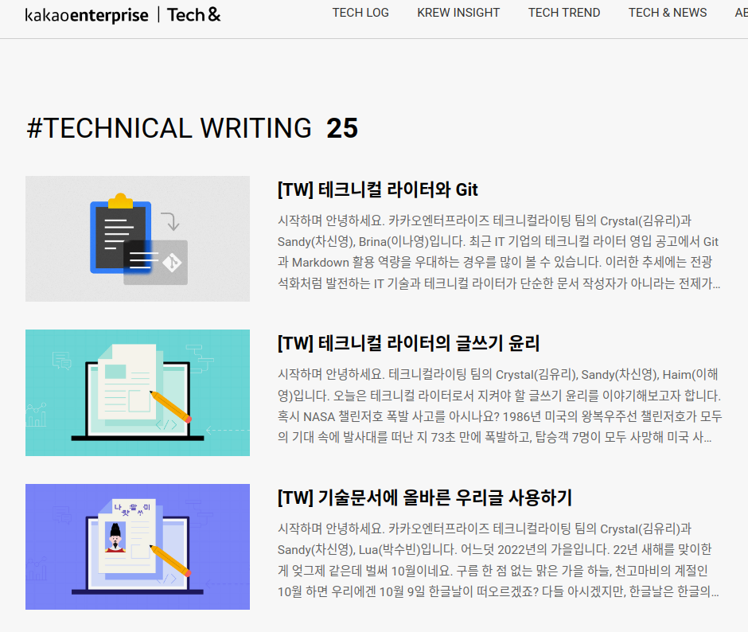

<!-- gid:20230717T103600 -->
[[TIP("이 노트에 대하여")]]
카카오 기술글쓰기 연재를 보관하고 어떤 항목을 재활용할 수 있을지 살핀다. 외부 가이드를 그대로 소비하기보다, 한글 린터와 문서 기준을 세우는 재료로 읽으려는 태도가 드러난다.
[[/TIP]]

<!-- provenance:source:start -->
[[TIP("원본·최신본")]]
이 페이지는 한국어 검색과 읽기를 위한 WikiDocs 미러입니다. [원본·최신본은 가든](https://notes.junghanacs.com/notes/20230717T103600/)에 있습니다. 최신 수정 내용·백링크·태그·히스토리·댓글·출처 정보는 원본 가든에서 확인하세요.

- 작성: `2023-07-17T10:36:00+09:00`
- 최근 수정: `2024-12-01T06:30:00+09:00`
[[/TIP]]
<!-- provenance:source:end -->

## "Kakao Technical Writing Guide"

(“Kakao Technical Writing Guide” n.d.)

Kakao Technical Writing Guide

-   카카오 엔터의 기술 글쓰기 파일을 긁어와서 저장한다. 왜?! 카카오의 글도 제대로 린트가 안되어 있더라.

### 카카오엔터 기술 글쓰기 연재 목록

<http://kko.to/PP2fgvsXR>

#### 25 개 목록 정리

25 개의 글이 있다. 읽어보긴 해야 할 듯!

#### 테크니컬 라이터와 Git : 2023-04-05

[2023-07-14 Fri 14:39] [{TW} 테크니컬 라이터와 Git](https://tech-kakaoenterprise.tistory.com/187)

## Related-Notes

## BIBLIOGRAPHY

- “Kakao Technical Writing Guide.” n.d. Accessed July 17, 2023. [https://tech-kakaoenterprise.tistory.com/tag/technical%20writing?page=1](https://tech-kakaoenterprise.tistory.com/tag/technical%20writing?page=1).
