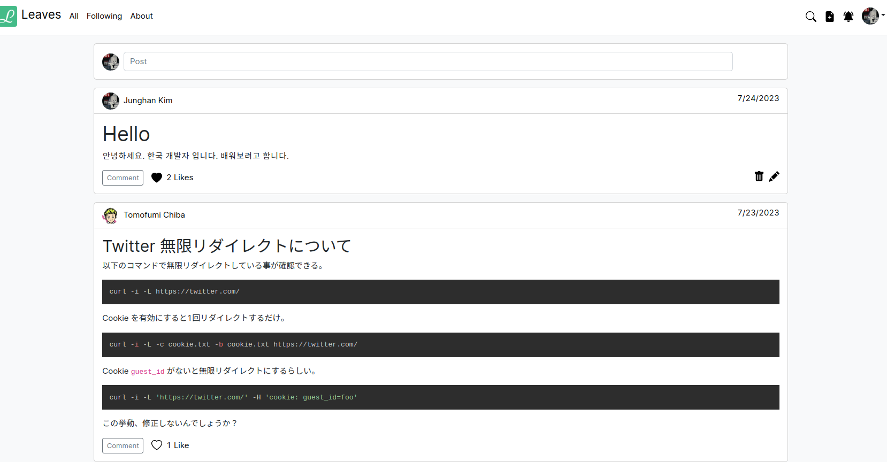
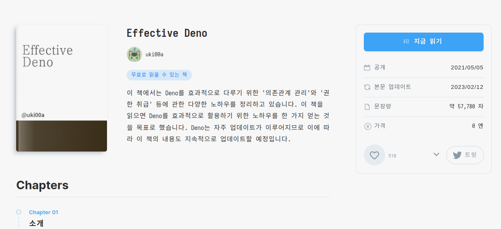
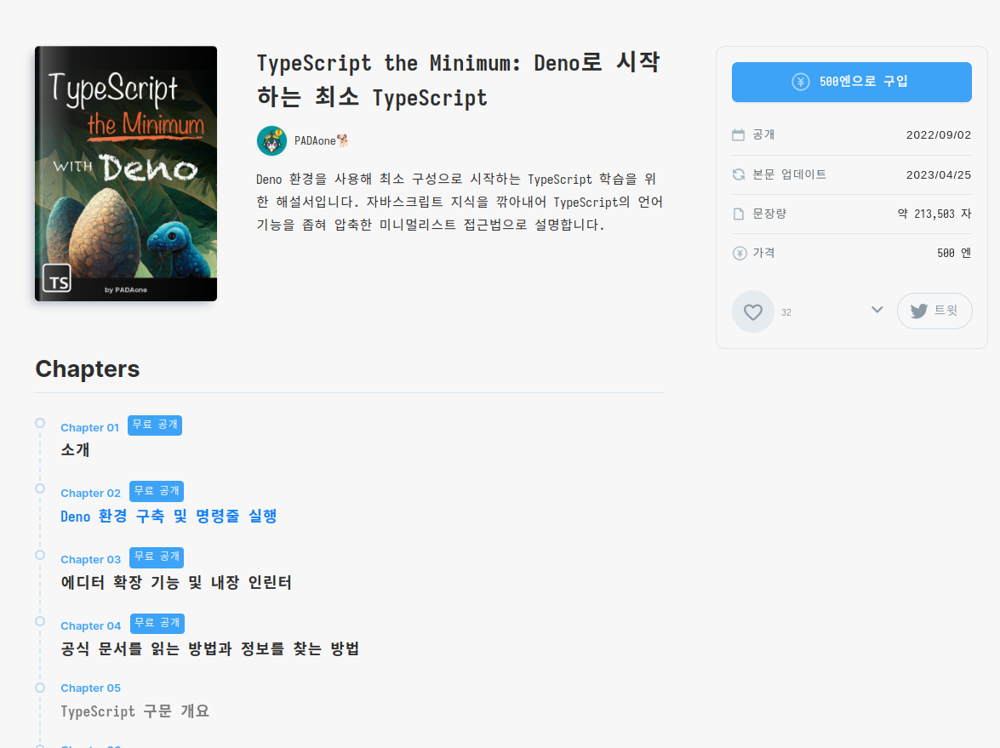

<!-- gid:20230723T082600 -->
[TOC]

[[TIP("이 노트에 대하여")]]
Deno가 어떤 런타임인지, Node.js와 무엇이 다르고 어떤 대안이 있는지를 간단한 질답 형식으로 정리한다. 이후 데노 학습 노트로 이어질 개념적 발판 역할을 하는 문서다.
[[/TIP]]

온라인 책의 장점은 계속 업데이트가 되는 것이다. 어떻게? 봇으로 예제들을 돌려서 업데이트 하면 된다.

## [2025-01-13](https://wikidocs.net/380393)

@user Deno 와 같은 런타임을 소개해줘

@assistant Deno 는 JavaScript 와 TypeScript 를 위한 런타임 환경입니다. Node.js 와 유사하지만, 보안에 중점을 두고 설계되었으며, 표준 모듈을 사용하고, TypeScript 를 기본적으로 지원합니다. Node.js 의 단점으로 지적되었던 부분들을 개선하려는 시도가 담겨 있습니다.

@user 유사한 목적의 다른 런타임은?

@assistant Node.js 가 가장 직접적인 경쟁자입니다. 그 외에도 Bun, Bunus 등 JavaScript/TypeScript 실행 환경이 있습니다. 하지만 목적(JavaScript/TypeScript 실행)이 같더라도 구현 방식이나 강조하는 부분 (예: 성능, 보안)에서 차이가 있습니다.

## 키워드 데노

-   [notes/ 데노: 시작하는 미니멀 타입스크립트 '2023-07-26](https://wikidocs.net/381101)
-   [notes/ 이펙티브 데노 웹프레임워크 '2023-07-27](https://wikidocs.net/381104)
-   [notes/ 린터: 텍스트린트 데노 활용법 '2023-08-31](https://wikidocs.net/381114)

## Deno, the next-generation JavaScript runtime

(“Deno, the next-Generation Javascript Runtime” n.d.)

## 배움과 활용방법

데노 문서 읽으면서 전체 시스템을 다루는 방법을 연습한다. 그것 뿐이다.

## <span class="org-todo done DONE">DONE</span> deno on Emacs Eglot : working

[2023-07-25 Tue 09:38] <https://zenn.dev/hyakt/articles/5c947cc22c4bfa>

2023-07-28 트리시터와 연계하여 전체 세트로 동작한다.

2023-07-26 과감하게 이맥스에서 JavaScript 타입스크립트 레이어 삭제했다. 데노에 집중하면 된다. 키바인딩 필요한 구성 다 넣으면 되겠다. 어짜피 스코드로 검증할 것이다. 현재 이글랏 데노 잘 연동 된다. 아무렴 경험이 필요할 것이다. 아 참고로 lsp-mode 는 하라는 대로 했으나 데노 서버가 제대로 안된다. 가볍게 가자.

-   deno eglot <https://deno.land/manual@v1.35.2/getting_started/setup_your_environment#eglot>
-   fmt 아래 포멧터 연동

## <span class="org-todo done DONE">DONE</span> deno REPL

[2023-07-26 Wed 14:45] deno 실행하면 된다. 노드와 같다.

## Manual

[2023-07-28 Fri 16:34] <https://deno.land/manual@v1.35.3/getting_started/first_steps>

## fmt : code formatter

[2023-07-25 Tue 09:44] <https://deno.land/manual@v1.35.2/tools/formatter>

이맥스에서는 deno-fmt 를 설치해서 포멧팅을 하면 된다. <https://github.com/rclarey/deno-emacs>

서버는 deno lsp 서버를 설치해서 연동하면 된다.

## dnt : npm packaging

<https://github.com/denoland/dnt> deno 로 개발한 모듈을 npm 패키지로 변환

데노 코드에서 패키지 만들기 <https://zenn.dev/mahaker/articles/f535960cb47457>

## `lume` : static site generator

[2023-07-25 Tue 05:52] <https://lume.land/>

와 굉장히 매력적인 구성이다. 내가 원하는 구성 아닌가? <https://github.com/johanbrook/johanbrook.com/tree/main>

포크함. 이 구성은 Deno 로 통합에 아주 유리 <https://github.com/junghan0611/johanbrook.com>

```text
git@github.com:junghan0611/johanbrook.com.git
```

와 쉽다. 이걸 내가 활용한다면?!

## `fresh` : full-stack framework

[2023-07-25 Tue 05:53] <https://fresh.deno.dev/>

나는 데노로 확실히 갈 것이라면 이런 선택도 좋으리라 본다. 하나로 다 커버해야 된다. 디플로이까지 모두 커버해야 한다.

[2023-07-24 Mon 15:43] Fresh (10.6k ⭐) — A web framework for Deno that offers features like edge rendering, island hydration, zero runtime, file-system routing, TypeScript support, and deployment adapters. It is still in early development and not production-ready. <https://fresh.deno.dev/>

나는 데노로 확실히 갈 것이라면 이런 선택도 좋으리라 본다. 하나로 다 커버해야 된다. 디플로이까지 모두 커버해야 한다.

이렇게 가면 정말 하나로 다 커버할 수 있다. 완벽한 옵션이 아닐 수 없다. <https://deno.com/deploy/pricing>

### 튜토리얼

[2023-07-25 Tue 11:44]

<https://zenn.dev/azukiazusa/articles/fresh-tutorial>

### Leaves 예제

[2023-07-25 Tue 12:35]

이 글이다. <https://zenn.dev/chiba/articles/md-sns-deno-fresh>

소스코드는 <https://github.com/chibat/leaves>

여기서 확인할 수 있다. 기본적인 동작이 다 된다. 굉장히 훌륭하다. <https://leaves.deno.dev/>

이 정도로 시작하면 좋을 것 같은데?!



## deploy

[2023-07-25 Tue 05:53] 이렇게 가면 정말 하나로 다 커버할 수 있다. 완벽한 옵션이 아닐 수 없다. <https://deno.com/deploy/pricing>

## Books

[2023-07-25 Tue 13:37]

### Effective Deno

[2023-07-25 Tue 12:42] <https://zenn.dev/uki00a/books/effective-deno>

이것 문서 파일 있나? <https://github.com/uki00a> 여기서 찾아보는 중.



보라. 여기서 중요한 점 본문 업데이트 일을 보라. 이게 가능하기에 기술 자료는 이렇게 배포해야 한다는 것이다.

### JavaScript Primer 2nd

[2023-07-25 Tue 13:37] 이건 나의 번역 대상?! <https://jsprimer.net/>

### TypeScript Minimum with Deno --

[2023-07-25 Tue 14:52] <https://zenn.dev/estra/books/ts-the-minimum> 500 엔이다.

무료 페이지를 본다.

독자 커뮤니티 <https://zenn.dev/estra/scraps/98904121a8324f>



## deno-ja : Japan Users Group

[2023-07-25 Tue 13:15] <https://deno-ja.deno.dev/> 일본 사용자 그룹이다 완벽하다. 근데 왜 스크랩박스를 엄청 애용하는가?! <https://zenn.dev/uki00a/books/effective-deno> <https://scrapbox.io/deno-ja/>

-   Effective Deno by uki00a

Deno 를 효과적으로 활용하기 위한 노하우를 한가지 얻을 수 있는 포괄적인 문서입니다.

-   Weekly Deno by uki00a

매주 일요일에 그 주에 Deno 의 최신 정보를 보내고 있습니다.

-   deno-ja Scrapbox by deno-ja

Deno 에 관해서 뭐든지 정리하고 있는 Wiki 적인 페이지입니다. deno-ja 커뮤니티에서 관리합니다.


## deno-kr : Korean Users Group

[2023-07-25 Tue 13:50]

제대로 운영 안된다. 왜?! 자료가 없다. 정말 자료가 없다. 누가 자료를 왕창 만들어서 정리해서 올려야 한다. 내가 할 일인가 싶다.

## Related-Notes

## BIBLIOGRAPHY

- “Deno, the next-Generation Javascript Runtime.” n.d. Accessed January 15, 2025. [https://deno.com/](https://deno.com/).
