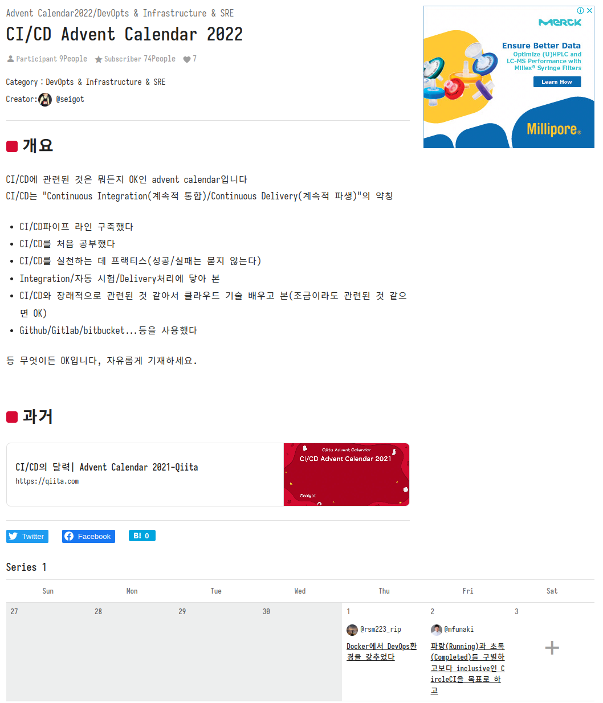

<!-- gid:20230724T095200 -->
[TOC]

[[TIP("이 노트에 대하여")]]
어드벤트 캘린더처럼 특정 주제로 여러 날에 걸쳐 꾸준히 기록하는 형식을 살핀다. 개인 창작이 연속될 때 하나의 책이나 프로젝트로 자랄 수 있다는 가능성을 붙잡는 메모다.
[[/TIP]]

## Related-Notes

-   [기록 로그](https://wikidocs.net/380787)
-   [토픽주제화제논제테마쟁점소재의제담론주안점관심사](https://wikidocs.net/380817)

## BIBLIOGRAPHY

  “어드벤트 캘린더(Advent Calendar).” 2025. [https://ko.wikipedia.org/w/index.php?title=%EC%9E%AC%EB%A6%BC%EC%A0%88_%EB%8B%AC%EB%A0%A5&#38;oldid=38435170](https://ko.wikipedia.org/w/index.php?title=%EC%9E%AC%EB%A6%BC%EC%A0%88_%EB%8B%AC%EB%A0%A5&oldid=38435170).

## 히스토리

-   [2023-07-24 Mon 09:56] 특정 주제로 여러 사람들의 글을 모으는 것. 개인 창작물.

합쳐서 보면 하나의 책이 될 수도 있다. 개인이 능력이 중요한 시대.

-   [AOC: Advent of Code 코드카타 - 어드벤트 코드](https://wikidocs.net/381677)

## 어드벤트 캘린더(Advent calendar)

(“어드벤트 캘린더(Advent Calendar)” 2025)

-   재림절 달력, 대림절 달력, 강림절 달력, 또는 어드벤트 캘린더(Advent calendar)는 성탄절을 앞두고 대림절 날짜를 세는 데 사용된다. 대림절 첫 번째 일요일의 날짜는 11월 27일부터 12월 3일까지 다양하므로 종이나 나무로 만든 재사용 가능한 재림절 달력의 대부분은 12월 1일에 시작된다. 대림절 첫 번째 일요일부터 시작하는 달력도 있다. 재림절 달력은 19세기와 20세기에 독일 루터교회에서 처음 사용되었으며, 이후 다른 기독교의 교파로 퍼졌다.
-   2025

### 어드벤트 켈린더

[2023-07-24 Mon 09:56] 아래와 같다. 특정 주제로 글을 쓰고 기록하는 것이다. 구독한 사람들은 특정 주제의 글을 계속 볼 수 있다. 국내에서는 아직 못본 것 같다.

```text
CI/CD 에 관련된 것은 뭐든지 OK 인 advent calendar 입니다
CI/CD 는 "Continuous Integration(계속적 통합)/Continuous Delivery(계속적 파생)"의 약칭

CI/CD 파이프 라인 구축했다
CI/CD 를 처음 공부했다
CI/CD 를 실천하는 데 프랙티스(성공/ 실패는 묻지 않는다)
Integration/자동 시험/Delivery 처리에 닿아 본
CI/CD 와 장래적으로 관련된 것 같아서 클라우드 기술 배우고 본(조금이라도 관련된 것 같으면 OK)
Github/Gitlab/bitbucket...등을 사용했다
등 무엇이든 OK 입니다, 자유롭게 기재하세요.
```

<https://qiita.com/advent-calendar/2022/cicd>



### <span class="org-todo done DONE">DONE</span> advent

1.  **English Translation**: "advent"
2.  **Korean Response**: "Advent"는 예수님의 탄생과 재림을 준비하는 기독교 절기입니다.

3.  Citations: [1] <https://www.britannica.com/topic/Advent> [2] <https://en.wikipedia.org/wiki/Advent> [3] <https://bibleproject.com/guides/advent/> [4] <https://www.usccb.org/prayer-worship/liturgical-year/advent> [5] <https://dictionary.cambridge.org/us/dictionary/english/advent>

## 로그

### [2023-07-24 Mon 09:56]

#### @user  Advent Calendar 에 대해서 알려줘

@assistant 물론이죠!

Advent Calendar(대림절 달력)은 크리스마스를 기다리는 12월 동안 매일 하나씩 열어보는 특별한 달력입니다. 대림절(Advent)은 성탄절 전 4주간을 의미하며, 예수 그리스도의 탄생을 준비하고 기념하는 기간입니다. 일반적으로 Advent Calendar 는 1일부터 24일까지의 날짜가 표시되어 있으며, 매일 하나의 작은 창문이나 주머니를 열어 작은 선물, 초콜릿, 메시지 또는 다른 깜짝 요소를 발견할 수 있습니다.

Advent Calendar 는 어린이들에게 매우 인기가 많습니다. 매일 하나씩 열어보는 기대감과 즐거움이 크리스마스의 기쁨을 더해줍니다. 또 최근에는 어른들도 즐길 수 있도록 고급 초콜릿, 차, 미용 제품 등이 들어있는 다양한 종류의 Advent Calendar 도 많이 출시되고 있습니다.

이러한 달력은 단순히 즐거움을 주는 것뿐 아니라, 가족들이 함께 모여 매일매일의 소소한 기쁨을 나누고, 크리스마스라는 특별한 날을 준비하는 의미 있는 시간을 갖도록 도와줍니다.
