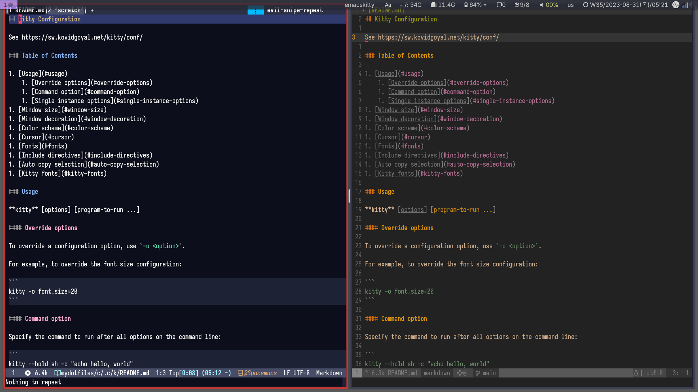

<!-- gid:20230830T084200 -->
[TOC]

[[TIP("이 노트에 대하여")]]
터미널에서 Emacs를 쓸 때 Wezterm, kitty와 Ghostty가 어떤 차이를 만드는지 기록해 둔다. 키 입력, GPU 가속, Wayland, 장기간의 시행착오가 함께 남아 있어 선택의 맥락을 보여 준다.
[[/TIP]]

## 관련메타

-   [도구](https://wikidocs.net/380778)
-   [터미널 레트로](https://wikidocs.net/380520)

## BIBLIOGRAPHY

- “키티 터미널 Kitty the Fast, Feature-Rich, GPU Based Terminal Emulator.” n.d. Accessed June 18, 2025. [https://sw.kovidgoyal.net/kitty/](https://sw.kovidgoyal.net/kitty/).
- “Slimmer Emacs with Kitty 터미널 이맥스 키티 통합.” 2022. 2022. [https://jao.io/blog/slimmer-emacs-with-kitty.html](https://jao.io/blog/slimmer-emacs-with-kitty.html).
- whhone. n.d. “Using Emacs in a Terminal - Wai Hon’s Blog.” Accessed August 30, 2024. [https://whhone.com/posts/emacs-in-a-terminal/](https://whhone.com/posts/emacs-in-a-terminal/).

## 히스토리

-   [2026-04-17 Fri 16:19] wezterm is 1st [터미널 이맥스 하네스 프론트엔드 완성 — 한글입력 클립보드 truecolor SSH원격 독립인스턴스 에이전트통합](https://wikidocs.net/382594) 이걸 해냈다 이말이야.
-   [2025-12-28 Sun 16:55] ghostty is 1st
-   [2025-06-19 Thu 02:09] 정리하세
-   2024-09-09 kkp term-keys 옵션이 많아졌다.
-   2023-08-30 문서 정리
-   2023-04-01 성공 WORKLOG 참고
-   2022-09-17 시도 그러나 실패 포기 ~/sync/markdown/oldnote/periodic/daily/2022-09-17.md

How to run Emacs on terminal with kitty

## 관련링크

### "Using Emacs in a Terminal - Wai Hon’s Blog"

(whhone n.d.)

### 키티 터미널 kitty The fast, feature-rich, GPU based terminal emulator

(“키티 터미널 Kitty the Fast, Feature-Rich, GPU Based Terminal Emulator” n.d.)

The fast, feature-rich, GPU based terminal emulator Fast Uses GPU and SIMD vector CPU instructions for best in class, Uses threaded rendering for absolutely minimal latency, Performance tradeoffs c...

## 2026 Wezterm: 에이전트 하네스 터미널 이맥스 끝판왕

-   [2026-04-17 Fri 16:19] wezterm is 1st [터미널 이맥스 하네스 프론트엔드 완성 — 한글입력 클립보드 truecolor SSH원격 독립인스턴스 에이전트통합](https://wikidocs.net/382594) 이걸 해냈다 이말이야.

아름다운데 좀 스크린샷을 넣어불까? 잠시만. 더 넣으려다가 시간 없다. 이만 줄인다.

## 2025 버티컬 보더 vertical-border

[2025-01-26 Sun 19:03]

(“Slimmer Emacs with Kitty 터미널 이맥스 키티 통합” 2022)

slimmer emacs with kitty

```elisp

;;;; vertical-border

;; (set-display-table-slot standard-display-table 'vertical-border (make-glyph-code ?│))
(setq mode-line-end-spaces nil)

;; (unless (display-graphic-p) ; terminal
;;   (set-display-table-slot standard-display-table
;;                           'vertical-border
;;                           (make-glyph-code ?│)))

```

## 2023 키티와 이맥스 키 전달이 핵심이다

[2023-08-30 Wed 09:11] 분명 3 월 말 경에 해결했다고 한다. 이 문제는 2022-09-17 이 근방에서도 엄청 고민했던 문제였다. 근데 이걸 어떻게 한 것인가?

다시 하려고 하니 잊고 있었다. 그래서 정리한다. 여기에서는 키티 터미널에서 이맥스를 사용하며 몇 몇 키를 바인딩 한다. 그래야 편히 사용할 수 있다.

정한에게는 매우 중요한 문제라 이게 해결이 안되면 터미널에서 이맥스를 사용 하지 못했을 것이다.

Hangul, AltL+Shift
: 한영 전환

PageUp, PageDown
: 익숙한 키다

Delete
: 이게 바인딩이 안 되있으면 불편하다.

F1-12
: 필요

ALT/CTRL+TAB
: 필요하다.

M-&lt;return&gt;
: vertico-map -- vertico-exit-input

아무튼 처음에는 AltL+Shift 키만 적용했다가 몇 가지 키를 추가했다.

이 작업에는 term-keys 라는 패키지를 사용한다. 즉 키티를 수정 할 게 없다. 여기를 수정했다. 다음 파일의 아래 일부를 수정 또는 추가하면 된다.

### 이어가면

위와 같이 코드가 들어가 있으면 아래와 같이 키티 바인딩 키를 확인할 수 있다.

```elisp
(require 'term-keys-kitty)
(with-temp-buffer
  (insert (term-keys/kitty-conf))
  (write-region (point-min) (point-max) "~/kitty-for-term-keys.conf"))
```

conf 파일은 대략 아래와 같다.

```text
...
map DELETE                                                  send_text all \x1b\x1f\x56\x60\x1f
map SHIFT+DELETE                                            send_text all \x1b\x1f\x56\x61\x1f
map CTRL+DELETE                                             send_text all \x1b\x1f\x56\x62\x1f
...
```

이제 키티가 꼭 이맥스에 전달해줘야 하는 키 바인딩을 kitty.conf 파일에 등록해준다.

```text
# change 'input method' for emacs with 'term-keys'
map SHIFT+SPACE   send_text all \x1b\x1f\x50\x21\x1f
map Hangul        send_text all \x1b\x1f\x50\x60\x1f
map DELETE        send_text all \x1b\x1f\x56\x60\x1f
map PAGE_UP       send_text all \x1b\x1f\x58\x60\x1f
map PAGE_DOWN     send_text all \x1b\x1f\x59\x40\x1f
# map F1            send_text all \x1b\x1f\x60\x1f
map F2            send_text all \x1b\x1f\x21\x40\x1f
map F3            send_text all \x1b\x1f\x22\x20\x1f
map F4            send_text all \x1b\x1f\x22\x60\x1f
map F5            send_text all \x1b\x1f\x23\x40\x1f
map F6            send_text all \x1b\x1f\x24\x20\x1f
map F7            send_text all \x1b\x1f\x24\x60\x1f
map F8            send_text all \x1b\x1f\x25\x40\x1f
map F9            send_text all \x1b\x1f\x26\x20\x1f
map F10           send_text all \x1b\x1f\x26\x60\x1f
map F11           send_text all \x1b\x1f\x27\x40\x1f
map F12           send_text all \x1b\x1f\x28\x20\x1f
map SHIFT+TAB      send_text all \x1b\x1f\x34\x21\x1f
map CTRL+TAB       send_text all \x1b\x1f\x34\x22\x1f
map SHIFT+CTRL+TAB  send_text all \x1b\x1f\x34\x23\x1f

map ALT+TAB                                                 send_text all \x1b\x1f\x34\x24\x1f
map SHIFT+ALT+TAB   send_text all \x1b\x1f\x34\x25\x1f
map CTRL+ALT+TAB                                            send_text all \x1b\x1f\x34\x26\x1f
```

그리고 나서는 터미널 모드에서만 본 패키지를 활성화 한다.

```elisp
(use-package term-keys
  :unless window-system
  :ensure
  :config
  (term-keys-mode t))
```

이렇게 하면 키티에서 Emacs 실행 시에 위 키가 정확히 전달이 된다.

이맥스는 자체 입력기 시스템을 사용하기 때문에 여기에 맞게 넣어줘야 한다. 터미널에서 지원이 제대로 안되는 것 뿐이다.

이 문제는 이렇게 간단하게 정리하지만 정말 해결하고 싶었다. 물론 X11 터미널을 사용하면 한글 입력 되긴 된다. 근데 이건 아니다. Emacs 입력기를 사용하는게 아니기 때문이다. 자동 완성에서 한글은 대 한 민 국 이런 식으로 어설프게 처리된다.

### 왜 키티 터미널인가?

[2023-08-30 Wed 10:08] 아래 글을 보고 나서 딱 생각이 들었다. [slimmer emacs with kitty](https://jao.io/blog/slimmer-emacs-with-kitty.html) 참고로 이 글은 1 년 전에 보았다. 못해서 아쉬웠을 뿐이다. 이제 충분하지 않는가?

요약하자면 먼저 메모리 관리와 성능 측면이다. Emacs 가 거의 모든 일을 다 처리하기 때문에 잘 관리해야 한다.

더 중요한 측면은 키티 터미널이다. 터미널 임에도 그래픽 모드와 크게 다르지 않은 높은 퀄리티로 이맥스를 사용할 수 있다.

이러기 위해서는 Emacs 설정을 튜닝해야 했다. 다행히도 이 글을 쓰는 2023-08-30 시점에는 기본 이상으로 다 갖춰진 상태다. 폰트와 이모지까지 다 커버 한다. 조직 모드에서 최적의 화면 구성도 맞춰 놓았다. org-modern 없이 아주 깔금하다.

실행은 쉘 설정 파일에 다음과 같이 추가함.

```bash
alias emacskitty='TERM=kitty-direct emacs --with-profile default -nw'
alias emacskittyclient='TERM=kitty-direct emacsclient -s /home/junghan/.cache/spacemacs-server-29 -nw'
```

### 남은 문제 corfu-terminal alignment on Org Src Block

[2023-08-30 Wed 10:36] 깔끔하게 안된다. 기다려보자. 괜찮다. 조직모드의 소스 블락에서 발생한다. 인덴테이션과 충돌이 나는 것 같다.

### 터미널 전용 Emacs 패키지 정리

[2023-08-30 Wed 10:13] 위에 있는 term-keys 뿐만 아니라 다음 패키지도 필요하다.

### term-keys

2023-03-13 드디어 동작한다. kitty 를 활용 할 수 있다. (잘 안쓰겠지만)

```elisp
(use-package term-keys
  :unless window-system
  :ensure
  :config
  (term-keys-mode t)
  )
```

[2023-03-13 Mon 11:12]

### corfu-terminal

```elisp
(use-package corfu-terminal
  :unless window-system
  :after corfu
  :config
  (add-hook 'corfu-mode-hook 'corfu-terminal-mode)
  )
```

[2023-04-14 Fri 14:57]

### xclip

```elisp
(use-package xclip
  :unless window-system
  :config
  (unless (display-graphic-p)
    (xclip-mode 1)))
```

## 2023 Emacs and SpaceVim on Markdown on Kitty

[2023-08-31 Thu 05:22]

지금 나의 설정에서 비교할 겸. 스크린샷. 둘다 Kitty 사용. 빔과 비슷. 어색하지 않다. 그 뒤의 풍부함이라. 테마는 다양하니 골라쓰라.



## 아카이브
