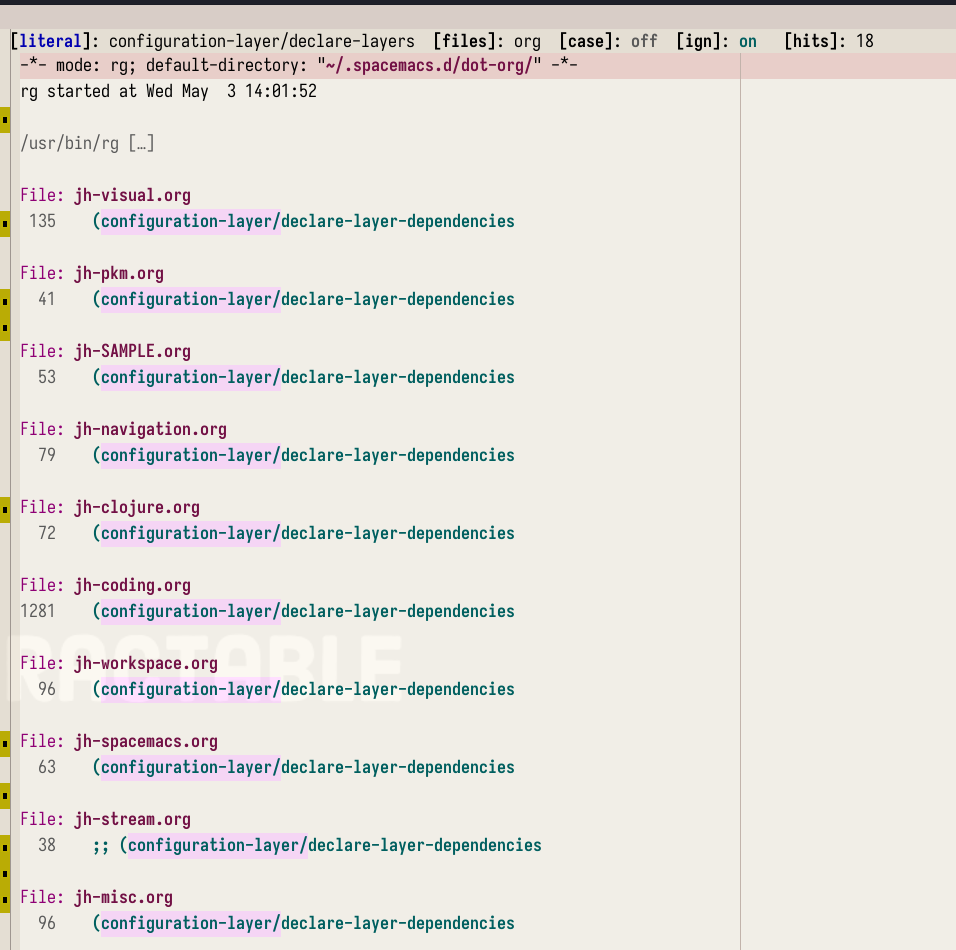

<!-- gid:20230907T190500 -->
[TOC]

[[TIP("이 노트에 대하여")]]
ripgrep 기반 rg.el과 wgrep을 이용해 여러 파일을 검색하고 곧바로 수정하는 흐름을 정리한다. 파일을 고르고 치환하는 실전 편집 감각을 이맥스 안에서 어떻게 잡는지 보여 주는 기록이다.
[[/TIP]]

## BIBLIOGRAPHY

  “Dajva/Rg.El.” 2025. [https://github.com/dajva/rg.el](https://github.com/dajva/rg.el).

## 관련노트

-   [일괄편집: 검색 여러개 파일들을 한 번에 변경하는 방법 (2023-07-10)](https://wikidocs.net/381084)

## dajva/rg.el

(“Dajva/Rg.El” 2025)

-   Landell, David
-   Emacs search tool based on ripgrep
-   [Usage — rg.el 2.3.0 documentation](https://rgel.readthedocs.io/en/latest/usage.html#installation)
-   [How to Find All Files Not Containing Specific Text on Linux](https://linuxhandbook.com/list-non-matching-files/)
-   [grep - How do I find files that do not contain a given string pattern? - Stac...](https://stackoverflow.com/questions/1748129/how-do-i-find-files-that-do-not-contain-a-given-string-pattern)

## Replacing text across progjects with `rg`

rg-enable-menu [2023-05-03 Wed 13:42]

/home/junghan/spacemacs/layers/+completion/helm/packages.el

```elisp
      ;; (with-eval-after-load 'helm-files
      ;;   (define-key helm-find-files-map
      ;;     (kbd "C-c C-e") 'spacemacs/helm-find-files-edit)
      ;;   (define-key helm-find-files-map
      ;;     (kbd "S-<return>") 'helm-ff-run-switch-other-window)
      ;;   (defun spacemacs//add-action-helm-find-files-edit ()
      ;;     (helm-add-action-to-source
      ;;      "Edit files in dired `C-c C-e'" 'spacemacs//helm-find-files-edit
      ;;      helm-source-find-files))
      ;;   (add-hook 'helm-find-files-before-init-hook
      ;;             'spacemacs//add-action-helm-find-files-edit))

(defun spacemacs//helm-find-files-edit (candidate)
  "Opens a dired buffer and immediately switches to editable mode."
  (dired (file-name-directory candidate))
  (dired-goto-file candidate)
  (dired-toggle-read-only))

(defun spacemacs/helm-find-files-edit ()
  "Exits helm, opens a dired buffer and immediately switches to editable mode."
  (interactive)
  (helm-exit-and-execute-action 'spacemacs//helm-find-files-edit))
```

[Replacing text across projects - Practicalli Spacemacs](https://practical.li/spacemacs/spacemacs-basics/evil-tools/replacing-text-across-projects/) 여기를 보니까 그랩하고 C-c C-e 로 작업을 할 수 있다고 한다. 뭐하는 것인가 보니 위의 함수로 매핑되어 있다. helm 을 안쓰는데 이것을 할 수 있는 방법은?

[Emacs Is Great - Ep 31, wgrep, editing grep buffers, also...](https://youtu.be/wBqkOnGnSkg)

wgrep 이 그 역할을 한다. 마음 편하게 하려면 그냥 helm 을 설치해야 하나 싶었다. 이게 뭔 짓인가! 햄으로 다 할 수 있는데! 그럼에도 방법을 찾아야지.

단순 노가다를 계속 할 수는 없지 않는가!

헉 나에게 `rg` 가 있었네 지금 wgrep 을 보니 의존 으로 설치되어 있다. rg 가 물고 있다. rg 는 ripgrep+wgrep 인데. 잠시만 해보자. _home/junghan_.spacemacs.d/dot-org/jh-editing.org 여기다.

했다. 완벽하다. 이렇게 하는 것이구나. 쉽다.

`C-c C-p` wgrep-mode 로 바꿔주고나서 수정하고 `Z Z` 입력하면 적용된다. 엄청난 팁이다. 아마도 Embark 등 시나리오에서도 가능할 것 같다. 개념을 몰라서 못했던 것이다.



## rg-files-without-match

[2023-09-07 Thu 19:06]

[How to Find All Files Not Containing Specific Text on Linux](https://linuxhandbook.com/list-non-matching-files/) [grep - How do I find files that do not contain a given string pattern? - Stac...](https://stackoverflow.com/questions/1748129/how-do-i-find-files-that-do-not-contain-a-given-string-pattern)

이맥스에서 사용하려면 인터페이스를 추가해야 했다. 커스텀 커맨드다. 그래야 조율이 가능하니까. 파일 목록이 쭉 나왔다. 이걸 가지고 조작을 해야 한다.

[Using rg (ripgrep): passing --files-without-match option flag - Emacs Stack E...](https://emacs.stackexchange.com/questions/74040/using-rg-ripgrep-passing-files-without-match-option-flag)

```elisp
(rg-define-search rg-files-without-match
  :format literal
  :flags ("--files-without-match")
  :menu ("Custom" "@" "Files without matches"))
```

파일 리스트를 받아서 해당 파일에 텍스트를 넣는 것이다. 커맨드라인에서 한다면 어떻게 하겠는가?

```text
# 이거 안될 것 같은데?!
# rg --files-without-match "title::" | fd -e org -x sed -i '1s/^/title:: {.}\n/' {}
```

## use grep to find content in files and move them if they match

[2023-09-07 Thu 19:24]

<https://stackoverflow.com/questions/91899/use-grep-to-find-content-in-files-and-move-them-if-they-match>

Grep command to find files containing text string and move them

```text
rg --files-without-match ":terms:" | xargs mv -t ../notes
```
