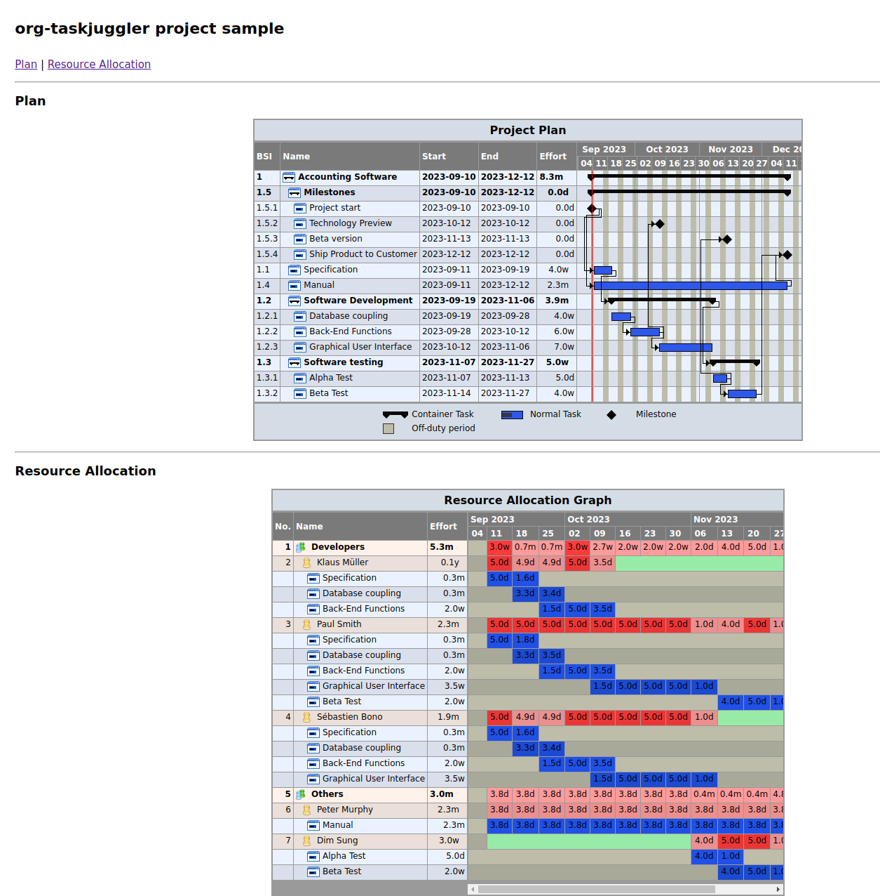

<!-- gid:20230910T161400 -->
[[TIP("이 노트에 대하여")]]
TaskJuggler export에 필요한 속성과 자원, 마일스톤 구조를 org 파일 한 장에 담아 둔 예제다. 실제 프로젝트 계획이 어떤 식으로 조직모드 문법으로 표현되는지 빠르게 확인할 수 있다.
[[/TIP]]

<!-- provenance:source:start -->
[[TIP("원본·최신본")]]
이 페이지는 한국어 검색과 읽기를 위한 WikiDocs 미러입니다. [원본·최신본은 가든](https://notes.junghanacs.com/notes/20230910T161400/)에 있습니다. 최신 수정 내용·백링크·태그·히스토리·댓글·출처 정보는 원본 가든에서 확인하세요.

- 작성: `2023-09-10T16:14:00+09:00`
- 최근 수정: `2023-09-10T16:14:00+09:00 (lastmod 없음: date fallback)`
[[/TIP]]
<!-- provenance:source:end -->

[TOC]

org-column 을 켠다.

## Accounting Software :taskjuggler_project:

### Specification

### Software Development

#### Database coupling

#### Back-End Functions

#### Graphical User Interface

### Software testing

#### Alpha Test

#### Beta Test

### Manual

### Milestones

#### Project start

#### Technology Preview

#### Beta version

#### Ship Product to Customer

## Resources  :taskjuggler_resource:

### Developers

#### Paul Smith

#### Sébastien Bono

#### Klaus Müller

### Others

#### Peter Murphy

#### Dim Sung

## Screenshot

[2023-09-10 Sun 16:26]

org-taskjuggler-export-process-and-open 다음 스크린샷 확인

## Related-Notes

## BIBLIOGRAPHY
