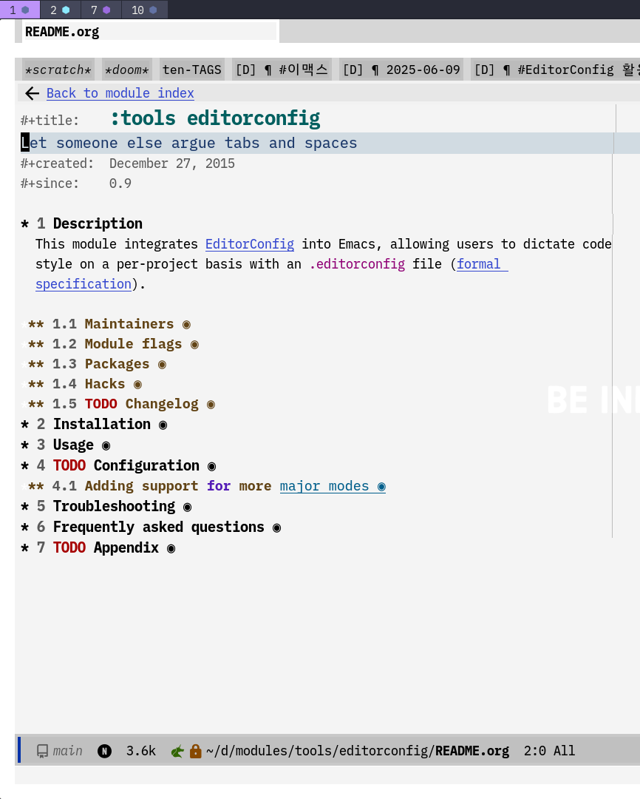

<!-- gid:20230916T180500 -->
[TOC]

[[TIP("이 노트에 대하여")]]
EditorConfig가 팀과 프로젝트에서 코딩 스타일을 통일하는 데 어떤 역할을 하는지 정리한다. 에디터마다 설정이 갈라지는 문제를 파일 기반 규칙으로 묶는 접근을 이해하기 위한 노트다.
[[/TIP]]

## 관련메타

-   [설정 구성](https://wikidocs.net/380785)
-   [텍스트에디터 텍스트편집기](https://wikidocs.net/380603)
-   [통합개발환경 코딩도구 개발도구](https://wikidocs.net/380799)

## BIBLIOGRAPHY

- “Editorconfig.” n.d. Accessed June 12, 2025. [https://editorconfig.org/](https://editorconfig.org/).

## EditorConfig

(“Editorconfig” n.d.)

[[TIP("요약")]]
What is EditorConfig? EditorConfig helps maintain consistent coding styles for multiple developers working on the same project across various editors and IDEs. The EditorConfig project consists of a file format for defining coding styles and a collection of text editor plugins that enable editors to read the file format and adhere to defined styles. EditorConfig files are easily readable and they work nicely with version control systems.
[[/TIP]]

### 설치 에디터 설정

[2023-09-16 Sat 18:05] <https://editorconfig.org/>

툴을 설치한다.

```shell
sudo apt-get install editorconfig
```

## 둠이맥스 모듈 :tools editorconfig

[2025-06-11 Wed 14:01]

있는데 쓸 것인가는 검토

### 스크린샷



## 로그

### [|2025-06-11 Wed 13:59|](https://wikidocs.net/380419.md#h-2025-06-11/)

#### @user editorconfig에 대해서 알려줘

@assistant EditorConfig는 여러 개발자와 다양한 에디터/IDE 환경에서 일관된 코딩 스타일을 유지할 수 있도록 도와주는 도구입니다. 프로젝트 루트에 `.editorconfig` 파일을 두고, 들여쓰기 방식, 문자 인코딩, 줄 끝 스타일 등 다양한 스타일 규칙을 정의할 수 있습니다[3][2][5].

아래는 대표적인 `.editorconfig` 예시입니다:

```ini
root = true

[*]
indent_style = space
indent_size = 4
end_of_line = lf
charset = utf-8
trim_trailing_whitespace = true
insert_final_newline = true

[*.md]
trim_trailing_whitespace = false
```

-   **root = true**: 이 파일이 최상위 설정임을 의미합니다. 상위 디렉토리의 설정을 무시합니다.
-   **[\*]**: 모든 파일에 적용되는 설정입니다.
    -   **indent_style = space**: 들여쓰기를 공백으로 합니다.
    -   **indent_size = 4**: 들여쓰기 크기를 4로 설정합니다.
    -   **end_of_line = lf**: 줄 끝 스타일을 LF로 설정합니다.
    -   **charset = utf-8**: 파일 인코딩을 UTF-8로 설정합니다.
    -   **trim_trailing_whitespace = true**: 줄 끝 공백을 제거합니다.
    -   **insert_final_newline = true**: 파일 끝에 새 줄을 추가합니다.
-   **[**.md]\*: 마크다운 파일에만 적용되는 설정입니다.
    -   **trim_trailing_whitespace = false**: 마크다운 파일의 줄 끝 공백을 제거하지 않습니다.

EditorConfig는 Visual Studio, VSCode, IntelliJ, Sublime Text 등 다양한 에디터에서 플러그인 형태로 지원됩니다[5][4][1]. 설치 방법은 에디터마다 다르지만, 대부분 공식 플러그인을 설치하면 바로 사용할 수 있습니다. 예를 들어, VSCode에서는 "EditorConfig for VS Code" 확장을 설치하면 됩니다[4]. 리눅스에서는 `sudo apt-get install editorconfig` 명령으로 CLI 도구를 설치할 수 있습니다.

-   Citations: [1] <https://learn.microsoft.com/ko-kr/visualstudio/ide/create-portable-custom-editor-options?view=vs-2022> [2] <https://hobbylife.tistory.com/entry/editorconfig-%ED%8C%8C%EC%9D%BC%EC%9D%84-%EC%82%AC%EC%9A%A9%ED%95%98%EC%97%AC-%EB%9D%BC%EC%9D%B8-%EC%97%94%EB%94%A9-%EC%84%A4%EC%A0%95%ED%95%98%EA%B8%B0> [3] <https://cheonjaeung.com/posts/editorconfig/> [4] <https://front-study.tistory.com/110> [5] <https://josephkim75.wordpress.com/tag/editorconfig/>

#### @user
