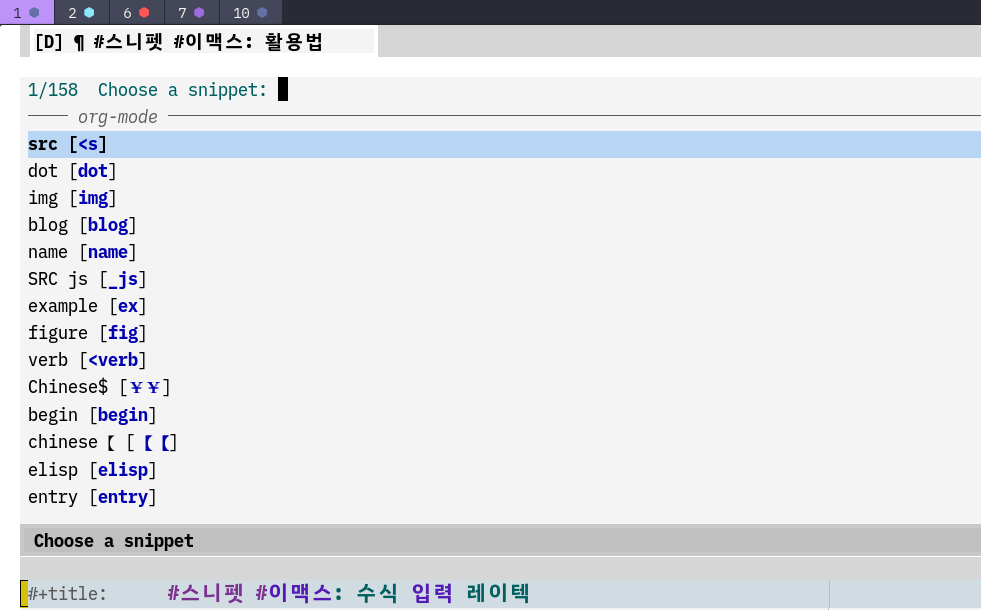

<!-- gid:20231018T171100 -->
[TOC]

[[TIP("이 노트에 대하여")]]
이맥스에서 스니펫을 다루는 여러 패키지의 성격과 쓰임을 한곳에 모아 비교한다. 간결한 템플릿부터 자동 생성 스니펫까지 어떤 도구가 어떤 순간에 맞는지 감을 잡게 해 준다.
[[/TIP]]

## BIBLIOGRAPHY

  “Abo-Abo/Auto-Yasnippet.” 2025. [https://github.com/abo-abo/auto-yasnippet](https://github.com/abo-abo/auto-yasnippet).
  “Doomemacs/Snippets: The Doom Emacs Snippets Library.” 2025. [https://github.com/doomemacs/snippets](https://github.com/doomemacs/snippets).
  jdhao. 2021. “Setting up Yasnippet for Emacs.” October 6, 2021. [https://jdhao.github.io/2021/10/06/yasnippet_setup_emacs/](https://jdhao.github.io/2021/10/06/yasnippet_setup_emacs/).
  “Minad/Tempel.” 2024. [https://github.com/minad/tempel](https://github.com/minad/tempel).

## 관련메타

-   [스니펫](https://wikidocs.net/380701)
-   [스니펫 이맥스: 수식 레이텍 laas](https://wikidocs.net/381375)

## tempel

-   [2023-01-19 Thu 16:48]
-   [2023-10-18 Wed 17:14]

### minad/tempel

(“Minad/Tempel” 2024)

:classical\\_building: TempEl - Simple templates for Emacs

23/01/19--20:29 :: 닷 파일에 반영했으니까 확인하라. 일단 써보면 안다.

잠시만, tempel 이거 괜찮은데 스맥스에 컴패니랑 같이 분일 수 있어? 왜냐면 이게 corfu 개발자가 만든거라. Emacs 빌트인 tempo 를 사용하는 거라 더 간단하다고 한다. 일단 관리가 간편하고 간단하더라. 아래와 같다.

quote 를 입력하고 `M++` 를 입력하면 아래와 같이 나온다. 템플릿에서 보면 p n 메커니즘이 있기에 해당 위치에 커서가 이동하고 입력하는 식으로 하면 된다. 스니펫이랑 같으면서도 편하다. 나는 이게 편하다.

> 진짜 쉽다. 이게 편하다.

## @doomemacs <span class="org-hashtag">#모듈</span> :editor snippets

[2025-06-10 Tue 11:52]

둠이맥스에는 This module adds snippet expansions to Emacs

```elisp
(package! yasnippet :pin "2384fe1655c60e803521ba59a34c0a7e48a25d06")
(package! auto-yasnippet :pin "6a9e406d0d7f9dfd6dff7647f358cb05a0b1637e")
(package! doom-snippets
  :recipe (:host github
           :repo "doomemacs/snippets"
           :files (:defaults "*"))
  :pin "fd4edaaf0c8476a26994db17d084b36733c635e2")
```

### abo-abo/auto-yasnippet

(“Abo-Abo/Auto-Yasnippet” 2025)

-   Krehel, Oleh
-   quickly create disposable yasnippets
-   2025

### Yasnippet for Emacs

[2023-10-18 Wed 17:13] (jdhao 2021)

-   Unlike Vim/Neovim, where there are snippet engines like ultisnips and other plugins. In Emacs, the de facto snippet engine is yasnippet.
-   2021

기본은 tab, backtab 으로 되어 있다. 아래를 추가한다. M-n, M-p 로 매핑했다. 이게 안전하다.

```text
(define-key yas-minor-mode-map (kbd "M-z") 'yas-expand)

Jump forward and backward
To jump forward and backward through the tabstop fields/positions, the default is to use Tab and Shift+Tab. You can customize via the following config:

;; use Meta-j and Meta-k to jump between fields
(define-key yas-keymap (kbd "M-j") 'yas-next-field-or-maybe-expand)
(define-key yas-keymap (kbd "M-k") 'yas-prev-field)
```

### §doom-snippets The Doom Emacs snippets library

[2024-04-04 Thu 13:56] (“Doomemacs/Snippets: The Doom Emacs Snippets Library” 2025)

-   The Doom Emacs snippets library

아하! `SPC i s` 로 활용할 수 있다.

#### 스크린샷

[2025-06-10 Tue 11:48]


