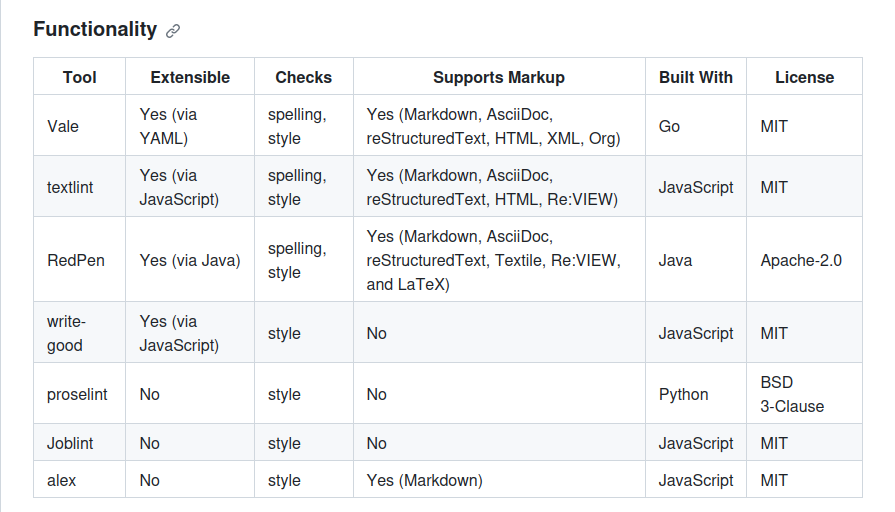

<!-- gid:20231108T061821 -->
[TOC]

[[TIP("이 노트에 대하여")]] Vale를 설치하고 살펴보며 한국어 문장 교열에는 왜 바로 맞지 않는지 생각한다. 형태소분석 부재가 한계가 되는 지점을 짚으면서 후속 대안으로 Kiwi 같은 도구를 바라보게 한다. [[/TIP]] - [notes/ 린터: 텍스트린트 발레 한글 버전 만들고 싶지 '2024-09-23](https://notes.junghanacs.com/notes/20240923T220612/)
-   [notes/ 발레 통합 예제 dotfiles/config/vale/styles/Google cashpw/dotfiles 교열 '2025-03-28 2025-03-28](https://notes.junghanacs.com/notes/20250328T172918/)

Why Vale not Textlint for Hangul linter with YAML 한글 Linter 만드는 길

## <span class="org-hashtag">#설치</span> 수동

[2024-10-08 Tue 15:46]

```text
sudo snap remove vale
wget https://github.com/errata-ai/vale/releases/download/latest/vale_3.7.1_Linux_64-bit.tar.gz
tar -xf vale_3.7.1_Linux_64-bit.tar.gz
cp vale ~/.local/bin
vale --version
```

## vale linter: Your style, our editor <span class="org-hashtag">#린터</span>

(“Vale Linter: Your Style, Our Editor #린터” n.d.)

-   Vale is a command-line tool that brings code-like linting to prose. It’s fast, cross-platform (Windows, macOS, and Linux), and highly customizable.

Vale is a command-line tool that brings code-like linting to prose. It's fast, cross-platform (Windows, macOS, and Linux), and highly customizable.

Vale 은 산문에 코드와 같은 린팅 기능을 제공하는 명령줄 도구입니다. 빠르고, 크로스 플랫폼(Windows, macOS, Linux)을 지원하며, 고도로 사용자 정의할 수 있습니다.

-   [X] **Support for markup**: Vale has a rich understanding of many [markup formats](https://docs.errata.ai/vale/scoping#formats), allowing it to avoid syntax-related false positives and intelligently exclude code snippets from prose-related rules.

-   [X] A **highly customizable** [extension system](https://vale.sh/docs/topics/styles/): Vale is capable of enforcing _your style_---be it a standard [editorial style guide](https://github.com/errata-ai/styles#available-styles) or a custom in-house set of rules (such as those created by [GitLab](https://docs.gitlab.com/ee/development/documentation/testing.html#vale), [Homebrew](https://github.com/Homebrew/brew/tree/master/docs/vale-styles/Homebrew), [Linode](https://www.linode.com/blog/linode/docs-as-code-at-linode/), [CockroachDB](https://github.com/cockroachdb/docs/tree/master/vale), and [Spotify](https://github.com/spotify/backstage)).

-   [X] **Easy-to-install**, stand-alone binaries: Unlike other tools, Vale doesn't require you to install and configure a particular programming language and its related tooling (such as Python/pip or Node.js/npm).

See the [documentation](https://vale.sh) for more information.

> **NOTE**: While all of the options listed below are open-source (CLI-based) linters for prose, their implementations and features vary significantly. And so, the "best" option will depends on your specific needs and preferences.

| Tool       | Extensible           | Checks          | Supports Markup                                                         | Built With | License      |
|------------|----------------------|-----------------|-------------------------------------------------------------------------|------------|--------------|
| Vale       | Yes (via YAML)       | spelling, style | Yes (Markdown, AsciiDoc, reStructuredText, HTML, XML, Org)              | Go         | MIT          |
| textlint   | Yes (via JavaScript) | spelling, style | Yes (Markdown, AsciiDoc, reStructuredText, HTML, Re:VIEW)               | JavaScript | MIT          |
| RedPen     | Yes (via Java)       | spelling, style | Yes (Markdown, AsciiDoc, reStructuredText, Textile, Re:VIEW, and LaTeX) | Java       | Apache-2.0   |
| write-good | Yes (via JavaScript) | style           | No                                                                      | JavaScript | MIT          |
| proselint  | No                   | style           | No                                                                      | Python     | BSD 3-Clause |
| Joblint    | No                   | style           | No                                                                      | JavaScript | MIT          |
| alex       | No                   | style           | Yes (Markdown)                                                          | JavaScript | MIT          |

The exact definition of "Supports Markup" varies by tool but, in general, it means that the format is understood at a higher level than a regular plain-text file (for example, features like excluding code blocks from spell check).

Extensibility means that there's a built-in means of creating your own rules without modifying the original source code.

## 사용법? 연동법? 그 이전에 변환법

[2023-11-08 Wed 06:33] 왜 Vale 인가?! YAML 포멧 때문이다. [2023-11-08 Wed 06:45] 확장을 YAML 로 한다는 것은 여러모로 장점이 많다. 마크업을 다양하게 지원하는 것만이 문제가 아니다. 스타일과 단어 체크하자는데 간단한게 좋지 않는가? 왜 그렇다면 Textlint 에 집착했는가? 별 생각이 없었는가?! 일본어 구성이 완벽했기 때문이다. 젠 서비스에 연동되는 것만 보더라도 압도적인 경험이 아닌가? 아름다운 경지에 이르렀다. 그렇다면 시작하는데 무엇인가? 일본에서도 모르겠다만 다시 한다면 Vale 에 적용하는 것을 고려할 지도 모른다. 아직 Vale 를 다 모르지만 완벽하게 포함 가능하면서 더 확장성이 있다면 말이다. 그렇다면 지금 나의 시작은 그저 Vale 로 작업하는게 더 나은 선택이다. 코딩의 몫은 Emacs 와 Elixir 에 집중하면 된다. 되도록이면 함수형 언어로 필요한 핵심에 접근하면 에너지를 줄일 수 있다.  Related-Notes - [린터: 슈퍼린터 깃허브 마켓플레이스](https://notes.junghanacs.com/bib/20250115T174121/)

## BIBLIOGRAPHY

  “Tpeacock19/Flymake-Vale.” 2024. [https://github.com/tpeacock19/flymake-vale](https://github.com/tpeacock19/flymake-vale).
  “Vale Linter: Your Style, Our Editor #린터.” n.d. Accessed September 11, 2024. [https://vale.sh/](https://vale.sh/).

## <span class="org-todo done DONT">DONT</span> vale 린터

[2024-10-07 Mon 23:11] (“Tpeacock19/Flymake-Vale” 2024) 스코드 보니까 장난아니다. 린터가 왕창 붙는구나. 놀랍다. 근데 켰나 내가? 응 vale-vscode 있네 - Related-Notes -&gt; 이것도 오타다. 아래 봐라. 여기 많은데 아마 한글 설정 하던거 있지? </home/junghan/mydotfiles/config-common/.config/vale> [텍스트린터 발레 한글 버전 : 제작](https://notes.junghanacs.com/notes/20240923T220612/) 여기서 해봤잖아. 물어가면서 하면 된다.

### flymake-vale 사용

(“Tpeacock19/Flymake-Vale” 2024)

### [2023-12-22 Fri 15:40] 기록

vale 뭐가 문제 였는가? 검토했었네. 근데 왜?! 형태소 분석기 연동해서 진행하려면 답이 없다. 그래서 안된다.

그렇다면 방법은 Textlint 로 작업하는 것 뿐이다. 일단 JSON 파일에 있는 것을 어떻게 옮겨와야 하는가?

편하게 생각하고 하나씩 하면 된다. 그냥 옮겨도 된다. 근데 무엇을 검사하고 싶은 것인가? 계속 돌지 말고 하나씩 해보자.
