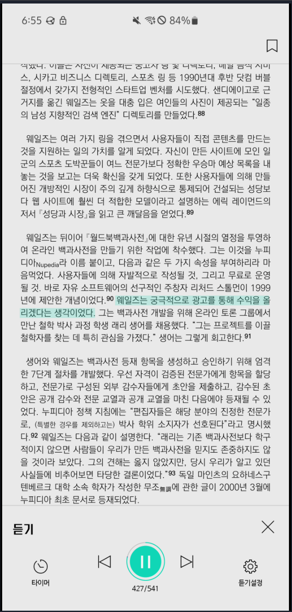

<!-- gid:20231118T065236 -->
[TOC]

[[TIP("이 노트에 대하여")]]
scrcpy를 이용해 안드로이드 화면을 리눅스에서 띄우고 제어하는 과정을 정리한다. 패키지 설치, 직접 빌드, 홈브루 경로까지 비교하며 무엇이 실제로 쓸 만했는지 남긴 기록이다.
[[/TIP]]

## BIBLIOGRAPHY

- “Genymobile/Scrcpy.” 2025. [https://github.com/Genymobile/scrcpy](https://github.com/Genymobile/scrcpy).

## Genymobile/scrcpy

(“Genymobile/Scrcpy” 2025)

[안드로이드](https://wikidocs.net/380626) Display and control your Android device

## 필요해?

그냥 apt-get 으로 설치해.

## <span class="org-todo done DONT">DONT</span> 2024-04-28 최신 버전 설치 + 갤럭시 S23

<https://github.com/Genymobile/scrcpy/blob/master/doc/linux.md>

```text
깃허브 클론해서 빌드하면 된다.
사용 할 때

-K -M 옵션을 줘야 된다.
```

## <span class="org-todo done DONT">DONT</span> scrcpy install

-   [2025-02-13 Thu 12:50] 전자책 보려는데 락 걸려있어서 소용 없구나 역시
-   [2024-10-23 Wed 22:24] 우분투에는 설치하려면 컴파일하는게 좋다.

<!--listend-->

```shell
# for Debian/Ubuntu
sudo apt install ffmpeg libsdl2-2.0-0 adb wget \
                 gcc git pkg-config meson ninja-build libsdl2-dev \
                 libavcodec-dev libavdevice-dev libavformat-dev libavutil-dev \
                 libswresample-dev libusb-1.0-0 libusb-1.0-0-dev
cd ~/git/clone
git clone https://github.com/Genymobile/scrcpy
cd scrcpy
./install_release.sh
```

## It works

[2023-11-18 Sat 06:02]

<https://github.com/Genymobile/scrcpy/blob/master/doc/linux.md>

```text
jhnuc :: ~/.local/bin » scrcpy                                                          2 ↵
scrcpy v2.2 <https://github.com/Genymobile/scrcpy>
 daemon not running; starting now at tcp:5037
 daemon started successfully
INFO: ADB device found:
INFO:     -->   (usb)  R3CM80KXYWY                     device  SM_N971N
/home/linuxbrew/.linuxbrew/Cellar/scrcpy/2.2/share/scrcpy/scrcpy-server: 1 file pushed, 0 skipped. 1.6 MB/s (64363 bytes in 0.038s)
[server] INFO: Device: [samsung] samsung SM-N971N (Android 12)
INFO: Renderer: opengles2
INFO: OpenGL version: OpenGL ES 3.2 Mesa 23.0.4-0ubuntu1~23.04.1
INFO: Trilinear filtering enabled
INFO: Texture: 1080x2280

```

## <span class="org-todo done DONT">DONT</span> Ebook Viewer 막혔다

-   [2025-02-13 Thu 13:06] 안된다. 막혔다.
-   [2023-11-18 Sat 06:55] 잘 된다. 괜찮다.



## <span class="org-todo done DONT">DONT</span> install 'homebrew' and 'scrcpy'

-   [2024-04-28 Sun 06:19] homebrew 안쓴다. 공간 많이 차지. 하지마라
-   [2023-11-18 Sat 05:59] 리눅스에서도 가능하다. 설치하면 된다. 왜? 홈브루가 필요한가? 패키지를 최신 버전으로 제공하니까.

<!--listend-->

<a id="code-snippet--install homebrew"></a>
```bash

/bin/bash -c "$(curl -fsSL https://raw.githubusercontent.com/Homebrew/install/HEAD/install.sh)"

test -d ~/.linuxbrew && eval "$(~/.linuxbrew/bin/brew shellenv)"
test -d /home/linuxbrew/.linuxbrew && eval "$(/home/linuxbrew/.linuxbrew/bin/brew shellenv)"
echo "eval \"\$($(brew --prefix)/bin/brew shellenv)\"" >> ~/.bashrc

brew install scrcpy
sudo apt-get install adb

```
