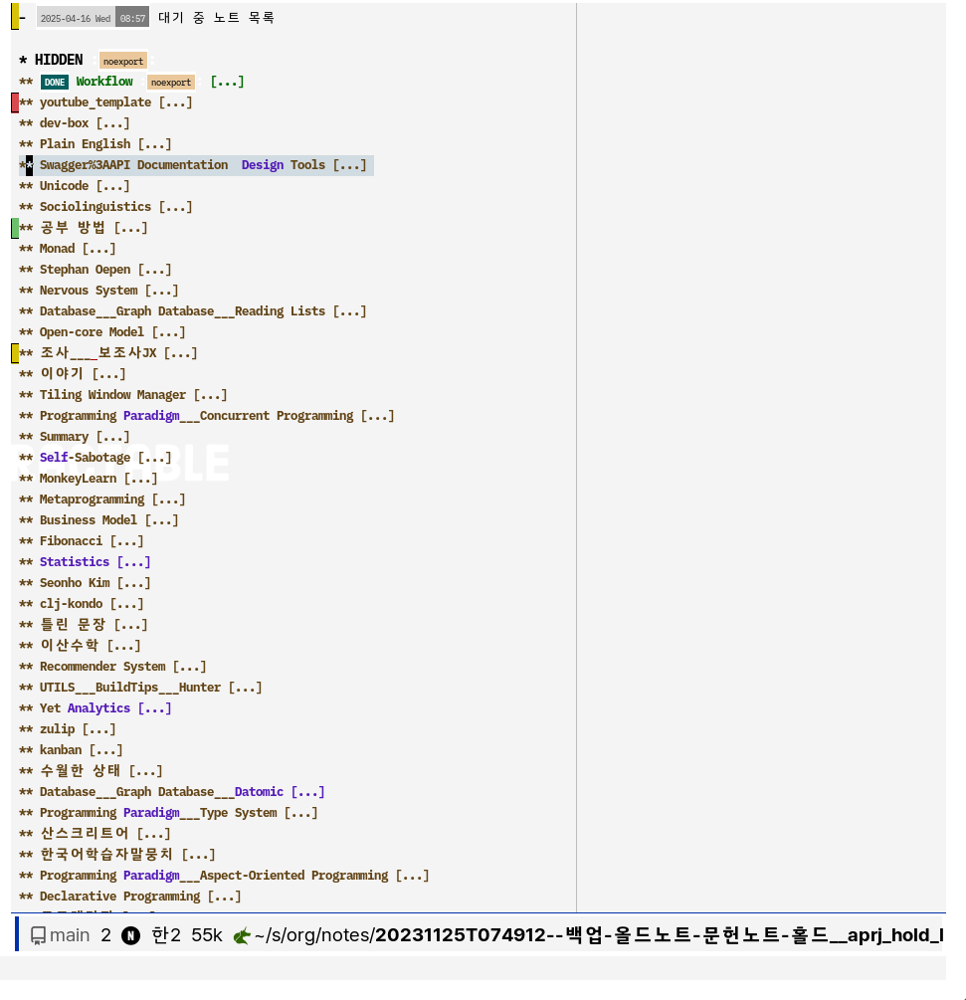

<!-- gid:20231125T074912 -->
[[TIP("이 노트에 대하여")]]
로그시크 시절에 만들었던 워크플로우와 문헌노트, 태그 체계를 백업 차원에서 붙잡아 둔 노트다. 지금은 과거 자산이지만, 개인 지식관리의 초기 설계가 어떻게 형성되었는지 읽을 수 있는 흔적이 많다.
[[/TIP]]

<!-- provenance:source:start -->
[[TIP("원본·최신본")]]
이 페이지는 한국어 검색과 읽기를 위한 WikiDocs 미러입니다. [원본·최신본은 가든](https://notes.junghanacs.com/notes/20231125T074912/)에 있습니다. 최신 수정 내용·백링크·태그·히스토리·댓글·출처 정보는 원본 가든에서 확인하세요.

- 작성: `2023-11-25T07:49:00+09:00`
- 최근 수정: `2025-04-16T00:00:00+09:00`
[[/TIP]]
<!-- provenance:source:end -->

## 히스토리

-   [2025-04-16 Wed 08:57] 대기 중 노트 목록
    
    대략 정리 필요한 것들
    
    

## related-Notes

-   [백업: 올드노트 제텔노트 정리대기중](https://wikidocs.net/381244)
