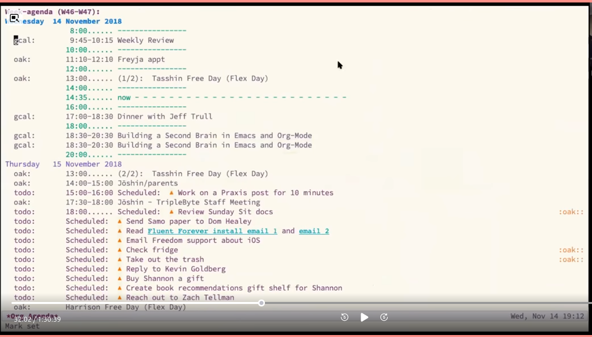
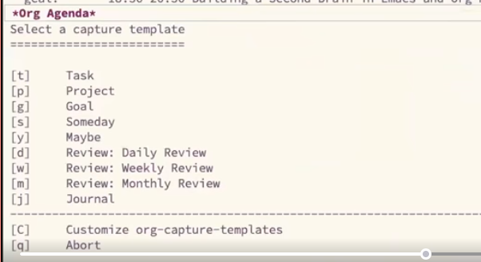
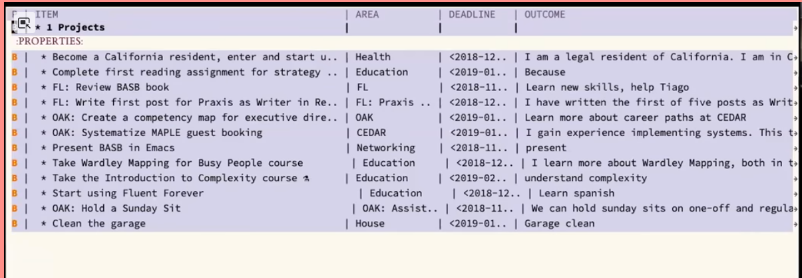
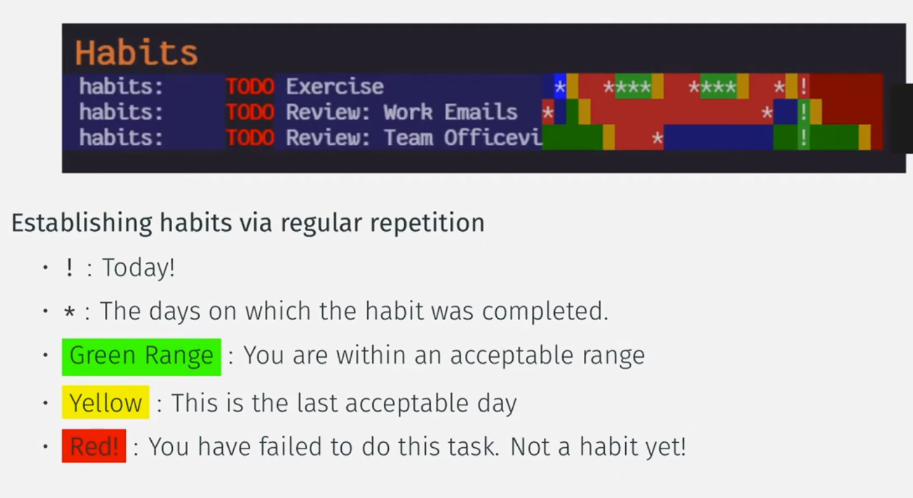
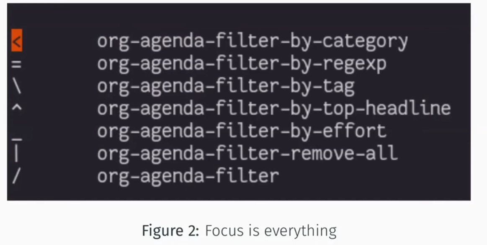
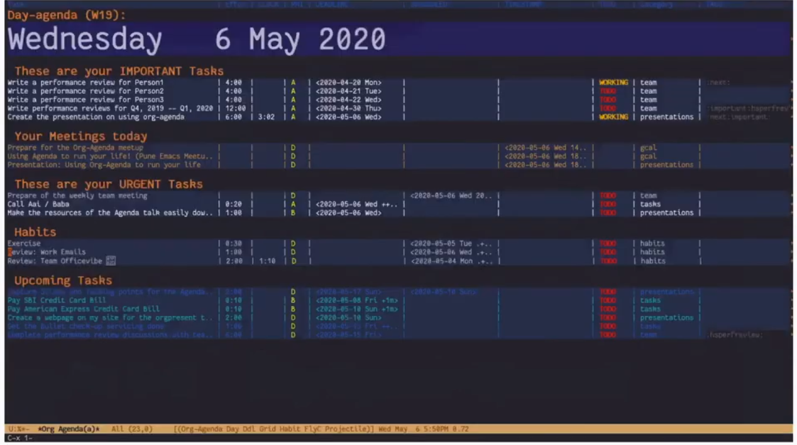
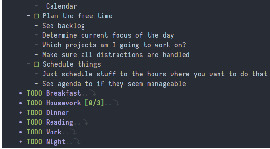

<!-- gid:20231209T075807 -->
[TOC]

[[TIP("이 노트에 대하여")]]
org-agenda 워크플로우 예제를 모아 두고 캡처와 파일 구조, 운영 원칙을 함께 점검한다. 실제 환경에 가져다 쓰기 전에 어떤 전제가 필요한지 파악하기 좋은 참고 노트다.
[[/TIP]]

## 히스토리

-   [2025-06-02 Mon 16:26] 이미지 링크 수정
-   [2023-12-09 Sat 07:58] 워크플로우 원칙을 확인한다. 그래야 캡처 시나리오에 문제가 없다.
-   [힣: 데일리 노트 저널 습관 워크플로우](https://wikidocs.net/381301)

## @norang Org Mode - Organize Your Life In Plain Text!

(“Org Mode - Organize Your Life in Plain Text!” n.d.)

-   [어젠다: 텍스트로 당신의 인생을 설계하라 - norang](https://wikidocs.net/381145)

### Workflow notes

-   Create and maintain as many files in your org-directory as you want.
-   Currently, I don't handle recursively loading org files, so your org-directory should be a flat structure.
-   Tasks are categorized as follows:
    -   Important tasks: These tasks should be tagged with `important`.
    -   Next tasks: In any given project, tag the next thing you want to do with the tag `next`. You can have many `next` tasks, but ideally you should have only one. Whenever a task goes into WORKING state, it automatically gets the `next` tag. Moving to any other state automatically removes this tag.
-   The following hotkeys are provided for quick tagging:

-   조직 디렉터리에 원하는 만큼 파일을 만들고 관리하세요.
    -   현재 저는 재귀적으로 로드되는 조직 파일을 처리하지 않으므로 조직 디렉터리는 플랫한 구조여야 합니다.
    -   작업(Tasks)은 다음과 같이 분류됩니다:
        -   `Important tasks`: 이러한 작업은 `imporatant` 로 태그를 지정해야 합니다.
        -   `Next tasks`: 특정 프로젝트에서 다음에 하고 싶은 일에 `next` 태그를 붙입니다. `next` 작업은 여러 개를 붙일 수 있지만, 이상적으로는 하나만 붙이는 것이 좋습니다. 작업이 WORKING 상태가 되면 자동으로 `next` 태그가 붙습니다. 다른 상태로 이동하면 이 태그는 자동으로 제거됩니다.
-   빠른 태그 지정을 위해 다음 단축키가 제공됩니다:

<!--listend-->

```emacs-lisp
(setq org-tag-alist
      '(("next" . ?x)
        ("notes" . ?n)
        ("important" . ?i)
        ("action_items" . ?a)
        ("joy" . ?j)
        ("waiting" . ?w)))
```

### Optional notes

-   You can use the convenience function \`bh/punch-in' (bound to `<f9> i`) to clock in a predetermined default task. All you need is the following one time setup:
    -   Go to the org-task you want to use as the default task.
    -   Give this task an org-id by running the function `org-id-get-create`
        ```emacs-lisp
        M-x org-id-get-create
        ```
    -   Copy the ID (stored in the task properties) and add the following line above `(require 'org-mode-crate)`
        ```emacs-lisp
        (defvar bh/organization-task-id "<task_id>")
        ```
-   Now when you start org-mode, you can press `<f9> i` to clock in the default task.

## @tasshin Implementing A Second Brain in Emacs and Org-Mode

(Tasshin 2017) [2023-10-11 Wed 14:39]

This post is a continuation of “Building A Second Brain with Emacs and Org-Mode.” If you haven’t read that yet, read that post first. It gave a high level overview of how BASB extends GTD, what Emacs and Org-Mode are (and why I wanted to implement BASB with them), and what principles emerge from using

<https://tasshin.com/blog/implementing-a-second-brain-in-emacs-and-org-mode/>

아주 간단한 캡처 구성을 가지고 있다. 프로젝트 관련하여 내가 가진 시스템과 동일한 노랑님 스타일인데




이 부분 간단 명료하다.



project view



stuck projects : org-mode manual

-   org-agenda-list-stuck-projects --? 동작 안된다?!

regular reviews

daily - tasks, weekly - projects monthly - goals annual - vision

review 템플릿 굳. j 참고할 코드 내역

## @vedang Emacs Meet up Session II: Org Agenda


[2023-11-09 Thu 11:41] 어마어마 좋은 훌륭 노트

-   <https://github.com/vedang/org-mode-crate/blob/master/org-mode-crate.el>
-   <https://github.com/vedang/org-mode-crate>

-   All the work you need to do
    
    -   Deadline
    -   Scheduled - need to start
    
    `C-c .` 'org-time-stamp
    
    Plain Date : I want to see this when i'm looking at a particular data range `C-c .` 맞는가? 타임스템프 위에서 아래와 같이 변경하면 쉽다.

from - to 시간은?! 앞에 시간 뒤에서 타임스템프를 호출하면 -- 가 생긴다.

```text

- Next/Prev any day of week : +Sun
- +5d
- 5 days from date-at-point ++5d
- insert time C-u C-c . "From 6 to 7pm" 18:00+1
- instant insert (C-u C-u C-c .)
- Date Range (Two C-c .'s, one after the other)

```

C-c . C-c . +5d

-   Repeating tasks Must do every week (+1w), Good to do every day (++1d)
    
    

-   Tracking what you need to do next

&lt; = \\ ^ _ | / org-agenda-filter-**\***

다르다 필터키가.



| cmd     | func        |
|---------|-------------|
|         |             |
| +       | priority-up |
| ,       | -           |
| -       | -down       |
| :       | set-tags    |
| I       | clock-in    |
| J       | goto        |
| O       | out         |
| C-c C-d | deadline    |
| C-c C-s | schedule    |

<https://github.com/vedang/emacs-up>

<https://vedang.me/about.html>

<https://github.com/junghan0611/csaoid/tree/master>

DayAgenda 를 다루는 방법에 대해서 말한다. 너무 많다. 정돈이 필요하다. 여기에 대한 대답은 다음 컬럼 뷰 이다.

-   Column View
    -   `C-c C-x C-c` 'org-agenda-columns
    -   'e' edit
        
        

### Workflow notes

-   Create and maintain as many files in your org-directory as you want.
-   Currently, I don't handle recursively loading org files, so your org-directory should be a flat structure.
-   Tasks are categorized as follows:
    -   Important tasks: These tasks should be tagged with `important`.
    -   Next tasks: In any given project, tag the next thing you want to do with the tag `next`. You can have many `next` tasks, but ideally you should have only one. Whenever a task goes into WORKING state, it automatically gets the `next` tag. Moving to any other state automatically removes this tag.
    -   중요한 작업: 이러한 작업에는 `중요` 태그를 붙여야 합니다.
    -   다음 작업: 특정 프로젝트에서 다음에 하고 싶은 작업에 `다음` 태그를 붙입니다. `다음` 작업은 여러 개를 붙일 수 있지만, 이상적으로는 하나만 붙이는 것이 좋습니다. 작업이 작업 중 상태가 되면 자동으로 `다음` 태그가 붙습니다. 다른 상태로 이동하면 이 태그가 자동으로 제거됩니다
-   The following hotkeys are provided for quick tagging:

<!--listend-->

```emacs-lisp
(setq org-tag-alist
      '(("next" . ?x)
        ("notes" . ?n)
        ("important" . ?i)
        ("action_items" . ?a)
        ("joy" . ?j)
        ("waiting" . ?w)))
```

## How do I keep my days organized with org-mode and Emacs isamert.net

(“How Do I Keep My Days Organized with Org-Mode and Emacs” n.d.)

<a id="figure--fig-test"></a>



## Related-Notes

-   [워크플로우](https://wikidocs.net/380530)
-   [계획](https://wikidocs.net/380751)

## BIBLIOGRAPHY

- “How Do I Keep My Days Organized with Org-Mode and Emacs.” n.d. Accessed September 5, 2024. [https://isamert.net/2021/01/25/how-i-do-keep-my-days-organized-with-org-mode-and-emacs.html](https://isamert.net/2021/01/25/how-i-do-keep-my-days-organized-with-org-mode-and-emacs.html).
- “Org Mode - Organize Your Life in Plain Text!” n.d. Accessed June 2, 2025. [https://doc.norang.ca/org-mode.html](https://doc.norang.ca/org-mode.html).
- Tasshin. 2017. “Implementing a Second Brain in Emacs and Org-Mode - Tasshin.” December 15, 2017. [https://tasshin.com/blog/implementing-a-second-brain-in-emacs-and-org-mode/](https://tasshin.com/blog/implementing-a-second-brain-in-emacs-and-org-mode/).
