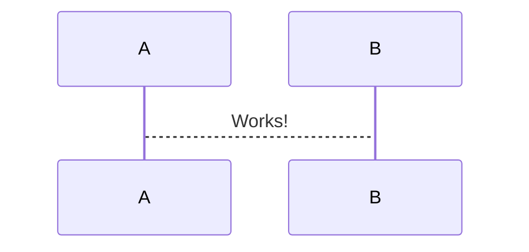
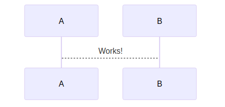
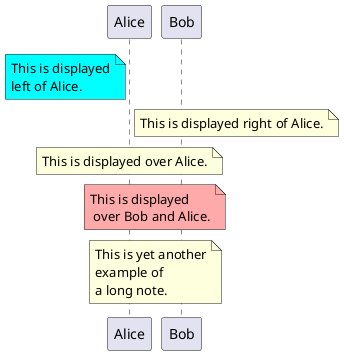

<!-- gid:20240116T141148 -->
[TOC]

[[TIP("이 노트에 대하여")]]
Mermaid, PlantUML, D2처럼 텍스트로 다이어그램을 만드는 도구를 Emacs와 Org-mode 맥락에서 정리한다. 안전성과 유지보수성, 실제 활용 경험을 함께 놓고 어떤 선택이 나은지 가늠하게 한다.
[[/TIP]]

## 관련메타

-   [마인드맵 다이어그램 시각화 사고법](https://wikidocs.net/380566)
-   [데이터시각화 도표 그래프 동적 대시보드 비주얼](https://wikidocs.net/380806)

## 히스토리

-   [2025-06-30 Mon 09:35] 대부분의 다이어그램은 텍스트로 만들어야 합니다. [ 온보딩](https://wikidocs.net/380828)

## ¤mermaid

-   [2024-04-12 Fri 14:16] 이맥스에서 안전한 선택

### 2025 ob-mermaid example

[2025-06-30 Mon 09:56]





### ob-mermaid

[2023-03-23 Thu 09:31]

-   스페이스맥스에 restclient 레이어에 이미 있다.

Mermaid is a tool for drawing systems diagrams. **NOTE**: The variable `ob-mermaid-cli-path` needs to be set in the config (because it will change from system to system).

```shell

npm install -g @mermaid-js/mermaid-cli
# mmdc -i input.mmd -o output.svg
```

#### ob-mermaid

### Mermaid | Diagramming and charting tool

(“Mermaid” n.d.)

### abrochard §mermaid-mode

(abrochard [2019] 2026)

Adrien Brochard 2024

Emacs major mode for working with mermaid graphs <https://mermaidjs.github.io/>

## ¤d2

d2 가 좋다. 쉽게 사용할 수 있으니까. 다이어그램은 하나 선택해서 해야 하는데 예쁜게 좋다. 이왕이면.

-   [문법: 영문법 - 문장 성분 품사 관계 - 다이어그램](https://wikidocs.net/381189)

### 설치 방법

<a id="code-snippet--install-d2"></a>
```bash

# Basics
curl -fsSL https://d2lang.com/install.sh | sh -s --
```

### FIXME ob-d2 exmaples

[2023-06-16 Fri 12:54]

[2024-01-16 Tue 14:34] 문제는 여백?! 상관 없이 블로그 엔진에서 로딩해주면 된다.

babel 검증 부터 한다. 이미지로 넣으면 되니까 Hugo 는 옵션이다.

테스트

```d2
x -> y: hello world
```

flags 옵션으로 테마 줄 수 있다. 이게 장점이기도 하다.

```d2
High Mem Instance -> EC2 <- High CPU Instance: Hosted By
```

다른 예제

```d2
clouds: {
  aws: {
    load_balancer -> api
    api -> db
  }
  gcloud: {
    auth -> db
  }

  gcloud -> aws
}
```

### ob-d2

[2023-06-16 Fri 12:47] <https://github.com/xcapaldi/ob-d2>

```elisp
;;;;; ob-d2

(defun jh-org/init-ob-d2 ()
  (use-package ob-d2
    :defer 15
    :config
    (setq ob-d2-command "~/.local/bin/d2")
    )
  )
```

## ¤plantuml

-   [모음: 둠이맥스 모듈](https://wikidocs.net/381193)

<!--listend-->



```text
/tmp/babel-sCCbLF/plantuml-8EIJK5.png
```
