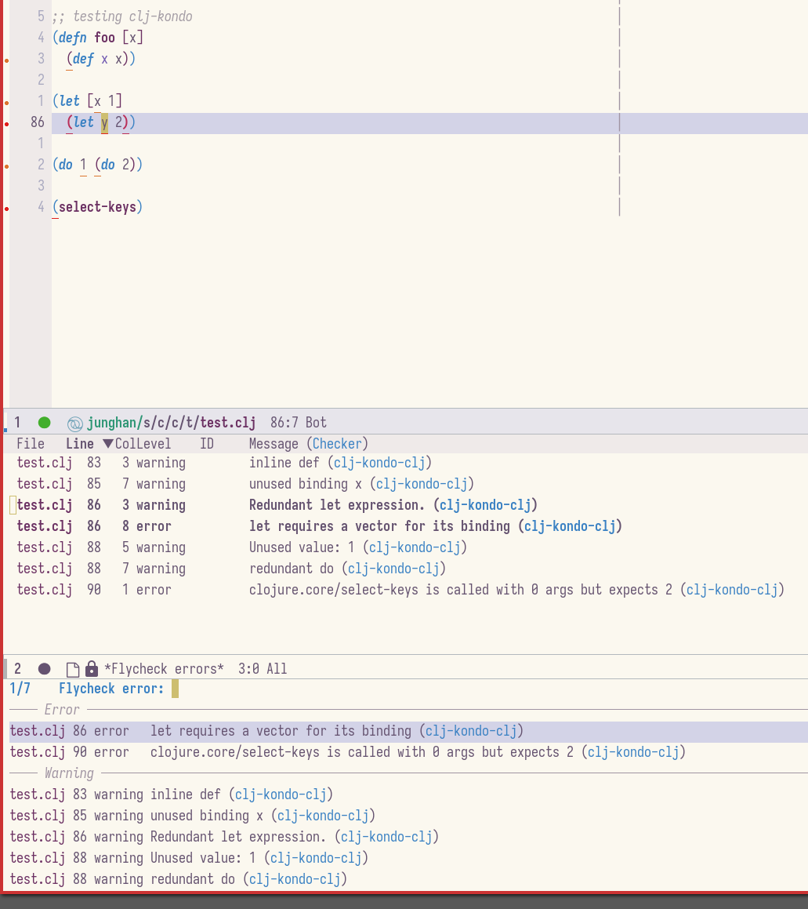
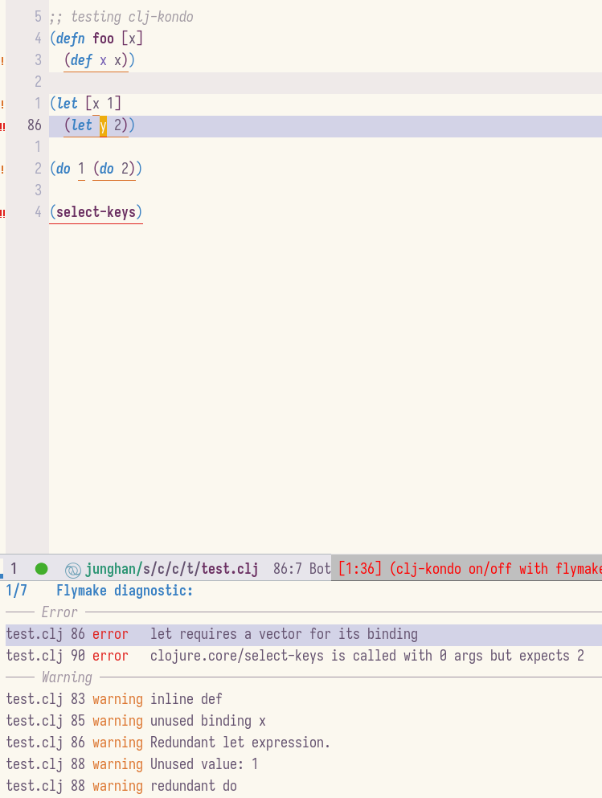

<!-- gid:20240117T121614 -->
[TOC]

[[TIP("이 노트에 대하여")]]
Clojure를 Emacs 통합개발환경 안에서 다루기 위해 필요한 관련 노트와 흐름을 엮어 둔다. 다른 언어용 IDE 노트들과도 연결되어 있어 전체 개발 환경 지도를 그리는 중심점 역할을 한다.
[[/TIP]]

## BIBLIOGRAPHY

  “Clojure-Lsp/Clojure-Lsp.” 2025. [https://github.com/clojure-lsp/clojure-lsp](https://github.com/clojure-lsp/clojure-lsp).
  “Leiningen - Clojure.” n.d. Accessed March 20, 2025. [https://leiningen.org/](https://leiningen.org/).
  “Weavejester/Cljfmt.” 2025. [https://github.com/weavejester/cljfmt](https://github.com/weavejester/cljfmt).

## 관련노트

-   [클로저](https://wikidocs.net/380504) 프로그래밍 언어

-   [이맥스 통합개발환경](https://wikidocs.net/380542)
-   [이맥스 통합개발환경: 웹 자바스크립트](https://wikidocs.net/381078)
-   [이맥스 통합개발환경: 엘릭서](https://wikidocs.net/381147)
-   [이맥스 통합개발환경: 파이썬](https://wikidocs.net/381174)
-   [이맥스 통합개발환경: 루비](https://wikidocs.net/381175)
-   [이맥스 통합개발환경: C언어 CPP언어 임베디드 clangd](https://wikidocs.net/381229)
-   [이맥스 통합개발환경: 하스켈](https://wikidocs.net/381251)
-   [이맥스 통합개발환경: 커먼리스프](https://wikidocs.net/381302)
-   [이맥스 통합개발환경: 하이랭 HY](https://wikidocs.net/381329)
-   [이맥스 통합개발환경: AWK 스크립트 Janet](https://wikidocs.net/381348)
-   [이맥스 통합개발환경: R언어 ESS](https://wikidocs.net/381349)
-   [이맥스 통합개발환경: 스킴 래킷 이맥스리스프](https://wikidocs.net/381370)

## 히스토리

-   [2024-06-01 Sat 18:30] 방향이 보인다.
-   [2023-10-20 Fri 13:09] 드디어 이 녀석을 정리해서 내 보낼 것이다. 어디서나 사용 가능한 고퀄리티 편집기.
-   [2022-09-27 Tue 21:29] 처음 작업한 문서

## Leiningen

[2025-03-20 Thu 09:34]

(“Leiningen - Clojure” n.d.)

[샘스트라우스 클로저 이맥스 유튜버 SammyEngineering::Clojure and Clojurescript Setup and Installation Tutorial (+ emacs/cider/shadow-cljs!)](https://wikidocs.net/382144.md#h-219110b7-7dd4-457f-9502-43931aac93ec/)

이게 사실 끝. 쉬울 수 있다.

```shell
sudo apt-get install leiningen

# lein new testproject
```

## 클로저 설치

[2023-07-30 Sun 15:02]

### binary  : clojure and clojure-lsp

-   [2023-07-31 Mon 05:30] asdf 사용하지 말고 바로 복붙하면 된다. 문서까지 포함 편하다.

이 두 녀석은 필수다

### clojure-lsp/clojure-lsp

(“Clojure-Lsp/Clojure-Lsp” 2025)

-   Clojure &amp; ClojureScript Language Server (LSP) implementation

## 아카이브

### <span class="org-todo done DONT">DONT</span> Cljfmt: weavejester/cljfmt

[2023-09-16 Sat 08:05] (“Weavejester/Cljfmt” 2025)

-   Reeves, James
-   A tool for formatting Clojure code

이럴수가 이렇게 해야 한다. 그렇다면 format-all 에서 제외해야 한다.

Code formatting via [CIDER](https://github.com/clojure-emacs/cider) using [Cljfmt](https://github.com/weavejester/cljfmt)

```text
/bin/bash -c "$(curl -fsSL https://raw.githubusercontent.com/weavejester/cljfmt/HEAD/install.sh)"

jhnuc➜  ~  ᐅ  /bin/bash -c "$(curl -fsSL https://raw.githubusercontent.com/weavejester/cljfmt/HEAD/install.sh)"
Downloading cljfmt binaries... Done!
[sudo] junghan 암호:
Extracted cljfmt into /usr/local/bin
```

### <span class="org-todo done DONT">DONT</span> zprint

[2023-09-16 Sat 07:46] 이걸 설치해야 한다. 설치 방법이 있더군 리눅스니까. <https://github.com/kkinnear/zprint/blob/main/doc/getting/linux.md>

vscode 도 설정 했으나 cursive 에서 제공한다네 그렇다면 괜한 짓을 한것인가 싶다. 아마 이야기가 없는 걸로봐서는 필요가 없었을지도

### <span class="org-todo done DONT">DONT</span> 2022 작업로그 이맥스 clj-kondo

-   [2023-07-31 Mon 05:20] 작업로그

별도로 설치할 경우는 cider 로 다 커버 할 때를 말한다. lsp 는 built-in 되어 있다.

#### WHY

[2022-12-27 Tue 09:50]

좋아. 지금 막히는 부분이 콘도인데. 코지는 왜 콘도 없는가? 사이더로 알 수 있는 것과 안되는 것을 알아야 콘도를 쓰는게 의미가 있다. 그렇지 않으면 콘도를 넣으면 안된다. 콘도를 넣으면 Flycheck 가 기본으로 지원이 되는게 현재 스맥스이다. 대안은 Flymake 이다. Flymake 로 가면 단계적으로 - <SPAN CLASS="ORG-HASHTAG">#FIXME</SPAN> 23965ba6-f341-4122-b010-8393a0e26587][Eglot LSP]] 을 사용할 수 있기 때문에 Flymake 는 필수이다.

#### clj-kondo :: static analyzer and linter for Clojure code

소개 정도 적어 놓는다.

#### flycheck-clj-kondo in spacemacs

[2022-12-27 Tue 13:38]

##### syntax checking layer

syntax checking 레이어가 flycheck 이다.

-   layer config clojure-backend 'cider clojure-enable-linters 'clj-kondo ;; (use-package flycheck-clj-kondo)

##### flycheck-clj-kondo test

어떻게 연동 되는지 보자.



flymake 비교하여 뭐가 특별할게 있는가?

##### keybinding

솔직히 키 바인딩 다 필요 없을게다. 잠시만 eglot 으로 가면? 어짜피 linter 보는 키바인딩은 동일해야 할 것이다. 스페이스맥스 바인딩이다. 불편하다.

#### flymake-kondor

flymake-kondor 로 본다. 설정 가져오자. 다음 2 개에서 flymake-kondor 를 쓴다. zmansky 교수는?!

vanilla/prot-dotfiles/emacs/.emacs.d/prot-emacs-modules/prot-emacs-langs.el 201:(prot-emacs-elpa-package 'flymake-kondor 202: (add-hook 'clojure-mode-hook #'flymake-kondor-setup))

##### 글로벌 키 바인딩 flymake keybinding

flymake-goto-next-error / flymake-goto-prev-error 만 잡아주면 된다. 백엔드로 등록해 놓으면 체크 해줄 것 아닌가?

즉, 스맥스를 기준으로 SPC e n/p 로 잡는다. 코지는 SPC j 로 잡았다. 뭐 여튼 잡는다. 기존 함수랑 바로 바인딩 (시그날 형식)이 될 것도 같은데?! 그냥 코지 바인딩으로 잡자. 스페이스맥스를 수정해야 한다. 귀찮은 일이다.

##### 메이저 모드 키 바인딩

메이저모드(클로저 모드)로 잡는 것도 좋겠다.

#### flymake-kondor test

아래와 같이 나온다. 근데 왜 자동으로 flymake-mode 가 동작이 안되네?! 이것부터 수정을 해야겠다. 결과는 다를게 없다 괜찮다. 충분하다. 키바인딩만 잘하면 되겠다.



### <span class="org-todo done DONT">DONT</span> 2022 cli-config and lsp-config : 존

-   [2025-02-09 Sun 22:29] 하지마라. 필요하면 하라.
-   [2023-07-31 Mon 05:30] 존이 하라는 대로 하는게 편하다. 거기에 필요한 것들다 들어가 있다.

cli-config, lsp-config 는 포크해서 관리한다. 그렇게 사용하면 된다. kit 에 필요한 것들도 아마 커버가 될 것이다.
