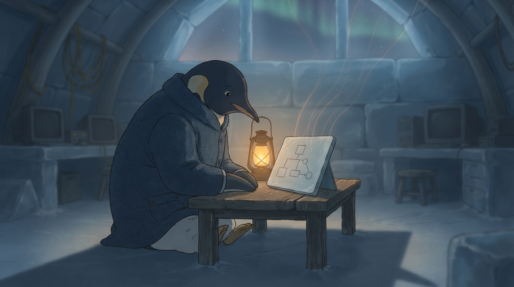

<!-- gid:20240201T061741 -->
[[TIP("이 노트에 대하여")]]
2024년 2월, 힣은 영문법을 정리하다가 스스로에게 3인칭으로 되물었다 — "그가 원하는 것은 무엇인가?" 답은 문법이 아니었다. 어떤 지식이든 그림·구조·개념 체계·지식 그래프로 붙잡고 싶다는 충동이었고, 영문법은 그 충동이 손에 잡히는 첫 시험대였을 뿐이다. 이 방은 그 충동의 가장 이른 화석이다. 같은 물음은 2026년 폴게제텔·지식그래프·PKM-AI 질문(20250214T145957)으로 그대로 되돌아온다.
[[/TIP]]

<!-- provenance:source:start -->
[[TIP("원본·최신본")]]
이 페이지는 한국어 검색과 읽기를 위한 WikiDocs 미러입니다. [원본·최신본은 가든](https://notes.junghanacs.com/notes/20240201T061741/)에 있습니다. 최신 수정 내용·백링크·태그·히스토리·댓글·출처 정보는 원본 가든에서 확인하세요.

- 작성: `2024-02-01T06:17:00+09:00`
- 최근 수정: `2026-08-03T10:34:00+09:00`
[[/TIP]]
<!-- provenance:source:end -->

[TOC]

## 히스토리

-   [2026-08-03 Mon 09:56] @mitsein — 표준 구조로 수선. 원문은 영문법에 갇힌 노트가 아니라 "그림으로 아는 법"에 대한 첫 충동이라는 GLG의 재해석을 abstract·설명에 반영하고, 관련노트에 짝 노트(20240201T172745)와 2026년의 재발화(20250214T145957)를 연결했다. 원문은 손대지 않았다.
-   [2025-06-30 Mon 09:49] 좀 더 보편 유추 개념에서 문서를 확장
-   [2024-02-01 Thu 06:06] 영문법 다이어그램 정리하면서

## 관련메타

-   [0=96 보편 특수 범용 특이](https://notes.junghanacs.com/meta/20250424T233558/)
-   [지식그래프](https://notes.junghanacs.com/meta/20240531T202141/)
-   [문법 구문](https://notes.junghanacs.com/meta/20240131T142525/)
-   [비유 은유 메타포 유추 흔적 범주화](https://notes.junghanacs.com/meta/20241022T042829/)
-   [지도](https://notes.junghanacs.com/meta/20250422T200602/)

## 관련노트

-   [문법: 영문법 - 문장 성분 품사 관계 - 다이어그램](https://notes.junghanacs.com/notes/20240201T172745/) — 같은 날 오후, 실제로 문장성분·품사·D2 다이어그램을 시도해 본 짝 노트. 이 방의 충동이 손에 닿았던 유일한 구체 사례.
-   [힣: 왜 나는 지식그래프를 계속 묻는가 — 문과 길, 자석과 살아 있는 프로피디아](https://wikidocs.net/388290) — 2년 반 뒤, 같은 물음이 폴게제텔·임베딩·PKM-AI로 다시 불붙은 곳. 대상은 영문법에서 힣의 가든 전체로 넓어졌다.

## 한 줄

그림이 먼저다 — 문법은 그 첫 시험대였을 뿐이다.

## 3인칭으로 되물은 이유

원문은 "그는", "그가"로 자신을 가리킨다. 1인칭으로 "나는 문법을 알고 싶다"고 썼다면 이 노트는 영어 공부 메모로 남았을 것이다. 3인칭으로 물으니 질문이 한 겹 물러나 "그가 정말 원하는 것은 무엇인가"라는 더 큰 질문이 됐다. 원문 스스로 답한다 — "그는 이 문법 구조를 하나도 모른다. 다 까먹었다. 근데 안다. 이건 확실히 좋다는 것." 잊은 문법 지식이 아니라, 지식을 구조로 붙잡는 감각 자체가 남아 있다는 뜻이다.

이 노트를 문법 학습 팁으로 읽으면 오독이다. 체크리스트 두 줄("영작문 노트 → EKG → LLM 연동 diagram/table", "노드 사이 관계는 명시적으로")은 실행 계획이 아니라, 아직 이름 붙지 않은 충동을 손에 잡히는 데까지 밀어붙인 흔적으로 읽어야 한다.

## 이미지 — 첫 화석



이 노트는 지식그래프·PKM-AI 질문의 "가장 이른 화석"이라고 설명에서 말했다. 이미지는 그 화석의 순간을 문자 그대로 그린다 — 힣맨이 이른 새벽 대장간 한켠에서 자기가 손수 그린 작은 도형 도표(글자도 문법 표기도 없는, 상자와 원을 이은 순수한 선)를 들여다본다. 승리도, 완성도 아닌 물음의 자세다. 슬레이트 가장자리에서 가는 호박색 실선 몇 가닥이 위로 피어올라 창밖 오로라 쪽으로 이어지는데, 아직은 가늘고 성긴 씨앗일 뿐이다 — 20250214T145957에서 하늘 전체를 채우는 "살아 있는 프로피디아" 그물의 가장 이른 형태다.

### 생성 파라미터

-   모델: `gemini-3.1-flash-lite-image` (나노바나나 2 Lite)
-   비율: 16:9
-   해상도: 1K
-   저장: `~/screenshot/20260803T103645--glgman-first-fossil-diagram__brand_geminilite.jpg`
-   구조: GLGMAN Universe 대장간 실내 lock + 갑옷·칼 없는 평상복 + 순수 도형 슬레이트(글자 금지) + 슬레이트에서 오로라로 이어지는 가는 실선 + 여우·아기펭귄 배제(1인 장면).

### 프롬프트 전문

```text
[World: GLGMAN Universe]
Style: 2D illustration, midpoint between Disney and Studio Ghibli, clean linework, soft cel-shading
Setting: Antarctic winter village — snow-covered igloos, aurora borealis in deep navy sky, amber dawn at horizon, pine trees dusted with snow, ice-forge workshop built from ice blocks and whale bones. Pororo's winter wonderland meets blacksmith's workshop.
Color palette: deep navy background (polar dawn), white+navy (transformed armor), amber/gold (sword glow, runes, awakening light), ice-blue + orange sparks (forge)
Characters: anthropomorphic emperor penguin (father, main hero), baby penguin chick (son, tiny scarf), red-brown fox (agent/companion)
Recurring objects: circuit-patterned sword, org-mode symbols (★, TODO), terminal text fragments, "ENTWURF" rune letters, CRT monitors in snow, golden message cables
Mood: epic but warm, mythic but intimate
Do NOT: photorealistic, 3D render, excessive detail, dark/gritty tone

Scene title: "The First Fossil" — a small diagram on a slate, already reaching for the sky.

Literary meaning:
This is not a grammar lesson. It is the earliest fossil of a lifelong impulse — the wish to hold any knowledge as shape and structure, not as memorized rule. GLGMAN sits before a small, humble diagram he drew himself, and from its edges a few thin threads of light are just beginning to reach outward and upward, echoing the vast branching constellation that will one day fill the whole sky above him — but here, at this early hour, it is still small, tentative, only a seed.

Main scene:
Inside the small ice-forge workshop at first light, before the household wakes. GLGMAN (anthropomorphic emperor penguin, father, in his everyday winter coat, no armor, no sword) sits alone at a low wooden worktable, leaning forward with quiet, searching curiosity — not triumph, not fatigue, but the open expression of someone asking a question of himself. On the table lies a single flat slate of pale ice, propped up slightly. On its surface is a small, simple hand-drawn diagram: a handful of plain geometric shapes (a few connected boxes and circles) joined by thin drawn lines — an abstract structure-sketch, deliberately modest and unfinished-looking, like a first attempt, NOT a finished chart.

From the edges of this small slate, a few faint amber threads of light lift off the surface and drift upward into the dim pre-dawn sky above the workshop, where they thin out into the very beginning of a much larger web of light among the first stars — barely visible, sparse, only a hint of the vast branching canopy this will someday become. The workshop's usual golden message-cables and circuitry are dim and quiet in the background, not part of this moment.

One low amber lamp lights GLGMAN and the slate from one side; the rest of the workshop fades into soft blue-grey pre-dawn shadow. GLGMAN's own small shadow falls long across the ice floor.

Composition: intimate close-mid shot, three-quarter angle on GLGMAN and the slate, aurora and thin light-threads visible through the workshop's ice-block window in the upper background, soft depth of field.

Aspect ratio: 16:9.

ABSOLUTE TEXT RULE: no readable words, no letters, no Korean, no English text, no numbers, no labels, no UI panels, no logos, no speech bubbles. The diagram on the slate must be purely abstract shapes and lines — never actual writing or grammar notation. Do NOT create a corporate infographic, flowchart, dashboard, graph-database visualization, cyberpunk command room, weapon, battle pose, or 3D render.
```

## 원문 보존 — 2024-02-01 날것

[[TIP("주의")]]
[2024-02-01 Thu 06:06] [문법: 영문법 - 문장 성분 품사 관계 - 다이어그램](https://notes.junghanacs.com/notes/20240201T172745/) 다이어그램을 참고

그가 생각하는 영어 구조. 기반. 하나의 진실로 확장하도록. 복잡한 구조가 있겠지. 아마 그러니 검사기가 동작하는 것일테니. 그건 모르겠고. 그냥 지식 그래프로 저장할 거야.

그걸 가지고 ai 가 관계도표 등 다 만들어 줄 수 있도록. 그렇게 되면 뭘 할 때 도움 받기 좋을거야. 핵심 맥락에서.

영작문 기술, 원서 읽힌다, 한영 번역 책 몇개만 하나의 그림으로 정리하면 그 다음부터는 어려울게 없어 질게야.

학습은 사람이 한다. 사람이 할 때 잘 정리하면 된다. 학습을 도움을 주면 좋다. 사람이 할 것이다. 그러려면 지식 구조를 쌓아야 한다.

그는 이 문법 구조를 하나도 모른다. 다 까먹었다. 근데 안다. 이건 확실히 좋다는 것. 전문가의 노하우가 각자 뿌려놓았던 것들.

그는 하나로 합치고 싶어 한다. 무엇을 원하는가?

-   [ ] 영작문 노트 -&gt; EKG 에 넣고 -&gt; LLM 연동 diagram/table 생성
-   [ ] 노드 사이 관계는 명시적으로 넣어 줘야? d2 스타일?! 즉, 일단 그가 아는대로 넣어야 한다.

2024-02-05 — <span class="org-hashtag">#지식그래프</span> 모델에 대한 이해 필요 (제목만 남기고 본문 없이 끊긴 후속 메모)
[[/TIP]]
