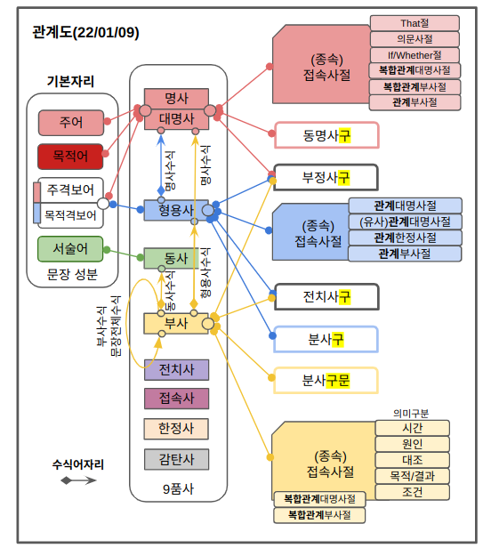

<!-- gid:20240201T172745 -->
[TOC]

[[TIP("이 노트에 대하여")]] 영문법을 문장 성분과 품사 관계 중심으로 다이어그램화해 이해하려는 노트다. 실제 예문과 관련 참고서를 붙여 두어 문법 구조를 시각적으로 붙잡으려는 의도가 또렷하다. [[/TIP]] BIBLIOGRAPHY 관련메타 - [ 문법 구문](https://wikidocs.net/380551)

## 관련노트

-   [강주헌: 번역가 번역방법론 원서읽힌다](https://wikidocs.net/382043)
-   [최정숙 미국식 영작문 어휘](https://wikidocs.net/382172)
-   [유원호 어원 어휘 미국문화 영작문 영문법](https://wikidocs.net/382192)

## 관계절의 의미

[2024-02-01 Thu 17:27]

관계절은 원서 읽힌다에 3장에서 다루고 있다. 이게 충분한 정보인가? 관계절을 다루는게 여기 밖에 없는가? 더 장황하게 연결되어야 한다.

## 2024 영문법 다이어그램

### 문장 성분

-   주어
-   목적어
-   주격보어
-   목적격보어
-   서술어

### 품사

[2024-02-01 Thu 17:05]

-   명사
-   대명사
-   형용사
-   동사
-   부사
-   전치사
-   접속사
-   한정사
-   감탄사

### <span class="org-hashtag">#관계도</span>

[2024-01-31 Wed 17:10]



-   [D2 Playground - play.d2lang.com](https://play.d2lang.com/?script=TMxdCoJAFMXx91nF3UZuLQSzKXwossCwEBmQgpF56EOkwBV5z-whppnCtx__yz2oc76aiNi8UF8g79xLmgsiNAOOnSDiVkMtvNEM40Pzs5uepgWyQqacYyHsIUNqIpp5fGe5XSE1Dpvkb1sWOOvQd6eAPvGAkniXP--x3oavooIqvMdbbpfSORafAAAA__8%3D&)

<!--listend-->

```d2
  자리: 문장성분 {
  주어
  목적어
  주격보어
  목적격보어
  서술어
}

품사: 9품사 {
  명사
  대명사
  형용사
  동사
  부사
  전치사
  접속사
  한정사
  감탄사
}
```
