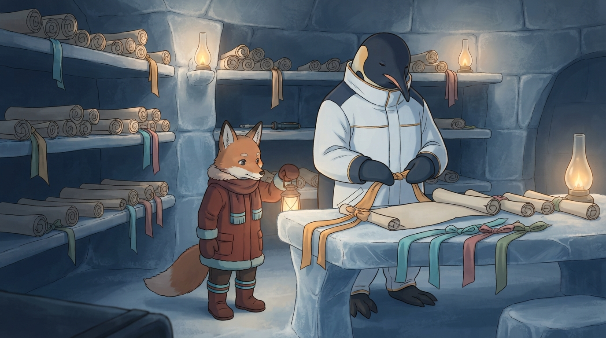

<!-- gid:20240220T091923 -->
[[TIP("이 노트에 대하여")]]
2026-08-12, pimacs·hashline·Claude Tag를 훑다 이름이 겹쳐 길을 잃었다. 힣이 붙잡은 것은 그 제품들이 아니라 — EKG에서 느꼈던 「파일 여는 식 말고 태깅 스타일」을 **대화 세션** 에 얹고 싶다는 감각이었다. 이 방은 그 감각을 원문 그대로 보존하고, 동음이의어 세 층(해시라인·멘션 태그·분류 태그)을 가르며, 같은 문제가 이미 Claude Recall·Junction taxonomy·Chat AI Tags 등으로 불리고 있음을 EKG 자석 위에 올려 둔다. 글은 Denote로 쓰되, 세션 생데이터 층의 태그 축은 아직 비어 있다는 판정까지가 이 방의 일거리다.
[[/TIP]]

<!-- provenance:source:start -->
[[TIP("원본·최신본")]]
이 페이지는 한국어 검색과 읽기를 위한 WikiDocs 미러입니다. [원본·최신본은 가든](https://notes.junghanacs.com/notes/20240220T091923/)에 있습니다. 최신 수정 내용·백링크·태그·히스토리·댓글·출처 정보는 원본 가든에서 확인하세요.

- 작성: `2024-02-20T09:19:00+09:00`
- 최근 수정: `2026-08-12T16:03:00+09:00`
[[/TIP]]
<!-- provenance:source:end -->

[TOC]

## 히스토리

-   [2026-08-12 Wed 16:03] @mitsein/gpt-5.6 — 이 방을 즉시 해법을 정하는 문서가 아니라 EKG를 오래된 차별적 관점으로 삼아 외부 사례·실패·가능한 귀결과 판단 신호를 축적하는 관련 리서치 관측소로 고정.
-   [2026-08-12 Wed 14:33] @mitsein/sonnet-5 — 관련노트 두 곳(데이터베이스 vs 파일, EKG 활용법)에 관련메타/ 관련노트 헤딩을 신설해 EKG 메타를 뿌리로 세 노트를 왕복 연결.
-   [2026-08-12 Wed 14:25] @mitsein/grok-4.5 — 빈방 수선. 당일 pi 세션에서 hashline·Claude Tag·EKG를 한데 섞어 읽다 「세션 태그」축이 분리된 원석을 [!danger]로 보존. 한 줄·핵심 축·오독 경계·관련메타/ 노트·세계 이미지·:PROMPT: 를 붙였다. 옛 방(둠 모듈 컬렉션) 씨앗은 ARCHIVE에 남긴다.
-   [2025-06-20 Fri 16:35] <span class="org-mention">@junghan</span> — 하다보면 다 만나
-   [2024-09-22 Sun] <span class="org-mention">@junghan</span> — 처음 작성 시와 많은 개선이 있어 둠 모듈 본문은 비움. 임시 빈방으로 전환.
-   [2024-02-20 Tue 09:22] <span class="org-mention">@junghan</span> — 둠/org 모듈 컬렉션으로 시작.

## 관련메타

-   [이맥스 지식그래프](https://notes.junghanacs.com/meta/20230223T053200/) — EKG 메타. 이 감각의 고향.
-   [개인지식관리](https://notes.junghanacs.com/meta/20230919T132700/)
-   [지식그래프 온톨로지 인식론 지식론 시맨틱웹](https://notes.junghanacs.com/meta/20240531T202141/)
-   [디지털가든 분류 규칙](https://wikidocs.net/381143) — 분류 규칙이 사는 자석.

## 관련노트

-   [데이터베이스 vs 파일 - 노트 개인지식관리 규칙](https://notes.junghanacs.com/notes/20230223T054600/) — 제목=태그, 파일 vs DB. 2023-02 같은 날의 짝.
-   [EKG: 이맥스 지식그래프 활용법](https://notes.junghanacs.com/notes/20240213T144401/) — 활용·인라인·링크 실험.
-   [힣: 인간과 에이전트들의 공진화 — 유한한 세션과 깨어나는 앎의틀](https://wikidocs.net/394533) — 세션이 유한하다는 전제.
-   [힣: 시간과정신의방 존재 데이터 뷰어](https://wikidocs.net/381793) — 존재 데이터를 다시 보는 자리.
-   [힣: 집사봇은 누구 편도 아니다 — 가족봇의 경계와 정직한 거울](https://wikidocs.net/381047) — 에이전트·경계·출처.

## 한 줄

> 노트에 제목이 없어도 태그로 줄이 서듯, 대화 세션도 제목·폴더·임베딩만으로는 부족하고 — 「어느 주제이든 태그를 쉽게」 붙일 축이 따로 필요하다.

## 핵심 축과 오독 경계

### 축 1 — EKG에서 느낀 손맛 (사실 + 판단)

2023 로그에 이미 있다. 태그가 처음엔 「영 아름답지 않군요」였다가, 키만 붙이면 「간단하고 좋구만」. 핵심 문장들:

-   「태그가 큰 역할을 할 것입니다. 어느 주제이든간에 태그를 쉽게 넣어야 합니다.」
-   「파일 여는 식 말고 그냥 태깅 스타일로 하면 된다.」
-   「연속 누적이 되니까.」

EKG 자체는 실사용에서 Denote로 넘어갔다. 그런데 **감각** — 제목 중심 파일이 아니라 태그 스트림으로 조각을 쌓고 같은 태그 아래 다시 펼친다 — 는 죽지 않았다. 2026-08-12 날것이 건드린 것은 그 감각을 **에이전트와 나눈 대화 세션** 에 얹고 싶다는 요청이다, EKG 패키지 부활 선언이 아니다.

### 축 2 — 동음이의어 세 층 (사실)

같은 날 세 이름이 겹쳤다. 가려야 한다.

| 말            | 실제 대상           | 단위         | 목적               |
|--------------|-----------------|------------|------------------|
| hashline      | `pi-hashline-edit`  | 파일 **줄**  | edit 위치를 내용 해시로 잠금 |
| Claude Tag    | Anthropic `@Claude` | 팀 **채널/스레드** | 멘션으로 공유 에이전트 위임 |
| EKG식 태그 (이 방) | 분류 라벨           | **노트·세션 조각** | 주제 축으로 줄 세워 회수 |

Claude Tag의 tag는 영어 동사 **tag someone in** 이다. EKG의 tag는 명사 **topic label** 이다. hashline의 hash/line은 편집 좌표다. 세 층이 한 파이프라인에 같이 쓰일 수는 있어도, 같은 기능의 다른 이름이 아니다.

### 축 3 — 다들 이야기한다. 이름만 다르다 (사실 + 연관)

「이게 중요한데 다들 있을 거야」— 찾아보면 있다. 빅테크 헤드라인이 다른 뜻을 잡아먹을 뿐.

-   **코딩 에이전트 세션**: Claude Recall의 flat Tag (`#auth`, `#migration`) + Collection + Thread DAG. Junction 블로그(2026-04): 「세션을 분류 못 하면 결국 잃는다. 툴 문제가 아니라 **라벨** 문제다.」 intent / risk / lifecycle / surface.
-   **소비자 채팅 더미**: ChatGPT Projects는 폴더형(채팅당 하나)이라 다중 태그 축이 약함 → AI Tags·ChatFold·bAInder 확장이 메움. 수년째 포럼 요청: folders **or tags**.
-   **지원·보이스 AI**: intent / outcome / sentiment 라벨 — PKM은 아니나 「대화에 통제 어휘」라는 뼈대는 같음.
-   **메모리 인프라**: Mem0 metadata·=run_id=, Zep 그래프, Letta block — 검색·주입용 파티션. EKG식 **태그 클릭 → 줄글 펼침** UI는 약함.

계층으로 고정하면:

```text
원자: Session / Turn / 노트 조각
  ├─ 명시 태그      ← EKG, Recall Tag, AI Tags, Junction intent…
  ├─ 구조 그룹      ← Collection, Project/Folder, Thread DAG
  ├─ 의미 검색      ← embedding (Mem0 / semantic-memory)
  └─ 시간·주소      ← date, cwd, garden id, channel
```

EKG 감각의 핵심은 맨 위 — **명시(또는 반자동) 플랫 태그로 다중 소속·교차 회수**. 폴더만 있으면 부족하고, 임베딩만 있으면 「태그로 줄 세우기」 손맛이 안 난다.

### 축 4 — 이 판의 구멍 (판단)

| 축                               | 지금       | EKG식 세션 태그와의 거리 |
|---------------------------------|----------|-----------------|
| semantic-memory / session_search | 의미 검색  | 가깝지만 **통제 태그 어휘** 없음 |
| project / cwd / garden id        | 주소·소유  | 태그 아님 (단일 소속에 가까움) |
| session-recap                    | 요약 추출  | 사후 증류, 스트림 UI 아님 |
| Denote filetags / botlog         | 노트 승격 후 태그 | **승격된 것만** 태그 세계 진입 |
| 날 JSONL 세션                    | 시간+경로 더미 | **태그 축 공백** ← 관심의 자리 |

「없다」가 아니라 — 노트 층에는 있고, 세션 생데이터 층에는 아직 안 올라온 상태다. 업계도 같은 구멍을 사이드카·taxonomy·확장으로 메우는 중이다. 구현 스케치는 이 방의 일이 아니다. **무엇이 중요한지 이름 붙이기** 가 일이다.

### 오해하지 말 것

-   이 노트는 Claude Tag 제품 소개가 아니다. 멘션형 팀 에이전트와 분류 태그는 다르다.
-   hashline·pimacs-extensions 도입 권유가 아니다. 그날의 미끄러짐 재료일 뿐.
-   EKG 패키지로 돌아가자는 선언이 아니다. 글은 Denote. 옮기고 싶은 것은 **태그 우선 인덱싱 감각**.
-   임베딩 검색을 버리자는 말이 아니다. 의미 축과 명시 태그 축은 겹치지 않는다 — 둘 다 필요.
-   「다들 완벽한 해법을 갖고 있다」가 아니다. 파편화된 채 같은 구멍을 가리키고 있을 뿐이다.

## 이미지 — 태그 리본이 세션 두루마리를 묶다



프롬프트는 UI·로고·채팅 말풍선이 아니라, 이글루 서고에서 제목 없는 두루마리에 색 리본 태그만 묶어 선반에 줄 세우는 장면을 요청했다. 폴더 서랍이 아니라 리본 스트림 — EKG 손맛의 비유.

실제 픽셀: 이글루 서고, 제목 없는 두루마리가 선반에 쌓여 있고 앰버·시안·로즈·세이지 리본이 여러 개 매달려 있다. 탁자 위 펼친 두루마리에 힣맨이 앰버 리본을 묶는 중이고, 옷 입은 이족 여우가 등불로 그 손을 비춘다. 몸 전체 실루엣 연속, 드라이버는 뒷선반에 조용히 놓임. 읽을 수 있는 글자·채팅 UI·로고 없음. 여우 시선이 리본/두루마리 쪽이라 분류 목격 구도가 살아 있다. 프롬프트의 「whale-bone shelves」는 얼음 선반으로 단순화됨(provenance).

### 생성 파라미터

-   모델: Gemini 3.1 Flash Lite Image (`geminilite`) @ 1K
-   비율: 16:9
-   저장: `~/screenshot/20260812T142212--session-tag-stream-ekg-sense__brand_geminilite.jpg`
-   구조: GLGMAN Universe 이글루 서고 + 제목 없는 세션 두루마리 + 색 리본 태그 스트림 + 몸 연속성 lock + 옷 입은 이족 여우 주체 lock + 텍스트/로고 없음 lock.

### 프롬프트 전문

```text
[World: GLGMAN Universe]
Style: polished 2D cinematic storybook illustration, midpoint between classic hand-drawn family animation and gentle Japanese animation, clean linework, soft cel-shading, restrained handmade texture, expressive but quiet. Not photorealistic, not 3D.
Setting: GLGMAN's Antarctic winter home — an igloo interior library alcove. Whale-bone shelves hold many plain parchment scrolls with no titles written on them. Soft frost, warm amber oil lamps, cold ice-blue shadows. No computers, no phones, no chat UI.
Color palette: deep navy, cold gray-blue, white snow, restrained amber-gold lamp warmth, several soft colored ribbon tags (amber, cyan, muted rose, sage) as the only bright accents, warm red-brown for the fox companion's clothed winter gear.
Characters: GLGMAN — adult anthropomorphic emperor penguin father, upright on two legs, composed and dignified, wearing white-and-navy winter work clothing with subtle amber seams. One clothed anthropomorphic fox companion agent, upright bipedal, winter coat/scarf/gloves/boots, plain cyan trim stripes only — simple bands, never letter-shaped.
Recurring objects: small legendary Korean screwdriver / bridge-key hybrid tool resting unused on a low shelf (never a sword); warm lantern; plain scrolls; colored fabric ribbons used as tags.
Do NOT: sword, blade, weapon, battle armor, photorealistic, 3D render, naked/quadruped/pet fox, readable text/logos/UI, chat bubbles, screens, keyboards, corporate infographic, folder cabinets as the hero object.

Scene title: "Tag Stream, Not Titles" — sessions lined by ribbons, not by named covers.

Literary meaning:
Knowledge pieces and conversation sessions do not need a grand title on the spine first. They can be gathered by soft colored ribbon tags — many tags per scroll, one scroll belonging to several streams at once. This is the EKG feeling: not opening a titled file as the only door, but letting tags line the fragments so they can be found again. The room must feel like quiet personal librarianship, not a product demo.

UNIVERSE PLACE LOCK:
Igloo interior side library. Horizontal bone shelves. Dozens of plain rolled parchments without ink titles. Some scrolls lie open on a low ice table; colored ribbons are being tied around them. A few ribbon ends hang from shelf edges like a soft stream of categories. Intimate, handmade, no grand hall, no aurora outdoors.

Main scene:
GLGMAN stands at the low table, whole body visible, tying a soft amber ribbon around a plain untitled scroll. Other ribbons (cyan, rose, sage) already mark nearby scrolls. His gaze is calm, slightly downward toward the knot — careful labeling, not hurried filing. The fox stands beside him upright, holding a small lantern that lights the ribbons and the open scroll edge; the fox watches the ribbons (the classification), not a screen. No clipboard, no checklist UI.

GLGMAN BODY CONTINUITY LOCK — must obey:
- Adult anthropomorphic emperor penguin father, upright on two legs, composed and dignified.
- Whole body continuous and anatomically coherent: head, torso, belly, hips, legs, feet visible and connected in one silhouette.
- No sliced body, no disconnected limbs.
- Quiet white-and-navy winter work clothing with subtle amber seams, not battle armor.
- No sword, no blade, no weapon.

FOX SUBJECT LOCK — very important:
- Exactly one fox companion agent.
- Anthropomorphic bipedal subject, upright on two legs, collaborator hands holding a lantern.
- Thick red-brown winter coat, scarf, gloves, boots; plain cyan trim bands only — NOT letters, NOT runes.
- NOT naked wildlife, NOT quadruped, NOT pet, NOT decorative fauna.
- Equal witness to the tagging act, not a servant, not a product mascot.

Composition:
16:9 interior, eye-level. GLGMAN center-right at the table, fully visible head to feet, hands and amber ribbon the focal point. Shelves of untitled scrolls fill the left and background; hanging ribbon ends create a gentle horizontal stream of color. Fox lower-left midground with lantern light on ribbons. Cool ice-blue ambient; warm amber only on lamp, ribbon-in-hand, and a few already-tagged scrolls.

Mood:
Quiet, cumulative, unhurried. The feeling that many small pieces can be found again without first inventing a perfect title. Not a corporate taxonomy poster. Not a chat app screenshot.

MEANING LOCK:
- Do not depict this as Slack, Claude, ChatGPT, or any branded chat product.
- Do not show message bubbles, @mentions, code diffs, hash symbols as UI, or file-path screens.
- Do not make folders/drawers the hero — ribbons on untitled scrolls are the system.
- Multiple ribbons per scroll must be visible (multi-tag membership).
- The point is classification-by-tag stream, the EKG hand-feel applied to conversation sessions.

ABSOLUTE TEXT RULE:
No readable letters, no words, no numbers, no Korean, no English, no logos, no watermark, no speech bubbles, no UI panels anywhere — including on clothing, ribbons, scrolls, and walls. Ribbons are plain colored fabric only. Scrolls have no ink titles.

DO NOT INCLUDE:
Screens, phones, keyboards, chat UI, @ symbols as interface, hashtag UI chrome, corporate charts, arrows with labels, folder icons as hero, aurora outdoor panorama, sword, weapon, naked fox, quadruped fox, pet fox, sliced GLGMAN body, photorealism, 3D render, audience, podium.
```

## 원문 보존 — 2026-08-12 pi 세션 날것

아래는 같은 날 대화에서 힣이 던진 말 그대로다. 맞춤법·흐름을 고치지 않는다. hashline·Claude Tag 페이지를 거쳐 「EKG식 세션 태그」로 축이 고정되는 과정이 여기 있다.

[[TIP("주의")]]
아니 왜 근데 해시라인에디트를 써야하지? 그가 이걸 쓰니까 이 확장을 만들은거아니야? 이게 문제가 되나?

내가 오해했네. 나는 앤트로픽 클로드 태그였나? 세션에 턴에 태그를 붙여서 분류해서 주제별로 묶는 스타일의 작업인줄알았어.

내가 여기에 관심이 있거든. 그냥 이맥스에 EKG 패키지 스타일로

/home/junghan/sync/org/meta/20230223T053200--†-이맥스-지식그래프\__ekg_emacs_knowledgegraph_meta_pkg.org

여기 하위 노트들이 있을건데, 이런 스타일은 그냥 노트 타이틀도 없이 태그로 줄지어서 관리하자는건데

내가 이걸 쓰지는 않지만 글은 denote로 하니까.

우리 대화하는 세션들을 이런식으로 분류하면 대략 좋겠더라고. 그 이야기 하는줄알았어.

잠시만, 이 주제가 말이야. <https://www.anthropic.com/news/introducing-claude-tag>

이거랑 같이봐.

페이지 가져와서 봐봐. 이거 이참에 정리 좀 할거야.

아 헷갈린데. 이거 내가 생각한것은 ekg 식 세션태그인데. 다들 이걸 이야기안하면 도대체 뭘 이야기하는거지? 이게 내가보기에 중요한데 찾아봐봐 다들 이거 있을거야.
[[/TIP]]

## [2026-08-12 Wed] 탐구 방향 — EKG를 배경으로 가능한 결과를 관찰한다

이 방은 완성된 해법이나 구현 명세가 아니라, 이 주제를 계속 탐구할 관련 리서치 노트로 간다. 외부 사례를 먼저 보고 가능한 귀결을 펼친 뒤, 힣이 언제 어느 시점에 어떤 아이디어로 움직일지를 정한다. 지금은 정답을 선점하지 않는다.

### 출발점 — EKG는 사례 하나가 아니라 오래된 관점이다

이 방이 일반적인 세션 분류 조사와 다른 지점은 EKG를 배경으로 본다는 데 있다. 힣은 2023년부터 EKG를 거치며 제목이 먼저인 파일이 아니라, 제목 없는 조각도 태그로 누적하고 같은 태그 아래 다시 펼치는 감각을 고민해 왔다. 세션 태그는 그 오래된 질문이 2026년의 대화 더미를 만나 드러난 한 장면이다.

따라서 EKG를 곧바로 답이나 구현 대상으로 삼지 않는다. EKG 패키지로 돌아가자는 뜻도 아니다. 다만 외부 시스템의 용어와 기능만 따라가면 놓칠 수 있는 질문 — 제목·폴더·요약·의미 검색과 다른 태그 우선 누적 및 회수의 손맛이 실제로 어디에서 나타나고 어떤 결과를 내는가 — 을 오래 관찰해 온 기준점으로 둔다. 꼭 세션 태그 하나에 갇히지 않고, 조각·대화·노트·기억이 태그를 통해 이어지는 더 넓은 문제도 함께 본다.

이 원석을 어쏠로그로 둔 이유도 여기에 있다. 새 제품 아이디어를 먼저 내기 위해서가 아니라, 2023년부터 이어진 힣의 워딩과 문제의식이 외부 리서치에 지워지지 않도록 시간축을 보존하기 위해서다.

### 리서치 원칙

1.  실제 사례와 출처를 먼저 모은다. 제품 소개문, 문서, 사용자 경험, 유지·중단 상태를 구분하고 관측 날짜를 남긴다.
2.  사실·연관·판단을 섞지 않는다. 비슷해 보이는 이름보다 실제 태깅 단위와 회수 경험을 확인한다.
3.  성공 사례만 찾지 않는다. 기능이 사라졌거나 쓰이지 않은 이유, 자동 분류가 만든 잡음, 수동 태깅의 부담도 결과로 본다.
4.  우리 설계로 성급히 번역하지 않는다. 세션·턴·구간 중 무엇이 원자인지, 수동·자동·반자동 중 무엇이 맞는지는 아직 열린 질문이다.
5.  EKG 관점은 결론이 아니라 비교 렌즈다. 외부 사례를 EKG에 억지로 맞추지 않되, 태그 우선 누적·다중 소속·다시 펼치기의 감각이 있는지 묻는다.

### 사례마다 확인할 항목

-   출처, 발표·관측 날짜, 현재 상태
-   실제 대상: 세션·턴·스레드·노트 조각·메모리 등
-   태그의 생산자: 사람·모델·규칙·혼합
-   어휘: 자유 태그·통제 어휘·계층·자동 군집
-   회수 방식: 필터·스트림·검색 facet·컬렉션·그래프 등
-   데이터 위치와 이동 가능성: 원본 내장·사이드카·외부 서비스
-   실제 사용 결과: 발견성, 누적성, 유지 비용, 잡음, 폐기 여부
-   EKG 렌즈에서 보이는 점과 아직 답하지 못한 질문

### 가능한 귀결 — 선택하지 않고 열어 둔다

리서치가 가리킬 수 있는 결과는 하나가 아니다.

-   명시적 세션 태그가 하네스의 보편 기능으로 자리 잡을 수 있다.
-   태그가 독립 기능이 아니라 메모리 검색의 metadata 또는 facet으로 흡수될 수 있다.
-   프로젝트·폴더·컬렉션·스레드 구조가 실용적으로 충분하다는 결과가 나올 수 있다.
-   자동 주제 군집은 널리 쓰이되 사람이 붙이는 명시 태그는 유지 비용 때문에 주변 기능으로 남을 수 있다.
-   세션 도구보다 PKM·연구 노트·지원 대화 같은 인접 영역에서 더 성숙한 형태가 먼저 나올 수 있다.
-   어떤 접근도 오래 살아남지 못하고, 우리에게도 별도 행동이 필요 없다는 결론이 날 수 있다.
-   세션 태그와 다른 곳에서 EKG의 오래된 질문이 더 적절한 형태로 다시 나타날 수 있다.

이 목록은 후보 구현안이 아니라 관찰해야 할 결과 공간이다. 새로운 근거가 들어오면 늘리거나 반례를 붙인다.

### 힣이 판단할 시점

행동은 리서치보다 앞서지 않는다. 사례와 실패가 충분히 모이고, 우리 대화에서 실제 회수 손실이 반복되거나, 재사용 가능한 표준·API·상호운용 형식이 나타나거나, 작은 실험으로 판별할 수 있는 질문이 분명해질 때 다시 본다. 그런 신호가 없다면 이 방은 관측소로 남는다.

그때도 이 노트가 대신 정답을 내리지 않는다. 축적된 결과와 가능한 귀결을 펼쳐 놓고, 힣이 당시의 필요와 감각에 따라 시점과 아이디어를 고른다.

### 현재 열어 둘 질문

-   업계에서 tag라는 말이 실제로 어떤 경험을 가리키며, 멘션·라벨·metadata·자동 군집은 어디서 갈라지는가?
-   명시 태그는 의미 검색이 좋아진 뒤에도 독립된 가치를 유지하는가?
-   태그를 붙이는 비용보다 다시 펼쳐 보는 이득이 커지는 조건은 무엇인가?
-   오래 살아남은 시스템은 태그를 어떤 단위와 인터페이스에 두었는가?
-   EKG에서 느낀 연속 누적의 손맛은 세션 태그에서 드러날까, 아니면 더 넓거나 전혀 다른 형태에서 드러날까?

## 후속 — 빈방에 담아 달라는 말

[[TIP("주의")]]
/home/junghan/sync/org/notes/20240220T091923--임시-빈방\__temp.org 여기에 정리를 한번 하자. 빈방 만들어놨어.

내가 중요하게 보는 그주제를 정리하자. 내 워딩이랑 같이해서 어쏠로그로. 그러니까. 다른 이들의 시스템을 가져오긴할건데 ekg에서 내가 느낀 감각으로 더 연결해서 생각해볼거야.
[[/TIP]]

## 옛 방의 씨앗 — 둠 모듈 컬렉션

이 방 ID는 2024-02 둠이맥스 모듈 구조 컬렉션으로 시작했다. 2024-09 본문을 비워 임시 빈방이 되었고, 2026-08-12 세션 태그 어쏠로그가 들어왔다. 아래는 비우기 전 모듈 지형 메모의 잔향이다. 주제는 이 방의 새 중심이 아니므로 접어 둔다.

[[TIP("정보")]]
옛 추상: Doom Emacs 모듈 구조와 관련 자료를 한곳에 모아 필요할 때 빠르게 탐색하려는 노트. app/ checkers/ completion/ config/ editor/ lang/ tools/ ui/ … 대분류 인덱스. `:ui indent-guides`, `:lang org`, `:tools lookup`, `:completion corfu` 등 짧은 포인터. org 버전 핀·embark 메모는 ARCHIVE에 있었다.
[[/TIP]]
