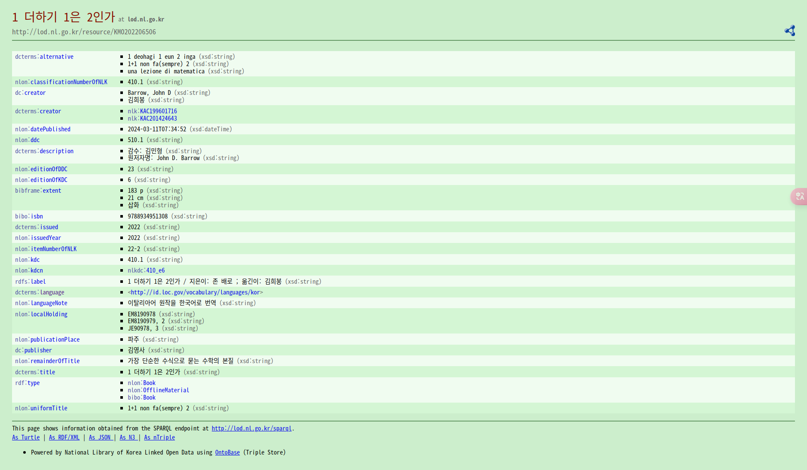

<!-- gid:20240314T173757 -->
[[TIP("이 노트에 대하여")]]
국가서지 링크드 오픈 데이터와 한국십진분류를 바탕으로 분류체계를 온톨로지 관점에서 읽어 보려는 노트다. RDF와 카테고리 분류를 실제 지식 구조화 프로젝트와 연결하는 실마리를 품고 있다.
[[/TIP]]

<!-- provenance:source:start -->
[[TIP("원본·최신본")]]
이 페이지는 한국어 검색과 읽기를 위한 WikiDocs 미러입니다. [원본·최신본은 가든](https://notes.junghanacs.com/notes/20240314T173757/)에 있습니다. 최신 수정 내용·백링크·태그·히스토리·댓글·출처 정보는 원본 가든에서 확인하세요.

- 작성: `2024-03-14T17:37:00+09:00`
- 최근 수정: `2025-05-23T00:00:00+09:00`
[[/TIP]]
<!-- provenance:source:end -->

[TOC]

도서검색 기본은 다음 2가지 이다.

-   [문헌정보 분류체계 도서 카테고리](https://wikidocs.net/380752)

더 확장하여 오픈데이터를 활용해보자.

[조직모드: 클립보드 복사 붙여넣기 복붙 org-rich-yank ◊kill-ring ◊yank](https://wikidocs.net/381391)

## 국가 도서 정보 시스템 활용

<https://www.nl.go.kr/>

<https://lod.nl.go.kr/page/KMO202206506>

```text
his page shows information obtained from the SPARQL endpoint at http://lod.nl.go.kr/sparql.
As Turtle | As RDF/XML | As JSON | As N3 | As nTriple
```



## <span class="org-todo todo TODO">TODO</span> <span class="org-hashtag">#국립중앙도서관</span>: 국가서지 링크드 오픈데이터

(“#국립중앙도서관: 국가서지 링크드 오픈 데이터” n.d.)

-   국가서지 링크드 오픈 데이터에 오신 것을 환영합니다.

[links]

### RDF 온톨로지 데이터

<https://lod.nl.go.kr/page/KMO202206506>

```text
his page shows information obtained from the SPARQL endpoint at http://lod.nl.go.kr/sparql.
As Turtle | As RDF/XML | As JSON | As N3 | As nTriple
```

## <span class="org-todo todo TODO">TODO</span> Emacs 검색 활용 방법

몇개 함수를 넣으면 좋지 않을까 한다.

```text
https://www.nl.go.kr/NL/contents/search.do?kwd=%EC%A1%B4+%EB%B0%B0%EB%A1%9C
https://m.yes24.com/Search?query=%EC%96%B8%EC%96%B4%20%EC%B2%A0%ED%95%99
https://www.suwonlib.go.kr:8443/search/keyword/

```

## Related-Notes

-   [한국십진분류법](https://wikidocs.net/380561)

## BIBLIOGRAPHY

- “#국립중앙도서관: 국가서지 링크드 오픈 데이터.” n.d. Accessed December 2, 2024. [https://lod.nl.go.kr/home/./](https://lod.nl.go.kr/home/./).
