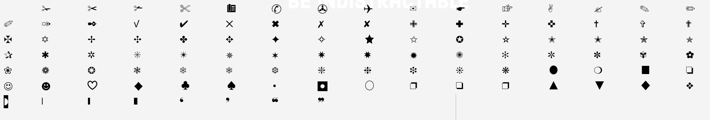

<!-- gid:20240320T091441 -->
[TOC]

[[TIP("이 노트에 대하여")]]
딩뱃과 특수 유니코드 문자가 조판과 파일명, 폰트 설정에서 어떤 의미를 갖는지 정리한다. 단순한 기호 수집이 아니라 실제 텍스트 환경 설계와 연결되는 기호 노트다.
[[/TIP]]

## 히스토리

-   [2025-06-22 Sun 11:03] 폰트 스케일 파일명
-   [2024-03-20 Wed 09:14] 생성
-   [한글: 간결한 한국어 국어기본법](https://wikidocs.net/381159)

## 관련노트

-   [노트테이킹 유니코드 기호: 파일명 ⓕ № ↔ → ∉ ⊢ ¬ ¢ µ ¥ £ ¡ ¿](https://wikidocs.net/381471)
-   [이맥스 폰트 스케일 유니코드 이모지](https://wikidocs.net/381473)

## 관련메타

-   [유니코드](https://wikidocs.net/380672)
-   [레이텍 수식 조판](https://wikidocs.net/380525)
-   [문장 문장부호 분음부호 발음구별기호](https://wikidocs.net/380808)
-   [작명 네이밍 이름 제목](https://wikidocs.net/380723)
-   [노트테이킹](https://wikidocs.net/380675)
-   [분류체계 구조화 분야 택소노미 폭소노미](https://wikidocs.net/380842)
-   [분류: 도서 카테고리](https://wikidocs.net/380752)

## 딩뱃 Dingbat

[2024-03-20 Wed 09:14] [딩뱃, 우리 모두의 백과사전 - ko.wikipedia.org](https://ko.wikipedia.org/wiki/%EB%94%A9%EB%B1%83)

딩뱃(Dingbat)은 조판 시에 사용하는 장식용 문자나 공백을 가리킨다. 이 용어는 현대의 컴퓨터에도 이어져 사용되고 있으며, 특수한 글꼴을 통해서 알파벳이나 숫자에 대응하는 딩뱃 문자를 사용할 수 있다.

## 2025 유니코드 딩뱃 목록 표기 <span class="org-hashtag">#이맥스</span>

[2025-06-22 Sun 11:06] M-x list-unicode-display

The Dingbats block (U+2700–U+27BF) (under the original block name "Zapf Dingbats") was added to the Unicode Standard in October 1991, with the release of version 1.0. This code block contains decorative character variants, and other marks of emphasis and non-textual symbolism. Most of its characters were taken from Zapf Dingbats. The block name was changed from "Zapf Dingbats" to "Dingbats" in June 1993, with the release of 1.1.

```txt
- 0x002700	✀	BLACK SAFETY SCISSORS
- 0x002701	✁	UPPER BLADE SCISSORS
- 0x002702	✂	BLACK SCISSORS
- 0x002703	✃	LOWER BLADE SCISSORS
- 0x002704	✄	WHITE SCISSORS
- 0x002705	✅	WHITE HEAVY CHECK MARK
- 0x002706	✆	TELEPHONE LOCATION SIGN
- 0x002707	✇	TAPE DRIVE
- 0x002708	✈	AIRPLANE
- 0x002709	✉	ENVELOPE
- 0x00270A	✊	RAISED FIST
- 0x00270B	✋	RAISED HAND
- 0x00270C	✌	VICTORY HAND
- 0x00270D	✍	WRITING HAND
- 0x00270E	✎	LOWER RIGHT PENCIL
- 0x00270F	✏	PENCIL
- 0x002710	✐	UPPER RIGHT PENCIL
- 0x002711	✑	WHITE NIB
- 0x002712	✒	BLACK NIB
- 0x002713	✓	CHECK MARK
- 0x002714	✔	HEAVY CHECK MARK
- 0x002715	✕	MULTIPLICATION X
- 0x002716	✖	HEAVY MULTIPLICATION X
- 0x002717	✗	BALLOT X
- 0x002718	✘	HEAVY BALLOT X
- 0x002719	✙	OUTLINED GREEK CROSS
- 0x00271A	✚	HEAVY GREEK CROSS
- 0x00271B	✛	OPEN CENTER CROSS
- 0x00271B	✛	OPEN CENTRE CROSS
- 0x00271C	✜	HEAVY OPEN CENTER CROSS
- 0x00271C	✜	HEAVY OPEN CENTRE CROSS
- 0x00271D	✝	LATIN CROSS
- 0x00271E	✞	SHADOWED WHITE LATIN CROSS
- 0x00271F	✟	OUTLINED LATIN CROSS
- 0x002720	✠	MALTESE CROSS
- 0x002721	✡	STAR OF DAVID
- 0x002722	✢	FOUR TEARDROP-SPOKED ASTERISK
- 0x002723	✣	FOUR BALLOON-SPOKED ASTERISK
- 0x002724	✤	HEAVY FOUR BALLOON-SPOKED ASTERISK
- 0x002725	✥	FOUR CLUB-SPOKED ASTERISK
- 0x002726	✦	BLACK FOUR POINTED STAR
- 0x002727	✧	WHITE FOUR POINTED STAR
- 0x002728	✨	SPARKLES
- 0x002729	✩	STRESS OUTLINED WHITE STAR
- 0x00272A	✪	CIRCLED WHITE STAR
- 0x00272B	✫	OPEN CENTER BLACK STAR
- 0x00272B	✫	OPEN CENTRE BLACK STAR
- 0x00272C	✬	BLACK CENTER WHITE STAR
- 0x00272C	✬	BLACK CENTRE WHITE STAR
- 0x00272D	✭	OUTLINED BLACK STAR
- 0x00272E	✮	HEAVY OUTLINED BLACK STAR
- 0x00272F	✯	PINWHEEL STAR
- 0x002730	✰	SHADOWED WHITE STAR
- 0x002731	✱	HEAVY ASTERISK
- 0x002732	✲	OPEN CENTER ASTERISK
- 0x002732	✲	OPEN CENTRE ASTERISK
- 0x002733	✳	EIGHT SPOKED ASTERISK
- 0x002734	✴	EIGHT POINTED BLACK STAR
- 0x002735	✵	EIGHT POINTED PINWHEEL STAR
- 0x002736	✶	SIX POINTED BLACK STAR
- 0x002737	✷	EIGHT POINTED RECTILINEAR BLACK STAR
- 0x002738	✸	HEAVY EIGHT POINTED RECTILINEAR BLACK STAR
- 0x002739	✹	TWELVE POINTED BLACK STAR
- 0x00273A	✺	SIXTEEN POINTED ASTERISK
- 0x00273B	✻	TEARDROP-SPOKED ASTERISK
- 0x00273C	✼	OPEN CENTER TEARDROP-SPOKED ASTERISK
- 0x00273C	✼	OPEN CENTRE TEARDROP-SPOKED ASTERISK
- 0x00273D	✽	HEAVY TEARDROP-SPOKED ASTERISK
- 0x00273E	✾	SIX PETALLED BLACK AND WHITE FLORETTE
- 0x00273F	✿	BLACK FLORETTE
- 0x002740	❀	WHITE FLORETTE
- 0x002741	❁	EIGHT PETALLED OUTLINED BLACK FLORETTE
- 0x002742	❂	CIRCLED OPEN CENTER EIGHT POINTED STAR
- 0x002742	❂	CIRCLED OPEN CENTRE EIGHT POINTED STAR
- 0x002743	❃	HEAVY TEARDROP-SPOKED PINWHEEL ASTERISK
- 0x002744	❄	SNOWFLAKE
- 0x002745	❅	TIGHT TRIFOLIATE SNOWFLAKE
- 0x002746	❆	HEAVY CHEVRON SNOWFLAKE
- 0x002747	❇	SPARKLE
- 0x002748	❈	HEAVY SPARKLE
- 0x002749	❉	BALLOON-SPOKED ASTERISK
- 0x00274A	❊	EIGHT TEARDROP-SPOKED PROPELLER ASTERISK
- 0x00274B	❋	HEAVY EIGHT TEARDROP-SPOKED PROPELLER ASTERISK
- 0x00274C	❌	CROSS MARK
- 0x00274D	❍	SHADOWED WHITE CIRCLE
- 0x00274E	❎	NEGATIVE SQUARED CROSS MARK
- 0x00274F	❏	LOWER RIGHT DROP-SHADOWED WHITE SQUARE
- 0x002750	❐	UPPER RIGHT DROP-SHADOWED WHITE SQUARE
- 0x002751	❑	LOWER RIGHT SHADOWED WHITE SQUARE
- 0x002752	❒	UPPER RIGHT SHADOWED WHITE SQUARE
- 0x002753	❓	BLACK QUESTION MARK ORNAMENT
- 0x002754	❔	WHITE QUESTION MARK ORNAMENT
- 0x002755	❕	WHITE EXCLAMATION MARK ORNAMENT
- 0x002756	❖	BLACK DIAMOND MINUS WHITE X
- 0x002757	❗	HEAVY EXCLAMATION MARK SYMBOL
- 0x002758	❘	LIGHT VERTICAL BAR
- 0x002759	❙	MEDIUM VERTICAL BAR
- 0x00275A	❚	HEAVY VERTICAL BAR
- 0x00275B	❛	HEAVY SINGLE TURNED COMMA QUOTATION MARK ORNAMENT
- 0x00275C	❜	HEAVY SINGLE COMMA QUOTATION MARK ORNAMENT
- 0x00275D	❝	HEAVY DOUBLE TURNED COMMA QUOTATION MARK ORNAMENT
- 0x00275E	❞	HEAVY DOUBLE COMMA QUOTATION MARK ORNAMENT
- 0x00275F	❟	HEAVY LOW SINGLE COMMA QUOTATION MARK ORNAMENT
- 0x002760	❠	HEAVY LOW DOUBLE COMMA QUOTATION MARK ORNAMENT
- 0x002761	❡	CURVED STEM PARAGRAPH SIGN ORNAMENT
- 0x002762	❢	HEAVY EXCLAMATION MARK ORNAMENT
- 0x002763	❣	HEAVY HEART EXCLAMATION MARK ORNAMENT
- 0x002764	❤	HEAVY BLACK HEART
- 0x002765	❥	ROTATED HEAVY BLACK HEART BULLET
- 0x002766	❦	FLORAL HEART
- 0x002767	❧	ROTATED FLORAL HEART BULLET
- 0x002768	❨	MEDIUM LEFT PARENTHESIS ORNAMENT
- 0x002769	❩	MEDIUM RIGHT PARENTHESIS ORNAMENT
- 0x00276A	❪	MEDIUM FLATTENED LEFT PARENTHESIS ORNAMENT
- 0x00276B	❫	MEDIUM FLATTENED RIGHT PARENTHESIS ORNAMENT
- 0x00276C	❬	MEDIUM LEFT-POINTING ANGLE BRACKET ORNAMENT
- 0x00276D	❭	MEDIUM RIGHT-POINTING ANGLE BRACKET ORNAMENT
- 0x00276E	❮	HEAVY LEFT-POINTING ANGLE QUOTATION MARK ORNAMENT
- 0x00276F	❯	HEAVY RIGHT-POINTING ANGLE QUOTATION MARK ORNAMENT
- 0x002770	❰	HEAVY LEFT-POINTING ANGLE BRACKET ORNAMENT
- 0x002771	❱	HEAVY RIGHT-POINTING ANGLE BRACKET ORNAMENT
- 0x002772	❲	LIGHT LEFT TORTOISE SHELL BRACKET ORNAMENT
- 0x002773	❳	LIGHT RIGHT TORTOISE SHELL BRACKET ORNAMENT
- 0x002774	❴	MEDIUM LEFT CURLY BRACKET ORNAMENT
- 0x002775	❵	MEDIUM RIGHT CURLY BRACKET ORNAMENT
- 0x002776	❶	INVERSE CIRCLED DIGIT ONE
- 0x002776	❶	DINGBAT NEGATIVE CIRCLED DIGIT ONE
- 0x002777	❷	INVERSE CIRCLED DIGIT TWO
- 0x002777	❷	DINGBAT NEGATIVE CIRCLED DIGIT TWO
- 0x002778	❸	INVERSE CIRCLED DIGIT THREE
- 0x002778	❸	DINGBAT NEGATIVE CIRCLED DIGIT THREE
- 0x002779	❹	INVERSE CIRCLED DIGIT FOUR
- 0x002779	❹	DINGBAT NEGATIVE CIRCLED DIGIT FOUR
- 0x00277A	❺	INVERSE CIRCLED DIGIT FIVE
- 0x00277A	❺	DINGBAT NEGATIVE CIRCLED DIGIT FIVE
- 0x00277B	❻	INVERSE CIRCLED DIGIT SIX
- 0x00277B	❻	DINGBAT NEGATIVE CIRCLED DIGIT SIX
- 0x00277C	❼	INVERSE CIRCLED DIGIT SEVEN
- 0x00277C	❼	DINGBAT NEGATIVE CIRCLED DIGIT SEVEN
- 0x00277D	❽	INVERSE CIRCLED DIGIT EIGHT
- 0x00277D	❽	DINGBAT NEGATIVE CIRCLED DIGIT EIGHT
- 0x00277E	❾	INVERSE CIRCLED DIGIT NINE
- 0x00277E	❾	DINGBAT NEGATIVE CIRCLED DIGIT NINE
- 0x00277F	❿	INVERSE CIRCLED NUMBER TEN
- 0x00277F	❿	DINGBAT NEGATIVE CIRCLED NUMBER TEN
- 0x002780	➀	CIRCLED SANS-SERIF DIGIT ONE
- 0x002780	➀	DINGBAT CIRCLED SANS-SERIF DIGIT ONE
- 0x002781	➁	CIRCLED SANS-SERIF DIGIT TWO
- 0x002781	➁	DINGBAT CIRCLED SANS-SERIF DIGIT TWO
- 0x002782	➂	CIRCLED SANS-SERIF DIGIT THREE
- 0x002782	➂	DINGBAT CIRCLED SANS-SERIF DIGIT THREE
- 0x002783	➃	CIRCLED SANS-SERIF DIGIT FOUR
- 0x002783	➃	DINGBAT CIRCLED SANS-SERIF DIGIT FOUR
- 0x002784	➄	CIRCLED SANS-SERIF DIGIT FIVE
- 0x002784	➄	DINGBAT CIRCLED SANS-SERIF DIGIT FIVE
- 0x002785	➅	CIRCLED SANS-SERIF DIGIT SIX
- 0x002785	➅	DINGBAT CIRCLED SANS-SERIF DIGIT SIX
- 0x002786	➆	CIRCLED SANS-SERIF DIGIT SEVEN
- 0x002786	➆	DINGBAT CIRCLED SANS-SERIF DIGIT SEVEN
- 0x002787	➇	CIRCLED SANS-SERIF DIGIT EIGHT
- 0x002787	➇	DINGBAT CIRCLED SANS-SERIF DIGIT EIGHT
- 0x002788	➈	CIRCLED SANS-SERIF DIGIT NINE
- 0x002788	➈	DINGBAT CIRCLED SANS-SERIF DIGIT NINE
- 0x002789	➉	CIRCLED SANS-SERIF NUMBER TEN
- 0x002789	➉	DINGBAT CIRCLED SANS-SERIF NUMBER TEN
- 0x00278A	➊	INVERSE CIRCLED SANS-SERIF DIGIT ONE
- 0x00278A	➊	DINGBAT NEGATIVE CIRCLED SANS-SERIF DIGIT ONE
- 0x00278B	➋	INVERSE CIRCLED SANS-SERIF DIGIT TWO
- 0x00278B	➋	DINGBAT NEGATIVE CIRCLED SANS-SERIF DIGIT TWO
- 0x00278C	➌	INVERSE CIRCLED SANS-SERIF DIGIT THREE
- 0x00278C	➌	DINGBAT NEGATIVE CIRCLED SANS-SERIF DIGIT THREE
- 0x00278D	➍	INVERSE CIRCLED SANS-SERIF DIGIT FOUR
- 0x00278D	➍	DINGBAT NEGATIVE CIRCLED SANS-SERIF DIGIT FOUR
- 0x00278E	➎	INVERSE CIRCLED SANS-SERIF DIGIT FIVE
- 0x00278E	➎	DINGBAT NEGATIVE CIRCLED SANS-SERIF DIGIT FIVE
- 0x00278F	➏	INVERSE CIRCLED SANS-SERIF DIGIT SIX
- 0x00278F	➏	DINGBAT NEGATIVE CIRCLED SANS-SERIF DIGIT SIX
- 0x002790	➐	INVERSE CIRCLED SANS-SERIF DIGIT SEVEN
- 0x002790	➐	DINGBAT NEGATIVE CIRCLED SANS-SERIF DIGIT SEVEN
- 0x002791	➑	INVERSE CIRCLED SANS-SERIF DIGIT EIGHT
- 0x002791	➑	DINGBAT NEGATIVE CIRCLED SANS-SERIF DIGIT EIGHT
- 0x002792	➒	INVERSE CIRCLED SANS-SERIF DIGIT NINE
- 0x002792	➒	DINGBAT NEGATIVE CIRCLED SANS-SERIF DIGIT NINE
- 0x002793	➓	INVERSE CIRCLED SANS-SERIF NUMBER TEN
- 0x002793	➓	DINGBAT NEGATIVE CIRCLED SANS-SERIF NUMBER TEN
- 0x002794	➔	HEAVY WIDE-HEADED RIGHT ARROW
- 0x002794	➔	HEAVY WIDE-HEADED RIGHTWARDS ARROW
- 0x002795	➕	HEAVY PLUS SIGN
- 0x002796	➖	HEAVY MINUS SIGN
- 0x002797	➗	HEAVY DIVISION SIGN
- 0x002798	➘	HEAVY LOWER RIGHT ARROW
- 0x002798	➘	HEAVY SOUTH EAST ARROW
- 0x002799	➙	HEAVY RIGHT ARROW
- 0x002799	➙	HEAVY RIGHTWARDS ARROW
- 0x00279A	➚	HEAVY UPPER RIGHT ARROW
- 0x00279A	➚	HEAVY NORTH EAST ARROW
- 0x00279B	➛	DRAFTING POINT RIGHT ARROW
- 0x00279B	➛	DRAFTING POINT RIGHTWARDS ARROW
- 0x00279C	➜	HEAVY ROUND-TIPPED RIGHT ARROW
- 0x00279C	➜	HEAVY ROUND-TIPPED RIGHTWARDS ARROW
- 0x00279D	➝	TRIANGLE-HEADED RIGHT ARROW
- 0x00279D	➝	TRIANGLE-HEADED RIGHTWARDS ARROW
- 0x00279E	➞	HEAVY TRIANGLE-HEADED RIGHT ARROW
- 0x00279E	➞	HEAVY TRIANGLE-HEADED RIGHTWARDS ARROW
- 0x00279F	➟	DASHED TRIANGLE-HEADED RIGHT ARROW
- 0x00279F	➟	DASHED TRIANGLE-HEADED RIGHTWARDS ARROW
- 0x0027A0	➠	HEAVY DASHED TRIANGLE-HEADED RIGHT ARROW
- 0x0027A0	➠	HEAVY DASHED TRIANGLE-HEADED RIGHTWARDS ARROW
- 0x0027A1	➡	BLACK RIGHT ARROW
- 0x0027A1	➡	BLACK RIGHTWARDS ARROW
- 0x0027A2	➢	THREE-D TOP-LIGHTED RIGHT ARROWHEAD
- 0x0027A2	➢	THREE-D TOP-LIGHTED RIGHTWARDS ARROWHEAD
- 0x0027A3	➣	THREE-D BOTTOM-LIGHTED RIGHT ARROWHEAD
- 0x0027A3	➣	THREE-D BOTTOM-LIGHTED RIGHTWARDS ARROWHEAD
- 0x0027A4	➤	BLACK RIGHT ARROWHEAD
- 0x0027A4	➤	BLACK RIGHTWARDS ARROWHEAD
- 0x0027A5	➥	HEAVY BLACK CURVED DOWN AND RIGHT ARROW
- 0x0027A5	➥	HEAVY BLACK CURVED DOWNWARDS AND RIGHTWARDS ARROW
- 0x0027A6	➦	HEAVY BLACK CURVED UP AND RIGHT ARROW
- 0x0027A6	➦	HEAVY BLACK CURVED UPWARDS AND RIGHTWARDS ARROW
- 0x0027A7	➧	SQUAT BLACK RIGHT ARROW
- 0x0027A7	➧	SQUAT BLACK RIGHTWARDS ARROW
- 0x0027A8	➨	HEAVY CONCAVE-POINTED BLACK RIGHT ARROW
- 0x0027A8	➨	HEAVY CONCAVE-POINTED BLACK RIGHTWARDS ARROW
- 0x0027A9	➩	RIGHT-SHADED WHITE RIGHT ARROW
- 0x0027A9	➩	RIGHT-SHADED WHITE RIGHTWARDS ARROW
- 0x0027AA	➪	LEFT-SHADED WHITE RIGHT ARROW
- 0x0027AA	➪	LEFT-SHADED WHITE RIGHTWARDS ARROW
- 0x0027AB	➫	BACK-TILTED SHADOWED WHITE RIGHT ARROW
- 0x0027AB	➫	BACK-TILTED SHADOWED WHITE RIGHTWARDS ARROW
- 0x0027AC	➬	FRONT-TILTED SHADOWED WHITE RIGHT ARROW
- 0x0027AC	➬	FRONT-TILTED SHADOWED WHITE RIGHTWARDS ARROW
- 0x0027AD	➭	HEAVY LOWER RIGHT-SHADOWED WHITE RIGHT ARROW
- 0x0027AD	➭	HEAVY LOWER RIGHT-SHADOWED WHITE RIGHTWARDS ARROW
- 0x0027AE	➮	HEAVY UPPER RIGHT-SHADOWED WHITE RIGHT ARROW
- 0x0027AE	➮	HEAVY UPPER RIGHT-SHADOWED WHITE RIGHTWARDS ARROW
- 0x0027AF	➯	NOTCHED LOWER RIGHT-SHADOWED WHITE RIGHT ARROW
- 0x0027AF	➯	NOTCHED LOWER RIGHT-SHADOWED WHITE RIGHTWARDS ARROW
- 0x0027B0	➰	CURLY LOOP
- 0x0027B1	➱	NOTCHED UPPER RIGHT-SHADOWED WHITE RIGHT ARROW
- 0x0027B1	➱	NOTCHED UPPER RIGHT-SHADOWED WHITE RIGHTWARDS ARROW
- 0x0027B2	➲	CIRCLED HEAVY WHITE RIGHT ARROW
- 0x0027B2	➲	CIRCLED HEAVY WHITE RIGHTWARDS ARROW
- 0x0027B3	➳	WHITE-FEATHERED RIGHT ARROW
- 0x0027B3	➳	WHITE-FEATHERED RIGHTWARDS ARROW
- 0x0027B4	➴	BLACK-FEATHERED LOWER RIGHT ARROW
- 0x0027B4	➴	BLACK-FEATHERED SOUTH EAST ARROW
- 0x0027B5	➵	BLACK-FEATHERED RIGHT ARROW
- 0x0027B5	➵	BLACK-FEATHERED RIGHTWARDS ARROW
- 0x0027B6	➶	BLACK-FEATHERED UPPER RIGHT ARROW
- 0x0027B6	➶	BLACK-FEATHERED NORTH EAST ARROW
- 0x0027B7	➷	HEAVY BLACK-FEATHERED LOWER RIGHT ARROW
- 0x0027B7	➷	HEAVY BLACK-FEATHERED SOUTH EAST ARROW
- 0x0027B8	➸	HEAVY BLACK-FEATHERED RIGHT ARROW
- 0x0027B8	➸	HEAVY BLACK-FEATHERED RIGHTWARDS ARROW
- 0x0027B9	➹	HEAVY BLACK-FEATHERED UPPER RIGHT ARROW
- 0x0027B9	➹	HEAVY BLACK-FEATHERED NORTH EAST ARROW
- 0x0027BA	➺	TEARDROP-BARBED RIGHT ARROW
- 0x0027BA	➺	TEARDROP-BARBED RIGHTWARDS ARROW
- 0x0027BB	➻	HEAVY TEARDROP-SHANKED RIGHT ARROW
- 0x0027BB	➻	HEAVY TEARDROP-SHANKED RIGHTWARDS ARROW
- 0x0027BC	➼	WEDGE-TAILED RIGHT ARROW
- 0x0027BC	➼	WEDGE-TAILED RIGHTWARDS ARROW
- 0x0027BD	➽	HEAVY WEDGE-TAILED RIGHT ARROW
- 0x0027BD	➽	HEAVY WEDGE-TAILED RIGHTWARDS ARROW
- 0x0027BE	➾	OPEN-OUTLINED RIGHT ARROW
- 0x0027BE	➾	OPEN-OUTLINED RIGHTWARDS ARROW
- 0x0027BF	➿	DOUBLE CURLY LOOP

```

### 2025 딩뱃 스크린샷

[2025-02-04 Tue 20:42]


