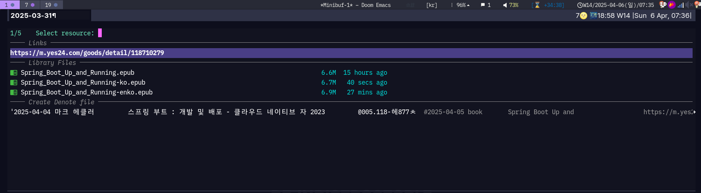

<!-- gid:20240416T072524 -->
[[TIP("이 노트에 대하여")]]
Emacs에서 서지를 **소비** 하는 방이다. 입력·캡처·키·컬렉션의 운영 계약은 [zotero-config botlog](https://notes.junghanacs.com/botlog/20260304T105300/)에 두고, 여기서는 citar·citar-denote·org-cite·bib 파일의 `file` 첨부처럼 편집기 안의 손을 정리한다. «조테로 GUI 없이도 bib만으로 충분하다»는 감각의 실무 자리.
[[/TIP]]

<!-- provenance:source:start -->
[[TIP("원본·최신본")]]
이 페이지는 한국어 검색과 읽기를 위한 WikiDocs 미러입니다. [원본·최신본은 가든](https://notes.junghanacs.com/notes/20240416T072524/)에 있습니다. 최신 수정 내용·백링크·태그·히스토리·댓글·출처 정보는 원본 가든에서 확인하세요.

- 작성: `2024-04-16T07:25:00+09:00`
- 최근 수정: `2026-08-03T11:05:00+09:00`
[[/TIP]]
<!-- provenance:source:end -->

[TOC]

## 히스토리

-   [2026-08-03 Mon 10:59] @mitsein/grok-4.5 — file= 첨부 흡수·표준 구조. 빈방 142618 이관 완료.
-   [2026-08-03 Mon 11:05] mitsein/grok-4.5 — 표준 구조. [denote:20250409T142618](https://notes.junghanacs.com/notes/20250409T142618/)의 file= 첨부·«조테로 필요 없다» 요지를 흡수. botlog·autholog와 역할 분리.
-   [2025-04-02 Wed] 기존 citar-denote·csl·embark 기록.
-   [2024-04-16 Tue 07:25] 생성.
-   [2023-11-10 Fri 08:40] 조테로-이맥스 분리 원칙(입력은 조테로/에이전트, Emacs는 조회).

## 관련메타

-   [조테로 서지관리](https://notes.junghanacs.com/meta/20240320T110018/)
-   [이맥스](https://notes.junghanacs.com/meta/20230521T215600/)
-   [참고 레퍼런스 첨부](https://notes.junghanacs.com/meta/20240824T210333/)

## 관련노트

-   [zotero-config: 캡처 금고와 메타 서지의 얇은 손](https://notes.junghanacs.com/botlog/20260304T105300/) — 운영 SSOT
-   [힣: 메타 기록을 조테로에 담는 이유](https://notes.junghanacs.com/notes/20250409T142940/) — 왜
-   [힣: 어쏠로지](https://notes.junghanacs.com/notes/20240925T200824/) — 공개 서재 선언
-   [조테로 플러그인 활용법](https://notes.junghanacs.com/notes/20230816T070200/) — 레거시 GUI
-   [조직모드: 인용 및 각주 예제](https://notes.junghanacs.com/notes/20230316T120200/)

## 한 줄

> Emacs는 서지를 입력하는 왕국이 아니라, bib를 읽고 인용하고 첨부 파일에 손 뻗는 소비 면이다.

## file= 첨부 — bib 안에 파일을 넣으면 조테로 GUI가 가벼워진다 (from 20250409T142618)

[2025-04-06 Sun] 핵심: 첨부 경로를 bib 항목의 `file` 필드에 둔다. citar library-files가 바로 연다.

```text
file = {/home/junghan/sync/logseq/Documents/book/Spring_Boot_Up_and_Running-enko.epub;/home/junghan/sync/logseq/Documents/book/Spring_Boot_Up_and_Running-ko.epub;/home/junghan/sync/logseq/Documents/book/Spring_Boot_Up_and_Running.epub},
```



«조테로는 편하지만 없어도 된다» — 조회·인용·첨부의 중심이 bib+citar에 있으면 GUI는 캡처 금고 UI일 뿐이다. Translation Server 원샷 저장의 **현재** 절차는 botlog/bibcli 스킬을 본다.

## BIBLIOGRAPHY

- 이기창. 2019. <i>한국어 임베딩: 자연어 처리 모델의 성능을 높이는 핵심 비결 Word2vec에서 ELMo, BERT</i>. Seoul. [http://www.yes24.com/Product/Goods/78569687](http://www.yes24.com/Product/Goods/78569687).
- 릭 루빈. 2023. <i>창조적 행위: 존재의 방식</i>. Translated by 정지현. [https://www.yes24.com/Product/Goods/119886818](https://www.yes24.com/Product/Goods/119886818).
- “Citar-Denote-Find-Citation: Symbol’s Function Definition Is Void: Denote-Link–Find-File-Prompt · Issue #49 · Pprevos/Citar-Denote.” n.d. Accessed June 14, 2025. [https://github.com/pprevos/citar-denote/issues/49](https://github.com/pprevos/citar-denote/issues/49).
- “Emacs-Citar/Citar.” 2024. [https://github.com/emacs-citar/citar](https://github.com/emacs-citar/citar).
- Kristoffer Balintona. 2023. “Citations in Org-Mode: Org-Cite and Citar.” 2023. [https://kristofferbalintona.me/posts/202206141852/](https://kristofferbalintona.me/posts/202206141852/).
- “Pprevos/Citar-Denote.” 2024. [https://github.com/pprevos/citar-denote](https://github.com/pprevos/citar-denote).

## 2023 조테로 이맥스 : Zotero Emacs

[2023-11-10 Fri 08:40] 기본은 citar 를 사용하여 자동 내보내기 된 bib 파일에 접근하는 것이다. 이는 조테로와 관계 없다. 만약 조테로와 연동하고 싶다면 몇 가지 패키지가 있다. 로컬 조테로 프로그램과 연동 없이 연동 서버 (번역 서버라고 불림)를 사용할 수도 있다. 무엇이든 노드 패키지를 설치 해야 하고 별도로 프로그램을 실행 해야 한다. 그래서 나는 Emacs 가 직접 조테로와 연동하지 않기로 했다. 조테로 클라이언트에서 자료를 입력하고 이맥스에서는 가져오면 된다. 이것으로 충분하다.

## 2024 §citar-denote 쓰레드 질문 답글

뭐라쓸려? [2024-12-30 Mon 17:50]

### pprevos/citar-denote

(“Pprevos/Citar-Denote” 2024)

-   Prevos, Peter
-   Emacs package to create and retrieve bibliography notes with the Citar and Denote packages.

### emacs-citar/citar

(“Emacs-Citar/Citar” 2024)

-   

-   Emacs package to quickly find and act on bibliographic references, and edit org, markdown, and latex academic documents.
-   

### Citations in org-mode: Org-cite and Citar

(Kristoffer Balintona 2023) - Kristoffer Balintona

-   Musings
-   Citations in org-mode

## 키워드

```text
bibtex:capf:citar:completion:csl:denote:orgroam:text:
```

-   [재능 노력 연습 지루함 익숙함](https://notes.junghanacs.com/meta/20240414T224508/)

## citar 자동 완성

emacs package to quickly find and act on bibliographic references, and edit org, markdown, and latex academic documents.

```text
여기서 자동 완성 측면을 바라 보라.
```

[emacs-citar/citar - github.com](https://github.com/emacs-citar/citar)

## citar-denote 디노트는 안되는게 있는가?

<https://lucidmanager.org/productivity/bibliographic-notes-in-emacs-with-citar-denote/>

[pprevos/citar-denote/blob/main/citar-denote.org - github.com](https://github.com/pprevos/citar-denote/blob/main/citar-denote.org)

장난 아니다. 단일 기능은 훨씬 디테일하다.

## <span class="org-todo done DONE">DONE</span> csl-styles

[2024-05-18 Sat 06:46]

(이기창 2019)

파일 상단에 선언을 해주면 될텐데, 아래에 apa.csl 로 박아 놓았으니 필요가 없을 것이다. 아무렴 편한대로.

```text
;; use #+cite_export: csl apa.csl
(setq org-cite-csl-styles-dir (concat user-org-directory ".csl"))
(setq citar-citeproc-csl-styles-dir (concat user-org-directory ".csl"))
;; (setq citar-citeproc-csl-locales-dir "~/.csl/locales")
(setq citar-citeproc-csl-style "apa.csl") ; ieee.csl
(setq citar-notes-paths '("~/sync/org/notes/"))
(setq org-cite-global-bibliography config-bibfiles)
(setq org-cite-insert-processor 'citar)
(setq org-cite-follow-processor 'citar)
(setq org-cite-activate-processor 'citar)
(setq citar-symbol-separator " ")
```

```text
#+cite_export: csl apa.csl
```

### APA -&gt; Choice

이기창. (2019). 한국어 임베딩: 자연어 처리 모델의 성능을 높이는 핵심 비결 Word2Vec에서 ELMo, BERT. <http://www.yes24.com/Product/Goods/78569687>, <https://ratsgo.github.io/>

### IEEE

[1]이기창, 한국어 임베딩: 자연어 처리 모델의 성능을 높이는 핵심 비결 Word2Vec에서 ELMo, BERT. Seoul, 2019. Available: <http://www.yes24.com/Product/Goods/78569687>, <https://ratsgo.github.io/>

### chicago-note-bibliography

이기창. 한국어 임베딩: 자연어 처리 모델의 성능을 높이는 핵심 비결 Word2vec에서 ELMo, BERT. Seoul, 2019. <http://www.yes24.com/Product/Goods/78569687>, <https://ratsgo.github.io/>.

## <span class="org-todo done DONE">DONE</span> embark -&gt; citar-copy-reference

[2024-05-18 Sat 06:52]

embark -&gt; citar-copy-reference 를 하려면, 아래와 같이 설정이 되어 있어야 한다. 특히 preview 에 해당하는 부분을 보라.

```elisp
;; (require 'citar-citeproc)
;; (setq citar-format-reference-function 'citar-citeproc-format-reference)
(setq citar-format-reference-function 'citar-format-reference)
(setq citar-templates
        '((main . "${author:20} ${editor:20} ${title:58} (${date year issued:4})")
          (suffix . " ${=key= id:16} ${shorttitle:20} ${=type=:10} ${tags keywords:*}")
          (preview . "+ \"${title}\" ${author} (${year issued date:4}) ${editor}\n  - ${abstract}\n  - ${shorttitle}")
          (note . "#+title: ${author editor}, ${title}")))
```

-   (릭 루빈 2023) "창조적 행위: 존재의 방식" 릭 루빈 (2023) 정지현
    -   『뉴욕 타임스』, 『선데이 타임스』 베스트셀러 1위2023년 1월 출간 후 미국 30만 부, 영국 10만 부 판매전 세계 28개국 번역 출간김하나, 오지은, 세스 고딘, 매트 헤이그, 조너선 아이브, J.J. 에이브럼스 등 강력 추천그래미 어워드 9회 수상, ...
    -   THE CREATIVE ACT

-   (이기창 2019) "한국어 임베딩: 자연어 처리 모델의 성능을 높이는 핵심 비결 Word2Vec에서 ELMo, BERT" 이기창 (2019) 다양한 단어/문장 수준 임베딩 기법을 일별하고 데이터 전처리, 임베딩 구축 및 학습에 이르는 전 과정을 튜토리얼 방식으로 소개한다. 통계 기반 언어모델 등 고전부터 BERT, XLNet 등 최신 기법까지 다룬다. Sentence embeddings using korean corpora

그러면 위에 정의된 대로 필요한 정보가 출력 된다. 필요한 대로 사용하면 된다.

## <span class="org-todo done DONT">DONT</span> `citar-org-roam` 서지 관리 기능

[오그롬: 제텔카스텐 에버그린 활용법 위키데이터](https://notes.junghanacs.com/notes/20220906T124100/)

### 왜? 오그롬 데이터베이스에 통합 됨. 쿼리 연결성 확보 차원!

-   메모 당 여러 참조
-   파일 당 여러 참조 메모
-   참조로 메모 인용을 쿼리
-   메모 실시간 업데이트
-   오그롬 캡처 템플릿

### 사용 방법

-   citar-open-notes, citar-open -&gt; citar 함수 - 오그롬 연동
-   citar-org-roam-ref-add : 노드에 ROAM_REF 추가
-   citar-org-roam-cited : 선택한 참고문헌을 인용하는 노트 목록 표시
-   citar-org-roam-open-current-refs : 현재 버퍼(오그롬 노드)와 관련 된 모든 인용 목록 표기

### 무엇이 필요한가? 오그롬 버퍼 라이브 정보 표기 : 확장 연결 표현형으로서

데이터베이스 덕분에 활용할 것은 라이브 정보 아닌가? 그 정도를 보여주기 위해서. 시나리오는 발굴해야 한다.

서지 정보에는 시간 인물 주제 맥락 선후 등 많은 정보가 있다. 물론 그 자체에는 하나 뿐이겠지만 다른 것과의 연관성에 따라서 바라 볼 수 있다.

"관련노트" 뭐 이런 맥락 아니겠는가?

## 아카이브

### <span class="org-todo done DONE">DONE</span> 07:52 버그픽스 citar-denote-find-citation

(“Citar-Denote-Find-Citation: Symbol’s Function Definition Is Void: Denote-Link–Find-File-Prompt · Issue #49 · Pprevos/Citar-Denote” n.d.)

<https://github.com/pprevos/citar-denote/issues/49>

citar-denote-find-citation: Symbol’s function definition is void: denote-link--find-file-prompt [2 times]

```text
@@ -552,7 +552,7 @@ (defun citar-denote-find-citation (citekey)
                          (denote-extract-id-from-string
                           (if (= (length files) 1)
                               (car files)
-                            (denote-link--find-file-prompt files)))))
+                            (denote-select-linked-file-prompt files)))))
              (goto-char (point-min))
              (search-forward citekey))
     (message "No citations of %s found in Denote files" citekey)))
@@ -661,7 +661,7 @@ (defun citar-denote-find-reference ()
            (files
             (find-file (denote-get-path-by-id
                         (denote-extract-id-from-string
-                         (denote-link--find-file-prompt files))))
+                         (denote-select-linked-file-prompt files))))
             (goto-char (point-min))
             (search-forward citekey))
            ((null citekey)
```
