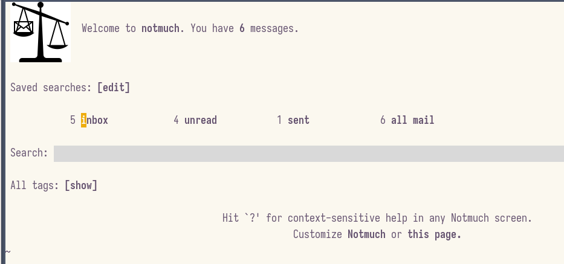

<!-- gid:20240502T052530 -->
[[TIP("이 노트에 대하여")]] Proton 메일을 Emacs 안에서 처리하기 위해 notmuch와 lieer 조합을 다시 점검하는 노트다. 예전 설정과 현재 둠이맥스 환경 사이의 간극을 어떻게 메울지 고민한 흔적이 남아 있다. [[/TIP]] 히스토리 - [2024-05-02 Thu 05:25] 둠이맥스 낫머치 - [2022-08-20 Sat 10:25] 스페이스맥스 낫머치 이맥스 2024-05-02 notmuch doomemacs lieer 를 활용? 기본이다. 둠이맥스. 잘 안된다. 모르겠구만. 스페이스맥스 에서 사용한 대로 그냥 쓰자. lieer <https://github.com/gauteh/lieer> ```text
sudo apt-get install lieer
``` 헉 아래 글을 보라. 2년 전에 쓴 글이다. ProtonMail : Proton Encrypted email url:: <https://en.wikipedia.org/wiki/ProtonMail> - ProtonMail 은 스위스 제네바에서 2013 년 설립된 종단간 암호화 이메일 서비스이다. ProtonMail 은 Gmail 과 같은 일반적인 메일 서비스와 달리 서버 전송 전 이메일 콘텐츠와 사용자 데이터 보호를 위해 클라이언트 측 암호화를 사용한다 2022-08-20 notmuch with spacemacs - [2022-08-20 Sat 10:25] 스페이스맥스 낫머치 이맥스 어제 알게된 notmuch 이메일 클라이언트. 가장 마음에 드는 부분은 cli 로 동작한다는 점이다. 프론트엔드만 이맥스에서 처리하니까 그외 부분은 설정하고 동작하는게 자유롭다. 프론트엔드가 이맥스일 필요도 물론 없다. 이런 방식이 LSP 가 인기 있는 이유이다. prot 이 쓰는 이유가 있지 않겠는가? 설치는? TL;DR 현재 지메일 연동되는 것 확인까지 했다. 사실 이메일을 내가 쓸 일이 없기 때문에 방법만 알면 된다. 당장은 그렇다. 지메일이 인증부터 아주 쉽게 되는 것을 보니 나머지 이메일 서비스는 사용할 필요가 없다. notmuch layer in spacemacs 다행히 스페이스맥스에서 공식 지원을 한다. 먼저 별도로 설치를 해주고 레이어를 활성화 하자. notmuch 문서를 굳이 보지 않더라도 아래 하우투 문서에서 상당 부분을 커버한다. <https://notmuchmail.org/howto/> pass 는 리눅스 CLI 로 패스워크를 관리하는 프로그램이다. GPG 키로 암호와하면 암호를 문서에 적을 필요가 없어진다. 유용하다. offlineimap3 가 최신이다. 설정 및 인터페이스를 동일하다. pop3 가 좋다는 것은 알지만 imap 이 기본이다. 이 바닥에서는. 욕심내지 말 것. lieer 는 gmail 인증을 해준다. 어느 문서에서는 개발자 등록(?) 뭐 그런 작업이 필요하다고 하던데 이걸로 다 처리가 된다. 모든 툴은 현재 리눅스(우분투 22.04)에서 apt 로 설치할 수 있다. 이 또한 장점이다. 안정버전이 최고다. ```text
sudo apt-get install notmuch mb2md neomutt -y
;; imap, msmtp for recv and send email
sudo apt-get install offlineimap3 -yi
sudo apt-get install pass lieer
``` Gmail 잠시만. new 를 해야되는데 계정 설정을 어떻게 하는지 좀 봐야겠다. 이런 저런 작업이 있었다. Sqrt 님의 설정을 보고 지메일을 새로 만들어야겠다는 생각을 했다. 그래서 junghanacsgmail.com 을 만들었다. 아주 마음에 든다. 아래 문서를 보고 설정하면 된다. 0 단계: Dropbox 에 mail 폴더 생성 기본 폴더로 사용한다. 1 단계: 수동으로 메일 읽기 2 단계: 메일 보내기 3 단계: gpg 로 서명해서 보내고 받기 4 단계: 자동 메일 확인 업데이트 5 단계: 다른 메일 추가하기 -- 필요 없다! 6 단계: tags 및 분류 검색 구축 사실, gmail 로 다 처리를 할 수 있다면 나머지는 옵션이다. 아래 문서에 전체 단계까지 다 커버를 하고 있다. 관련 문서 <https://github.com/SqrtMinusOne/dotfiles/blob/master/Mail.org> <https://sqrtminusone.xyz/posts/2021-02-27-gmail/> 작업 로그 이게 뭔데? notmuch email client 인데. notmuch new 를 하면 새 메일을 다운 받는다. 그렇게 하면 이맥스에서 메일을 확인 가능하다. 특히, GPG 로 암호화 된 경우 이맥스에서 단번에 대응이 가능하다. 이건 정말 엄청난 장점이 아닐 수 없다. 잘 된다. 물론 아직 설정해야 할 부분이 남아있다.  Related-Notes - [이맥스 이메일: mu4e mbsync - 지메일](https://notes.junghanacs.com/notes/20250415T120555/)

## BIBLIOGRAPHY
