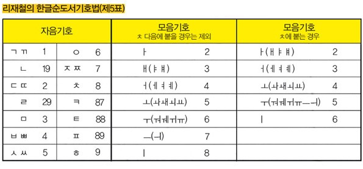

<!-- gid:20240519T073537 -->
[[TIP("이 노트에 대하여")]]
도서관 책등의 숫자와 기호가 어떤 원리로 붙는지 이해하기 위한 입문 노트다. 듀이십진분류와 한국십진분류가 왜 필요한지 일상적인 비유를 통해 접근하게 해 준다.
[[/TIP]]

<!-- provenance:source:start -->
[[TIP("원본·최신본")]]
이 페이지는 한국어 검색과 읽기를 위한 WikiDocs 미러입니다. [원본·최신본은 가든](https://notes.junghanacs.com/notes/20240519T073537/)에 있습니다. 최신 수정 내용·백링크·태그·히스토리·댓글·출처 정보는 원본 가든에서 확인하세요.

- 작성: `2024-05-19T07:35:00+09:00`
- 최근 수정: `2025-05-01T00:00:00+09:00`
[[/TIP]]
<!-- provenance:source:end -->

[TOC]

## 도서 분류의 원리

(“도서 분류의 원리” n.d.)

부엌에 참기름이 어디 있는지 생각해 보라. 팥빙수를 담는 투명한 그릇은 어딨을까? 아무리 찾기 힘든 물건이라도 어머니는 단번에 찾아내신다. 부엌보다 훨씬 복잡한 도서관에는 어머니처럼 책을 찾아주는 사람이 많지 않다. 여기 자기 힘으로 원하는 책을 쉽게 찾는 방법이 있다. 바로 기호다. 도서 분류의 원리를 이해하면 더 쉽고 빠르게 원하는 책을 찾는다. \\&amp;\\#60;출처: gettyimages\\&amp;\\#62; [ 세상의 모든 것을 분류하다 ] 듀이십진분류법(DDC)과 한국십진분류법(KDC) 도서관에 있는 책은 옆면에 각각의 이름표를 달고 있다. 숫자와 문자가 함께 사용돼 언뜻 복잡해 보이지만 원리를 알면 놀라움 그 자체다. 먼저 각 책장에는 앞자리가 비슷한 책이 한데 모여 있다. 특히 맨 앞자리 숫자는 지구상의 모든 자료를 0에서 9까지 10개의 '주류'로 나눈 것이다. 이들은 인류의 역사와 비슷한 구조를 갖추고 있다. 000은 태초의 인간과 자연이 혼돈에서 출발한다는 의미에서 특정 학문이나 주제에

## 도서기호 활용 방법

> 첫 번째 방법은 리재철의 한글순도서기호법 제5표에 따른 것이다. 저자의 성에 해당하는 '하'를 그대로 쓰고 이름의 첫 자인 '지'에서 'ㅈ'에 해당하는 7과 'ㅣ'에 해당하는 8을 붙여 '하78'로 쓴다. 마지막에는 책 제목의 첫 글자인 '중'에서 초성인 'ㅈ'을 붙인다. 결국 '하78ㅈ'이 된다.
> 
> 두 번째 방법은 동서저자기호표에 따른 것이다. 저자인 성인 '하'에서 'ㅎ'을 먼저 쓴 뒤, 기호표에서 '하지연'을 찾으면 가장 가까운 표현으로 '하지스가'가 151, '한'이 152로 나타난다. 둘 중 앞의 것을 택해서 'ㅎ151'로 쓴다. 마지막에는 책 제목 첫 글자의 초성인 'ㅈ'을 붙인다. 결국 'ㅎ151ㅈ'이 된다.
> 
> [네이버 지식백과] 도서 분류의 원리 - 세상의 모든 것을 분류하다 (원리사전, 이재웅, 수학동아)

리재철 한글순도서기호법

## Related-Notes

-   [전창호 자료조직개론 - 자료분류론 자료편목론 - 문헌정보학](https://wikidocs.net/382012)
-   [분류](https://wikidocs.net/380842)

## BIBLIOGRAPHY

- “도서 분류의 원리.” n.d. Accessed May 18, 2024. [https://terms.naver.com/entry.naver?cid=58885&#38;docId=3573599&#38;categoryId=58885](https://terms.naver.com/entry.naver?cid=58885&docId=3573599&categoryId=58885).
