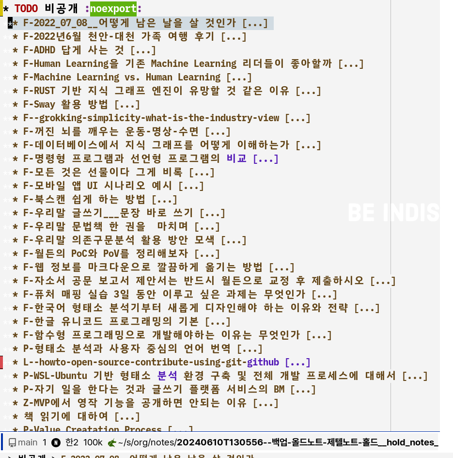

<!-- gid:20240610T130556 -->
[[TIP("이 노트에 대하여")]]
예전 제텔노트와 이야기 노트를 버리지 않고 홀드 상태로 보관하기 위한 백업 노트다. 과거 자산을 훗날 다시 꺼내 정리할 수 있도록 최소한의 단서를 남겨 둔다.
[[/TIP]]

<!-- provenance:source:start -->
[[TIP("원본·최신본")]]
이 페이지는 한국어 검색과 읽기를 위한 WikiDocs 미러입니다. [원본·최신본은 가든](https://notes.junghanacs.com/notes/20240610T130556/)에 있습니다. 최신 수정 내용·백링크·태그·히스토리·댓글·출처 정보는 원본 가든에서 확인하세요.

- 작성: `2024-06-10T13:05:00+09:00`
- 최근 수정: `2025-04-02T00:00:00+09:00`
[[/TIP]]
<!-- provenance:source:end -->

[TOC]

비공개

## 히스토리

[2025-04-02 Wed 14:27] 대기 중 노트 목록

## 2022 작성한 노트 정리

-   [AI 시대에 왜 우리 개인은 더 지식에 목마른가](https://wikidocs.net/381018)

## Related-Notes

-   [백업: 올드노트 문헌노트 홀드](https://wikidocs.net/381170)

## BIBLIOGRAPHY
